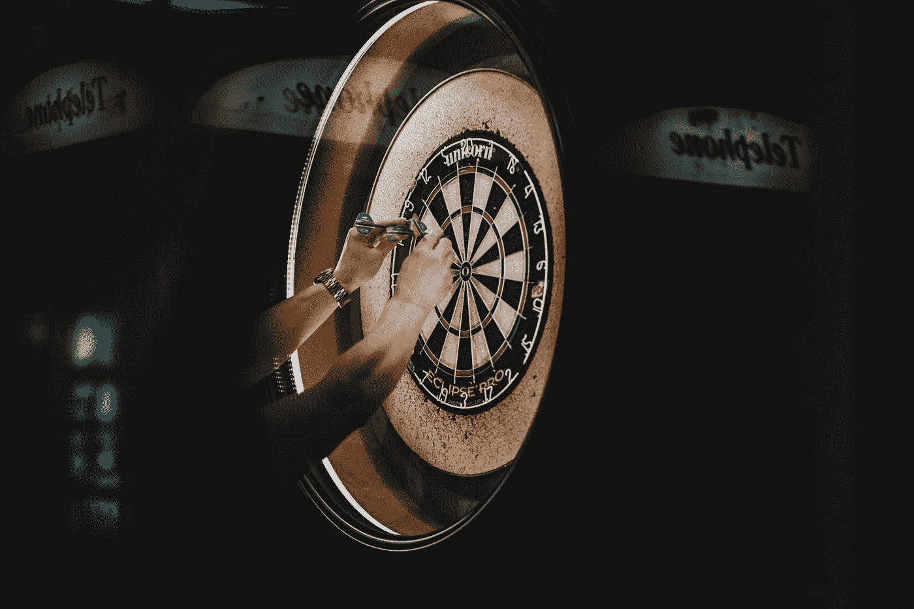
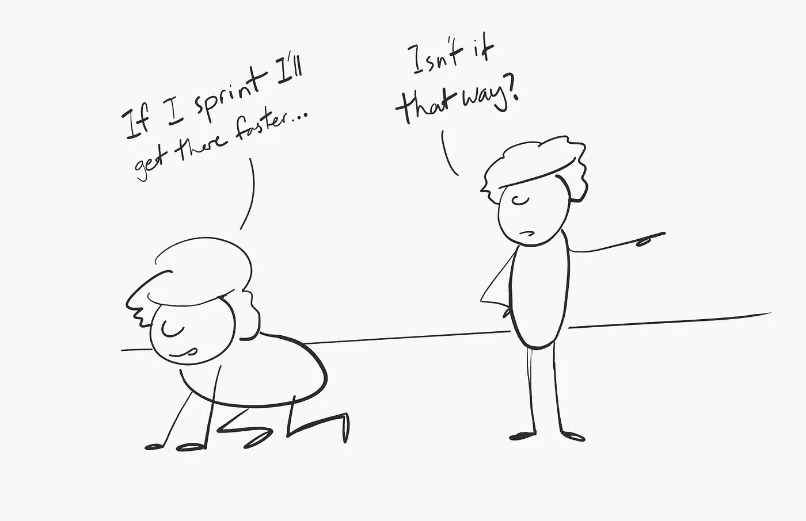

# 停止工作，开始思考。

> 原文：<https://medium.com/swlh/stop-working-start-thinking-e2a643c11b86>

## 这会让你更有效率

我们都知道，一天坐在办公桌前 12 个小时，很可能一事无成。我以前做过很多次——除非你把 Cow Clicker Extraordinaire 算作生产力。

在过去的十年里，我们谈论了很多关于生产力和努力工作的问题。从公司的小隔间到现在流行的“随时随地工作”的现代态度，关于在办公桌前花更多的时间是否等同于更高的生产率的辩论正在激烈进行。

一方面，我们知道，从经验上看，情况并非如此，因为“看似有效”并不一定“有效”。另一方面，我们仍然通过在办公室的时间长短来衡量社会和职业。

因此，我们仍然在晚上 9 点发送电子邮件，让*看起来*像我们还在工作。

这是幼稚的，它仍然存在的原因是，坦率地说，很难衡量和跟踪真正的生产力。如果我花 5 个小时修理某样东西，那看起来很有效率。但是如果我两天前多花一个小时小心，也许我就可以完全避免这个问题。

没有人想出一个标准的方法来经验性地衡量一个人花时间做的工作有多好。多花一个小时复制和粘贴 excel 表格 ***会让*** 产生更多的表格。但是如果你把这一个小时花在思考如何写一个计算机脚本来自动完成它，会怎么样呢？一小时后你的床单会更少，但将来会更多。

所以我们求助于最接近的抽象——你 ***看*** 某人工作多久。

这导致了类似于这些的[辩论，其中一些人会争辩说，花更多时间的蛮力将确保成功——而其他人会争辩说，休息时间对于你实际工作的时间来说是富有成效的。](https://m.signalvnoise.com/trickle-down-workaholism-in-startups-a90ceac76426)

要回答增加工作时间是否会提高生产率的问题，我们首先要量化生产率。

那么什么是生产力呢？我是说真的，在一天结束的时候？是完成的工作量吗？

# 获胜者是…

真正的定义是生产力不是用走了多少步来衡量的，而是在正确的方向上走了多少步*。这是一个有方向和大小的向量。*

> *自动化应用于高效的操作将会放大效率。自动化应用于低效率的操作会放大低效率。*
> 
> *—比尔·盖茨*

*调整到适合我们的定义，**努力**应用于正确方向的运动将放大走正确方向的好处。向错误方向*施加的力*只会在错误的方向上走得更远。*

*如果你一周抽出 100 个小时跑一百万步，但你是从糖果山*跑到*外，那你还不如没动呢。除非你真的不想去糖果山。奇怪的人。*

*所以我们知道我们需要正确的方向，*和*努力在那个方向上快速前进**。***

*在这一点上，我要花一点时间说，有很多人和公司目前发展得非常快，但是方向错了。*

## *找到你的方向*

*我们如何确保我们走的方向是正确的？*

*首先，我相信在一些功能性学科中比其他学科更容易找到正确的方向。例如，销售等职能领域相对容易找到方向，因此大部分注意力正确地花在了能够更努力、更快推动的人身上。*

**

*然而，产品开发是一个完全不同的领域。难以置信的是， ***难以置信的是*** 很难找到正确的方向，而且很多时候团队都不知道他们要跑向哪里就直接投入了跑步。*

*像精益创业这样的技术鼓励了这种快速开火的心态。因为未来是不可知的，所以要坚持不懈地工作，直到有事情发生。虽然该框架的实验方法有其优点，但围绕它建立的总是忙碌、总是工作的文化并不一定会导致更快地找到那个方向。*

*这就像在漆黑的房间里向目标扔飞镖一样。从我丰富的丢镖经验来看，开着灯扔飞镖已经够难的了。*

## *方向思维*

*那么我们如何找到正确的方向呢？首先——多思考，少行动。花时间思考至少会给你一个手电筒，让你在漆黑的房间里使用。这不能保证你能击中目标，但会大大减少你投掷位置的模糊性。*

**

*做意味着移动。思考意味着仔细观察各种选择，权衡它们预期的成功机会，评估成本，并确定哪里需要更多的信息。*

*你告诉我哪一个更有可能给你指出正确的方向。在冲进兔子洞之前，停下来想一想。*

# *思维的两个组成部分*

*这一切都很好，但我们到底应该考虑什么？*

*如果我们进一步分解思考，在我看来，有两个因素最终会让你走上正确的方向——逻辑推理和创造性思维。*

## *逻辑推理*

*如果目标是找到哪条路是最好的，你需要逻辑。将大问题分解成可操作的部分，然后你可以通过询问他人、做更多的研究等来验证。这是关于使用常识来推断正确的问题，以获得你需要的答案。*

*你会惊讶于几个恰当的问题能给你多少洞察力来指导你下一步该做什么。*

## *创造性思维*

*第二个难题是创造性思维。有多种有效和无效的方法来解决这个问题，但是一般来说，一旦你对你试图解决的问题有了很好的理解(这种理解是由深入的思考和逻辑产生的)，你需要将自己置于一个让想法产生的环境中。*

*任何参与创造过程的人都知道，创造力来自大脑的一侧，当你试图有意识地使用它时，它不是很有效。又名——坐在空白画布前试图思考要画什么不会给你一幅毕加索的画。*

*同理，坐在电脑前的你也不会被闪电击中。你需要扩展你的经历，改变常规，尝试用左手吃饭(除非你是左撇子，在这种情况下用右手吃饭)。当你的思想在空转，做白日梦和徘徊时，想法就来了。*

*没有伟大的想法是坐在办公桌前试图想出伟大想法的人想出来的。*

## *结论*

*所以如果:*

1.  *局部推理和创造性思维是思维的两个必要组成部分*
2.  *思考是找到最佳前进方向的最佳方式*
3.  *在行动之前找到最佳方向是最有效率的方式*

*那么自然地，最后的结论应该是，花更多的时间工作(如果工作的定义是呆在办公室里，实际生产东西)不会带来生产力。具有讽刺意味的是，你应该花更多的时间做其他事情*，而不是工作，这样你的时间才会更有成效。**

****

**这种永远在线、永远移动的文化不仅对工作之外的重要生活事物*有害，而且实际上是给一代人洗脑，让他们认为所有这些努力实际上会让他们得到他们想要的东西。***

***如果工作时间是成功的原因，那么玛丽莎·梅耶尔每周工作 130 个小时将会是世界上最成功的公司。相反，马克·扎克伯格和其他人平均在办公室花 50-60 个小时。***

***所以，如果你还没有想好你的职业、生意等要去哪里。—停止移动。离开你的办公桌，回到你的房间，想想你在做什么。***

***在费力地吃完堆积如山的糖果后，母亲对年轻时的自己说。***

******

## ***这篇文章发表在《创业公司》杂志上，这是 Medium 最大的创业刊物，有 319，283 人关注。***

## ***订阅接收[我们的头条](http://growthsupply.com/the-startup-newsletter/)。***

******