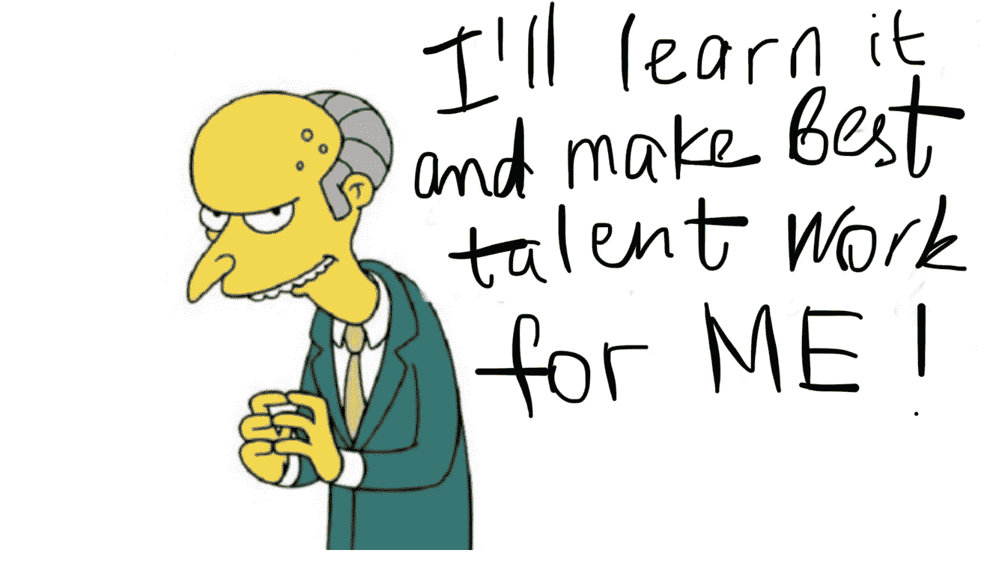
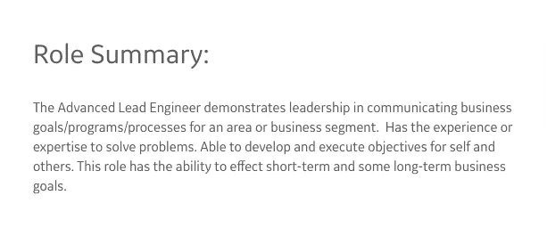
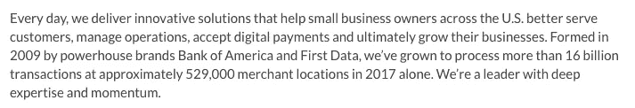
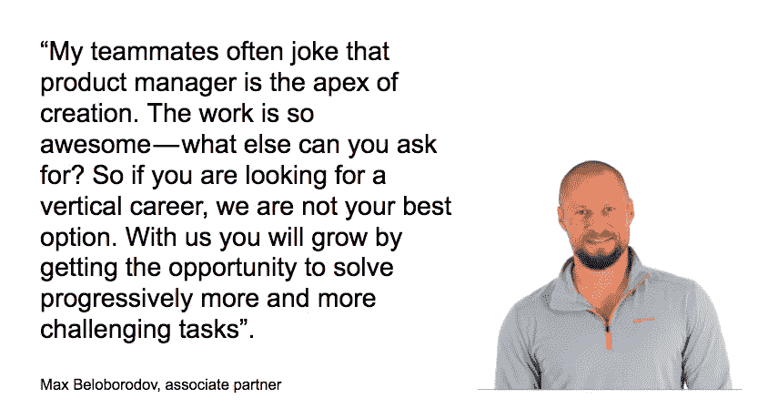
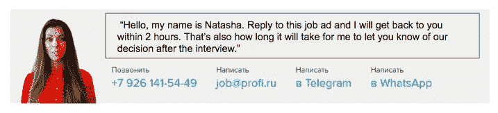
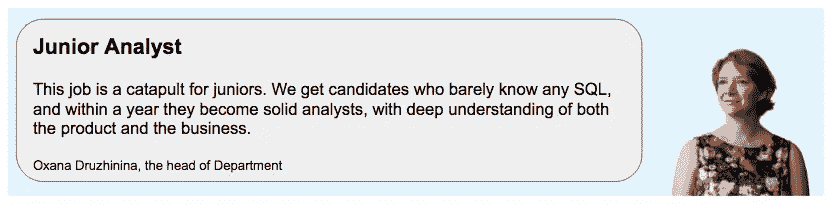
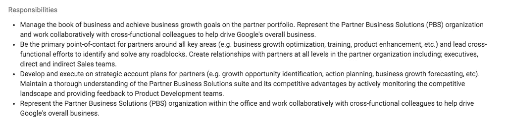
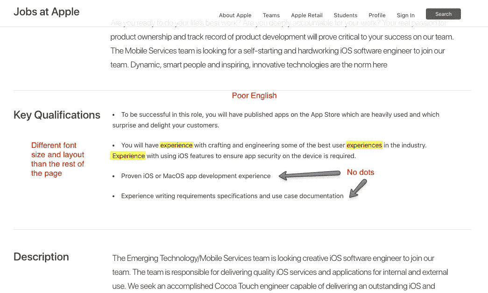

# 不要再写招聘启事了，因为你生活在 90 年代

> 原文：<https://medium.com/swlh/stop-writing-job-postings-like-you-live-in-the-90s-e5185f5f94c3>

## 我写招聘广告是有报酬的。在这篇文章中，我将分享如何让你的招聘启事在 21 世纪发挥作用。

在 20 世纪，雇主就是一切，而雇员什么都不是。招聘启事反映了这一事实。他们以公司想要的(要求和责任)开始和结束，对潜在员工的工作利益只字未提。语气不友好——他们清楚地告诉你谁是老板。

在过去的几十年里，它发生了很大的变化——至少对科技公司来说是这样。如今，许多公司都在努力吸引最优秀的人才。他们准备好接受疯狂的补偿，他们找了几个月的猎头，但令人惊讶的是，招聘启事的语气和内容都保持不变。太抽象，太老套，太干巴巴，用第三人称叙述，斜线听起来更官方和克制—

A job at [GE](https://jobs.gecareers.com/ShowJob/Id/70550/Advanced-Lead-Engineer/)

他们仍然经常自恋地谈论自己，但不愿意提供足够的对候选人真正重要的工作背景。好像他们在说——“我们这么好，我们还有一个空缺！你最好来接受我们提供的任何东西。”

[Bank of America job posting](https://www.glassdoor.com/Job/marketing-jobs-SRCH_KO0,9.htm)

你的公司制作了大量的内容——但在他们看来，在招聘广告中添加经理的视频或引用他们的话的图片是一个过于大胆的想法。就像这个—

Part of my client’s [job description](https://profi.ru/vacancies/product/)s, translated

# 促销页面

职位发布页面是促销页面。它的文字是促销。

我们对促销了解多少？他们需要有一个战略，USP，卖点，情感和理性的论点和证明(社会证明)。

你必须能够从第一个屏幕上获得它的砂砾。常见的异议应该被驳回。所有 CTA 都应该是显而易见的。接下来的步骤应该简单明了。

Example of a [friendly and clear next steps promise](https://profi.ru/vacancies/product/), translated

在促销页上，你把价格放在最后。你不会在顾客进店之前问他们身上有没有钱。那么，为什么你要以要求开始你的工作描述呢？

要求很重要，但首先，你必须向应聘者“推销”你的工作。所以你必须概述机会。像这里，举个例子:

如果你不想让人们仅仅因为你的乒乓球而去办公室，就不要用办公室的好东西来开始你的工作描述。你必须从实际的成人利益开始。

> **为什么与我们合作**
> 
> 1.我们做事很快——以你自己能忍受的速度。没有未启动的项目，政治，废话或企业压力。
> 
> 2.很多事情其实取决于你。比任何人都更深入地研究各种选择，倾听队友的意见，提供论据，并做出决策。你取得的成果越多，你得到的信任和自由就越多。
> 
> 3.你不仅要为业务指标工作，还要为“爱”指标工作。我们很务实，但有时我们会打着“我们喜欢这个产品”的旗号。我们清楚地知道我们想要建设的未来是什么样子(了解更多关于我们的 BHAG)。

> 像写宣传页一样写你的帖子。首先你卖它，然后提出你的要求。

# 加密

大部分工作描述都是编码的。公司用复杂的措辞加密他们的期望，候选人必须尽最大努力破译它们才能理解任何东西。就像在模仿游戏中一样:

*Candidates trying to decipher your job posting*

写招聘启事的人最喜欢做的事是极端抽象的操作。就是你用“设计决策”代替“绘图”的时候。

A job at [Google](https://careers.google.com/jobs#!t=jo&jid=/google/product-marketing-manager-brand-and-minato-tokyo-japan-4512540365&). One can only guess what he’s actually going to do there

候选人在这个游戏中，也加密他们的经验。他们在纸上看起来像全能的神，但实际上并不令人印象深刻。

双方使用代码的原因是一样的:(1)增加重要性& (2)因为他们没有足够的时间去寻找完美的措辞。即有足够的时间思考。

当我重写客户的招聘广告时，我通常会收集太多的信息，以至于我从来没有机会真正使用它们。

> 不要加密你的信息，也不要着急。尽可能深入挖掘，这将有助于你更准确地表达事情。

# 语境

肯定有某种人力资源的阴谋，不透露候选人最感兴趣的东西。

> 我的工作日会是什么样子？我将和谁一起工作？
> 我将从什么任务开始？
> 该产品将走向何方，目前处于哪个阶段？谁以前在这里工作过，他们为什么离开？
> 等。

我把关于公司和候选人未来团队的信息称为“背景”。

背景不仅仅是回答潜在候选人最迫切的问题。有点把他们吸进去了。这个人还没有去过你的办公室，但是他/她已经可以很清楚地描绘出他/她和你在一起的生活。他们将做什么，他们将向谁学习，他们将坐在谁的旁边。

> 多给点上下文。这里的关键成功指标是“现在他们在面试时没有什么可问的了”。

# 在乎

现在试着阅读任何一份工作——90%的机会你会在每份工作描述中发现至少几个错误。更不用说页面的排版方式了。看起来好像他们根本不在乎—

[A job at Apple](https://jobs.apple.com/en-us/details/114422887/ios-software-engineer?team=SFTWR)

> 工整的编作业页。尽量避免错误。

# 弱点

你必须坦诚面对自己的弱点。公司没有候选人就不能做的事情。

> 我们正在寻找一个能帮助我们使我们的品牌传播更加感性和生动的人。
> 
> 如果你来我们的办公室，和我们交谈，听我们在厨房里开玩笑，你会看到我们的活力和我们对事业的奉献。如果你访问我们的社交媒体页面，你会看到更多没有灵魂的公司。我们想在你的帮助下改变这种状况。

不要撒谎，但要深入挖掘，找到真正的漏洞。公司不会白招人。他们总是试图解决一个痛点。表现出你的脆弱会吸引强势的人，疏远弱势的人。

> 不要害怕展示你的脆弱。在其他条件相同的情况下，强者会选择最需要他们的公司。

## 备忘录

一份写得不好的招聘启事相当于几十个小时的人力资源努力付之东流。所以，下次你写招聘启事时，请遵守以下规则。

1.像写宣传页一样写你的帖子。首先你卖它，然后提出你的要求。

2.工整的编作业页。不要犯错误。

3.不要加密你的信息，也不要着急。尽可能深入挖掘，这将有助于你更准确地表达事情。

4.多给点上下文。这里的关键成功指标是“现在他们在面试时没有什么可问的了”。

5.不要害怕展示你的脆弱。在其他条件相同的情况下，强者会选择最需要他们的公司。

我最初是用俄语写这篇文章的。非常感谢 Anna 和 Olesya 帮助我将它改编成英语。

 [## 安娜·格里戈里耶娃- UX 集体

### 阅读来自 UX 集体的安娜·格里戈里耶娃的作品。UXer *设计师*插画师*书虫*社会公正…

uxdesign.cc](https://uxdesign.cc/@4erepawko)  [## Olesya Rogaleva -培养基

### 他们似乎很清楚自己在做什么，要去哪里。当他们到达保险库的挂锁时…

medium.com](/@olesiarogaleva) 

## 这篇文章发表在 [The Startup](https://medium.com/swlh) 上，这是 Medium 最大的创业刊物，有+384，399 人关注。

## 订阅接收[我们的头条](http://growthsupply.com/the-startup-newsletter/)。

