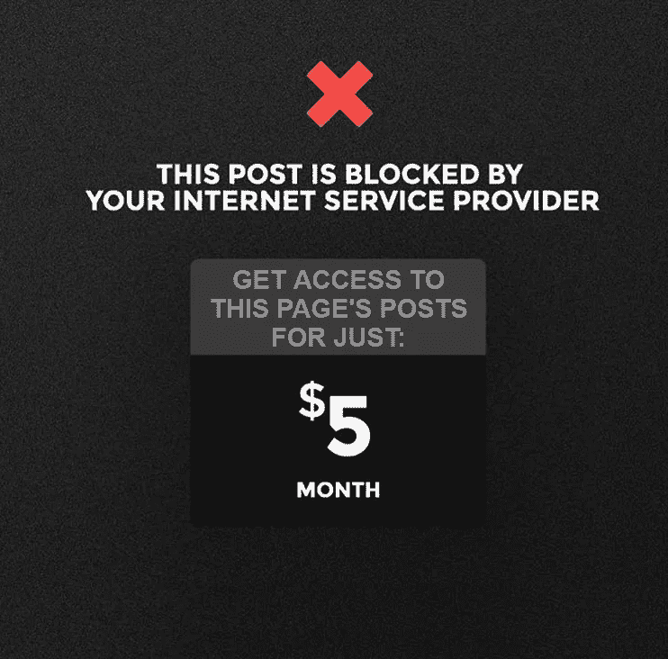
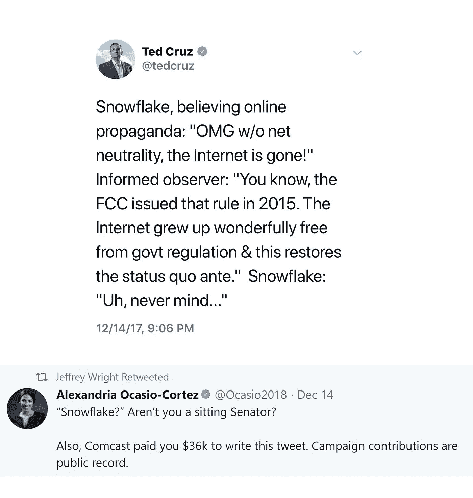
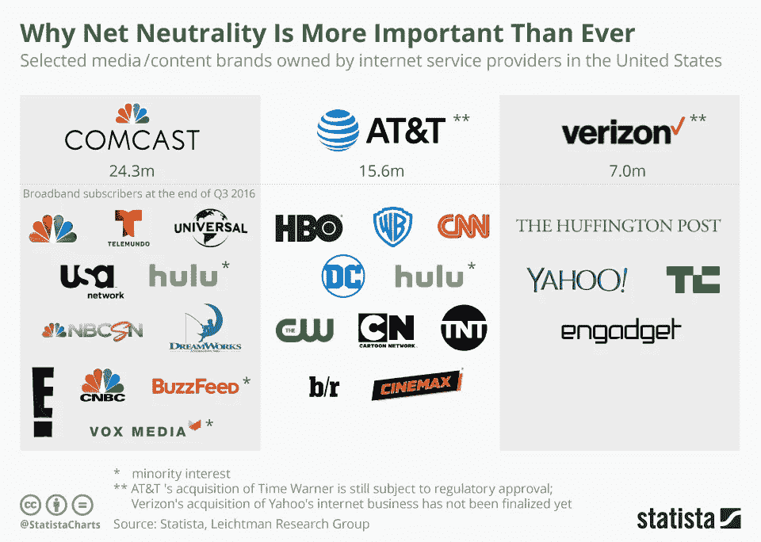

# 关于互联网将如何消亡的故事。

> 原文：<https://medium.com/swlh/story-about-how-the-internet-is-going-to-die-6f5282532acc>

## 西装革履的坏人来认领我们的互联网。

2017 年 12 月 14 日，FCC 的共和党多数派批准了主席 Ajit Pai 取消网络中立保护的计划。

他们开着他们的豪华汽车来私有化人类历史上最强大的工具之一。互联网。ISP(互联网服务提供商)、政客和立法者串通一气，闭门会面，以终结我们所知的自由开放的互联网。即使他们提供误导性的花哨东西，如*免费互联网(就像扎克的 internet.org 门面)*，并在 twitter 上重申这对人民或互联网本身无害，我们知道这是一只狼在我们的门口，这是一个伪装成社会改革的邪恶计划。我们知道没有免费的午餐。在这个世界上没有。尤其是在本世纪。

> 他们来配给互联网，把它撕成碎片，让我们像朝鲜人一样访问它。

世界处于知识收集的最后前沿。谁拥有这一切，谁就成为地球的皇帝。末日的开始不一定是核弹头，而是知识限制和信息私有化。**特朗普治下的美国已经开始了。**

互联网被设计成任何人都不能垄断的形式。复杂的协议被分成奇怪的层来管理互联网，将数十亿台计算机连接成一个复杂的自由信息的巨大网络，这些协议是用一种本质上非常自由的思想创建的。如果有人能统治互联网，他就能统治世界。简而言之，这个简单的规则，防止变态接管互联网的完全控制**被称为网络中立。**

## 现在，十亿美元的问题。他们将如何夺走我们的互联网，为什么？

# 为什么:

本世纪被称为信息高速公路有一个主要原因。互联网。为什么互联网如此重要？因为它使数十亿人聚在一起成为可能——否则这些人将在地理上、政治上、意识形态上和文化上分离开来——并分享信息——否则这些信息将无法获得。互联网超越了所有的语言和文化障碍。世界上所有的知识，都是在人类存在的几个世纪中积累起来的，分布在几千英里之外，突然间每个人都可以获得。历史、研究、医学、文学和色情，应有尽有。都在那了。

## 这个集体大脑处于危险之中。电信-政治-立法者三角关系将撕裂网络中立性。

# 如何:

最有可能的是，一开始，他们来找我们，给我们一个我们无法抗拒的提议。

> 就像两年前 internet.org 在印度时脸书做的那样。但人民和印度电信监管机构从一英里外就嗅到了危险，并确保 internet.org 永远不会起飞。这个邪恶的计划有一张诱人的公众面孔。
> 
> ***免费上网。***

是啊。又是免费赠品。这真是太可惜了，在经历了无数个几十年的骗局之后，人们仍然会对免费赠品着迷。凡事都有代价。有时成本太高，我们无法逆转它带来的损害。就像*物种*影片中 SETI 接收来自外太空的*友军*传送。这就是好莱坞的历史。

数百万美国吃白食的人会上当。但是我们当中只有很少一部分人会注意到他们的标语以不祥的、有条件的星号结尾，我们很乐意忽略这些星号。老实说，谁在所有这些*条件后面应用了*部分，有如此故意的小字体大小和完全令人反感的字体风格？然后我们了解到，我们无法访问整个互联网，而只能访问一小部分。就像 10 亿个网站中的 100 个。不过没关系。我们可以访问脸书、whatssap、BBC、Gmail 等优质网站。这是我们所能要求的。我们很开心，也很满足。我们有你需要的一切。免费的。对吗？

现在，刚刚发生的是，我们刚刚失去了访问数十亿其他网页。信息丰富的博客。替代新闻媒体。成千上万的免费在线课程，从网页设计到火箭科学。提供免费学位和研究项目的数万所大学的资料。在线请愿平台。我们不知道的是，我们刚刚失去了进化的机会。在几个月的使用中，我们可以接受所有我们错过的东西。不过还好；我们很幸福。我们已经习惯了当前版本的受限互联网，我们的大脑自动相信这是唯一的互联网。“*谎言重复的次数足够多，它就会变成真理*”，这是一条宣传定律，通常被认为是约瑟夫·戈培尔的名言，他是一位生活在希特勒德国的冷酷无情的纳粹部长。在心理学家中，这种现象被称为“真相幻觉”效应。在这一点上，我们甚至不知道，或者不在乎，我们生活在超级恶棍为我们创造的那个版本的互联网里。我们只是知道他们想让我们知道的。我们只是在他们提供的非常狭窄的媒介范围内进行辩论，我们并不知道这一点。我们成了被洗脑的傻子。这就像电话公司决定我们应该给谁打电话，我们应该通过电话说什么。

## 他们在互联网内部创建了一个内部网，我们已经被编程来接受它，因为我们太喜欢免费赠品了。

问题是，我们都是数百万其他人的代表。他们也选择了这个免费的软件包，现在，数十亿人在这个伪互联网里面，完全忘记了外面有一个原始版本。这是完全的屈服。由于天生的集体智慧，我们的进化突然停止了。知识闭塞。世界变成了一个矩阵，而我们，是它的实验程序。这是战争的顶峰。这就是最终控制将如何建立在人类身上。量身定制的算法将决定谁应该知道什么以及何时和如何知道。这就是我们如何成为主人的奴隶。这将立即取消人类作为一个集体物种的成长，并把我们打回我们几千年前逃离的石器时代。

这有什么用？每当有人需要接触大众，带来新发明、新研究、新信息或启示时，美国电话电报公司和威瑞森等 ISP 就可以把它们删掉，确保这些信息永远不会到达你的互联网。

> 他们可以**屏蔽竞争对手的网站**和**屏蔽他们不同意的政治观点**。如果大人物给足够的薪水，他们可以**选择性地裁掉有竞争力的初创企业**。例如，石油公司可以支付更多的费用来封锁关于绿色能源初创企业的新闻。他们可以有选择地抹去他们不引以为豪的历史。他们可以阻止新的治疗方法，从而降低大药厂的利润。如果一些在那里进行医学研究的人**发明了一种治疗癌症的方法**，他们通向世界的渠道可能会被阻断，因为这可能会降低数十亿美元的癌症产业的利润。**革命**达不到人。**抗议**不会触及民众。大师们不同意的任何想法都不会影响到人们。

> 一切都将被控制、操纵和编程。

## 政客们已经被互联网服务提供商和电信公司收买了。

## 想知道康卡斯特为什么付钱让他发微博吗？这些公司是由包括康卡斯特在内的互联网服务提供商拥有的。

谁控制了互联网，谁就拥有了最终的控制权。互联网是数百万人长期努力的结果。他们希望它是自由和开放的。数十年和数十亿人用我们现在看到的方式居住在这里。

免费互联网不是问题。限制上网的免费互联网才是问题所在。选择性屏蔽互联网是破坏网络中立性的原因。

## 废除网络中立是我们这个通过集体智慧努力进步的物种棺材上的最后一颗钉子。

页（page 的缩写）s:你的任务是筛选和研究什么该相信，什么不该相信。互联网就在这里，可能是人类有史以来设计的最具革命性的概念之一，就在你生活和呼吸的时候。它是人类进化的重要生命线。

— — — — — — — — — — — -

如果你喜欢这篇文章，**你可以鼓掌 50 次**,让更多的人知道，从而将知识传播给其他人，这样我们就可以用有意义的想法和故事轰炸人类，帮助每个人在每次阅读时都有所改变。

## 这个故事发表在[的创业](https://medium.com/swlh)上，这是 Medium 最大的创业刊物，有 318，120 多人关注。

## 订阅接收[我们的头条新闻](http://growthsupply.com/the-startup-newsletter/)。

