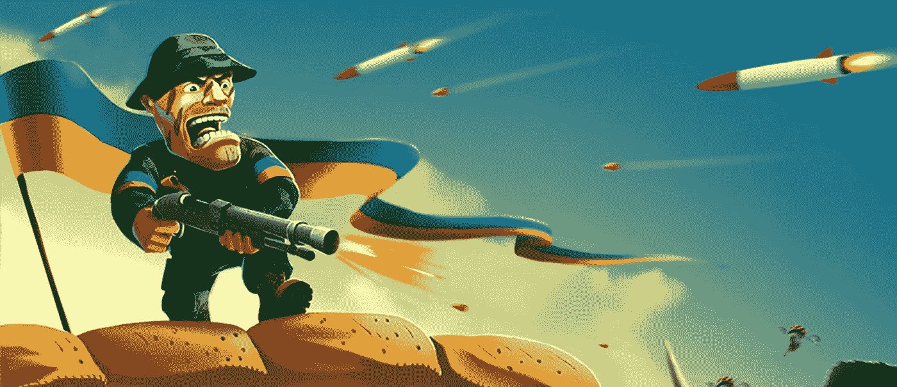
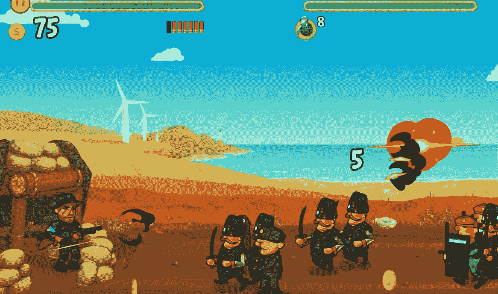
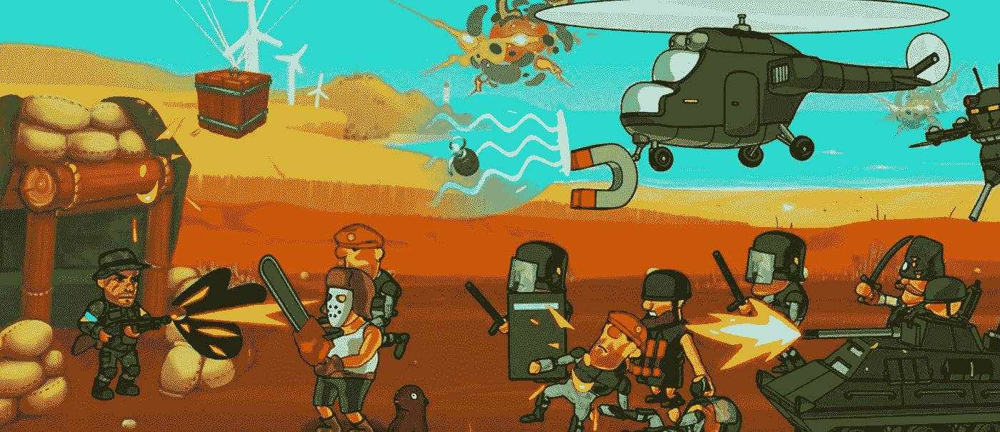
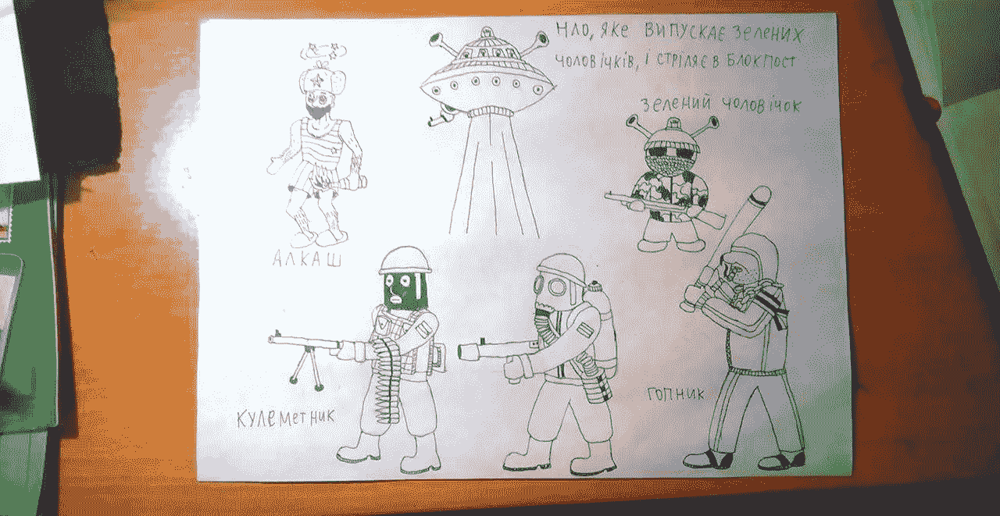

# 成功的故事:乌克兰射击游戏如何赢得全球 80 万球迷的青睐

> 原文：<https://medium.com/swlh/story-of-success-how-ukrainian-shooting-game-won-favor-of-800k-fans-all-around-the-world-a116f6648fc>

# 保卫你的“最后前哨”

太阳火辣辣的。平原上热气腾腾。咸咸的海风会灼伤肺部。你独自一人在这闷热的大草原上。你的前哨站是最后一个了。你必须站起来。直到有人来帮忙。直到弹夹里至少有一颗子弹。你是祖国最后的希望。野蛮的部落已经闯入你的家园散布破坏。你是唯一能阻止野蛮入侵者的人。你是唯一一个可以收回属于你和你家人的权利的人。

并让敌人在地面和空中的攻击越来越具有侵略性和轻率。让他带着他最绝望的打手和最疯狂的神风敢死队来追捕你吧。让他用装甲车和战斗无人机。拿起你的枪——坚持到底！

这是乌克兰 IT 公司[Stfalcon.com](https://stfalcon.com/en/portfolio)开发的热门射击游戏《最后的前哨》的情节。从 2015 年该游戏首次发布开始，它就在全球范围内不断受到欢迎。在 [Google Play](https://play.google.com/store/apps/details?id=com.stfalcon.lastoutpost) 的 80 万下载量说明了一切。平均申请分数也是如此，为 4.7 分。这款手机游戏的 iOS 版现在也可以在 [AppStore](https://itunes.apple.com/app/id1060615525) 买到，目前为止在那里的评分是 4，6。

“太好玩了。我想看看它能变得多疯狂。”

“不能不玩。我玩过的最好的动作游戏之一。”

“好游戏。简单，当你不想做一大堆事情的时候很好。重玩一关给钱少。这是让更好的项目毫无困难地前进的代价。我确实喜欢它。什么都不要改变。”

"这是一款不错的游戏，有很棒的游戏性、画面和音乐."

“合并。”

这些只是对我们在 Google Play 中的动作游戏的一些评论。但这款游戏不仅得到了用户的积极评价。2016 年，它赢得了游戏竞赛 Yodo Game Award 的“最佳创意”类别。

# 游戏是如何被创造出来的

这款游戏的创意源于 2014 年 2 月乌克兰历史上发生的戏剧性事件。不可能袖手旁观。我们总的来说想支持我们的军队和乌克兰人民。当到处都不好玩的时候，即使是一个小游戏也能让每个人都精神起来。

我们特意选择了一款知名游戏“沼泽攻击”作为我们项目的灵感来源。我们旨在点燃人们，引发积极的联想。“沼泽攻击”的情节是围绕着你的家园防御成群的狂怒野兽试图闯入并夷为平地。这正是我们的同胞对周围发生的事情的看法。我们将这些联系与当时的现实联系起来，并赋予它们相关的意义。燃烧瓶、盾牌、旧权力拥护者的侵略性犯罪暴徒、黄金制成的面包和抽水马桶——这一切都反映了现实，很容易辨认。我们甚至选择历史人物作为我们一些角色的原型。

在情感上，我们求助于乌克兰武术，它从哥萨克时代就存在于此。乌克兰战斗精神的内在特征是幽默和一丝自嘲。在困难时期，幽默总是有助于控制情绪，不至于崩溃。只有真正勇敢的人才能用幽默对待自己。在游戏中，幽默无处不在:在激动人心的音乐、滑稽的卡通音乐和生动的战利品描述中。

人们的反应很热烈。这款游戏迅速火了起来，并传播到了乌克兰境外。我们建议玩家通过我们的[脸书页面](https://www.facebook.com/TheLastOutpostUA/)参与图形开发。这个想法很成功，一些用户甚至给我们发来了角色的草图。

每个人都在游戏中找到了自己的东西。对于一些玩家来说，这是一种消磨时间和转移注意力的愉快方式。对其他人来说，这是灵感和鼓励的源泉。玩家提到的主要缺点是游戏太短。

新的剧集让人期待，开发者也在不断被推进。到目前为止，共有 54 个级别。进一步的发展很大程度上取决于玩家的活动。但是这个团队不会停下来。

# 游戏部分

许多玩家都注意到一个游戏的最大好处是它不会带来负担。但是你也不会觉得无聊:完成所有关卡都是一件作品。

游戏玩法相当简单。你的任务是在敌人到达你的哨站之前挤出一枪。在每一关之前，你购买新的盔甲和装备，并建立一条防线。为此，你使用前一关收到的硬币。你开始时只有一把猎枪，然后逐渐有了可以随意处置的木块、铁丝网、冲锋枪、卡拉什尼科夫步枪、破片杀伤手榴弹、急救包和燃烧瓶。总共有 5 种武器，7 种手榴弹和 5 种防御等级。

对于所有的东西，你有 6 个能量收费。全浪费了？等一个小时或者看个短视频。每一关都有礼物赠送。在 raw 中玩 5 天后，你会获得新的优势和能力。

游戏的核心是免费的。但是如果你愿意的话，你可以用现金购买游戏中的货币、奖金和复活角色所需的配给量。它还可以让你关掉广告。你也可以获得 1000 枚硬币邀请社交网络的朋友。

# 开火！

你的反应有多好？在危机中，你能集中精力完成任务并迅速做出决定吗？你能吹嘘自己有很强的耐力吗？测试你自己。加入全世界成千上万的玩家。在轻松的氛围中，通过经典射击游戏[【Stfalcon.com](https://last-outpost.stfalcon.com/index_en.html)[的](https://stfalcon.com/)“最后的前哨”提升你的生存技能。你会站起来的！因为你是真正的英雄！

## 【stfalcon.com】最初发表于**。**

**

## *这个故事发表在 [The Startup](https://medium.com/swlh) 上，这是 Medium 最大的创业刊物，拥有 325，521+人关注。*

## *在此订阅接收[我们的头条新闻](http://growthsupply.com/the-startup-newsletter/)。*

**