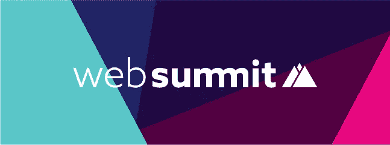
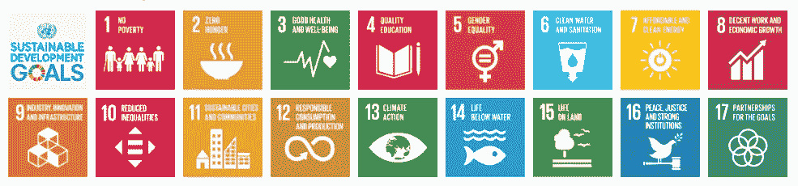
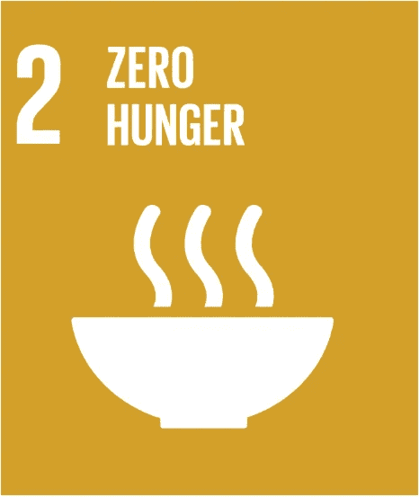
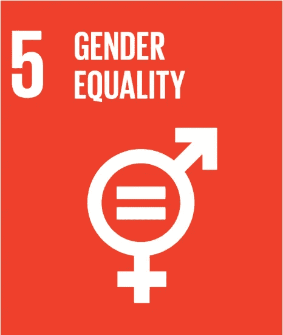
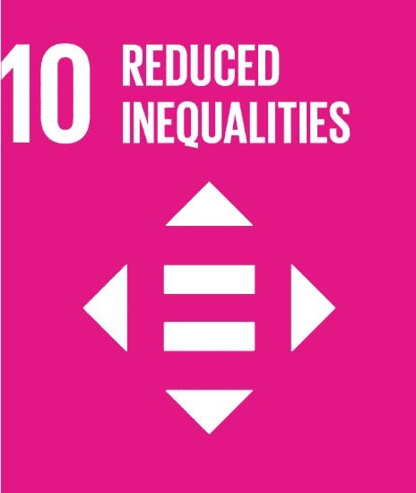
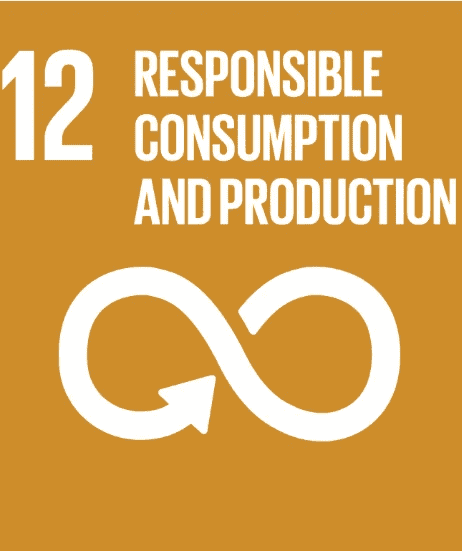
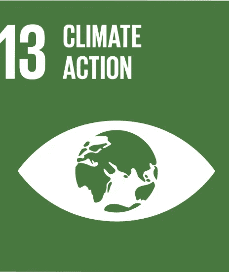

# 2018 年网络峰会:技术与可持续发展的交汇点

> 原文：<https://medium.com/swlh/storychief-at-web-summit-2018-where-technology-meets-sustainability-1b10b2dc8a36>

[https://websummit.com/](https://websummit.com/)
Credit: [websummit.com](https://websummit.com/)

什么是[网络峰会](https://websummit.com/)？

简而言之，它始于 2010 年的一个“简单的想法”——将技术社区的人们联系起来——演变成了世界上最大的技术会议。

或者，正如网络峰会联合创始人[帕迪·科斯格罗维](https://twitter.com/paddycosgrave)所说，

> “世界上最大的企业家聚会。”

但是 Web Summit 背后的人知道规模不是唯一重要的事情，这就是为什么他们以组织“地球上最好的技术会议”而自豪。

毕竟，他们张开双臂欢迎优步和 Stripe 等知名独角兽，而这些强大的公司还只是早期创业公司。

[StoryChief](https://storychief.io/) 很高兴成为今年在葡萄牙里斯本举行的 2018 年网络峰会上受欢迎的创业公司之一！

## 网络峰会:地球上最好的技术会议

但是怎么做呢？为什么呢？

除了他们的演讲嘉宾阵容中的科技界大腕之外，他们今年还承诺在 2018 年网络峰会上实现以下 17 个**联合国可持续发展目标中的 9 个**。：

[https://sustainabledevelopment.un.org/?menu=1300](https://sustainabledevelopment.un.org/?menu=1300)
Source: sustainabledevelopment.un.org

没错。世界上最大的技术会议，汇集了世界上最新和最伟大创新的思想领袖，引领着负责任的会议方式。

太棒了。

让我们突出几个，好吗？

## **联合国可持续发展目标 2:零饥饿**

该是有人想想那些被扔进垃圾桶的食物的时候了。

[https://sustainabledevelopment.un.org/sdg2](https://sustainabledevelopment.un.org/sdg2)
“End hunger, achieve food security and improved nutrition and promote sustainable agriculture.”

通过与 Zero Desperdicio 的合作，此次活动剩余的所有食物都将送给里斯本市内有需要的人。

## **联合国可持续发展目标 5:性别平等**

谈论房间里的大象！

[https://sustainabledevelopment.un.org/sdg5](https://sustainabledevelopment.un.org/sdg5)
“Achieve gender equality and empower all women and girls.”

2018 年网络峰会还通过引入技术领域女性休息室、导师会议和圆桌会议，优化了“技术领域女性”的体验。👩🏻‍💻

## **联合国可持续发展目标 10:减少不平等**

因为多样性比性别更重要，也比种族或年龄更深刻，2018 年网络峰会今年将超越使命召唤。

[https://sustainabledevelopment.un.org/sdg10](https://sustainabledevelopment.un.org/sdg10)
“Reduce inequality within and among countries.”

与 Crescer.org 合作，将有 12 名难民参加会议，他们已经做好充分准备，渴望积极参与为期 3 天的活动。

## **联合国可持续发展目标 12:负责任的消费和生产**

网络峰会将与米尔普里基金会合作，通过向与会者分发 30，000 个可重复使用的瓶子来加入“扭转塑料潮流”的运动。

[https://sustainabledevelopment.un.org/sdg12](https://sustainabledevelopment.un.org/sdg12)
“Ensure sustainable consumption and production patterns.”

此外，活动将使用仅可生物降解的餐具和食具，更不用说会议上使用的所有宜家家具都是可再利用、可重复使用或可回收的。👏👏👏

## **联合国可持续发展目标 13:气候行动**

随着 2018 年网络峰会与 Ecosia.org[合作，绿色将在很多方面成为今年的主题。他们将一起为每位出席者种下一棵树，也就是里斯本市内的 **7 万棵树**。](https://ecosia.org/)

“Take urgent action to combat climate change and its impacts.”

树木将战略性地种植在当地生态系统周围，确保会议实现完全碳中和。

这意味着今年的每个与会者都可以放心，他们已经为这个星球做了一些事情，只需要在里斯本参加会议。

这包括我们自己的故事树懒首领，它现在就在里斯本。

树懒是高度可持续的动物！

我们希望能在我们的展位见到您。

如果我们想念你，请在这里留下你的联系方式…

 [## 开始形成

### →

app.storychief.io](https://app.storychief.io/capture/1276?source=67436) 

## 这篇文章发表在 [The Startup](https://medium.com/swlh) 上，这是 Medium 最大的创业刊物，有+385，662 人关注。

## 在此订阅接收[我们的头条新闻](http://growthsupply.com/the-startup-newsletter/)。

