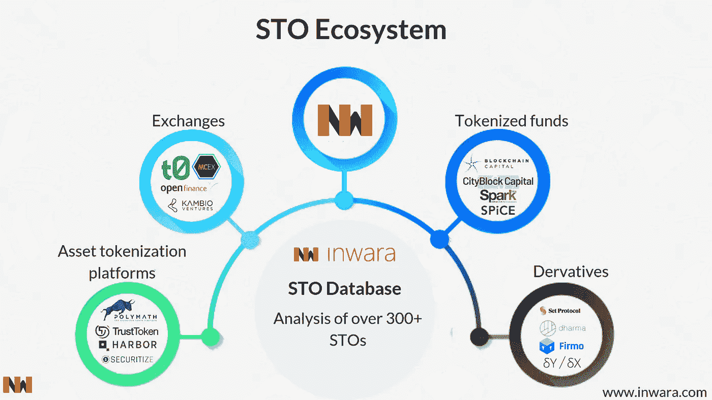
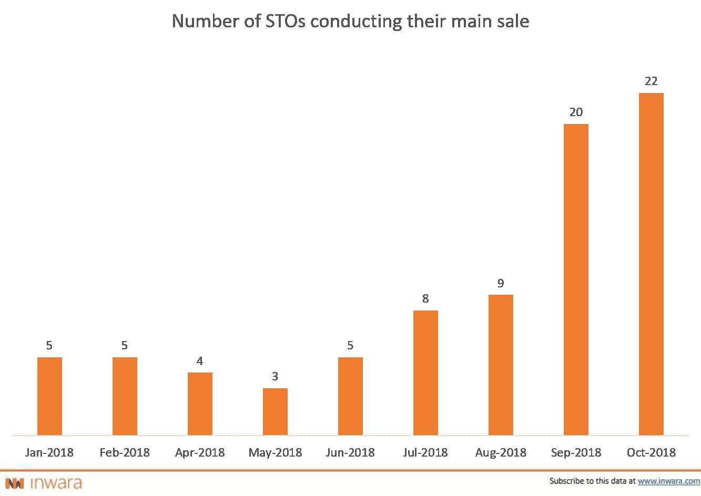
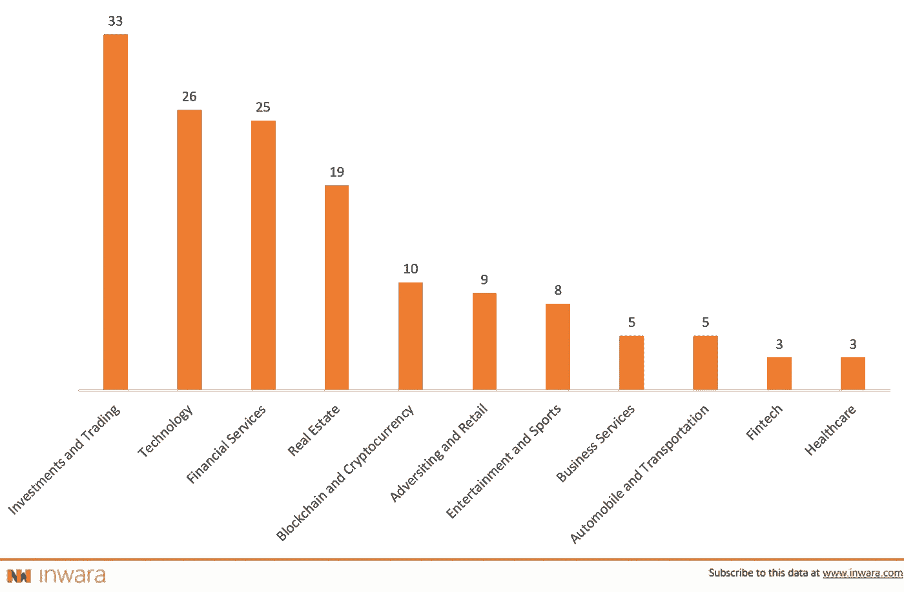
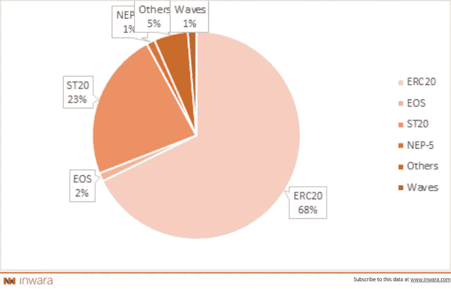
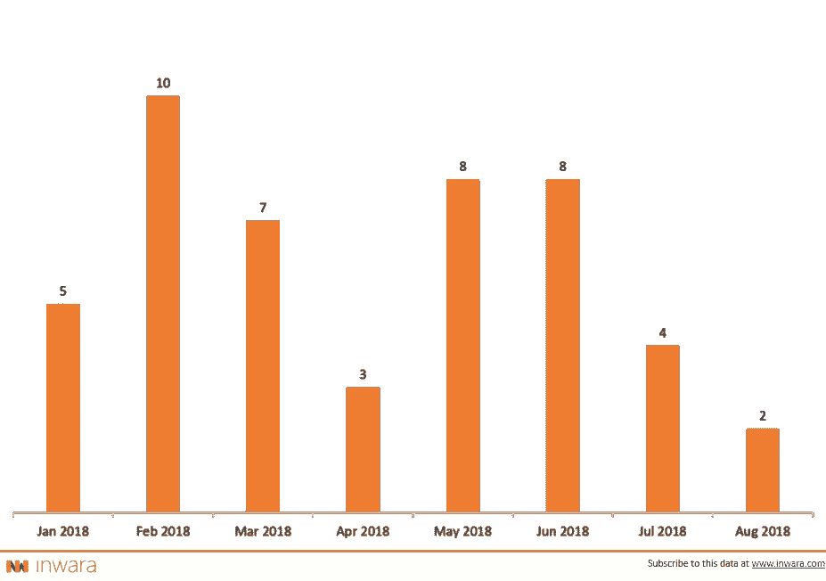
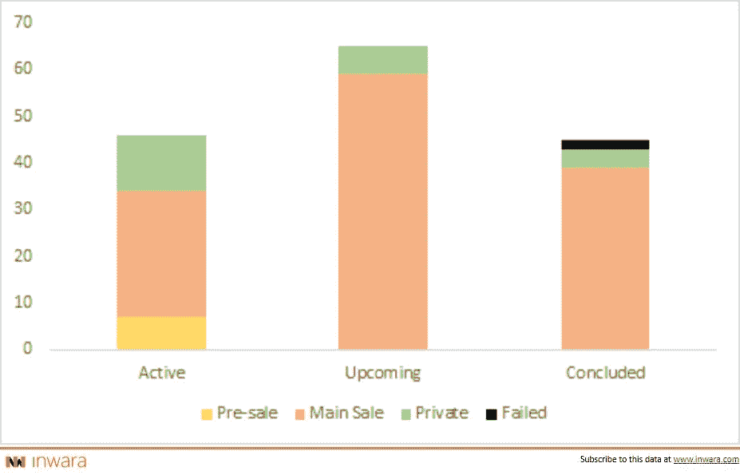

# 2019 年将会是 STO 之年吗？

> 原文：<https://medium.com/swlh/stos-security-token-offerings-will-rule-over-icos-in-2019-complete-sto-market-analysis-fb05223c8d20>

> [下载 InWara 关于安全令牌的报告(STO](https://www.inwara.com/report/security-token-offerings)

# STO:安全令牌产品

安全代币发行(STO)是一种类似于 ICO 的筹资工具，但有特定的法规要求代币发行者对其行为负责。

ico 相对快速的成功使其成为一种可行的众筹方式。虽然 ico 已经帮助许多初创公司筹集了大量资金，但由于几乎没有或根本没有监管，这种筹资方法也为各种骗局铺平了道路。

# 解码安全令牌提供(sto)

区块链技术自获得普及以来一直在发展，这主要归功于早期阶段的比特币。现在，随着智能合约的发展，安全令牌已经出现，其唯一目的是将自己确立为在法律边界内运行的实时数字资产的新用例。

## 4 层 STOs

**区块链协议**

安全令牌无权拥有自己的协议技术，而是基于现有协议构建而成，其中[以太网](https://www.ethereum.org/)是目前该领域最流行的协议。然而，这不是唯一的选择，因为有更多的协议进入这个领域。

**智能合约**

无论这个术语听起来多么美妙，这与智能合约和法律债券没有任何关系。它们基本上是由区块链协议设定的编程语言。理想情况下，它们应该有一个效用，因此有一个值，这就是它们被命名为效用*令牌*的原因。

**发行平台**

这些平台创建和分发公用设施令牌，还负责为令牌发行制定合规、受监管的智能合同。

**交易所**

数字资产生态系统中最重要的组成部分，因为它们促进了交易，因此提供了等式中的流动性。没有它们，代币就没有价值，除非有人愿意付钱。

> [下载 InWara 关于安全令牌的报告(STO](https://www.inwara.com/report/security-token-offerings) )

## 法规背后的原因

*SEC 对欺诈和不合规 ico 的打击，引发了同业从****ico****向****STOs****的转变。*

*sto 是因为在大多数司法管辖区，以法规和合规性的形式提供基础资产支持，并让项目背后的公司对其投资者负责。*

# sto 迅速取代 ico

[Source: InWara’s STO database](http://www.inwara.com/?utm_source=stostartup&utm_medium=stostartup&utm_campaign=stostartup)

2018 年 10 月是 sto 数量最多的一年。这种从 ico 到 s to 的明显转变主要是由于零售市场(比特币和以太坊)最近触底以及散户投资者对 ico 的需求疲软。

打击还导致投资者信心下降，促使投资者改变对 s to 的偏好。

# STO 景观

> 按行业划分的 sto 数量

[Source: InWara’s STO database](http://www.inwara.com/?utm_source=stostartup&utm_medium=stostartup&utm_campaign=stostartup)

到目前为止，投资和交易是数量最多的 sto，占总 sto 的 20%以上。金融服务业在 ICOs 数量上领先，但对于 sto 来说，该行业后退了一步。

sto 推动了投资流入真正的链外业务，提供股权/股份以换取资本。

> [下载 InWara 关于安全令牌的报告(STO](https://www.inwara.com/report/security-token-offerings)

# 令牌标准后跟 sto

[Source: InWara’s STO database](http://www.inwara.com/?utm_source=stostartup&utm_medium=stostartup&utm_campaign=stostartup)

[以太坊的](https://www.ethereum.org/) ERC 20 以 68%的 sto 代币采用率统治着这个领域。

[Polymath，](https://polymath.network/)首批支持 s to 概念的公司之一，凭借其 ST-20 令牌标准获得了 23%的第二大份额。

[证券化](https://www.securitize.io/)专门为 sto 开发了四个数字证券发行方，分别是 [Spice venture capital](https://spicevc.com/) 、 [Blockchain capital](https://blockchain.capital/) 、 [22X](https://22xfund.com/) 和 [Augmate](https://www.augmate.io/) 。这些代币的采用目前在这个领域还不太常见，但是对 sto 日益增长的需求可以提高证券化代币的采用率。

> [下载 InWara 关于安全令牌的报告(STO](https://www.inwara.com/report/security-token-offerings) )

当谈到数字货币投资时，s to 被认为对风险的偏好较低，因为与 ico 相比，安全令牌发行平台具有多样性。不可否认，ERC 20 在 ico 中以超过 90%的代币采用率领先，这就是为什么 ico 的市场趋势因 XRP 超越 ETH 成为总市值第二大 alt coin 等事件而扭曲。

此外，以太坊正在推出一个独特的令牌标准。ERC-1400 专门用于安全令牌。它目前正处于以太坊社区的测试阶段。我们的目标是通过在现有的安全令牌上添加特定的规范，使 ERC-1400 符合 ERC-777 和 ERC-20 标准，从而使安全令牌更加可信。

# 未来令牌的简单协议(SAFT)

[Source: InWara’s STO database](http://www.inwara.com/?utm_source=stostartup&utm_medium=stostartup&utm_campaign=stostartup)

随着美国证券交易委员会对欺诈发行人采取行动，SAFT 在美国证券交易委员会的登记数量大幅上升。最近的报告表明，美国证券交易委员会可能正在对所有在未来证券简单协议(SAFTs)框架下运作的项目进行系统调查。

# 到目前为止，STOs 的成功率高达 99%

[Source: InWara’s STO database](http://www.inwara.com/?utm_source=stostartup&utm_medium=stostartup&utm_campaign=stostartup)

我们现在见证了越来越多的 sto，因为有超过 60%的 sto 是活跃的或即将到来的。此外，打算筹集资金的公司开始意识到，由于安全代币所具有的价值，老练的和/或有资格的投资者和基金的兴趣更倾向于“安全代币”而不是“实用代币”。

> [下载 InWara 关于安全令牌的报告(STO](https://www.inwara.com/report/security-token-offerings)

根据 Inwara 的消息， [Neluns](https://neluns.io/) 通过 STO 迄今为止的最高纪录筹集了 1.36 亿美元，其次是 [Tzero](https://www.tzero.com/) 筹集了 1.347 亿美元。

# [SEC](https://www.sec.gov/) 股权融资领域的参展据点

美国证券交易委员会正在发表声明，寻求“既定”规则和条例的许可和执行之间的平衡，并毫不犹豫地对违规行为采取法律行动，就像它对 Paragon 和 Airfox 所做的那样。

[Paragon](https://paragoncoin.com/) 和 [AirFox](https://airfox.com/) 这两家 ico 已经成为美国监管机构和 SEC 的猎物，因为它们承认参与了未注册证券的销售，SEC 因此对它们处以 25 万美元的罚款。

> [下载 InWara 关于安全令牌的报告(STO](https://www.inwara.com/report/security-token-offerings) )

# 总结一下

在不久的将来，sto 可能会取代 ico。它们将是合法的、受监管的，人们可以带着真正的回报预期投资它们。回报不受比特币市场价格的影响，而是对数字经济生态系统有益的企业正现金流。

> 这些数据从何而来？
> 
> 要利用 InWara 的 STO 数据库，请在此安排您的[专家漫游。](https://calendly.com/amathur)

*声明:本文来源于* [*InWara*](http://www.inwara.com/?utm_source=stostartup&utm_medium=stostartup&utm_campaign=stostartup) *。这不是财务建议。InWara 不提升/降级任何公司/ICO。本信息或其他媒体中的观点、陈述、估计和预测仅属于作者个人。它们不一定反映 Inwara 或其任何附属公司(“Inwara”)的意见。Inwara 没有义务更新、修改或修正此消息或其他媒体，或以其他方式通知其接收者，如果此处陈述的任何事项或此处陈述的任何意见、预测、预测或估计发生变化或随后变得不准确。本邮件或其他媒体中提供的任何内容、信息和材料均按“原样”提供。Inwara 对其准确性、完整性或及时性，或收件人获得的结果不做任何明示或暗示的保证，并且不对任何收件人在此的任何不准确、错误或遗漏承担任何责任。在不限制上述规定的情况下，Inwara 对任何消息或媒体的接收方不承担任何责任，无论是在合同、侵权行为(包括疏忽)、担保、法规或其他方面，对于此类接收方因其或任何第三方决定的任何行动、意见、建议、预测、判决或任何其他结论或任何行动过程而遭受的任何损失或损害，无论是否基于此处包含的内容、信息或材料。*

## 这篇文章发表在 [The Startup](https://medium.com/swlh) 上，这是 Medium 最大的创业刊物，拥有+397，714 名读者。

## 在此订阅接收[我们的头条新闻](http://growthsupply.com/the-startup-newsletter/)。

