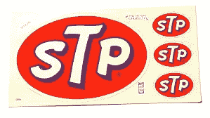

# 了解每个营销专家都知道但你不知道的 3 个秘密

> 原文：<https://medium.com/swlh/stp-marketing-6deb6b010b5>

## STP 营销

STP 是几种事物的缩写。STP 是汽车润滑油的一个品牌。这个名字最初是经过科学处理的石油的缩写。STP 也是 90 年代西雅图最棒的垃圾乐队之一。这是石神庙飞行员的缩写。瑞普·斯科特。

营销和销售是成功和致富的关键技能。

# 营销

[营销](https://www.udemy.com/course/mba-asap-marketing/?referralCode=521C9D2BAE54BCCA5D7D)中的 STP 代表**细分、目标和定位**。

STP 模式有助于营销人员精心制作他们的信息，开发和交付定制的相关信息，吸引细分的目标受众。

这种方法有助于制定内容营销的数字战略。您可以使用 STP 来应用营销角色和原型，以帮助开发相关的和有针对性的数字通信。

这是一种面向受众和客户的营销方式。目标是向具有商业吸引力的受众群体传递相关信息。

STP 侧重于识别最有价值的细分市场，然后为这些细分市场创建正确的营销组合和产品定位策略(想想 4p)。

# 分割

Segmentation

在[营销](https://www.amazon.com/MBA-ASAP-Marketing-2-0-Principles-ebook/dp/B07FTFMRFD/ref=tmm_kin_swatch_0?_encoding=UTF8&qid=&sr=)中，我们希望识别潜在客户，并说服他们购买。我们也有兴趣说服老客户成为回头客。

我们通过提供他们需要和想要的产品和服务来做到这一点。这一切都是为了让合适的人了解我们的价值主张。

每个人都是独一无二的，但我们也倾向于与他人有共同的兴趣。我们希望尽可能以最精确的方式来识别这些共性。这些被称为小生境。

我们使用细分来识别具有特定需求和愿望的利基市场，我们可以清楚地表达这些需求和愿望。在成熟市场，我们利用细分来寻找新客户。细分使我们能够集中我们的信息并更有效地传递。

营销信息的设计应针对并告知每个细分市场与该细分市场最相关的优势和特点。这是一种不同于大众营销的方法，在大众营销中，一种尺寸适合所有类型的客户。这种方法更有效，因为它向正确的人群提供正确的组合，而不是一种喷雾祈祷的方法。

市场可以根据任何变量进行分割，只要它是可以明确定义和衡量的。以下是一些例子:

## 人口统计数据

这是最广为人知的将人们分类的方法。可以通过:地域、年龄、性别、收入、教育程度、种族、婚姻状况、专业或职业。人口统计学解释了你的买家是谁。

## 心理图形

心理图形探究顾客购买的“原因”。这是一种基于与购买决策相关的个性和情感特征的行为分类方法。心理特征包括:态度、生活方式、爱好、个性和领导特质以及对风险的态度。

通过访谈、调查、问卷、客户数据和反馈收集数据，帮助形成典型客户的心理特征。这是脸书基于“喜欢”收集的信息。

根据客户的心理特征建立客户群的原型。

你可以从互联网、网络和手机上购买和获取大量关于潜在客户兴趣和态度的数据。当我们在本书后面讨论分析工具和来源时，我们将对此进行更多的探讨。

## 生活方式

生活方式是指非工作时间的努力，如爱好、娱乐活动、娱乐、度假和其他。Google Adwords 等工具中使用的关键字和搜索词可以帮助您根据潜在客户的生活方式兴趣和偏好来定位和定位他们。稍后，当我们进入数字营销时，我们会对此进行更多的讨论。

研究这些行为利基的一个有效方法是 Reddit，志同道合的人在这里创建关于给定兴趣或爱好的子主题。共享的信息对于了解客户群非常有价值。

## 信仰和价值观

这指的是宗教、政治、民族主义和文化信仰和价值观。像脸书这样的社交媒体平台是 Twitter 的好来源。

## 生命阶段

人们根据他们的年龄改变和喜欢不同的活动，有不同的兴趣。二十多岁的人和六十岁的人属于不同的范畴。人生阶段是人的生命在不同年代阶段的标杆。查看“段落”这本书，它是关于这种方法的很好的初级读本。

## 地理

这是你根据国家、地区、区域、邮政编码、城市或乡村位置、气候或山脉等来查找人们的地方。

## 语言

有了像 Google 和 Bing 这样的免费翻译工具，我们可以相对容易地考虑锁定语言群体。

## 行为

行为经济学研究心理、认知、情感、文化和社会因素对个人经济决策的影响。在细分中，它指的是顾客与购买性质、品牌忠诚度、使用水平、寻求的利益、使用的分销渠道以及对营销信息的反应之间的关系。亚马逊已经掌握了积累这些数据来创建购买者的个人资料。

## 使用水平

用法是一个有趣的变量。许多公司认识到他们有“超级用户”,他们负责很大一部分销售。例如，可口可乐公司有一个超级用户俱乐部，因为他们估计 20%的顾客贡献了 80%的销售额。识别并培养你的超级用户。

# 把…作为目标

Targeting

下表列出了评估每个细分市场潜在商业可行性的各种标准。

## 大小

市场必须足够大，以证明细分的合理性。随着长尾市场的出现，市场潜在规模已经扩大。长尾指的是可以通过网络到达的市场，在地理上没有集中，但热情的兴趣遍布全球。将所有这些孤独者加在一起，他们可以代表重要的市场。你的产品越独特，你在不同地理区域的营销就越多。

## 差异

细分市场需要清晰可辨。细分市场之间必须存在可测量的差异。测量工具和技术随着数字营销而激增。谷歌分析是一个主要工具。

## 金钱

它必须在经济上是值得的。预期的增量利润必须超过额外的营销成本。获得客户的成本(CAC)必须低于他们购买的终身价值(LTV)。CAC

## 易接近

每个细分市场的潜在客户必须有能力接收你的营销信息，分销网络必须能够接触到他们。随着网络和移动通讯、数字下载、SaaS 模型和隔夜运输的出现，可访问性显著提高。

不同的细分市场对不同的优势有不同的反应，因此要重点宣传不同的优势。

# 配置

Positioning

定位映射了细分和目标步骤中讨论的变量，并定义了您的产品在客户眼中相对于竞争对手的位置。

深思熟虑的定位是在市场中取得竞争优势的关键。

定位是品牌的一个组成部分，我们将在下面讨论。顾客的感知和反馈会影响品牌在市场中的定位。

三种定位会影响品牌及其竞争优势:

功能的

符号的

经验的

## 功能定位

功能定位与功能集和用户体验有关。

它侧重于价值主张的各个方面，即满足和实现客户的需求和愿望。

## 符号定位

奢侈品牌和知名品牌在这个领域经营。这些是你的产品中令人向往的元素；满足顾客自尊的品牌特征。

## 体验定位

体验定位侧重于品牌的元素，解决与客户的情感联系。

这三个要素结合起来定位**品牌**。定位是一种概念性工具，有助于定制您的价值主张并将其传达给客户。您希望突出您相对于竞争对手的优势，并以令人信服的方式向客户传达这种区别。

Segmentation, Targeting, Positioning, Branding

# 想要更多吗？

看看我写的关于数字时代的[营销的书。](https://www.amazon.com/MBA-ASAP-Marketing-2-0-Principles-ebook/dp/B07FTFMRFD/ref=tmm_kin_swatch_0?_encoding=UTF8&qid=&sr=)

[跳过商学院。自我教育。](https://www.amazon.com/MBA-ASAP-Master-Game-Business-ebook/dp/B07N5GGQXT/ref=tmm_kin_swatch_0?_encoding=UTF8&qid=&sr=)

## 这篇文章发表在 [The Startup](https://medium.com/swlh) 上，这是 Medium 最大的创业刊物，有+ 379，938 人关注。

## 订阅接收[我们的头条新闻](http://growthsupply.com/the-startup-newsletter/)。

