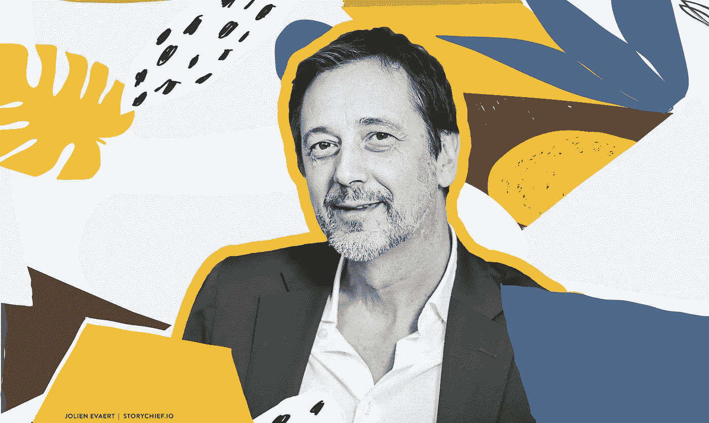
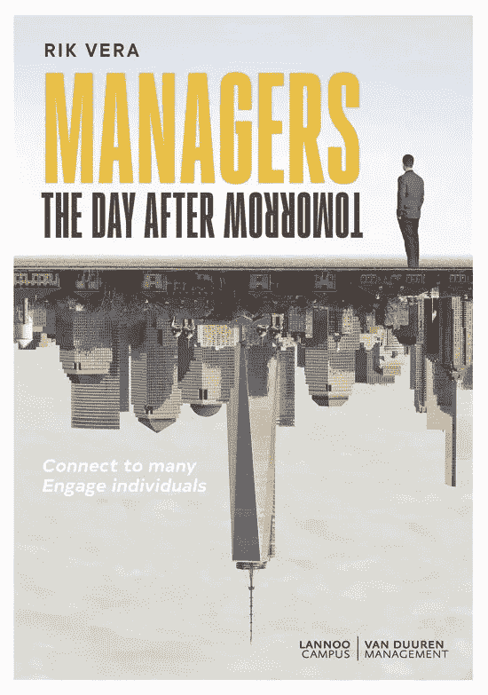
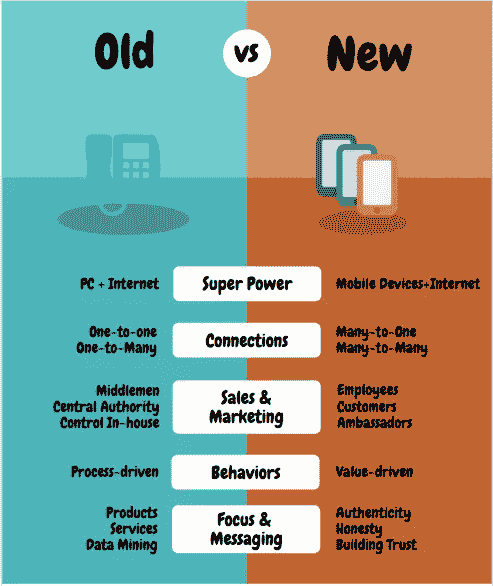

# 据 Nexxworks 的 Rik Vera 称，比内容营销更奇怪的事情已经发生了

> 原文：<https://medium.com/swlh/stranger-things-have-happened-than-content-marketing-according-to-rik-vera-of-nexxworks-578eaf95a9b9>

© Jolien Evaert | Story Chief

像任何体面的面试官一样，我利用我的人际网络和搜索引擎，在本月早些时候与 [Nexxworks](https://nexxworks.com/) 的 [Rik Vera](https://rikvera.com/) 进行了一次面谈。在这个数字化转型和创新的时代，Nexxworks 是内容营销的信奉者。

我不得不承认，这不像是一次采访，更像是两个老朋友之间的对话。

## 告诉我你的书，瑞克。 [*后天管理者*](https://www.bol.com/nl/p/managers-the-day-after-tomorrow/9200000085455202/?suggestionType=suggestedsearch&bltgh=sX6hDVZBsZUGTG0tEFRCww.1.2.ProductTitle) 。它正被翻译成英语。我确实在你的个人网站上看到了它的序言的预览。

是的。它将于 9 月 18 日以英语发行。

我不得不说。我习惯于写专栏和博客，但写书是如此不同。

比方说，当你为比利时报纸撰稿时，你最多只能写 800 字。所以你会习惯这种写作，而不是 50000 字的章节。我自己用荷兰语写的，我对这个翻译感到兴奋，因为翻译常常成就一本书，也可能毁掉一本书。

我想写一本我想读的书。

[https://www.bol.com/nl/p/managers-the-day-after-tomorrow/9200000085455202/?bltg=itm_event%3Dclick%26mmt_id%3DMMTUNKNOWN%26slt_type%3Drecommendations%26pg_nm%3Dpdp%26slt_id%3Dprd_reco%26slt_nm%3Dproduct_recommendations%26slt_pos%3DC1%26slt_owner%3Dccs%26itm_type%3Dproduct%26itm_lp%3D2%26itm_id%3D9200000085455202&bltgh=lfiG5L654JHQi31dXjxLLw.1_6_7.9.ProductImage](https://www.bol.com/nl/p/managers-the-day-after-tomorrow/9200000085455202/?bltg=itm_event%3Dclick%26mmt_id%3DMMTUNKNOWN%26slt_type%3Drecommendations%26pg_nm%3Dpdp%26slt_id%3Dprd_reco%26slt_nm%3Dproduct_recommendations%26slt_pos%3DC1%26slt_owner%3Dccs%26itm_type%3Dproduct%26itm_lp%3D2%26itm_id%3D9200000085455202&bltgh=lfiG5L654JHQi31dXjxLLw.1_6_7.9.ProductImage)
Which world do you live in?

## **那么接下来我要问，你是电视剧*陌生人* *的粉丝吗？***

## 整个前提是基于“颠倒的概念”**的概念——某种与人类世界平行存在的另一个维度**？

是的。这就是我的封面照片的目的。

这是真实发生的事情。你有这个上层世界和这个下层世界，当你看商业时，大多数公司仍然生活在上层世界。他们没有意识到在他们脚下有一个全新的世界正在发展。突然间冥界变成了上层世界，反之亦然。

> **“对于大多数公司来说，后天已经来了。”**

玛雅人是对的。旧世界翻转成新世界…

如果我们看看零售业，这已经发生了。他们没有意识到他们已经变成了地下世界，因为消费者已经发现了新的世界并转换了。最终，这些企业只剩下旧的商业模式，但再也没有顾客了。

> “新经济看起来像旧经济，就像 Airbnb 看起来像酒店行业，就像优步看起来像出租车行业一样。”

但我们说的是上层世界和下层世界。这些商业领袖中的一些人看着镜子里的自己，不明白为什么他们的形象看起来是一样的，但是一种商业模式是成功的，而他们的却不是。

这是因为镜子的一边和另一边有不同的物理定律。

## 物理？这是我在学校学过的最难的科目之一。

## 请告诉我更多关于物理学在这场数字化转型浪潮中扮演的角色。

旧经济和新经济的物理规律完全不同。

只要人们不愿意放弃旧的方法，他们就不会学习新的物理学，也永远不会学习新的方法。但是你不必改变你的积木。请意识到，我们在旧经济中建立的联系是由旧的物理定律建立的，而有了新的物理定律，联系之间就有了不同的结构。

公司和人之间的联系，人和他们的公司之间的联系，现在都不同了。陷入旧常态的公司认为只要将旧结构“数字化”就足够了，而不是用新的物理学来分解和重组联系。

我希望每个人都来了解新的物理。

## 阿门。那么我们能具体谈谈销售和营销发生了怎样的变化吗？

我们已经有了 100 多年的公司和客户之间的互动，这种互动的基础是公司在销售代表和消费者之间有一些一对一的 T2。也许是你店里的某个人在和顾客交谈，或者甚至是企业对企业的交谈。

然后是**一对多**营销。因为那时候，这是你唯一能做的。因此，我们开发了一整套规则和概念、管理技术和营销技术，以适应这种类型的世界。

通过个人电脑和互联网的礼物，消费者在某个时候被赋予了超能力。他们不仅手边有信息，还可以互相访问。

> “有史以来，我们第一次连在了一起。”

突然间，它变成了多对一。

“许多”公司现在都在争夺“一个”客户的注意力。这是你对整个世界的轴心。**这不再仅仅是个人电脑的事情，而是智能手机和其他移动设备的事情。** *这个*就是现在客户的超能力。

公司一直认为这是他们的超级力量，但实际上这是顾客的。许多公司低估了这给了人们与他人联系的力量。它把顾客放在宇宙的中心。

## 于是，**一对一**和**一对多**翻转为**多对一**和**多对多**。

是的。我们已经进化到一个不再有中间人和中央权威的社会。

每个人都与每个人有联系，所以如果你看看经典营销，有细分和买家角色。我们甚至开发了顾客之旅，以及所有这些拉近与顾客距离的尝试。

这还不够。

在任何特定的时间和特定的时刻，顾客都希望被当作个体对待。**多对一**和**多对多**是新的物理学，我将它与你的大脑层进行比较。这并不是说更低的层不再存在，只是因为仍然需要一对一和一对多的物理定律，只是因为它们上面的层，物理定律有所不同。

新的成功公司将最大限度地利用新的物理原理，利用他们的客户成为他们的销售和营销部门，这包括内容营销。 客户可以成为你的基础设施。

那些一开始不相信 **Airbnb** 和**优步**的人认为这是不可收拾的。他们认为你需要控制出租的房产和驾驶的汽车。他们低估了网络的力量，人们可以在其中控制质量，甚至可以成为向你提供产品的基础设施。

## 这些同样的顾客也能毁了你。我们目睹了这一切。

他们可以。

所以你需要时刻保持和谐，因为公司可能会在一夜之间被摧毁。控制它的不再是公司，而是一群人。作为一家公司，你需要足够谦虚，才能与外面的部落合拍。

## 那你是怎么做到的呢？你如何表现出谦逊？

看看这些层。

1.  潜入你的沮丧顾客的红色海洋，让他们参与进来，创造一个生态系统。
2.  利用你的客户数据向他们表明你关心他们，你了解他们，而不仅仅是追加销售、交叉销售或深度销售。
3.  不要到处喊你有最好的产品，而是展示你是真实可信的。

这与我从许多领域的行业专家那里听到的非常相似，即[真实性](https://blog.storychief.io/advice-for-startup-founders-around-storytelling)和[建立信任](https://blog.storychief.io/why-gdpr-is-good-for-your-business)正在夺回它们在商业宝座上应有的位置。

是的。建立信任，诚实和有道德，并表现出你在乎——你有一颗心。

> “展示你自己，因为人们希望和有个性的人一起工作。”

以客户为中心并不意味着你自己没有个性。没有人喜欢和没有个性的人做生意。

**经理:**

*   确保你把人们放在你和你的顾客之间，并赋予他们权力。
*   让你的员工脱离流程，并**向他们展示你公司的价值观。**展示你的内心和个性，让你的员工参与价值驱动的行为，而不是过程驱动的行为。

## 那么我可以假设你是员工驱动和客户驱动的内容营销的信徒？内容创作中的协作？

绝对的。

关于公司的外部或非中间人的故事写得越多，公司就越有吸引力。这是公司仍然需要习惯的事情。他们没有受过这样的训练，现在突然之间，他们不得不放弃中央权力，放弃一些内容营销，让给他们可能从未见过面的人。

这需要一种新的领导力。

## 这就是你和管理团队在 Nexxworks 的领导方式吗？你认为它与那些更大更老的公司相比如何？

我们试着。

即使是像我们这样的公司，也正处于新旧社会的转折点——旧的领导方式和新的方式。这对我们来说相当容易，因为我们是一家年轻的小公司，但我确实认识到，对于大公司来说，经历这一过程非常困难。

我担心的是，公司有两种做法:

1.  太慢了，而且
2.  不要一路走来

然后你就有了利益冲突。他们要求最接近客户的人变得更加以客户为中心，但在这个过程进行到一半时，他们又回到了原来的方式。然后你就有了一个介于旧公司和公司目标之间的律师。

> “我们正在烧掉一整套夹在中间的聪明的年轻经理。”

## 这就是你写书的原因吗？因为我知道你的搭档彼得·辛森和史蒂文·范·贝勒赫姆也写了他们自己对你所说的变化的看法。但是你的书是专门针对管理者的。

是的。鉴于我的背景，经理是我最了解的人。经理们。

你如何应对这些挑战？

这本书不是什么灵丹妙药，但我想确保今天的经理们意识到这个新世界的物理特性及其愿景。

## 你也可以通过你在 Nexxworks 的博客来做到这一点。你们显然都相信内容营销是一种营销工具。能谈谈内容营销吗？它的过去、现在和未来？

内容营销将会成为一门新的科学，一旦它成为一门科学，你就能使它自动化。SEO 可以自动化。真实性甚至可以自动化，但我坚信美存在于不完美之中。我们必须小心不要让事情变得太完美。

我不喜欢读那些让人感觉有隐情的文章。我喜欢读这样的东西:这是为内容而写的，而不是为了吸引特定公众而写的内容。但这只是我。

## 阿门。我也是。但是这种内容营销很快就会被 AI 针对你的想法呢？

我们所做的部分工作将由人工智能驱动——这是毫无疑问的。

人工智能将能够写故事，但同时这一切都是关于真实性。

我讨厌公司编故事。

> **“不要编故事，努力创造真实性。它有回旋镖效应，会回来打你的脸"**

它是关于内容，而不再是关于你的产品和服务。

## 由于市场营销的这种转变，你会看到每个人都关闭弹出窗口，忽略广告。但是现在，广告被融入到内容中。

## 我自己也在纠结这个问题，但我知道这是内容营销中不可避免的弊端。

我也在纠结同样的事情。

我们都是内容内容内容营销。

在不丧失真实性的情况下，您能在行动号召(CTA)中走多远？

我们过去生产内容，并认为这就足够了。不是的。如果你有产品要卖。只要是有机的，不需要销量，内容就可以了。但是一旦你开始扩大规模，那就另当别论了。不能用内容给人付费。

有一条很细的线。那些专门帮助公司在他们的内容营销中找到商业和真实之间的平衡的人——他们将是主要的参与者，非常重要。

同意。这是一个需要填补的特殊角色，那些阅读这篇文章的人，尤其是那些寻求职业建议的人，应该明智地去追求它。

## 最后，我想谈一点个人的事情。你的女儿们，她们已经 20 多岁了。但是，让我们说，他们刚刚高中毕业，你可以给他们一条关于开始职业生涯的建议。

## 那会是什么？

[乌达城](https://eu.udacity.com/)。利用有这样的东西可用的优势。

传统的高等教育机构是很好的，但是在这个时代，你没有获得后天所需的技能是愚蠢的。

[*故事长*](https://storychief.io/) *感谢瑞克如此慷慨地抽出时间。*

## 这篇文章发表在 [The Startup](https://medium.com/swlh) 上，这是 Medium 最大的创业刊物，拥有 355，974+人关注。

## 在这里订阅接收[我们的头条新闻](http://growthsupply.com/the-startup-newsletter/)。

