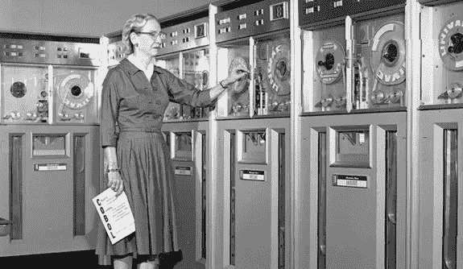

# 战略领导:管理事物和领导人们

> 原文：<https://medium.com/swlh/strategic-leadership-managing-things-and-leading-people-2e6b15650870>

Photo Credit: Courtesy of the Computer History Museum via [Yale News](https://news.yale.edu/2017/02/10/grace-murray-hopper-1906-1992-legacy-innovation-and-service)

没有人能比少将·格雷斯·默里·霍珀(或被称为“惊人的格雷斯”)说得更好了。关于管理和领导的区别，她说 ***“你管理事情；你领导人们。”***

海军上将霍普(1906-1992)是 20 世纪真正的先驱。她不仅是第一个成为海军旗舰军官的女性之一，她还在开发第一种计算机语言(COBOL)方面发挥了重要作用，这种语言一直沿用至今。1945 年的一个晚上，她创造了“调试”这个术语(通常用来指修复计算机代码错误)，当时她和一位同事拆开了一台坏掉的计算机，却发现里面有一只大飞蛾。因此，计算机实际上被“调试”了。[1, 2]

霍普上将是非同寻常的。她的工作为我们今天使用的计算机奠定了基础。然而，当被问及她最大的成就是什么时，她自豪地回答道，“这些年来我培养的所有年轻人。”[2]

# **管理**

我经常惊讶于很少有领导人应用海军上将霍普的格言。大多数领导每天都有大量的事情要做，而且经常只和事务性的人打交道。也就是说，他们与下属互动的主要动机是对他们有所要求。那些领导者试图管理他们一天的需求，结果他们管理了一天中的每件事和每个人。

这种方法肯定会做一件事，让人们不想再为那些领导人工作了。人们很聪明，能够很快意识到什么时候一个领导者把他们的最大利益放在心上，什么时候一个领导者没有。

霍普上将说得对。领导每天都对他们有很高的要求。但是这些需求是东西，而不是人。通过设置优先级、保持有效的时间表、开发系统和协议，以及装备和授权团队承担任务来管理事情。

如果没有一些实用的技巧来应用海军上将霍普的永恒格言“你管理事情；你带领的人。以下是我多年来受益匪浅的个人“经验教训”;我希望它们对你和对我一样有用。

# 管理事物的 5 个技巧:

*   **早点醒来！我们一天中最有效率的部分是在其他人起床活动之前的几个小时。在这宝贵的不受干扰的时间里，我们可以喝杯咖啡或茶，全神贯注地度过一天。经过一整夜的睡眠后，我们的大脑处于最佳状态，我们也是如此，这使我们能够做一些最好的工作。**
*   每天列一个清单。美国中央情报局的一项研究表明，人们在短期记忆中一次只能记住大约六件事情。[3]这意味着面对每天向我们袭来的无数任务，除非我们把它们列成清单，否则我们肯定会忘记一些东西。列清单让我们处于优势。它不仅释放了我们的短期记忆，用于创造性任务和解决问题，它还使我们能够形象化并优先考虑我们的一天。
*   **先做你最困难的任务。据说，如果你“早上第一件事就是吃一只活青蛙……那么一天中就不会有更糟糕的事情发生了。”[4]从最困难的任务开始，不仅让我们摆脱了那只“青蛙”,还让我们自由地充分享受每一天。**
*   **应用五分钟规则。我们大多数人都有推迟小任务的倾向，因为它们似乎会让我们偏离正轨。乍一看，这个理论很有道理，我以前也是这么想的。然而，在领导大型团队和项目多年后，我意识到推迟小任务实际上会降低我们的工作效率。这是因为大多数小任务可以在五分钟或更短的时间内完成——回复邮件、审阅文件等等。推迟这些小任务会导致我们错过快速的胜利和直接的结果。这就是为什么我对小任务应用五分钟规则，如果它能在五分钟或更短的时间内完成，我会立即完成，如果不能，我会写下来。**
*   知道如何以及何时授权。没有一个领导者能做所有的事情。管理任务的一部分是知道哪些是自己要做的，哪些是要委托给别人的。一般来说，如果你有太多的工作要做，而其他人至少有你 80%的能力，那么你应该把它委派出去。

# **领导力**

另一方面，人们不是被管理，而是被领导。实际上，人们希望知道他们被一个组织所重视，并且这个组织的领导者把他们的最大利益放在心上。这是每一个领导者的起点；没有信任，人们根本不会跟随你。

人们还需要得到一个愿景(或清晰的画面),了解组织试图完成什么，以及他们如何融入其中。领导力不是管理每天的需求，而是带领人们走向一个方向。

霍普上将的方向是彻底改变人们与计算机互动的方式。这样的目标要求人们适应快速的变化，并愿意不断尝试新的想法和方法。

人们不会自然而然地接受未经检验和不确定的事物，但由于霍普上将的领导，许多人追随了她。

霍普上将和普通领导人的区别在于，她理解一个基本概念，你管理*事情*和你领导*人民*，这在她的职业生涯中造成了所有的不同。

# **领导别人的 5 个小技巧**

*   首先建立信任。信任是有人追随你的原因。没有信任，你无法领导。许多领导者在没有首先与下属建立信任的情况下就推进政策或目标，这是错误的——会导致高流动率、缺乏认同和糟糕的结果。为了建立信任，我们必须向他人展示我们将他们的最佳利益放在心上，并且我们有能力领导他们。
*   **确定什么是重要的。在每个组织中，每个人都必须购买某些东西才能获得成功。你能想象如果麦当劳说他们不会提供快速服务，或者如果谷歌说他们不会促进创新吗？这些公司肯定不会有今天的地位(如果它们还在经营的话)。在每一个组织中，我们需要确定是什么“东西”让我们与众不同，让我们成功，然后，我们需要帮助他人相信它，并每天实践它。**
*   **换位思考。**很少有人会因为某件事对你很重要而去做，但大多数人会因为某件事对自己很重要而去做。如果我们希望其他人相信我们组织的愿景，我们需要试着从他们的角度看问题，并向他们展示我们的愿景如何使他们受益——无论是加薪、奖金、对事业的信念、团队的友情，还是其他。
*   **过度沟通。领导者经常犯的错误是与组织中的人沟通不够。令人惊讶的是，当人们感觉他们在组织决策的“圈内”时，士气会提高多少。在每一个决策中，人们都想知道自己的意见和想法被听到了(不一定被执行，只是被听到)。此外，当人们感到自信，知道对他们的期望，并在达到这些期望时收到反馈时，士气会提高。世界上最未被充分利用和最具成本效益的奖金是理所应当的赞美。**
*   **培养你的员工。作为领导者，我们的工作就是确保员工每天都在成长和变得更好。不管是有 30 年经验的人还是新员工，我们所有人都有知识可以分享，都有成长的空间。新员工为组织注入新的视角和新兴技能，同时，有经验的员工传达高效的方法和专业知识。作为领导者，我们必须确保每个人都有一个与他人分享知识的平台，并且员工可以参加外部课程和培训，使他们成为组织更有价值的资产。**

# 参考资料:

1.  “美国军舰霍普号(DDG 70)以少将“惊人”格蕾丝·赫柏命名，” *PublicNavy.mil，2017 年 11 月 12 日访问，*[http://www . public . navy . mil/surfor/ddg 70/Pages/nameske . aspx #。Wf_GB5OnFQI](http://www.public.navy.mil/surfor/ddg70/Pages/namesake.aspx#.Wf_GB5OnFQI) 。
2.  《格蕾丝·默里·霍珀(1906–1992):创新与服务的遗产》*耶鲁新闻*，2017 年 2 月 10 日[https://News . Yale . edu/2017/02/10/格蕾丝-默里-霍珀-1906-1992-遗产-创新与服务](https://news.yale.edu/2017/02/10/grace-murray-hopper-1906-1992-legacy-innovation-and-service)。
3.  豪雅，理查兹 J. *智力分析心理学*。华盛顿特区:中央情报局情报研究中心，1999 年，第 19 页
4.  *引用 Investigator.com*2013 年 4 月 3 日[https://quoteinvestigator.com/2013/04/03/eat-frog/](https://quoteinvestigator.com/2013/04/03/eat-frog/)的话:“每天早上吃一只活青蛙，接下来的一天就不会有更糟的事情发生了。

**看看我和妻子创办的这家初创公司，它帮助利用商业作为打击人口贩运的一种方式。我们通过一杯咖啡赋予女性改变世界的力量。公平贸易咖啡杯及制品—**[**allofusmatter.org**](http://allofusmatter.org)

## 这个故事发表在 [The Startup](https://medium.com/swlh) 上，这里有 263，100 多人聚集在一起阅读 Medium 关于创业的主要故事。

## 在这里订阅接收[我们的头条新闻](http://growthsupply.com/the-startup-newsletter/)。

