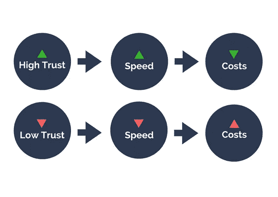

# 信任的有形力量

> 原文：<https://medium.com/swlh/strategic-leadership-the-tangible-force-of-trust-b2670b2cbd51>

## 战略领导系列

Photo by [rawpixel.com](https://unsplash.com/photos/3BK_DyRVf90?utm_source=unsplash&utm_medium=referral&utm_content=creditCopyText) on [Unsplash](https://unsplash.com/?utm_source=unsplash&utm_medium=referral&utm_content=creditCopyText)

为什么有些领导者似乎总能建立起充满活力和高效的团队，而其他人却很难留住员工？

史蒂文 M.R 柯维在他的畅销书《信任的速度 中，将信任定义为我们对另一个人的**性格**和**能力**的信任程度。[1]他认为，尽管信任本质上是一种无形的软技能，但信任在一个组织中带来的好处是实实在在的。

他证明了在低信任度的组织中存在一种“隐性税收”,这种税收会增加几乎所有东西的成本。同样，他展示了高信任度的组织如何更有效率，更善于决策，能够执行更好的策略，以及更具成本效益。

他的底线是:当信任度高时，速度提高，成本下降，同样，当信任度低时，速度下降，成本上升。

# 信任是关于期望的

像信任这样无形的东西怎么会对我们的底线产生如此巨大的影响？答案是因为信任会让我们加倍努力。这是允许他人独立行动并满足我们期望的东西。

我们所有人都以这样或那样的方式经历过这种情况。在工作中，我们可能会委托某人准备并发送报告，处理与客户的重要接洽，开发解决问题的方法，或者甚至选择墙壁的油漆颜色。不管是什么，当我们授权他人处理需要做的事情，并且他们按照我们的期望去做时，我们的组织会发展得更快、更有效率。

> 信任不能给予不符合我们期望的人，没有人能建立信任，除非他们知道我们的期望。

# 让人们参与进来

正因为如此，信任始于一段关系。如果我们希望别人达到我们的期望，他们需要了解我们，同样我们也需要了解他们。我们必须关注对他们的职业和个人都很重要的事情，当我们这样做时，他们往往会回报我们。他们回报是因为他们感到被认可。

作为人，当我们觉得自己对他人有价值或重要时，我们会吸引他们。我们越来越多地参与到他们正在做的事情中，并开始在更大程度上考虑我们的行为如何影响他们。认为信任可以简单地给予是错误的；信任不是给予的，而是培养的。我希望你喜欢这些关于如何在任何情况下建立信任的实用建议:

# 在任何情况下建立信任的 5 个技巧

*   对他人产生个人兴趣。没有人会支持对我们重要的东西，除非他们知道我们支持对他们重要的东西。这意味着从个人和职业两方面去了解他人，并向他们表明我们没有不可告人的动机或议程。这意味着向其他人证明，我们真正把他们的最佳利益放在心上。
*   **建立融洽的关系。**当我们与他人真诚相处时，我们会营造一种环境，让他们在任何情况下都能找到我们。这是一个安全的地方，在这里，其他人相信我们是“站在他们一边”和“站在他们一边”的。他们可以做真实的自己，诚实而自由地说话，不用担心被拒绝或后果。
*   **增进我们的了解。**更进一步，增加我们对他人的了解意味着洞悉他们潜在的动机和目标。这创造了一个地方，使我们能够以与他人的意图一致的方式行动，同样，他们也可以以与我们的意图一致的方式行动，即使他人很少或没有直接参与。
*   让别人采取行动。当我们让别人对我们“任务包”中的事情采取行动时，我们给了他们加倍努力的机会。这里有一点风险，因为它要求我们放弃对某样东西的控制，把它交给另一个人。我们愿意放弃控制，将任务委派给他人，这对于我们组织的成长是绝对必要的。或者就像我爷爷曾经说过的“如果你想微观管理你的生意，你就会有一个微商。”
*   **以结果为基础。当我们把一项任务委派给其他人时，他们可能第一次就不会完全正确。这是因为他们正在学习如何满足我们的期望。我们可以用两种方式来应对这些情况:强调消极面或积极面。前者侵蚀信任，后者建立信任。如果我们选择先看看别人做得好的地方(或者至少是好的一面)，然后在此基础上指导他们下次更好地满足我们的期望，我们就改变了谈话的整个重点。我们实现了提供必要反馈的相同目标，但以在过程中建立信任的方式来实现。**

# 参考

1.  斯蒂芬·m·r·柯维*信任的速度:改变一切的东西。西蒙&舒斯特，2014。*

**看看我和妻子创办的这家初创公司，它帮助利用商业作为打击人口贩运的一种方式。我们通过一杯咖啡赋予女性改变世界的力量。公平贸易咖啡杯及制品—**[**allofusmatter.org**](http://allofusmatter.org)

## 这个故事发表在 [The Startup](https://medium.com/swlh) 上，这是 Medium 最大的创业刊物，有 272，171+人关注。

## 订阅接收[我们的头条](http://growthsupply.com/the-startup-newsletter/)。

