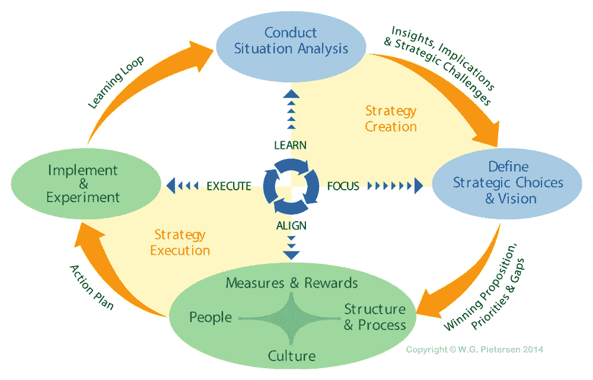
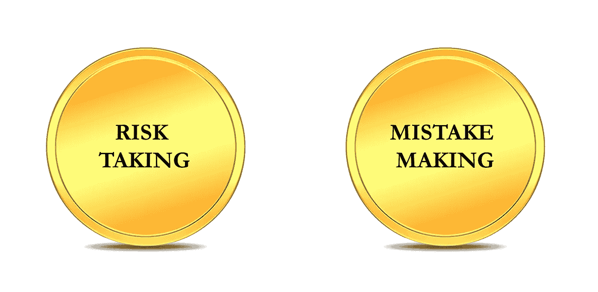

# 战略学习:威利·彼得森教授访谈录

> 原文：<https://medium.com/swlh/strategic-learning-an-interview-with-professor-willie-pietersen-510314827a3d>

## 为一个不断变化的世界创造和实施战略作为一个动态过程。

我们正处于大规模破坏的风暴中心，人们清楚地认识到，在这个动荡和不断变化的环境中，现状是无法维持的。我们如何发展我们的战略来应对破坏性的未来、科学革命、意料之外的事件和挑战？**为了生存，我们必须拥抱变化。为了繁荣，我们必须改变。**

[Willie Pietersen](https://williepietersen.com/) ，管理学实践教授，哥伦比亚商学院高管教育学院成员，[战略学习:如何比你的竞争对手更聪明，并将关键见解转化为竞争优势的作者，](https://www.amazon.com/Strategic-Learning-Competition-Competitive-Advantage/dp/0470540699)在这个问题上有很好的见解。我们去年在他指导的一个企业培训项目中相遇，我有机会了解他的战略学习框架和愿景，并与他详细讨论了新技术对我们生活/业务的影响、人类的未来以及道德的重要性。威利也是第一个鼓励我写作的人，第一个阅读我的文章并给出建设性反馈的人。在此分享他渊博的知识、专长和智慧的一个片段是我的责任和荣幸。

*Willie Pietersen was raised in South Africa, and received a Rhodes Scholarship to Oxford University. After practicing law, he embarked on an international business career. Over a period of twenty years he served as the CEO of multibillion-dollar businesses such as Lever Foods, Seagram USA, Tropicana and Sterling Winthrop’s Consumer Health Group. In 1998, Willie was named Professor of the Practice of Management at the Columbia University Graduate School of Business. He specializes in strategy and the leadership of change, and his methods and ideas, especially Strategic Learning, are widely applied within Columbia’s executive education programs, and also in numerous corporations. He has served as a teacher and advisor to many global companies, including Aviva, Bausch & Lomb, Boeing, Chubb Corp., Deloitte, DePuy, Electrolux, Ericsson, ExxonMobil, Henry Schein, Inc., Federal Home Loan Bank of Atlanta, Novartis, Salt River Project, SAP, UGI, United Nations Federal Credit Union and also the Girl Scouts of the USA. Willie is the author of two books and numerous articles. His latest book is* [*Strategic Learning: How To Be Smarter Than Your Competition and Turn Key Insights Into Competitive Advantage*](http://williepietersen.com/books/strategic-learning/)*.*

你撰写并教授了大量关于战略的文章。什么是战略，在企业环境中，战略是谁的责任？

这实际上是一个关键问题，因为在我们能够进行战略运作之前，我们必须首先能够进行战略思考，深刻理解潜在的概念，只有这样我们才能设计出利用这些概念的工具。有趣的是，战略是有效领导的一个非常重要的组成部分。**有效的领导力有 3 个基本组成部分:** **1。自我领导**，有强烈的自我意识，以良好的价值观为基础，作为一名领导者完全真实和透明。 **2。战略领导力**，能够为组织提供一个清晰的方向和明确的优先级，以带领其前进。 **3。人际领导**，发挥他人的长处。这三个要素紧密结合，任何一个都不能单独发挥作用。当他们协同工作，我们能够整合他们，我们就成为真正的整合型领导者。战略是领导结构中非常重要一部分。

不幸的是，战略被广泛误解，因此被误用。这可不是什么好消息。一项针对大量受访者的全球性研究显示，典型组织中只有三分之一的员工真正了解他们的公司战略，只有三分之一的员工完全参与到组织正在努力做的事情中。这两件事是联系在一起的。另一个发现是，在敬业度排名前四分之一的高敬业度组织中，绩效水平明显更高，利润水平平均高出 21%。只有当员工完全理解并致力于组织的战略时，他们才会感到完全投入。就理解它是什么而言，我认为我们需要将其分解为简单的本质，这是进行战略思考的基本起点，一切都从这一点开始。

关键的出发点是资源有限的现实，然而如果我们不真正内化这一现实，我们的思维就会脱轨。这意味着我们需要在如何调动稀缺资源以获得竞争优势方面做出选择。这就是战略的本质，它是关于在追求竞争优势的过程中做出选择。这只有在我们为我们寻求服务的客户提供卓越价值时才会发生。

当我们谈论做出选择时，实际上有 3 个问题我们需要能够回答: **1。我们将在哪里竞争，我们的目标是什么？**我们必须确定我们的竞争场所，并在周围设置围栏。 **2。我们将如何在所选择的领域赢得价值创造的竞争？3.成功的关键优先事项是什么？**一个组织所做的一切都是从这三个问题的答案中衍生出来的一系列选择。当我们问“制定战略是谁的工作？”我们必须给出的答案是，这是每个人的工作，在每个级别、每个职能部门、每个地区、每个业务部门。这就是我用非常简单的方式思考战略的方式。"

***组织如何在这个瞬息万变的世界中取得竞争优势？***

世界是动态的，充满了混乱。**在一个动态的环境中，旧的、静态的制定战略的方法已经不再适用。**我认为我们必须牢记一个基本事实:在一个动态和快速变化的世界中，可持续的竞争优势——一个时髦的词，一种终极目标——不能长期依赖于特定的产品或商业模式，因为这些东西很快就会被事件超越。我们需要进行的非常大的思维转变是，理解可持续竞争优势不是一种产品，也不是一种商业模式，而是一种组织能力。我们必须建立一个能够通过学习不断自我更新的适应性企业。

正是这种理解帮助我创建了“**战略学习过程**”。这是一套工具，一个框架，代表着从作为计划的战略到作为学习的战略的转变。它由循环移动的 4 个步骤组成。

> **第一步** : **学习**通过对外部环境、客户和我们自身的现实情况进行分析&形成一套关于这些的见解。
> 
> 第二步:集中精力，利用这些见解对这三个问题做出最佳选择(我们将在哪里竞争，我们将如何获胜，我们的优先事项是什么)。
> 
> 步骤 3:调整我们员工的衡量标准和奖励、结构和流程、文化和能力。
> 
> 第四步:执行，比我们的竞争对手更快更好地实施，不断试验和学习。然后，这种学习回到第一步，这是起点，因为环境在变化，所以我们不能停止学习。

Strategic Learning Framework by Willie Pietersen

我们的想法是将此作为一个正式的流程，将这种思想和一套实践嵌入到组织中。形势分析是基本的出发点，它迫使我们“由外向内”地思考。正如军方常说的“情报先于行动”，顺序也很重要。在经历这些步骤时，要明白它们作为一个学习和再学习的整体系统是相互关联的。在许多公司，这已经成为一个正式的流程，如果领导让它发挥作用，它似乎会很有效。没有哪个过程会像一只上了发条的老鼠自己跑掉一样，靠自己就能让你成功。没有一个过程本身是灵丹妙药。灵丹妙药是领导有效性，这意味着不只是机械地遵循过程，而是首先应用激发过程的基本原则。

我想强调的是,**战略关乎胜利，而不仅仅是竞争或参与。**我不喜欢“*价值主张*”这句话，因为它忽略了最大的问题:价值有多大？价值是一个相对的术语，就像温度一样，它不是绝对的。我们需要一个比价值主张更高的标杆，我们需要一个“ ***成功主张*** ”，它定义了你将创造的价值的差异幅度；这给了你的客户一个令人信服的选择你的理由。它基于一个基本的事实:顾客的标志是有选择。如果他们没有选择，他们就不是顾客，而是人质。他们不会在早上醒来时想着他们欠你什么，而是你欠他们什么！因此**你所创造的价值中的可测量的差异幅度，你给他们选择你的令人信服的理由就是你的获胜主张**。这是我对可持续竞争优势的看法。但是赢一次是不够的，你必须继续赢，通过学习和适应。"

***我们如何将这种思维植入企业的 DNA？***

战略是一个军事概念。一位伟大的战略思想领袖卡尔·冯·克劳塞维茨，一位与拿破仑作战的普鲁士将军，在 1832 年至 1835 年间写下了关于战略的权威著作，名为《战争论》。我不喜欢战争，但那是战略的起源，所有伟大的战略原则都是在那里阐明的。战争是一项血腥的运动，军队不会介意占领敌人的领土或者斩首他们的领袖等等。在商业世界里，战略不是一项血腥的运动，你不会通过摧毁你的敌人来赢得胜利，你会通过为你的客户赢得比你的竞争对手更多的分数来赢得胜利。战略的所有其他方面都适用于商业世界。

我们谈到了战略学习，有一个关键的过程是非常重要的，但适应性和战略思维不能只停留在一个过程上，战略不能只是季节性的。当谈到“规划时间”时，我们突然开始谈论客户、竞争对手、行业趋势和我们自己的现实，我们制定战略，然后我们关灯，因为这不再是战略季节！这是一个持续的过程。克劳塞维茨强调，在军队中，战略是一个不断评估和再评估的过程。残酷的逻辑是，外部环境不会停止变化，所以你不敢停止学习！我主张以下几点:始终让小团队进行持续评估和再评估的情况分析，一个团队关注客户和利益相关者进行需求层次分析，一个团队进行竞争对手分析，一个团队分析行业趋势；所有的**团队总是在绩效会议上把洞察力作为一种思维习惯发挥作用**。我提倡的另一件事是远离办公室进行**季度静修:远离紧急事务去思考重要的事情。另一个想法是**做事后总结，**在每一次重大努力后，检查什么有效，什么无效，为什么，然后传播。**

一个关键的文化方面是我们如何处理犯错误。

这是冒险的必然结果。我们敦促我们的组织成为谨慎的风险承担者，这意味着会有一定数量的错误。这就像一枚硬币:一面说冒险，另一面说犯错。善于冒险似乎取决于你处理错误的能力。有两个类别:

1.  **愚蠢的错误**，当你重复你自己的错误或别人的错误时，下注不成比例地超过了组织能够承受的损失，没有足够深入地思考就采取行动…
2.  剩下的是**聪明的错误**，前提是学习的价值大于错误的成本。

如果这是一个组织的哲学，它将重点从责备转移到学习。这是适应性系统的一个重要方面。在这方面做得很出色的一个行业是航空业。每次飞机失事，航空业都会变得更安全，因为他们会非常迅速地进行根本原因分析，并将分析结果传播到整个全球航空系统。我们都可以从中学习，如果你看看航空安全的图表，这是一个持续改进的壮观故事。这就是我们处理错误的方式。"

***你提到了关于“外-内思维”，也在你的书中写到关于“营销近视”。它们到底是什么意思？***

“Our 自然是由内而外地思考。社会学家对非正式谈话的内容做过研究，其中 80%涉及由内向外的思维；它们是关于我们自己的家庭、社会、公司内部发生的事情，而不是外部发生的事情。知道谁是谁，我能相信谁是生死攸关的事…

在商业世界中，我们需要明白成功发生在我们组织的边界之外，而不是内部。内部是我们调动资源与外部竞争的地方。由外向内思考的能力至关重要，但这是一种不自然的行为。令我惊讶的是，尽管我们在理智上理解这一点，但对话经常会很快变成我们想做什么。那是你战略的一个可怕的起点！这个世界不在乎你想做什么，这个世界只在乎你得到了什么。出发点是你的客户和他们的需求，你的竞争对手提供给他们什么，你如何创造卓越的价值？说起来容易做起来难。

作为领导者，我们需要成为榜样。IBM 前总裁兼首席执行官彭明盛(Samuel J. Palmisano)表示，IBM 的每一位高管都应该能够在每次谈话中回答 4 个问题，这些问题源于由外向内的思维: **1。为什么我们的客户会选择与我们做生意？2.投资者为什么要选择把钱给我们？3.为什么员工应该寻求在我们的组织中工作？4.为什么社区应该欢迎我们加入他们？**这些问题涉及 4 个关键利益相关方，以及在相关工作中满足他们需求的重要性。正如克劳塞维茨所强调的，它引入了战略性思维的智力训练。

营销近视与此有关。西奥多·莱维特在 1960 年写了一篇精彩的文章。他提出的观点在今天仍然很有意义。他写道**你不卖产品，你卖利益**。他举例说，铁路公司之所以失败，是因为他们认为自己从事的是铁路业务，而不是运输业务。铁路只是向顾客输送利益的一种手段。客户买的不是功能，他们买的是好处，他们在寻找解决问题的方法。因此，我们必须由外向内思考。

让我们以亚马逊及其零售业务为例。他们提供的福利是什么？正如杰夫·贝索斯指出的那样:亚马逊以优惠的价格、快速便捷的配送让购物变得简单。我们忘记了服务模式和客户体验的重要性。销售福利的另一个例子是霍尔马克贺卡公司的成功主张，它是这样写的:“我们帮助人们彼此联系，表达他们的感受”。这就是他们提供的好处，信用卡只是提供这种好处的工具。这是我们需要内化的另一种思维转变。

柯达如此热爱他们的胶片，以至于他们无法享受数码摄影的好处。通用汽车公司惨败。在 20 世纪 80 年代初，他们拥有美国汽车市场 52%的市场份额，今天只有 18%左右。它们逐渐下降。他们的智力没有问题，但他们变得内向，并在政治上将其归咎于工会。他们不谈论客户的需求，他们只关注成本。我们知道他们失败的原因，这不再是一个争论:由内而外的思考。

**你需要由外向内思考&明白你卖的是利益，而不仅仅是产品。你的利益与竞争者的利益相竞争。你提供的福利的差额将帮助你获胜。**不要做一个制造和销售的组织，要做一个有感觉和有反应的组织。"

***在资源有限的情况下，我们需要做出选择，分清轻重缓急。这意味着什么？***

做选择听起来很简单明了，不是吗？让我们退后一分钟。阿尔贝·加缪说过‘生活是你所有选择的总和’。组织也是如此。我们做出选择，最终我们的选择会改变我们。现在，什么是选择？有用的答案是:选择不是选择，直到你决定放弃什么。选择是一种牺牲的行为。当你的资源有限时，你就是在进行一场零和游戏。你做的每一件额外的事情都会从你做的其他事情中减去能量和努力。

没有人拥有无限的资源。史蒂夫·乔布斯真的非常擅长这个。他过去常常把他的前 100 名员工带离办公室，就潜在的创新领域进行头脑风暴。团队会带着极大的热情和 10 个项目的清单回来。在这一点上，大多数人会试图解决所有十个问题。但乔布斯知道这只会稀释公司的影响力。头脑风暴之后，乔布斯做了一件很多人会认为冷酷无情的事情:他砍掉了最下面的七样东西。他宣称苹果公司将集中精力和资源的唯一事情就是这三个最重要的事情。决定我们不做什么是一件非常困难的事情。绝大多数输入对输出的影响很小。作为领导者，我们需要定义那些影响最大的事情，并对它们进行优先排序。"

***你正在辅导全球各行业的 CEO 和高管。他们面临的最大挑战是什么？在这个颠覆性的世界中，推动成功的最强有力的想法是什么？***

“我提供观点和指导，我不声称拥有所有正确的答案。我认为我们应该问正确的问题。我谦卑地提出一个观点。我非常确信，前面提到的这些基本规则肯定是重要的。我们面临的挑战是什么？是的，世界在变，但更重要的是，变化的性质在变。世界变得更具破坏性。颠覆意味着旧的结构正在被摧毁，旧的成功法则不再有效。我们必须不断重塑成功的样子。彼得德鲁克说:在动荡时期，最大的危险是按照过去的逻辑行事。

在那样的市场环境中，我们需要:创建一个学习型组织，并将其融入你的流程、结构和领导方式中。我们需要用达尔文的观点来思考，适应或者死亡。人类系统中的适应来自学习；不是因为事故。 **2。练习由外向内的思维。** **3。** **练习客户同理心。**不同于以客户为中心。从顾客的角度看世界，体验世界。 **4。简化。我们听到所有这些术语，像人工智能、量子计算、大数据等等。大多数人甚至不知道他们是什么意思。我们需要了解它们带来的好处和创造的更大价值。它们是获取更大利益的工具。我们需要简化它们，并向我们的人民解释它们。复杂性是你的敌人。复杂使人麻痹，简单给人力量，给人活力。 **5。用令人信服的领导信息团结您的员工。**不要只把你的战略看做一个文档。人不是跟着文件走，是跟着人走，跟着想法走。你着手进行的变革越大，拥有一个强有力的将人们团结在一起的叙事就变得越重要。我们作为领导者运行两个大系统:一个社会系统和一个经济系统。如果其中一个表现不佳，另一个就会失效。我们经常忘记通过讲故事来激发的社会系统，它给我们所做的事情赋予了意义。我们不是踏上灵性旅程的人，我们是踏上人类旅程的灵性生命。**

# 谢谢你，威利！

如果你觉得这个故事有趣，请随意鼓掌一次、两次或五十次👏👏👏👏👏

如果你看不够，请在[媒体](/@ezgitasdemir)和[推特](http://twitter.com/ezgitasdemir4)上关注我🤗

这里还有一些你可能会感兴趣的文章:

[真实性](/swlh/oath-to-authenticity-b60d761fa904)

[用心的领导者](/swlh/the-mindful-leader-an-interview-with-michael-bunting-901c38742cff)

[领导](/swlh/leadership-n-capacity-to-lead-eb05c9253698)

Ezgi Tasdemir 博士是诺华肿瘤公司的员工。本文由 Ezgi Tasdemir 创作。观点、分析和观点不一定代表诺华或任何其他公司或组织的观点或意见。作者没有从诺华或任何其他制药/非制药公司获得任何资助或支持。

## 这篇文章发表在《初创企业》杂志上，这是 Medium 最大的创业刊物，有 322，555 人关注。

## 订阅接收[我们的头条](http://growthsupply.com/the-startup-newsletter/)。

