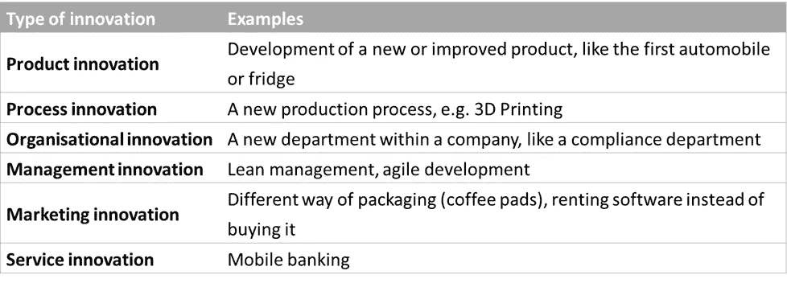

# 科技创业的成功因素(下):理念

> 原文：<https://medium.com/swlh/success-factors-of-tech-startups-part-2-the-idea-67e4bf8adc52>

在我的[上一篇文章](/@daniel_kirch/success-factors-of-tech-startups-part-1-the-team-faca5f795038)中，我描述了为什么合适的团队是科技创业公司最重要的成功因素。但是团队本身——坐在一个时髦的共同工作空间——不能成为商业上的成功，它还需要一个产品来销售，一个创新，一个想法。因此，我关于关键成功因素的文章的第二部分是围绕成功创业背后的理念展开的。

# 想法

从团队的商业理念来看，投资者显然希望看到商业模式中的创新元素。

**创新**是一个颇为宽泛的哲学讨论现象。奥地利/德国/美国经济学家约瑟夫·熊彼特(1883-1950)，我认为是科学中企业家精神和创新概念的倡导者，认为创新是一种**创造性破坏**，意味着每一个新事物，旧的必须消失。尼采也一样，他让他的查拉图斯特拉说:

> 谁必须是善与恶的创造者，他首先必须是一个毁灭者，粉碎价值观。

所以，当你听到无数的创业公司声称要“革新”和“颠覆”某些东西时，请记住，这种企业家精神的创造性破坏成分已经存在一个多世纪了:)。

无论如何，我喜欢继续用一个更现代的创新定义(Trott 和 Myers/Marquis):

> “创新不是一个单独的行动，而是一个相互关联的子过程的总过程。这不仅仅是一个新想法的构思，也不是一个新设备的发明，也不是一个新市场的开发。这个过程是所有这些东西以一种综合的方式发挥作用。”

因此，理论元素以一种绝对新颖的方式被结合，或者现有的方法、过程、工具被聪明地重新组合以创建一个新产品的基础。因此，创新以不同的形式出现，它可以是渐进的或破坏性的，有形的或非物质的。下表给出了创新特征和示例的概述:

Types of innovation. Source: own graphic

创业想法基于这些类型的创新(有时同时基于几种创新类型，例如大规模定制的在线 Müsli 商务)。创新是必要条件。但这还不够。想想那些提供新银行应用或 p2p 贷款的金融科技初创公司。与传统方式(即银行贷款)相比，它们是创新的，但它们如何区分彼此？他们的**独特销售主张** (USP)是什么？如果他们有一个，USP 是直接和清晰可辨的吗？它是否解决了现有客户的难题并代表了一种优势？“专家”说，如果你的创新优势不是替代品的 10 倍，那么你就不会成功。10 倍似乎是一个巨大的因素，但这里的要点是，如果你的目标群体没有直接面对你的 USP，他们很难认出你的 USP。此外，从现有产品或工艺转换到新的产品或工艺，后者总是与转换成本和风险相关(制药公司几乎不会为了节省 10%的生产成本而转换到替代生产工艺，因为原始工艺对于无风险运行至关重要，生产成本也不是问题)。所以新的必须是真正值得的。

说到竞争对手，你的**保护**有多强？你有宝贵的**知识产权(IP)** ？你能利用你的技术专利禁止竞争对手进入市场吗(至少在几年内)？或者你至少是坦克里最快的鲨鱼？问问你自己:你的竞争对手要花多少钱和时间才能达到你现在的位置。然而，在你和竞争对手之间筑起一道屏障，无论是速度、知识产权还是无与伦比的 10 倍优势。

投资者在投资你的团队和你的想法时承担了巨大的财务风险。这就是为什么他们希望看到一个机会，使一个整洁的回报。为了回报，他们投资的初创公司需要以比投资者的进入估值高得多的价格出售(“退出”)。正因为如此，初创公司的**增长增长**至关重要(这主要适用于风险投资支持的初创公司，当然也有不同的方法，如自举或自动化现金流产生的创业公司，这不是本文的重点)。如果增长是一个创业公司想法的基本要素，商业模式必须是**可扩展的**。简单来说，可伸缩性意味着你可以在不增加 x 倍输入的情况下增加 x 倍输出。例如:如果一个理发师想让他/她的收入翻倍，他/她需要做两倍的工作，或者雇佣双倍数量的理发师，或者开第二家理发店。因此，理发并不是一个可扩展的行业。相反，如果你销售软件，比方说通过应用程序商店或“作为服务”，你可以很容易地将产出增加一倍、三倍、四倍(销售更多的软件),而不用雇佣更多的软件工程师。因此，软件业务以及其他基于数字产品或服务的商业模式(销售电子书、托管网站、在线广告……)都非常具有可扩展性。除了商业模式之外，具体的市场规模和市场发展对你公司的发展也至关重要，同样重要的还有竞争结构(这是一个由少数玩家垄断的巨大市场吗？是一片小小的“蓝海”却没有任何竞争？).

尽管风险投资界赞赏增长，但这种增长不能不惜一切代价。**融资能力**是现实世界的限制，它让创始人和投资者回到现实。你的想法必须是可行的。收购风险资本最好是一步一步来(从商业天使或种子轮开始，然后是一系列的 A、B、C……)在每一轮之后达到你的目标或有价值的里程碑，而不是一开始就试图收集全部金额。

根据你带着你的商业想法接触的投资者类型(商业天使、种子投资者、风险投资家……)，不同的**进展/状态**是可以预期的。虽然商业天使可能不介意投资一个只有一个想法概念的团队(记录在 power point 幻灯片中)，但风险资本家通常希望看到一个概念证明、一个原型、一个 MVP、第一次积极的测试结果(医疗技术)、来自真实客户的牵引力(投资者喜欢这个词)。创始人需要找出某个投资者对地位的要求，并相应地接近他们。你拥有的越多(上市产品、付费客户……)，对你越有利，因为你的初创公司的估值会增加(投资者的风险会降低)。另一方面，在没有外部资金的情况下，创始人更难实现创业想法的进一步发展。所以找到正确的平衡是关键。

所以现在你有一个创新的想法，有强大的 USP，可扩展性潜力，足够的吸引力(但不需要太多的资本)来获得资金。你有超级创业点子吗？还没有！伟大的创业想法的最后一个重要特征是**退出潜力、**或问题的答案:谁会出于什么原因在什么阶段以什么价格收购你的公司？这个话题对于一个风险投资家来说是必不可少的，因为他/她在“退出”的情况下(由于现金流为负值，财年内没有股息)，只能通过出售股票来获得回报。投资者的退出预期再次取决于所处的阶段:他越早投资，失败的风险越高，回报假设也越高(商业天使和战略投资者可能与头脑简单的金融投资者有不同的预期)。

我们将在下一篇文章中深入探讨财务资源，但是现在，团队已经建立，想法已经形成，您已经准备好了！

在[的下一篇文章](/@daniel_kirch/success-factors-of-tech-startups-part-3-resources-b78c85bff2c0)中，我们将深入探讨财务资源，但现在，团队已经建立，想法已经形成，您可以开始推销了！

## 这篇文章发表在 [The Startup](https://medium.com/swlh) 上，这是 Medium 最大的创业刊物，有 273，103+人关注。

## 订阅接收[我们的头条新闻](http://growthsupply.com/the-startup-newsletter/)。

