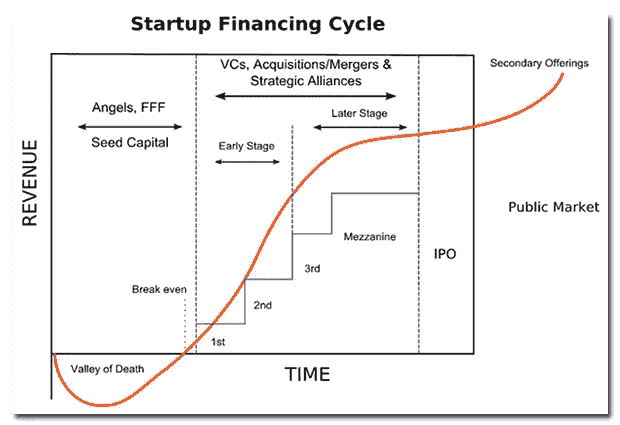
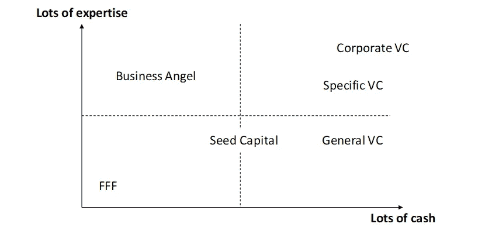

# 科技创业的成功因素(三):资源

> 原文：<https://medium.com/swlh/success-factors-of-tech-startups-part-3-resources-b78c85bff2c0>

在我的科技创业公司成功因素系列的第三集也是最后一集，我将讲述一个创始人团队成功将其想法商业化所需的相关资源(此处跳回到[第一部分](/@daniel_kirch/success-factors-of-tech-startups-part-1-the-team-faca5f795038)或[第二部分](/@daniel_kirch/success-factors-of-tech-startups-part-2-the-idea-67e4bf8adc52))。

在一家风险投资基金工作了 3 年多，我想到的最相关的资源当然是**现金**。没有现金，你无法支付你的一流团队，开发技术，销售产品，租用办公室，举办烧烤聚会…简而言之:

> 创业公司的现金就像一级方程式赛车的燃料。
> 
> 没有现金，就没有比赛。

但是并不是所有的现金资源都是平等的。创业融资周期的每个阶段都有正确的来源，这些现金资源的正确组合可以决定你的创业成功与否。

正如你从创业融资周期(下图)中所看到的，具有高增长雄心的创业公司通常会在收支平衡和征服市场之前经历一个“死亡之谷”。这个死亡之谷的特点是总现金流为负，也就是说，你每个月都在烧钱，如果在这个阶段没有人资助你的公司，你的创业公司将无法走过这个山谷，并在以后为利益相关者创造价值。

Source: [https://en.wikipedia.org/wiki/Venture_capital](https://en.wikipedia.org/wiki/Venture_capital)

这么说大量现金很有帮助？看情况！记住——说到风险投资——你每筹集一欧元，你就送出了你公司的股份。因此，一个舒适的融资帮助你安全地成长或收支平衡，然而，你应该考虑价格是否合适。此外，过多的资金会导致预算时低效的资源分配，从而分散注意力。确定合适的资金需求绝对不容易。因此，计算一个安全缓冲，接受你真正需要的投资，如果需要的话，引入能够并愿意在以后的融资轮中提供额外投资的投资者。

在选择正确的投资者群体时(如今大多数创业融资都是由财团/辛迪加完成的)，我提出了以下框架，其中我将投资者分为两个维度:专业知识和现金量。

商业天使是富有的私人投资者，有时是前行业专家/经理或前企业家，他们现在喜欢把钱投资到有前途的创业团队。由于他们投资自己的私人资金(或自己投资公司的现金)，与机构风投相比，他们的预算有限。对于年轻的创始人团队来说，商业天使肯定是赢家，因为创始人可以从投资者的商业或技术专业知识和指导中获利。与他们联系的一个好方法是通过你所在城市或周边的天使投资人俱乐部，或者更好的方法是通过你的个人关系网。

另一组私人投资者是 T2 FFF，代表“家庭、朋友和傻瓜”。他们是最先接触的捐赠者之一，也是最容易说服的(“傻瓜”)，但不一定是你的公司。

如果你的私人现金供应商不能完全满足你的融资需求，是时候接触机构投资者(即风险投资基金)了。在这些风投中，有早期投资者(所谓的**种子资本基金、** [如种子基金亚琛](http://www.seedfonds-aachen.de)或 [HTGF](https://high-tech-gruenderfonds.de/en/) )进行投资，类似于 FFF 和商业天使，帮助你度过死亡之谷，即开发产品并准备进入市场。此外，一旦开发出一种产品并拥有相关的客户群，后期风险资本基金就更加注重市场渗透。这些风险投资的具体表现是我所说的**一般风险投资**(投资各种技术/行业，可能有地理重点)**特定风险投资**(分别投资极少数行业，如金融科技或人工智能)和**公司风险投资**(一家公司的子公司，出于战略目的投资母公司的核心商业模式，又称 c VC)。

虽然所有三种形式的风险投资都有相当充足的现金，但特定的风险投资——如果管理得当——可以利用其特定的领域知识，同时比一般的风险投资更好地宣传其投资对象。具体风投的例子有人工智能技术的 asgard.vc，电子商务的 [Rocket Internet](https://www.rocket-internet.com/) 或 SaaS 的 [Point Nine Capital](http://www.pointninecap.com/) 。尽管如此，由于与母公司的联系，企业风投(如能源行业的 [statkraftventures](https://www.statkraftventures.com/) 或西门子的 [next47](https://next47.com/) initiative)预计会对他们的行业有更深入的了解，然而，我对在早期阶段让风投加入持谨慎态度，因为他们将有权力将初创公司的战略转变为他们自己的方向，从而限制了你的退出潜力。

Combine the “deep pockets” with “smart money”. Source: own graphic

不在图片中，因为有很多，是公共拨款，通常是非摊薄的钱。很难对拨款进行规划，因为拨款的批准取决于许多因素，所以没有获得拨款的特殊策略。试着把它们作为额外的缓冲加入到你每个阶段的筹资中。对于德国的基金会，我推荐 EXIST grant。

对于早期融资轮，我推荐商业天使和种子资本的联合，以达到收支平衡。这种组合提供了行业专业知识和足够的现金资源，也确保了未来的融资。当涉及市场渗透和扩张时，尝试与特定的风险投资合作，并与投资者的专家一起完善你的商业模式(除了一般的风险投资，以满足更高的资本需求)。当你准备好退出时，寻找公司资本(但要清楚他们的战略)。

阿洛拉，祝你从基金会到退出的旅程好运，并让我知道进展如何。

## 这篇文章发表在 [The Startup](https://medium.com/swlh) 上，这是 Medium 最大的创业刊物，拥有 273，103+人关注。

## 在此订阅接收[我们的头条新闻](http://growthsupply.com/the-startup-newsletter/)。

