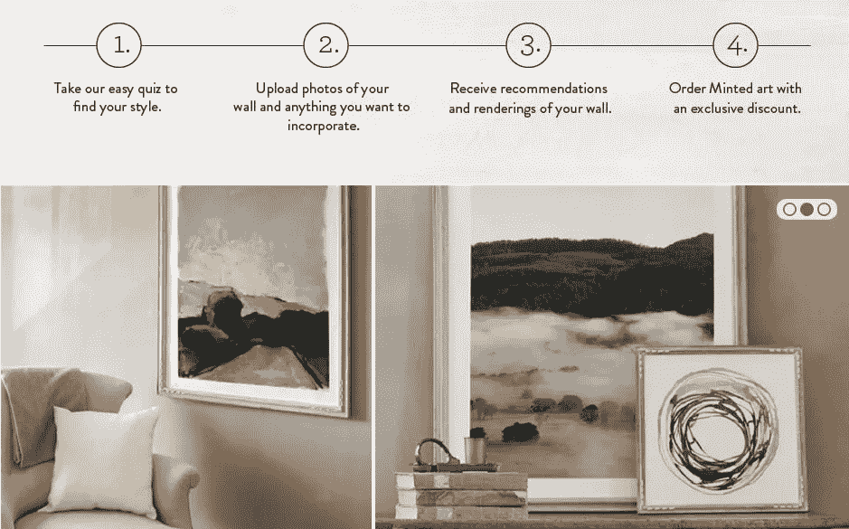
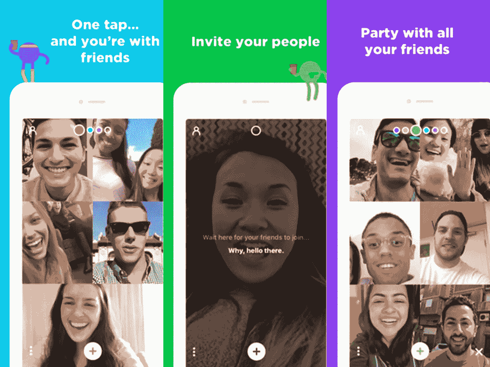

# 2018 年值得关注的成功美国创业公司:我的前 6 名

> 原文：<https://medium.com/swlh/successful-us-startups-to-watch-in-2018-my-top-6-622a82763320>

成功的美国创业公司每年吸引数百万美元的投资。创业成功的秘诀是什么，如何把你的想法变成盈利的项目？根据风险投资专家的说法，我们分析了来自不同领域的 6 家美国创业公司，这些公司在 2017 年增长迅速，在 2018 年肯定会继续增长。

# 室内设计师在线平台

美国初创公司 Laurel & Wolf 成立于 2014 年，目前已经吸引了超过 2500 万美元的投资。该公司建立了一个在线平台，将室内设计师和客户聚集在一起。正如初创公司的口号所说:在线室内设计服务，让装饰你的空间变得有趣、简单、实惠。负担得起是关键词，因为在美国，个人室内设计师的服务交钥匙项目平均费用为 5500 美元，而 Laurel & Wolf 的最高价格为每间 349 美元。

Image was captured from the video presentation of Laurel & Wolf

# 它是如何工作的

这家初创公司的创始人从现有的众包解决方案中汲取了灵感，并将其应用于室内设计。它是这样工作的:

1.  客户回答关于他的项目的问题，并上传需要设计的空间的照片。
2.  然后，用户从平台上的建议中选择设计者。
3.  设计师创造了房间的概念，并列出设计中使用的所有物品的价格清单。

除此之外，还有一种替代方式——直接从平台上的图片中购买现成的设计(包含所有项目)。

# 人力资源专家 CRM

美国公司 Paycom 并不完全是一家初创公司(它成立于 1998 年底)，但在过去三年中，它的利润增长迅速，并在 2017 年增长最快的 100 家公司中排名第二。Paycom 是一种为招聘定制的 [CRM 系统](https://stfalcon.com/ru/blog/post/how-to-develop-custom-crm-for-large-business)。几乎所有的功能都可以让人力资源经理的工作自动化——从招聘到入职。此外，该服务允许您跟踪人力资源经理的 KPI 和所有招聘流程的绩效。

# 售票创业

是的，只是一个从你的智能手机上购买门票的应用程序。一家来自三藩市的名为 Gametime 的初创公司已经获得了超过 3000 万美元的投资[。这家初创公司在类似的预订应用程序中独树一帜——通过该应用程序，你可以购买活动当天(或晚上)的最后一分钟门票，甚至可以与你的朋友分享。](https://www.crunchbase.com/organization/gametime)

Gametime 押注于便利性——该应用程序允许你通过短信直接向你的朋友发送门票。这家初创公司反对文书工作，因此所有支付都是在智能手机上进行的。一旦填写完毕，支付数据会以加密形式存储在应用程序中。Gametime 创始人说，由于付款被加密并存储在手机上，结账只需 9 秒钟，而不是粉丝们花 5 分钟填写网络表格。

# 任何庆典的独特装饰

另一家美国初创公司为用户提供在不同场合购买独特商品的服务。这家新公司的想法是，每个用户都可以为自己的节日装饰选择一个个性化的设计——从邀请卡到家居用品。这家初创公司基于众包原则——它将设计师和买家聚集在一个平台上。

Image was teken from Minted.com

最好的作品是由用户决定的。在网站上，你可以买到现成的商品或者向设计师寻求帮助。自成立以来，这家初创公司已经筹集了近 9000 万美元的投资。专家认为，它的成功在于用户的方便和可及性。

# 群组视频聊天[家庭聚会](https://medium.com/u/21f2e74dab23?source=post_page-----622a82763320--------------------------------)

Houseparty startup 开发了一款群组视频通话应用，在一次聊天中最多支持八个用户同时进行通话。这家初创公司称之为视频派对。您可以轻松加入现有的聊天室或创建自己的视频聚会。如果你愿意，你也可以建造一个封闭的房间，只允许特定的人进入。

有趣的是——这一切都始于 Meerkat 应用程序，它允许直播视频流。但是创始人及时抓住了新的市场条件，这家初创公司将[转向了群聊。这一决定已经为该公司带来了近 7000 万美元的投资。](https://stfalcon.com/en/blog/post/when-to-pivot-your-startup)

# 网上购买奢侈品

美国初创公司 RealReal 自成立以来的头三年里已经成功聚集了 300 万客户。现在一家初创公司的投资额已经达到 1.72 亿美元，专家建议投资者仔细看看这家公司，因为这家初创公司正在快速增长。这家公司是如何达到如此高的记录的？答案在于最初的想法。

事实上，RealReal 是一个奢侈品销售平台，市场上有很多类似的想法。然而，创始人对质量进行了投标——平台上展示的所有商品都由 RealRel 专家检查真实性(创业公司的名字在上面)。公司的专家关注每一个细节:面料和皮革的质量，锁，铆钉等。这样买家就可以 100%确定他们在公司网页上看到的商品是正品。

***最初发表于*******。****

**

## *这个故事发表在 [The Startup](https://medium.com/swlh) 上，这是 Medium 最大的企业家出版物，拥有 274，707+人。*

## *在这里订阅接收[我们的头条新闻](http://growthsupply.com/the-startup-newsletter/)。*

**