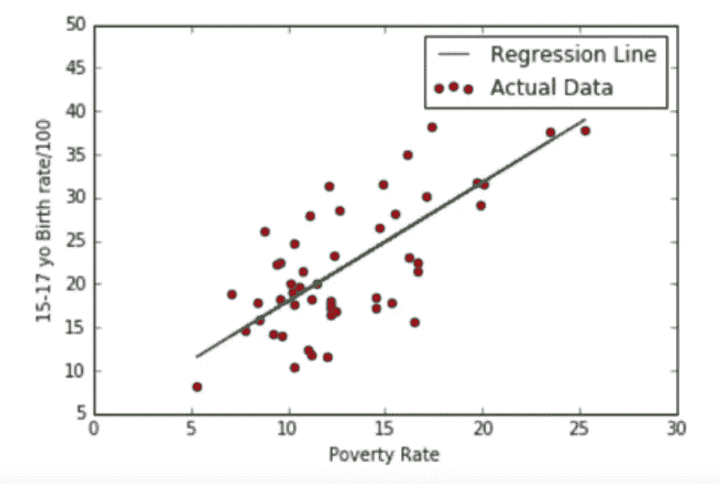

# 超级简单机器学习—简单线性回归第 3 部分【验证】

> 原文：<https://medium.com/swlh/super-simple-machine-learning-simple-linear-regression-part-3-validation-65b8c11fa36b>

这是简单线性回归的最后一部分。先看 [*第一部分*](/@bernie.low93/super-simple-machine-learning-by-me-simple-linear-regression-part-1-concept-and-r-4b5b39bbdb5d) *和* [*第二部分*](/@bernie.low93/super-simple-machine-learning-simple-linear-regression-part-2-math-and-python-1137acb4c352) *。*

写这篇文章花了很长时间，因为这部分让我非常厌烦，所以我不停地起床开关冰箱和做其他愚蠢的事情。此外，我对 p 值和假设检验有一种挥之不去的仇恨，这种仇恨源于我无法完全理解它。我们的关系现在略有改善。

再一次，如果你发现任何错误，无论是语法错误还是数学错误，请告诉我。

# 你的结果意味着什么？

之前，在[第 2 部分](/@bernie.low93/super-simple-machine-learning-simple-linear-regression-part-2-math-and-python-1137acb4c352)中，我们使用 Python 导出了我们的回归线。图表看起来像这样



等式是:

> y = 1.37x + 4.27

因此..数值 1.37 和 4.27 是什么意思？

# 生命中唯一不变的是不变的

4.27 是等式中的常数或 Y 轴截距。

我们在数学课上学到了什么？

> y = 1.37x + 4.27

所以如果

> x = 0

然后

> y = 4.27

既然你的 *x* 是贫困率，我们假设零贫困，就会有 4.27%的出生率。

..

..

或者至少，我是这么想的。

通过进一步的阅读，我意识到尽管这么说有点正确，但有两件事与此背道而驰:

1.  贫困率有可能为零吗？人们只能想象。此外，如果我的常数是负数(比如说-4.27 而不是 4.27)，我的出生率会是负数吗(婴儿回到子宫)？！？！)
2.  我的数据集没有任何贫困率为 0%的记录。这意味着我的回归方程与 0%的贫困率无关，因为它从未在这样的数据上训练过。

那么，我等式中的 4.27 是什么？嗯，它解释了我的 *x* 没有的“等”。它告诉你，生活并不完美，不是所有的事情都可以用你所知道的来解释，你只是应付它。

这篇非常好的文章把常数描述为“垃圾箱”，我想我的父母也是这样描述我的。

# 系数。是的，它有“高效”二字。不，这不是在 linkedin 上炫耀自己的时髦词汇。

我方程中的 1.37 就像是“乘数”。

*x* 每增加 1 个单位(贫困率每增加 1%)，效果乘以 1.37。由于这是一个只有 1 个变量的简单线性回归，你可以预测，贫困每增加 1 个单位，出生率平均增加 1.37 倍。

它也表明了我的 *x* 变量对我的 y 是否有负面或正面的影响。假设我有一个这样的方程:

> y = -2x + 4

我的 *y* 是一个广告的点击量，我的 *x* 是我的广告高度。因为它是“-2”，它表明我的广告越长，我获得的点击越少，如果这种关系被证明是正确的，那么如果你需要更多的点击，较短的广告是可行的。


The coefficient describes the relationship between x and y. Aww, how romantic.

# 预测时间

当你插入 *x* 找出一个 y 时，预测部分出现。这就是为什么 *y* 被称为因变量，因为它依赖于 *x* 的值。

假设你在一个贫困率为 15%的城市，你试图让政府注意到提供免费教育和降低贫困率的重要性。

因此，你想知道如果贫困率达到 20 %, 15-17 岁青少年的估计出生率会是多少，以此来警告他们。

你的方程式是:

> y = 1.37(20) + 4.27
> 
> y = 31.67

从数据集中，你可以看到这个结果非常接近实际数据。耶！


# 你的模型是真的吗？简介:P 值又名“UGHHHHH”

*x* 变量真的是一个合适的变量吗？我能说贫困率真的对出生率有影响吗？或者这只是我在碰巧有效的点上画的一条线？

[p 值](https://www.statsdirect.com/help/basics/p_values.htm)是这些问题的答案。


me when I have to explain p-value to myself every year of my life since I was 14

好吧，事情是这样的。有个家伙叫零假设:


Today’s star: Null Armstrong hahahhahhahahha

零假设，或者我称他为零阿姆斯特朗，基本上是一个讨厌的家伙，他告诉你你很烂，你相信的是错的，事实上你的 x 对你的 y 没有影响。

对他来说，你的等式会是这样的:

> y = 0x + b

你的斜率是 0，因为你的 *x* 对 y 没有影响

> 虚假设
> 
> H0:β1 = 0(β1 是你的斜率/系数/a)

然而，因为你不轻易放弃，你告诉 Null Armstrong 闭上你的臭嘴，并通过向他展示有另一种假设来证明他是错的，那就是

> 另一假设
> 
> 哈:β1≠0

在 *x* 和 *y* 之间有一个显著的线性关系，贫穷确实会影响出生率，所以斜率不可能是 0，有没有人*甚至*喜欢和你在一起？

证明 Null Armstrong 是错误的一种方法是通过 p 值。

**首先，我们必须始终假设零假设是真的。**

从那里，一个**非常小的 p 值**将会声明**非常不可能**假设零假设为真，从而使得 *x* **的 p 值在统计上显著**，并给出更多理由相信替代假设。

> 小 P 值=不可能为零阿姆斯特朗是对的=通过排除，你是对的

我们认为什么是*“非常小”*？

不参考你裤子里的东西的尺寸，人们通常使用 0.05 作为分界点，这是基于英国统计学家[罗纳德·费雪](https://en.wikipedia.org/wiki/Ronald_Fisher)的选择，他写了一本关于 p 值的书，

*who btw 还想出了* [*性感儿子假说*](https://en.wikipedia.org/wiki/Sexy_son_hypothesis) *这和这个话题完全不相干但是性感儿子假说是我现在最喜欢说的话。*

注意，你的 p 值并不能证明你是对的，只能证明 Null 阿姆斯特朗是错的。

基本上:

> 高 P 值:这次你赢了，Null 阿姆斯特朗！
> 
> P 值低:吸 ittttt，Null 阿姆斯特朗！

# 但是我为什么要这样折磨自己呢？

当您进行多元线性回归时，找出变量的重要性尤其有用，因为您需要确定哪些 *x* 变量实际上对您的模型(特征选择)有好处。我将在下一篇文章中详细阐述这一点。

Scikit learn 没有显示 p 值的汇总函数，因此我将使用 statsmodel 来查找我的变量(出生率)的 p 值。


Coefficients (blue), p-values (red). Use the summary() function from scikit learn

我们的 *x* 变量的 p 值是 0.000，这意味着它太小而无法显示。相反，我运行以下代码:

> 打印(reg 2 . PV values)

然后得到

```
[9.79903930e-02 1.18781873e-09]
```

因此，我的 *x* 变量的 p 值实际上是 1.19e-09，非常非常小，显然远小于 0.05，因此，**在预测出生率**时，我的贫困率是一个具有统计意义的因素。

那我们常数的 p 值呢，是 0.098，高于 0.05？

别担心，因为我们的常数不会变。

对于常数，零假设假设常数没有影响，因此为 0。

高 p 值仅仅表示当 my *x* = 0 时，常数离 0 不太远，这是可能的或者是这样的，因为数据集没有数据点证明 *x* 为 0。

# p 值是充分证据吗？


Admiral Ackbar returns to warn you about the pitfalls of the p-value

就像你我一样，p 值并不完美，也有讨厌的人。许多研究人员就 p 值的真正意义和准确性进行了争论。

毕竟不是证明你的假设一定正确。是的，它具有统计学意义，但这是因为*你* ***认为*** 它具有统计学意义，因为*你*设定了阈值水平。

1.  0.05 真的够了吗？通过设置更高的门槛，你只是给自己更多的空间去说你是对的。
2.  当您使用来自同一总体的不同样本时，p 值可能会改变 ALOT，因为有可能某个样本只是给出了一个高 p 值，而当您将整个总体考虑在内时，它却不准确。这可能会扭曲您的最终 p 值。*真相是什么！*
3.  零假设合理吗？一个测量告诉你一个不可能的假设是不可能的，这是一个有意义的测量吗？？？？？你明白了吗？

一篇写 p 值怎么不好应该感觉不好的研究论文可以在[这里](https://ac.els-cdn.com/S1063458412007789/1-s2.0-S1063458412007789-main.pdf?_tid=b1a5ebda-0246-11e8-99d1-00000aacb362&acdnat=1516936509_74f356fe237782252975398d46e51443)找到。

反对 p 值假设检验的人可能更喜欢使用贝叶斯方法。

然而，也有许多支持 p 值的人。似乎更接近更准确结果的关键是设置一个低得多的阈值(0.001 或 0.005)。

**P 值已经被广泛用于评估机器学习中的模型，所以我会继续使用它**。只是把它当作一种比较模型和/或变量的评分方式。

例如，一些学校可能会说及格是 50%,一些可能会说是 60%,但 50%或 60%是学生是否足够了解主题的准确衡量标准吗？也许不是，但这是一个很好的判断基准。

还有其他方法来评估我的模型的准确性，也是告诉你自己做得很好的好方法。我将在下面讨论:

# 训练/测试分割

如果我们有足够的数据可以处理，我们通常会进行训练/测试分割，将数据集分割成**训练集**和**测试集**(通常是 80% / 20%)

*   定型集用于创建模型，在本例中是回归线。
*   测试集用于测试模型，方法是对模型运行回归线，以查看模型对未经训练的数据的执行情况。

这里要做的是确保你的模型不会[过度装配](https://en.wikipedia.org/wiki/Overfitting)。

当您在数据集上训练模型时，会发生过度拟合，它在预测数据集本身内的内容方面变得非常好。

如果你要检查你的模型的准确性，它可能有 98%的准确性，但这是一种欺骗，因为你是根据它被建模的数据来测试它。


“Ownself check ownself”

由于除了用于创建模型的数据集之外，您不一定还有其他数据集，因此我们将通过拆分现有的数据集来创建自己的“外部”数据集。

通过对照测试数据进行验证，您会得到一个准确性分数，它会告诉您基于模型创建中未涉及的数据，您的模型执行得有多好，因此它可以被视为“外部”数据。

# 检查你的剩余情节

正如我之前在[第一部分](/@bernie.low93/super-simple-machine-learning-by-me-simple-linear-regression-part-1-concept-and-r-4b5b39bbdb5d)中提到的，如果你的回归模型运行良好，你的残差图应该没有显示出可以解释的模式的迹象。

我的是这样的:


is this random enough for you?

# r 的平方

[**R 的平方**](http://blog.minitab.com/blog/adventures-in-statistics-2/regression-analysis-how-do-i-interpret-r-squared-and-assess-the-goodness-of-fit) **永远在 0 和 1** 之间，**越高**你的 R 平方越好。

r 的平方是你的线性模型所解释的 y 的变化。

> r 平方=解释偏差/总偏差

Scikit learn 的功能是:

> print(注册分数(X，Y))


My Rsquared is 0.53, which is just alright, I GUESS.

然而，把所有的鸡蛋放在一个 R 平方的篮子里是一个错误。有时候你的预测是有偏差的，R 平方看不到这一点。

在某些情况下，无论如何，R 平方值总是很低。例如，当为试图预测人类行为的数据集建模时，它可能很低，因为我们大多是不可预测和狡猾的混蛋。

在其他情况下，R 平方值会很高，这很好，因为模型与实际数据非常接近。然而！这可能是过度拟合造成的，我们都知道这是完全不酷的。

# RMSE(叶的老朋友，标准差)

> RMSE —均方根误差
> 
> RMSD —均方根偏差


Taken from [https://docs.oracle.com/cd/E40248_01/epm.1112/cb_statistical/frameset.htm?ch07s03s03s01.html](https://docs.oracle.com/cd/E40248_01/epm.1112/cb_statistical/frameset.htm?ch07s03s03s01.html)

你好，黑暗，我的老朋友，我又来和你说话了。

我说的黑暗是指方差和标准差。哦，还有第二部分的 [SSR/SSE](https://towardsdatascience.com/super-simple-machine-learning-simple-linear-regression-part-2-math-and-python-1137acb4c352) 。

RMSE 测量样本的预测值和实际值之间的差异。它基本上是残差的平均方差的平方根。

听起来很熟悉？标准差也是方差的平方根。

然而，在回归分析的情况下，方差中的误差不是 Y -Y bar 而是 Y -Y pred，这使得*稍微*不同，但是遵循相同的原理。

均方根误差(RMSE)如何与残差平方和(RSS: *真实 Y 预测 Y AKA 回归的方差形式*)相关？

RSS 是误差的平方，MSE 是误差的平方，因此 RMSE 是 RSS 平均值的根。

叹气。

剩余平方和=∑(ŷI-yi)2

均方误差=(1/n)∑(ŷI yi)2


对 RMSE 来说，越小越好，因为这表明“错误”越少。

# 快速回顾

- p 值=越小越好。最好是这里的<0.05

- Don’t ownself check ownself. Split data into Test and Training Sets

- R squared = 0

- RMSE = Smaller the better

# And That’s It for this post!

Yes, I have a headache too. My eyes have gone blur and my soul has left my body.

We’re done with Simple Linear Regression!

whoooooooooooooooooooooooooooooooooooooooooooooooooooooooooooooooooooooooooooooooooooooooooooooooooooooooooooooooooooooooooooooooooooooooooooooooooooooooooooo

If there ever was an awesome guide to a comprehensive code for Simple Linear Regression in Python, it’s 。

[](https://mubaris.com/2017/09/28/linear-regression-from-scratch/) [## Python 中从头开始的线性回归

### 线性回归是机器学习中最简单的算法之一。在这篇文章中，我们将探索这个算法，并…

mubaris.com](https://mubaris.com/2017/09/28/linear-regression-from-scratch/) 

下一篇文章将是关于多元线性回归，它类似于简单的线性回归，但是..少…简单…

感谢迈克尔和瘤胃校对。


## 这篇文章发表在 [The Startup](https://medium.com/swlh) 上，这是 Medium 最大的创业刊物，有 289，682+人关注。

## 订阅接收[我们的头条新闻](http://growthsupply.com/the-startup-newsletter/)。

