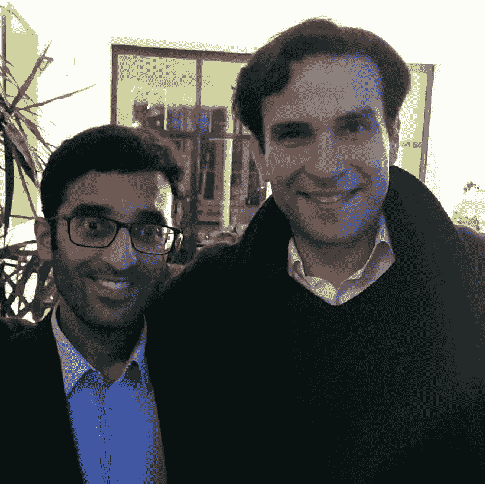

# 超自然企业家 2

> 原文：<https://medium.com/swlh/supernatural-entrepreneurs-ii-311a8cdf693d>

在 Musk 之后，让我们来见见巴基斯坦企业家 Zia Chishti，她是 Afinity 和 Align Technology 的创始人，这两家公司市值 20 亿美元，员工超过 3 万人。

Chishti 出生在美国，很小就失去了父亲，在获得斯坦福大学的 MBA 学位之前，他在巴基斯坦度过了童年。乍一看，齐亚听了他的经历和轶事，似乎很正常:追随他非凡的愿景并将其变为现实，使他成为一名超凡的企业家。一些提示:

*   **与众不同:**鹤立鸡群，连 AI 都成了老古董。要么进入深度科技运动，从事[的下一件事](/swlh/and-then-whats-next-6605beb6913)，要么开发一些不寻常的东西。
*   当寻找资金时，最好选择那些能帮助你成长的人，而不是那些只会带来钱的人。
*   艰难的决定:当没有更可行的解决方案时，解雇他。即使是年龄是你两倍的最有价值的工程师或高级顾问也是可以被取代的。可悲的是这样的决定可以拯救公司。
*   **创始人:**健康的创始人关系建立在一切透明的基础上，如果不是这样，那就认真重新考虑你的同事。
*   **销售:**当销售和交易完成时，尽可能快地跑出去，不要冒险被困在那个额外的问题上。
*   **做梦** …并控制你的梦(技术上是可能的)。
*   忘了咖啡吧，它会降低你的平均脑容量…

With Chishti

## 这篇文章发表在 [The Startup](https://medium.com/swlh) 上，这是 Medium 最大的创业刊物，拥有+394，714 名读者。

## 在这里订阅接收[我们的头条新闻](http://growthsupply.com/the-startup-newsletter/)。

