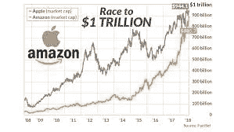
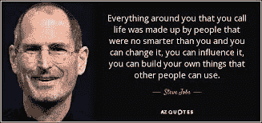

# 滑动以从零到一解锁——来自两本书的经验

> 原文：<https://medium.com/swlh/swipe-to-unlock-from-zero-to-one-lessons-from-two-books-4d110da44f88>

我们并不是每天都能听到类似“亚马逊继苹果之后达到万亿美元的市场估值”这样的消息。诸如此类的新闻总是激起我的好奇心，想了解这些公司是如何运作的。为了做到这一点，我最近读了两本书——在这里我分享我从他们身上学到的东西。读完这些书后，我对我们生活的世界有了一个更好的了解，对那些让这一切成为现实的企业家们也有了更多的感激。

滑动解锁:

由四大巨头(谷歌、微软和脸书)的产品经理撰写，这本书很好地介绍了管理我们生活的技术及其潜在的商业战略。你会找到一些问题的答案，比如“为什么一个华尔街商人要钻透阿勒格尼山脉来建造光缆？”以及‘谷歌为什么让安卓、地图和搜索免费’。你可以得到更多的基本问题的答案，比如为什么你的新手机会安装垃圾应用程序，为什么亚马逊上的价格每 10 分钟就变一次。

如上所述，这本书的章节从为什么和如何开始，涵盖了推动世界前进的软件技术(谷歌搜索、云计算、大数据、Spotify 上的推荐)和推动它们的硬件(操作系统、互联网)。这本书最棒的一点是，它给出了公司的真实例子来阐述令人信服的理论。它还对应用经济学(如果免费，应用如何赚钱)和商业动机(比如脸书为什么收购 WhatsApp)进行了基本概述。

它解决了一直存在的网络安全问题，并触及了管理这些指数级增长的业务的政策和法规纲要。正如我们从参议院对马克·扎克伯格的审判中所知，法律在理解技术方面还有很长的路要走。这本书继续探讨未来的趋势——自动驾驶汽车和机器人将会偷走我们的工作。作者以一个问题结束了这本书——“亚马逊会成为第一个万亿美元的公司吗”——我们现在知道这个问题的答案——它不会是第一个，因为苹果获得了这个地位，但它确实达到了估值。

总体而言——如果你是一名技术新手，想同时了解技术和商业，这是一本好书。

虽然第一本书有助于理解为什么公司会这样做，但接下来的书让自己有能力问自己“我如何才能做到”？根据作者的回答是‘零比一’。这本书是成功企业家和风险投资家彼得·泰尔的第一手资料，他是 Paypal 和 Palantir 的联合创始人，是脸书、SpaceX 和 LinkedIn 的投资者。

他恳求人们问一句“没有人在做什么有价值的生意？”。然后他断言，当你从零到一的时候，密集的进步就发生了——创造新的东西。他称之为技术。

这本书提供了一个人的第一手资料，他经历了 2000 年的网络泡沫破灭，并最终成为赢家。基于他的经验，他讲授商业思维课程，修改硅谷危机后的教条课程

1.  敢于冒险总比琐碎小事好——他说有一个宏伟的愿景比只做渐进的发展要好
2.  一个糟糕的计划总比没有计划好——保持精简和灵活应该等同于没有计划
3.  竞争市场会破坏利润——创造一个新市场比试图在现有市场中竞争要好
4.  销售和产品一样重要——尽管产品足够好，它仍然需要销售

他继续解释完全竞争和垄断。他所说的垄断指的是像谷歌这样的公司。他声称资本主义和竞争是对立的，为了创造和获取价值，人们不应该建立无差别的商品业务。他将企业的价值定义为其未来产生现金流的能力。他把垄断企业的特征描述为:

1.  专有技术——它必须比最接近的替代品至少好 10 倍。例如谷歌的页面排名算法
2.  网络效应——脸书的增长就是通过利用这一点实现的
3.  规模经济——软件初创公司应该能够无缝扩展，比如 Twitter 可以根据用户数量进行扩展
4.  品牌——除了苹果还有谁能证明这一点。

为了建立垄断，他给出了以下有实例支持的理论

1.  从小做起，创造并主导利基市场
2.  然后逐渐扩展到邻近的更广阔的市场
3.  不要扰乱:尽可能避免竞争
4.  通过在市场上取得最后的巨大发展而获得最后的优势

然后，他解释了风险投资、优秀团队的重要性、雇佣合适的人以及销售的不容置疑的需求。

这本书最精彩的部分是，他给出了任何有想法的企业家在试图创建企业之前必须回答的七个问题——大致分为工程、时机、垄断、人员、分销、持久性和秘密问题。阅读这本书是理解他如何得出这些问题以及为什么回答每一个问题都很重要的最好方式。

总的来说——这是一本推荐给所有想了解世界主流创业公司和风险投资的人的书，作者是在这两方面都有成就的人。

书中的最佳引语:

最与众不同的事情不是反对大众，而是独立思考

为了幸福，每个人都需要有目标，这些目标的实现需要努力，并且需要成功实现他的至少一些目标”——卡钦斯基

最后，引用启发这些书作者的人的话，

## 这篇文章发表在 [The Startup](https://medium.com/swlh) 上，这是 Medium 最大的创业刊物，有+368，675 人关注。

## 在这里订阅接收[我们的头条新闻](http://growthsupply.com/the-startup-newsletter/)。

