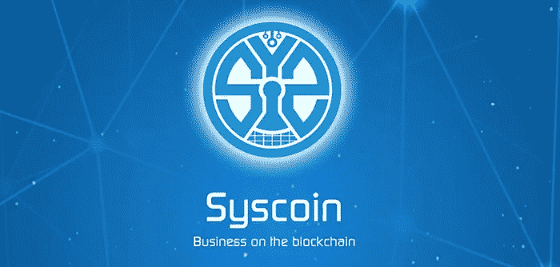
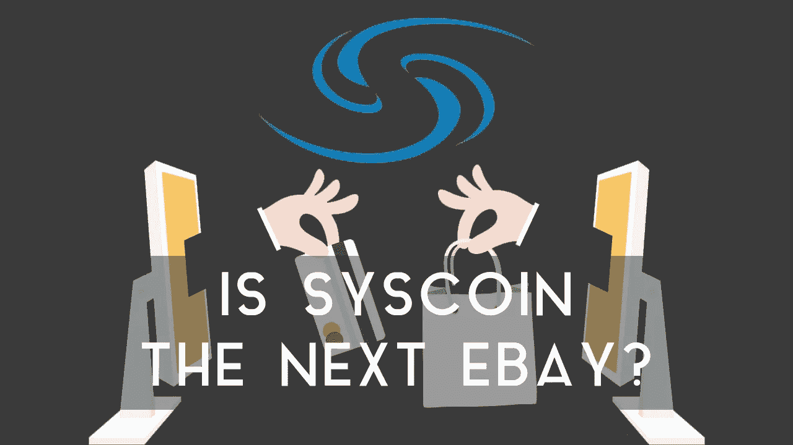
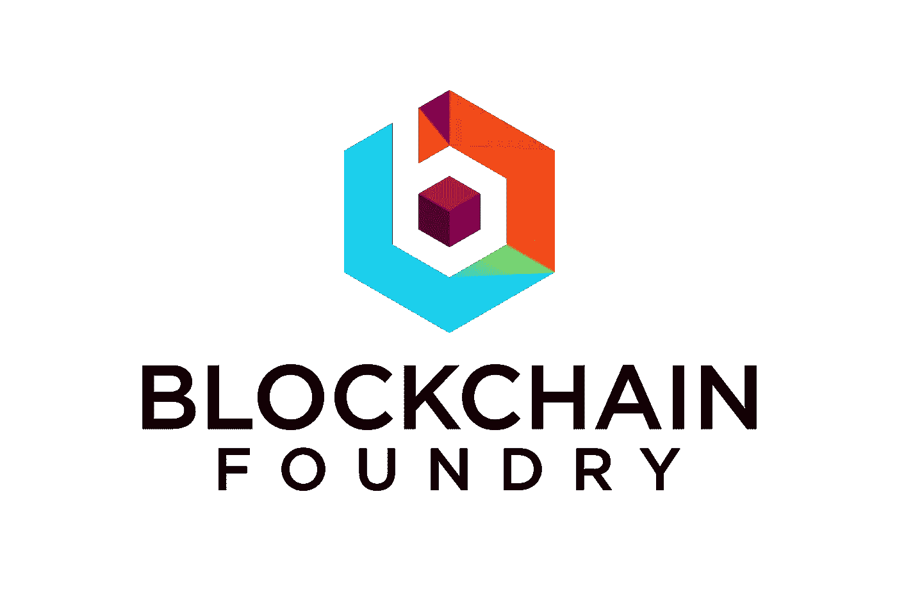
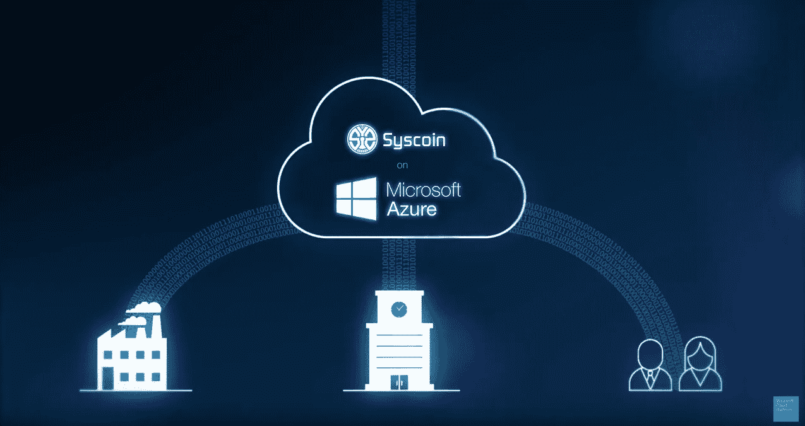
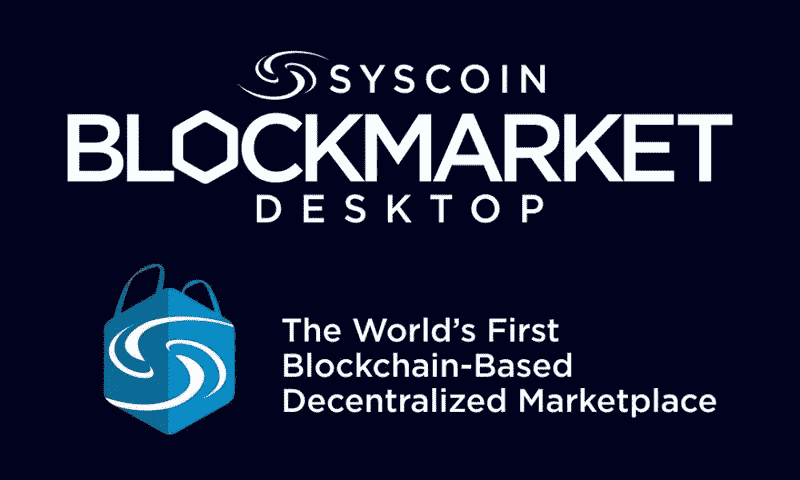

# SYS coin(SYS)——区块链的 Ebay

> 原文：<https://medium.com/swlh/syscoin-sys-the-ebay-of-blockchain-d09ebddd559f>

区块链是自互联网诞生以来最具变革性的技术，因为它有能力转化并影响每个现有的行业。**那么，谁会是亚马逊、易趣、谷歌、脸书、Snapchat 等呢？区块链的？**我可以回答其中一个问题。 **Syscoin 无疑将成为区块链的 Ebay**。然而，Syscoin 将对世界产生更大的影响，因为它不仅是一个购买和销售商品的去中心化平台，而且还是一种加密货币等等。今天，Syscoin 的交易价格为**$ 0.31**，但由于潜在的 50 亿用户和我将讨论的增长驱动因素，这种硬币在未来两年内很容易达到大约**$ 3**。

# 基础知识:

1.  Syscoin 于 2014 年 3 月推出，是一种基于比特币协议的**数字点对点货币**，也是一个**去中心化市场**
2.  去中心化的市场 **BlockMarket** ，允许用户买卖产品和数据证书
3.  如今，在 BlockMarket 平台上只能使用**比特币和 Syscoin**
4.  Syscoin 团队还推出了**区块链铸造**来帮助开发利用 Syscoin API 的业务
5.  Syscoin API 有能力制作一个区块链应用程序，作为法律文件、医疗数据、工资单文档等
6.  **股票代码:SYS**价格:$ 0.31
    按市值排名:36
    市值:174735893 美元
    流通供应量:529271750 SYS
    最大供应量:888000000 SYS
    平均交易量:7904520 美元
    阻塞时间:一分钟
    共识:PoW

# 团队:

1.  Syscoin 团队由 **Sebastian Schepis** 领导。他从 6 岁开始涉足技术领域，12 岁左右，他甚至成为了多伦多当地一个黑客组织的领导者。19 岁时，Schepis 先生成为由加拿大第一批有竞争力的本地交易所运营商创建的创业公司的第一名员工。从那以后，Sebastien 曾在其他几个 CLECs 工作过，拥有超过 15 年的电信产品(数据、无线、语音)经验
2.  Syscoin 团队有另外 2 名开发人员全职从事这个项目
3.  该团队还有 **2 名营销专员、2 名社区经理和 1 名业务开发人员**

# 增长驱动因素:

1.  BlockMarket 将为用户提供**导入和插件**的能力。也就是说，Syscoin 团队将允许你从 Ebay 等外部网站导入你的所有列表，该协议也有插件或允许 Shopify 或 Etsy 等平台使用 Syscoin。这些功能将吸引更多用户使用该平台，并有助于获得大规模的适应性
2.  Syscoin 拥有**强化的智能合约**，允许用户拥有分散交易、创建和存储数字证书、创建别名、多重签名服务、价格挂钩等能力。这个协议有无数的用例
3.  这个平台绝对没有**中间商费用**，你卖出多少就是你收到多少。区块市场不抽取百分比
4.  BlockMarket 正在努力实现大规模采用，因此在这个平台上列出你的产品将是 **100%免费的**，并且对商家来说没有**托管费**
5.  该平台的分散性质使其不受政治干预。例如，如果你生活在一个禁止某些物品的国家，你将能够在没有任何痕迹的情况下获得这些产品
6.  比特币和 Syscoin 是 BlockMarket 上仅有的两种支付方式。我想，一旦 BlockMarket 在市场上获得足够的牵引力，他们会选择只接受 Syscoin 作为一种支付形式。这将**内在地增加加密货币的效用，从而增加其价值**
7.  像比特币一样，保护和驱动这个平台的节点将会分布在世界各地，进一步增强其分散性
8.  Syscoin 与微软的 Azure 有一个新的合作关系。这种关系的可能性是无限的
9.  和其他加密货币一样，只有你自己掌管你的钱。BlockMarket **永远不会以任何理由没收你的资金**，不管你是商家还是顾客
10.  **区块链铸造厂**的推出将有助于支持和发展利用 Syscoin API 的业务。这将进一步扩大 Syscoin 在医疗数据、法律文件、薪资文件等业务领域的影响力。
11.  BlockMarket 平台还提供了一个**分散式消息系统**，允许你与平台上的其他用户进行交流

# 逆风:

1.  这种类型的技术非常先进，因此目前的人口将有技术限制。这个项目的真正价值要在未来 5 年左右才能释放出来
2.  相对于他们试图完成的一切，团队的规模有点小。此外，如果他们在所有社交媒体渠道上提供定期和一致的进展更新，那就太好了，但他们非常雄心勃勃
3.  由于监管总是会落后于创新，数字货币领域未来可能会受到新监管的约束
4.  截至目前，Syscoin 的增长完全是通过口口相传实现的。目前还没有在这个项目上花费营销费用

# 总结:

Syscoin 的估值稍微复杂一点，因为这个项目太独特了。自 BlockMarket 于 2017 年 8 月上线以来，Syscoin 目前拥有 70，000 名用户，交易价格为:

股票代码:SYS
**价格:$ 0.31**
市值排名:36
市值:174，735，893 美元

让我们保守地假设 Syscoin 将能够采取。 **25%的 Ebay 活跃用户(1.68 亿)**年复一年，每个用户代表相同的价值。此外，每 70，000 名用户相当于 Syscoin 价格上涨 0.30 美元。

到 2018 年底，Syscoin 将有 42 万新用户，到 2019 年底，大约还有 40 万新用户。在接下来的两年里，Syscoin 的平台上将总共有 820，000 名新用户。这将意味着大约 3.50 美元的**将增加**到 Syscoin 当前价格 0.31 美元，这将使 Syscoin 在 2019 年**年底**的价格达到:

1.  股票代码:SYS
    **价格:3.81 美元**
    市值排名:14
    市值:2144687671 美元
    发行量:562,910,150 SYS

这一价格预测**不包括两年期间的市场增长率**。

我希望你们都喜欢今天的文章！ **Syscoin 团队**……让我们用你正在做的所有伟大的事情来营销和教育这个世界吧！！

## 这个故事发表在 [The Startup](https://medium.com/swlh) 上，这是 Medium 最大的创业刊物，拥有 312，921+人关注。

## 在这里订阅接收[我们的头条新闻](http://growthsupply.com/the-startup-newsletter/)。

