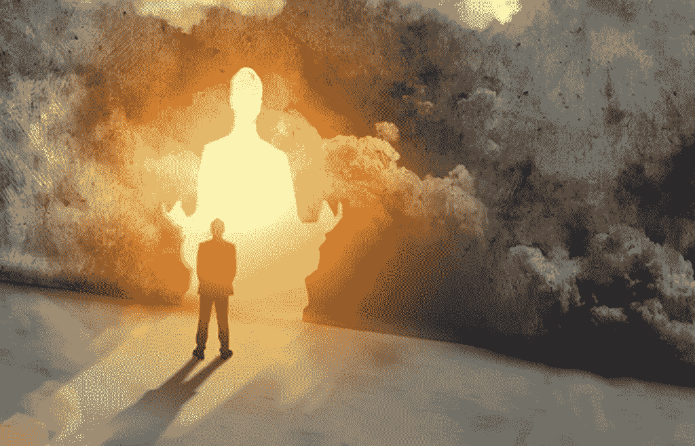
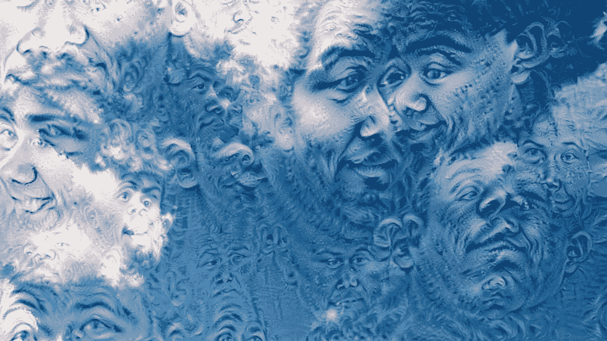

# 环境系统

> 原文：<https://medium.com/swlh/systems-of-circumstance-c67a2361d307>

## 一切相对于其他一切

一切都是相对的，相对而言。我们表面上是我们自己宇宙的中心，但我们有什么资格提出不同的建议，尤其是从一个局外人的角度来看？

你有困惑吗？太好了，现在我们可以继续今天的话题了。因为，哪里有问题，哪里就有真理感，不管它可能被放错了地方。

当我们体验生活时，我们不断地消费、收集和划分，以更好地预测未来，或者至少为下一个时刻做好心理和身体上的准备。从这个意义上说，记忆的发展很可能是一种生存本能。这些是心智模式和系统，我们必须以此为基础进行决策，并进行回顾性评估或重新评估，以制定战略并应用我们针对预期方向或结果的日常策略。但我们是人，至少在某种程度上是人，当我们经历、消费和评价时，随之而来的是我们所处环境的主观本性。在大多数情况下，我们天生就不客观也不理性，但那是另一个话题。

所以我今天的问题是:我们能从战略规划中去除环境和主观性吗？从协调培养、贡献和进化我们环境本身的主观性质的客观系统？我们是否能够消除自己的相对性，在日常决策中采取一种客观或更普遍的立场，使我们的目标和贡献与更大的目标和意义相一致？我们能够合一吗？在我们的生存本能、恐惧、寻求快乐和避免痛苦的渴望之外的意识水平？

老实说，我不知道。但这并不意味着我们应该阻止自己去考虑那些围绕、指导和影响我们决策的环境的“为什么”和“如何”。我们到底有多了解自己，了解自己在做什么。

希望在读完这篇文章后，你会觉得你对自己的了解比你想象的要少一些，反过来，你会好奇为什么会这样，或者更多地认识到这一点。

相对来说当然。

# 今天的垃圾思想…

“每个人都忙于逃避他们所追求的现实，他们忘记了，也看不到并生活在现实中，这令人难以置信。”

迷路

没关系，如果只是定期迷失和无所事事不令人钦佩的话，让思想游荡，身体跟随允许和消化。允许你在任何地方迷路，做任何事，除了在你的手机上。

大师和山

山顶最多只能走一半路程。我们在山顶有很多新的机会去追求和探索，在下山的路上，我们应该花时间去欣赏我们已经取得的所有成就，以及我们在上升过程中如此不耐烦地错过的一切。正是对我们自身无知的探索提供了从参与者发展成为主人的机会。大师知道山的一切，以及它存在和互动的环境。

你的人民，你的部落

当你在你的部落中时，你可以环顾四周并注意到(并知道)两件事:首先，这些人在这里支持、激励并使你成为更好的你，以及你所创造的。第二，他们可能会和你一样感受、思考和寻找同样的东西，并带着同样的激情、目标和不安全感这样做。所以，靠过来。这些是你的人。

移情乘数

观看笑和情绪可能有 80%是你自己经历的。你越能感同身受，你就能越接近这个数字。所有的人、噪音和经历都在我们周围发生，这创造了一个令人难以置信的快乐机会。

多多益善，适可而止

只有当你“足够”时，你才能创造出真正有价值的贡献，而不是追求激情和探索已知。只有在接受的时候，你才能成为一个人，代表一个人，做出更多的贡献。

## 这篇文章发表在《创业公司》杂志上，这是 Medium 最大的创业刊物，有 300，118 人关注。

## 订阅接收[我们的头条](http://growthsupply.com/the-startup-newsletter/)。

