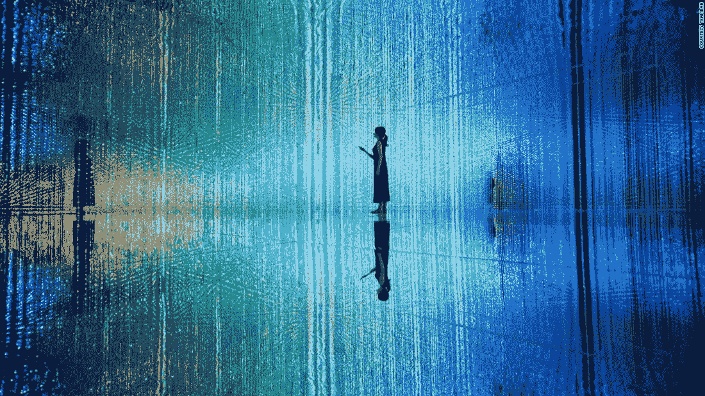
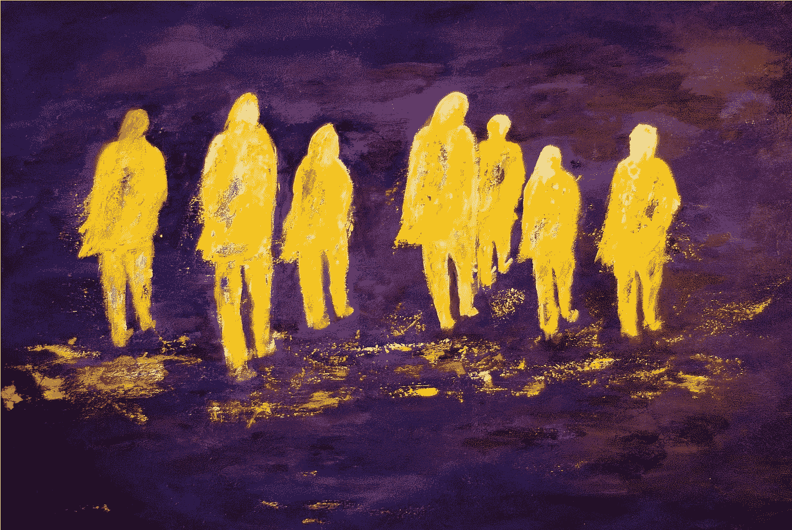

# 花片刻

> 原文：<https://medium.com/swlh/take-a-moment-deecc48e81ee>

## 看透你的“自我”

你多久看一次镜子里的自己？盯着自己看怎么样？密切地，聚焦于你的瞳孔，通过缟玛瑙的巨大完美。太迷人了。

你可以看穿你自己，看穿你的狗屁信仰，你的恐惧和不安全感。你可以看到你的兴奋、激情和热情，为什么你今天起床，更不用说过去几年每隔一天起床了。

你可以越来越深，越来越近，不眨眼地快速掠过你所有的记忆，感受机会的力量，感受你与你所知道的一切的联系，感受你迄今为止所学到和经历的一切，这一切都是为了让你走到这一步。此时此刻。

然后你突然想到，你已经到了。随着平静的空虚感袭来，所有的噪音都消失了。就像电影的开头或者暴风雨前的平静。

在这一刻，这完美的空虚，这就是你。这就是你，你已经成为的人，你已经决定成为的人，你已经把自己放在的地方。这是你的时代。

然后“眨眼”就没了，那种感觉就是。但是，我们只需要在那一刻重新确定我们是谁，我们从哪里来，我们的目的是什么。然后，回到工作中，因为我们有一个惊人的一天，一些非常聪明和有才华的人给我们自己和激励，以及一个远远超越我们自己和我们在镜子里看到的生活。

我们不仅仅是我们成就的总和，它们也不是我们的身份。我们所有人的潜力都比我们自己和他人有限的想象力所能理解的要多得多；正是这样的时刻不仅建立了我们对目标的信心，也给了我们继续生存和发展所需的清晰和专注。

所以花一点时间，然后出去消磨一天吧！

# 挑战自己不属于自己

一些共同的语境来调节气氛，”放下电话。你总是在打电话。我就在这里。你在破坏这个时刻。你有问题。那里有什么比我们，这里，现在更有趣的？”

我们沉迷于屏幕、设备和分心。等等，让我换个说法。我们沉迷于注意力，在排泄和避免我们的无效时间。我们是自私的、社会性的动物，对最有趣或最有益的活动感到舒适、控制和好奇。但是你已经知道了所有这些。

我们应该更感兴趣和好奇的不是那些手持设备的人，从屏幕或滚动的电子邮件和社交媒体开始，而是我们自己或其他在相同环境下坐着、观察并指出它的人。

向内看，手指指向我们自己，我们会发现什么？

一个被冷落、被激怒的观察者，不舒服地站在一个空无的状态中，孤独而分离；自私地渴望我们有资格获得的联系和关注，试图成为这一刻的一部分，试图在别人离开时控制和创造联系。

这种状态、我们的状态、我们的叙述所激发的思想、感情和行动，比我们所指的那些东西更能揭示我们自己。这里我指的是我们对联系、舒适、控制和包容的渴望，就好像它们不见了一样；好像它们被拿走了，藏起来了或者消失了。但是它们没有去任何地方，它们都在那里，我们已经把自己从它们中移走，分离出来，把我们的“自我”定位为一个观察者，一个控制评价者，一个判断和居高临下的暴君，他更清楚地知道自私地追求自己的舒适和控制。

这个故事充满了恐惧和不安全感；投射到像一个亲密的屏幕或设备这样微不足道的东西上。仅仅因为我们没有被包括在内，就给这样的事情这样的权力和控制是愚蠢的。

你看，当别人的注意力被转移时，我们就被排除在外，独自留在一个空虚的空间里。我们不再能控制它们或环境，我们不再参与其中，但更奇怪的是，我们不再能满足我们的需求；我们对此非常不自信。进入恼怒和焦虑。某人或某事引起了他们的注意，而我们没有被邀请，我们不够有趣，我们没有价值，没有被包括在内。我们的叙述变成了…

> “我，我，我。与我交谈，与我结合，包括我。见我。我在这里，我在这里很孤独，我们需要团结在一起，我们的部落，为了生存，为了更亲密。如果我们不团结在一起，我担心我们会分崩离析。”
> 
> “难道我不值得你浪费时间吗？谁更重要，更有趣？我需要控制住局面。你不能分开或摆脱我，这是我的时刻，我想要你的注意，我渴望它和你在这里，和我在一起，和我们在一起，因为如果不是我一个人，那会很不舒服，我不知道该怎么办。”

作为屏幕上的指针和观察者，我们的注意力、设备或疏忽都充分说明了我们。我们把自己从那一刻分离出来，回到了孩童般的贫困。

那我们该怎么办？

**更有趣。或者更好，更感兴趣。**如果失败了，那就活在当下，享受这一瞬间，这段空虚的时光，保持联系，让他们回来或者离开。自私地强迫控制一种情况只会制造紧张，让你们更加分离。

不要考虑你自己的时刻和背景，而是考虑我们所有人的时刻和背景，我们就是那个时刻，相信你自己和你的关系。如果你这样做，这个装置或任何其他注意力分散都是虚幻的，与当前展开的时刻无关，不受控制地被创造出来，它是美丽的。

挑战你自己，不要成为你的“自我”，要超越你的“自我”。

# 今天的垃圾想法

零散破烂。我们只能称之为“运气”几次，之后它就是伟大的战略或职业道德。

我们是我们的创造

我们一生中实际学到的东西的总结体现在我们的日常行为、决定以及我们对他人的影响和启发中。我们是我们最大的成就，我们是我们最大的信息，我们的行动是信使。

精神假期

我觉得我只是离开了一段时间，四处旅行，整理东西，学习，实验和体验我与各种概念和心理模式的关系。现在我回来了。更聪明、更快、更专注、更有动力、更投入、更有目标，朝着我认为对自己、更重要的是对他人有巨大价值的方向前进。

雷·戴利奥

他的话是:要进步，你必须开发和利用激进的开放思想。想要的生活很难有。没有我想要的生活更难。好好选择你的习惯，支持你的目标。想要成功，你需要两样东西:梦想和应对现实的方法；这意味着学习和对你不知道或不理解的事物的彻底开放。

进化与进步

我们被吸引并被引导向进化，不仅在生物学上，而且在我们创造的艺术中，在通过系统和过程对我们自己和环境的设计中，以及在我们如何思考中。抵制进化是恐惧，是不自然的。找到进化失败、成功、实验、自然选择的方法，你会发现进步。

不要竞争。接受。

不要竞争。生活不是一场赛跑，也不是一场马拉松，它是一场试跑，你可以登上这座山，你的山，然后得到你想要的，你创造的。你必须如此深入地了解自己，以至于没有人能看到或做你为自己看到、做、创造和成为的事情。不针对任何人。如果有的话，你需要别人成功。

## 这个故事发表在 [The Startup](https://medium.com/swlh) 上，这是 Medium 最大的创业刊物，有 286，184+人关注。

## 订阅接收[我们的头条](http://growthsupply.com/the-startup-newsletter/)。

