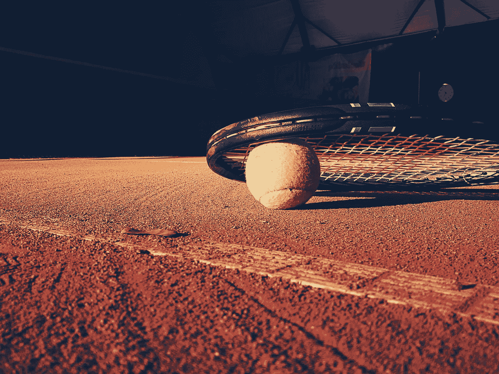
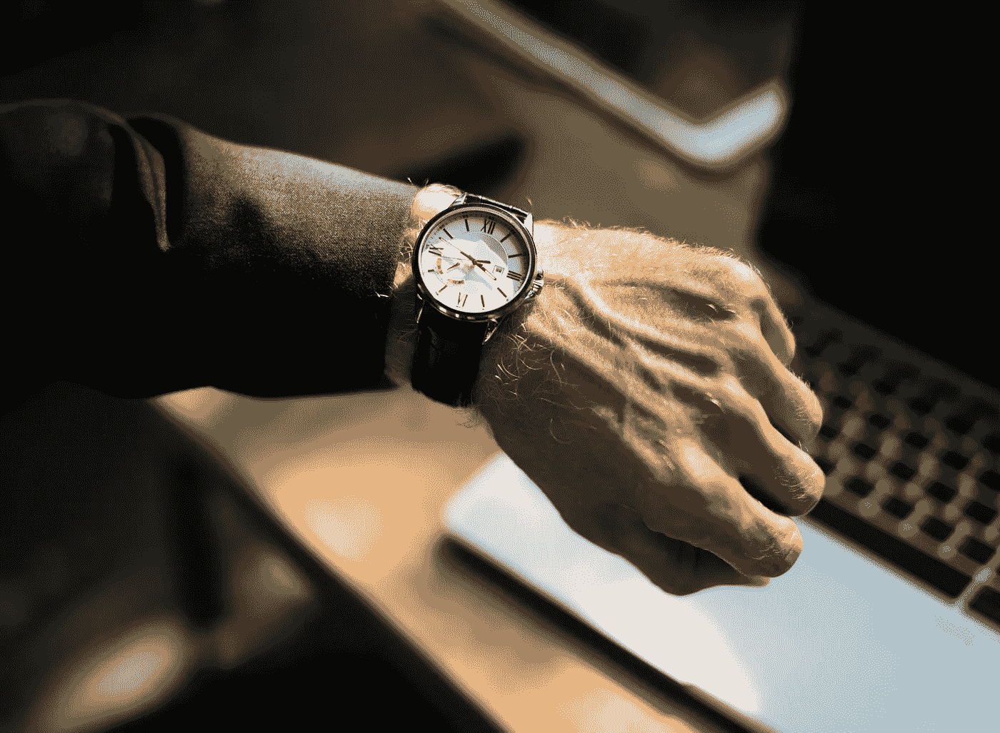

# “休息一天”:不工作的三个理由

> 原文：<https://medium.com/swlh/take-a-rest-day-3-reasons-why-not-working-out-works-2dd021971c91>

Photo by [Tookapic](https://www.pexels.com/de/@tookapic) on [Pexels](https://www.pexels.com/de/foto/sport-ball-tennis-ubung-7753/).

我以前说过。体育与商业的比较是一个很大的陈词滥调，但它是无限适用的。

本周，我发现了另一个层次的适用性。

在对一名运动员进行初步评估时，他是我们绩效咨询小组的新客户，我们审查了他的时间表、以前的训练和教练经验、他的目标和期望。

在我们共同的热情中，他说:

> “你可以给我任何东西。我全天候训练。给我你最糟糕的，我会把我的头放下，然后走！”

这家伙不是你典型的“没有休息日”的 Instagram 兄弟。他是一名具有国际竞争力的运动员，他获得的奖项比字母表中的字母还要多。显然他言行一致！

然而，他来到我们公司，因为他的表现正在下降，他已经遭受了几次恼人的伤害。

我们继续讨论他过去的训练协议；他解释说，即使他的上一个教练在比赛后规定休息一天，他仍然会训练。他有一种强迫性的需求，总想“做点什么”。

如果你有体育锻炼的经验，你可能听说过休息日对你的日常锻炼很重要。

事实上，训练实际上会让你的身体崩溃，当你睡着或休息一天时，你的身体会自愈，直到它能够适应这些压力。这就是为什么一周之后你会因为深蹲而感到疼痛，而两周之后，在同样的锻炼中，你毫发无伤地离开了。

在长时间不休息后，一个人可能会经历受伤、睡眠障碍、表现下降，在极端情况下，还会出现倦怠症状，如抑郁或慢性疼痛。

**简而言之，当我们休息一天时，我们会变得更强壮、更持久、适应性更强。**

我们开始了…您一直在等待的业务比较！

有时候离开工作是很重要的。大多数朝九晚五的工作允许人们在打卡下班后离开办公室，然后第二天继续工作。

对于大多数参与创业的人来说，我们生活在工作中。

**当我们不“工作”时，我们仍然在工作。**

在我探索“全力以赴”在商界意味着什么(在体育界，我们称之为“最佳表现”)的过程中，我不自觉地加入了休息日规则。

每周一天，或者最多两个星期，我尽最大努力创造我喜欢的放松环境。作为一个长期过度思考的人，我这次的目标是有目的地让我的大脑暂时关闭。即使只有一两个小时。

(这通常包括浴缸、葡萄酒和冰淇淋。但是尽管如此……)

在这一天，我首先关掉电子设备，练习放松技巧，并且通常专注于工作之外的另一部分生活。

也许这并不奇怪，但是在这个时间段通常发生的是压倒性的新鲜想法，一些生活平衡感，以及重新开始工作的愿望。

**欲望。不是义务。**

我的运动员不会让自己在休息日训练，因为这看起来很浪费，我希望他*希望*训练，以便他明天带着新的热情和愤怒回来。

对于工作中的我来说，“我真的需要完成*在这里插入任务*”变成了“我真的想*在这里插入任务*”。

> “每个人都需要休假一天。一个人有意识地分离的一天……一个不再面对问题、不再寻找解决方案的一天。我们每个人都需要从那些不会远离我们的忧虑中解脱出来。”
> ― **玛娅·安杰洛**

我同意商人的休息日规则。如果你还不知道，以下是我希望你尝试一下的三个原因。

## **1。再生。**

尽管他看起来每周 7 天每天 24 小时都在努力工作，但就连加里·维纳查克也承认每年都会花周末时间和家人在一起，并有六周的假期。尤其是度假，他不碰工作，也不碰社交媒体。

为什么？

因为平衡很重要。睡眠很重要。组织很重要。健康的习惯、人际关系和干净的生活空间很重要。他们帮助我们从赤字和损失中恢复。它们帮助我们表现得更好。

当你花时间和你的伴侣在一起，或者最终赶上你最喜欢的电视连续剧，或者洗车，或者出去吃饭，而不是像一周中的其他晚上那样点外卖，你给了自己工作角色之外的思考、感受和体验的自由。

Photo by [RawPixel](https://www.pexels.com/de/@rawpixel) on [Pexels](https://www.pexels.com/de/foto/analogon-arbeiten-armbanduhr-drinnen-404972/).

## **2。新想法。**

当我们不深陷于世俗、常规或策略时，我们会突然意识到我们周围发生了什么。

你可能会发现自己注意到了实际应用于商业的全新事物，比如人们的行为或互动方式，脸书的帖子或谷歌广告引起了你的注意，以及一个标题有多有趣。

给自己留出空间，打破工作模式，让你回到现实世界，在那里，真实的人在工作(买东西)，真实的事件在发生(比如对话、转化和关注)。

## **3。最大化。**

当你允许你的注意力不时地转移到工作之外的其他地方时，你的注意力可以在你需要的时候更充分地集中在工作上。你更认真地对待一周的工作日，最大限度地利用每一秒钟，因为你知道缓刑即将到来。

想想一年 365 天都在节食会有多惨。那不仅对身体不健康，而且对精神也不健康。当你知道节食将会结束，或者当周末有一个欺骗日时，你会对坚持规则(远离饼干罐)更好一点，直到那时。

你变得有能力——并且愿意！—100%工作，100%休息。

**“全进”不等于脱离现实。**

这也不会让你突然变成超人。你需要休息。

## **有一个例外。**

休息日规则有时并不适用。

当运动员参加奥运会或世界锦标赛时，他们可能没有休息日。如果他们这样做了，可能是在旅行、积极恢复或其他方面，但他们不能完全休息。这是不现实的，直到他们再次回家，然后他们可能会去度假。

在商业中，休息有时也是一种奢侈。也许你正在拼命争取这个月的工资。也许这个月你会在国际间旅行，整晚都有连续的会议和航班。也许，出于任何原因，你真的只是*不能。*

然后做我的运动员会做的事情，做一些积极的恢复(“游泳或慢跑”)。去喝杯咖啡，给自己额外的三分钟时间让自己回到现实，然后继续战斗。

然后考虑休假。

**感谢阅读！如果你从这篇文章中受益，请鼓掌或分享，这样它可以帮助别人。我非常感谢你的反馈和回应，比你知道的还要多！——朱莉娅**

**想了解更多关于教练、表演心理学和体育行业创业的信息，请查看** [**狮子的鬃毛博客**](http://www.whitelionperformance.com/blog) **。**

## 这篇文章发表在 [The Startup](https://medium.com/swlh) 上，这是 Medium 最大的创业刊物，有 320，131+人关注。

## 在这里订阅接收[我们的头条新闻](http://growthsupply.com/the-startup-newsletter/)。

