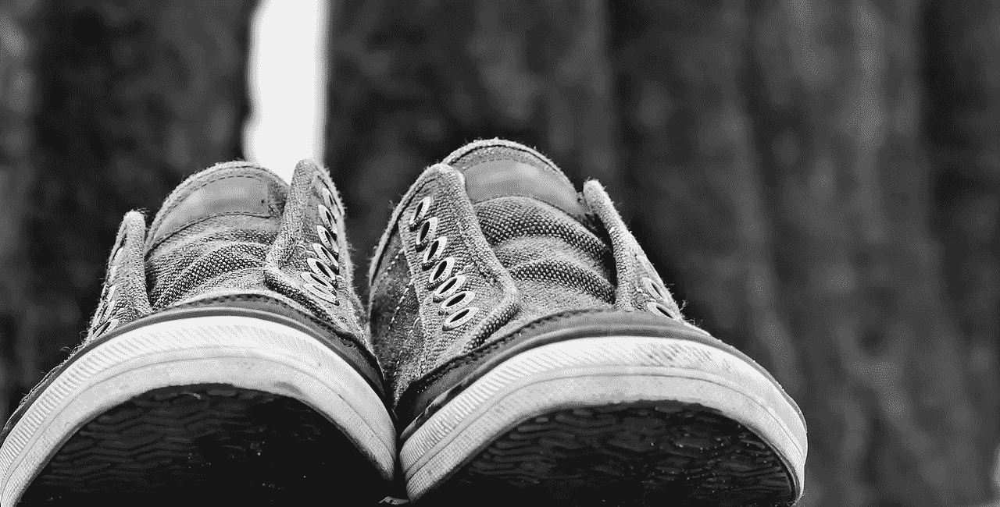

# 散步

> 原文：<https://medium.com/swlh/take-a-walk-27598ac99d88>

## 改变你的世界。

> 在你批评一个人之前，请站在他的立场上走一英里。这样，当你真的批评他时，你会在一英里之外，穿着他的鞋子。”―史蒂夫·马丁

如果我们不认识到人们确实经常这样做，这就不会那么有趣了。

为什么人们在判断自己的行为或行动之前，很少理解和欣赏另一个人的经历？

为什么领导者很少倾听员工的声音，也很少意识到他们错误批评的影响？

这种换位思考的观念根植于古代智慧。我们大多数人都接受这个想法，甚至更多，我们期望从别人那里得到它。然而实际上，这似乎更像是老生常谈，而不是一种价值观。

我认为关注我们自己的需求或问题，并相信我们的故事版本是人类的天性。

> *“世界分为那些认为自己是对的人。”—未知*

世界真小。

一个小世界，往往导致狭隘的视角，中断的沟通，糟糕的决策和受损的关系。

人成了标签，成了层次，成了功能，成了壁垒。

我们错过了信息，因为我们不喜欢信使。

我们在不理解问题的情况下规定了解决方案。

都是因为不愿意放弃我们最喜欢的一双鞋。

> *“任何让我们对他人不满的事情都能让我们了解自己。”―郑振聪*

我们站在他人的立场上是通过语言和经历来实现的。

通过倾听的艺术来学习语言，目的是理解说的和没说的。提出问题，完善我们的理解，直到我们能够尽可能充分地欣赏、思考和重申对方的观点。

通过去他们去的地方，看他们所看到的，听他们所听到的，在某些情况下做他们所做的来体验。亲身体验，不要假设我们了解他们的世界是怎样的，也不要假设我们可以从远处判断。

这种做法不仅服务于我们付出时间和注意力的人，也服务于我们自己。

他们和我们一样，会珍惜被关注、被重视和被理解的机会。

反过来，我们可能会赢得更高层次的尊重和被倾听的权利，从而扩大我们的影响力。

双方都为合作和创造性创造了新的可能性。

最终，我们变得更加了解自己、我们的局限、信念和感知。我们的世界变得更大了一点，我们的眼睛变得更清晰了一点。

也许他们把它向前传递，这样至少在一些小的方面，世界不那么分裂了。

> *“不完美不是不足；它们提醒我们，我们都在一起。”―布琳·布朗*

我有一个朋友，作为日常习惯，他每天早上都和别人一起散步。

对他来说，邀请他最近才认识的人和他一起散步是很平常的事。他会交换号码，说“早上 6:30 来见我，我们一起走。”其他同行的都是他认识多年的人。

他从不错过任何一天和某人一起散步。有时他会在早上和不同的人一起散步 2 到 3 个小时。他甚至计划假期和家人或密友一起散步。

听听他是怎么说的，这种实践教会他去爱和欣赏各种类型的人，让他对他们面临的挑战有了更深的尊重。他从他们的故事中获得力量和智慧。

作为回报，他付出时间、注意力、同情心和鼓励。人们找他只是为了去散步。因为他站在他们的立场上，走在他们身边，听他们讲故事。

**搭把手。**

**脱鞋。**

**散步。**

*原载于 2018 年 4 月 25 日*[*soul2work.com*](https://soul2work.com/2018/04/take-a-walk/)*。*

## 这篇文章发表在 [The Startup](https://medium.com/swlh) 上，这是 Medium 最大的创业刊物，有 319，283+人关注。

## 在这里订阅接收[我们的头条新闻](http://growthsupply.com/the-startup-newsletter/)。

