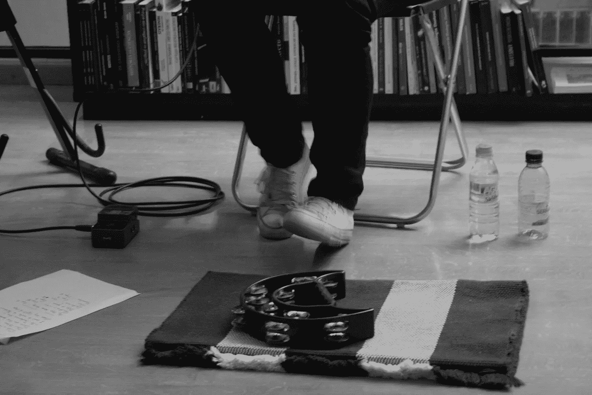

# 利用脆弱性练习

> 原文：<https://medium.com/swlh/taking-advantage-of-vulnerability-exercises-fca4b4f1045a>

Me and my tambourine — circa 2009

音乐和音乐家的坚韧是我灵感的巨大来源。长大后，我渴望成为一名音乐家，对创作过程的美妙以及我如何能够将思想和情感融入歌曲或旋律感到惊讶。今天，我运用类似的灵感来源，通过数据驱动的视角来解决复杂的问题。

站在观众面前唱我的歌太可怕了。尽管我在精心创作歌词和旋律上投入了大量的爱和注意力，但现场演奏是一种恐惧和快乐的混合。与世界分享我的音乐的满足感和对失败近乎瘫痪的恐惧。对弄乱词、唱错调、无法与观众沟通的恐惧，比分享我(他)艺术的行为更强烈。我表演的所有节目都很小，很亲密，所以我可以很容易地与房间里的每一个人进行眼神交流。这让我更加害怕犯错误，破坏大家的体验。

直到最近，我才意识到这些节目是一系列让我拥抱脆弱的练习。

从[韦氏词典](https://www.merriam-webster.com/dictionary/vulnerability?utm_campaign=sd&utm_medium=serp&utm_source=jsonld)

> 脆弱的
> 
> 能够在身体上或者感情上受到伤害
> 
> **2:** 易受攻击或伤害 **:** [可攻击的](https://www.merriam-webster.com/dictionary/assailable)
> 
> *//易受批评*

尽管脆弱的定义可能看起来过于戏剧化，但这正是我在表演时所经历的。我把自己放在那里，如果没有人喜欢音乐，中途离开或者根本就没有出现，我的情绪就会受到“伤害”。同样的话也适用于任何做过公开演讲的人。

与看起来相反，学会脆弱会让你变得更强大。它可以成为创造性的催化剂。它可以激发合作，让你们的关系更加牢固，更加紧密，植根于信任和理解。

我是通过观看我最喜欢的音乐家之一的现场演奏而了解到这一点的。如果你看过 KT Tunstall 的表演，那就是我所说的脆弱性练习。

虽然她也带着一个完整的乐队巡回演出，但她的大多数展示和现场表演都是令人难以置信的独角戏！她解构了自己的歌曲，并在舞台上一层一层地将它们重新组合在一起。这些是全有或全无的时刻。如果她漏了一拍或者被观众中的某个人分散了注意力，这首歌就可能被毁了。她只能靠自己了。

这是一个巨大的勇气和脆弱的行为。它展示了对流程和工艺的巨大投入，同时完全接受失败的可能性。

脆弱性对我们生活方方面面的影响并不是一个新话题。布琳·布朗博士，在她的 TED 演讲中，分享了一个奇妙的旅程，去理解脆弱在我们生活中所扮演的强大而积极的角色。

在工作环境中，《文化密码 的作者丹尼尔·科伊尔(Daniel Coyle)研究了[漏洞循环](https://qz.com/work/1241911/daniel-coyle-author-of-the-the-culture-code-says-building-trust-works-in-the-opposite-way-you-think-it-does/)如何导致同事之间的信任。一个人脆弱，另一个人接受，这种行为触发了这个循环，创造了一个建立在信任、合作和友情基础上的工作环境。

反思所有这些弱点练习，我清楚地知道这是我在生活的每个方面知道如何操作的唯一方法。变得透明和脆弱。努力给予，不求回报，伸出援手，最重要的是，不要害怕寻求帮助。

*感谢阅读！*

## 如果你喜欢这篇文章👏👏👏并把这个分享给你的朋友！

## 在推特上关注我 [@carolinabento](http://twitter.com/carolinabento)

*这里是我写的另外几篇文章，你可能也会喜欢*

 [## 在结构强度中找到平衡

### 先睹为快我的新书“现实检查”

medium.com](/@carolinabento/finding-a-balance-in-structured-intensity-69d90916cbbe)  [## 拥抱每一次失败，作为你旅程的一部分

### 并把它变成学习的机会

medium.com](/@carolinabento/embrace-every-failure-as-part-of-your-journey-a776de453360)  [## 新经理的 7 个实用技巧

### 当你第一次成为经理时，就好像你进入了一个全新的世界。然而，什么都没有…

medium.com](/@carolinabento/7-practical-tips-for-new-managers-c0e39e1349dd) 

## 这篇文章发表在 [The Startup](https://medium.com/swlh) 上，这是 Medium 最大的创业刊物，拥有+ 380，474 名读者。

## 在此订阅接收[我们的头条新闻](http://growthsupply.com/the-startup-newsletter/)。

