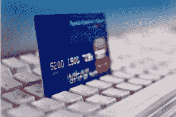

# 打理生意——一个你不能忽视的问题

> 原文：<https://medium.com/swlh/taking-care-of-business-the-one-problem-you-cannot-afford-to-ignore-a9765a9b2fb0>

作者:[约翰·福尔德](https://readyfireaim.eu/author/jforde/)| 2018 年 5 月 10 日|

***“如果你有一份没有烦恼的工作，那你就没有工作。”
——马尔科姆·福布斯***

在 1974 年初，没有人想使用信用卡。我的朋友，如果它从未改变，这将是一个问题。

然而，幸运的是，它做到了。

今天，我们有大量的塑料。还有很多类似信用卡的支付方式，比如 Apple Pay、Paypal 等等。

这确实让我们的工作更容易，是吗？毕竟，任何能简化销售的东西都有助于销售。

然而，你可能不知道的是，你是如何将那份好运——以及今天的一个大问题——归功于同一年发生的一场大变革。

这叫做“退款”

如果你没有意识到的话，这就是监管野兽，让顾客通过打电话给他们的信用卡公司说“我没有买那个”来质疑收费。

这是巨大的。突然间，所有或大多数对欺骗性商家、突击收费的恐惧都烟消云散了……信用卡的使用扶摇直上，成为主流。事情是这样的…

几十年后，质疑指控变得如此容易，这也许太容易了。即使对于那些试图诚实经营的商人来说。

是的，作为一个文案，这是你必须关心的事情。因为在你即将看到的方面，你可能是问题的一部分。但是你也可以成为解决方案的一部分。

看吧，退款成为一个日益严重的业务问题的部分原因是，现在发起退款非常容易。

顾客可以去他们的信用卡网站点击一个按钮。这是一种“懒人退款”政策。没有客服打电话。毫无疑问你什么时候会被撤销指控。

只是即时保护。

然而，对卖方来说，这不是一件小事。不仅仅是销售被取消。已经发货的产品有赔钱的风险。将你的业务建立在你认为已经完成的销售上也有风险。

然后这个——如果你的退款率太高，你可能会失去你的商业账户，作为信用卡公司的惩罚。“高”在总销售额中所占的比例很低，可能只占订单的 2%左右。

而且不止于此。

处理退款涉及费用。它们也可能涉及运输和处理成本的损失。另外，重新进货的成本。平均而言，美国商家每月会遭到约 206 次退款。每 100 美元的退款最终会让商家损失 240 美元。当然，对某些人来说没那么糟，但对另一些人来说更糟。

如果你是“唯一的文案”，那和你有什么关系？事实证明，很多。

看看下面的列表。它包括 10 种减少退款的可能方法。这会让你成为客户的英雄。开始了…

1.  **让自己“为人所知”** —据 PayPal 的人说，客户发起退款的最大原因之一是因为他们只是想在账单上认出你的公司。当你交付产品或出现在账单上时，要非常、非常清楚自己是谁。试着创建一个描述性很强的网址，出现在账单和欢迎信中。
2.  **让自己受欢迎**——说到欢迎信，来一封吧。有一系列的，在一个自动回复“这里是如何开始”系列。试着做一份快速启动报告，或者 CD 或 DVD，或者网页上有很多欢迎视频。对于高价商品，也可以试着寄一封普通的欢迎信。此外，这份礼物会让他们感到内疚而留下来。或者甚至是未来礼物的承诺，他们会在“准备好的时候”得到这样，你也可以利用预期。
3.  **功能，而不仅仅是好处**——我们都知道销售就是把好处摆在前面。但是有一个地方你想强调特性，也就是说，客户将得到什么，更多，这是在结束。或者至少在订单上。明确地拼写出来，这样没有人会对他们收到的东西感到困惑或被抛弃，这两种情况也经常是信用卡拒付的原因。
4.  **非常容易联系到**——当你买东西，想知道你想买的东西，或者其他什么的时候，有多让人恼火……而你试图联系的公司制作了一个“联系我们”的页面，比福特诺克斯更难以理解和不受欢迎？是的，没错。所以不要做那个客户。确保你的客户也不是那个客户。容易找到问题、投诉或评论。联系方式、电话号码或我最喜欢的实时客户聊天。
5.  **快速响应** —说到客户服务，有一个关于杰夫·贝索斯如何通过电话测试客户等待时间的故事。在一次大型会议上，他问这些时间有多快，一位高管回答说，没有证据，它们不到一分钟。因此，贝佐斯用会议室的扬声器拨通了电话，以验证这一说法。四分半钟后，一个客服代表接了电话。这位高管不久后辞职了。猜猜客户打不通怎么办？是的，他们取消订单。
6.  **检查你拿卡的方式**——如果你的订单没有要求信用卡背面的小代码，就要求它。此外，据《福布斯》报道，还可以考虑其他加强信用卡授权的方法。例如，添加 Visa 帐户更新程序将自动更新持卡人信息，并减少授权拒绝。询问送货地址会有所帮助，尽管这在数字送货产品上没什么意义。
7.  **无隐性收费** —收取月租费没问题。收运费和手续费没问题。收服务费，进货费，其他的都没问题。即使所有这些可能有点令人不快。因为你可能会发现它们会带来很好的生意。然而，如果你不完全主动地公开这些现有的费用，那就不好了。作为一个文案，这也适用于我们…隐藏指控最终只会反过来咬我们。
8.  **不要让他们等着**——在亚马逊、联邦快递，甚至隔夜邮政包裹的时代，“六到八周”的日子已经过去了。如果你或客户拿走了某人的钱，确保他们尽快拿到他们订购的东西。许多退款发生在“我的订单是$@#% &”的死区中
9.  **做出你打算遵守的承诺**——这也被称为“卖好东西”，诚实地出售。我们都知道，是的，承诺是说服的灵魂。但是在这里，如果你试图对月亮许下承诺，但只是打算送月亮馅饼…你最终也会为此付出代价。不满意的顾客取消收费的比率更高。他们也去告诉朋友取消。

避免退款的最佳方法是什么？我个人知道有些人不喜欢最后一个建议，因为他们不愿意创造一个模糊的未来债务，但是…

10。提供退款和担保——是的，这极具争议性。有人说，提供你能接受的最大、最慷慨的退款政策。其他人说这是鲁莽的，就像制造了未来义务和不确定性的乌云。但最终，担保确实减轻了买家的焦虑。如果写得好，它们也能保护顾客的屁股。

有人曾经说过:“顾客就像牙齿，如果你不照顾他们，他们就会离开。”通过将它们发送到此处来照顾您所爱的人。(并提醒他们注册著名的“文案圆桌会议”电子邮件。这是免费的，当他们加入时会得到价值 78 美元的礼物。)

## 这个故事发表在 [The Startup](https://medium.com/swlh) 上，这是 Medium 最大的创业刊物，拥有 325，962+人关注。

## 在此订阅接收[我们的头条新闻](http://growthsupply.com/the-startup-newsletter/)。

