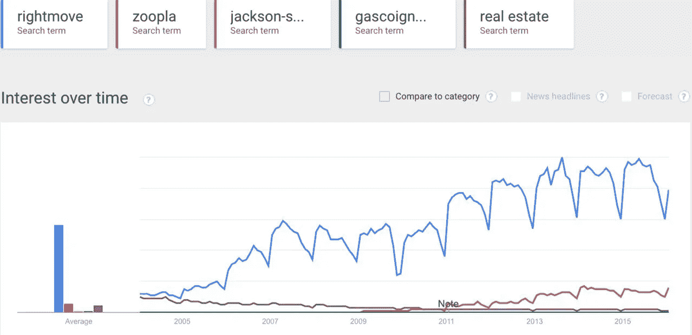
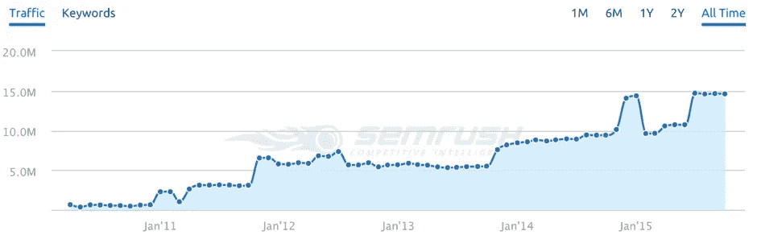
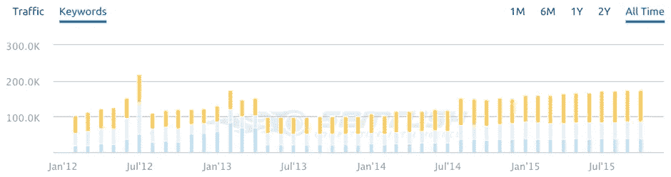
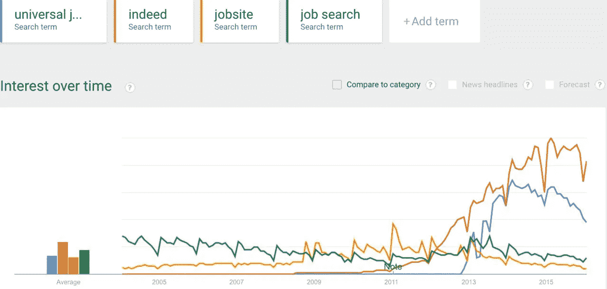
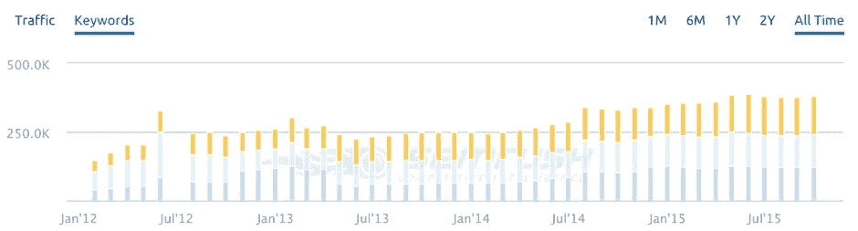
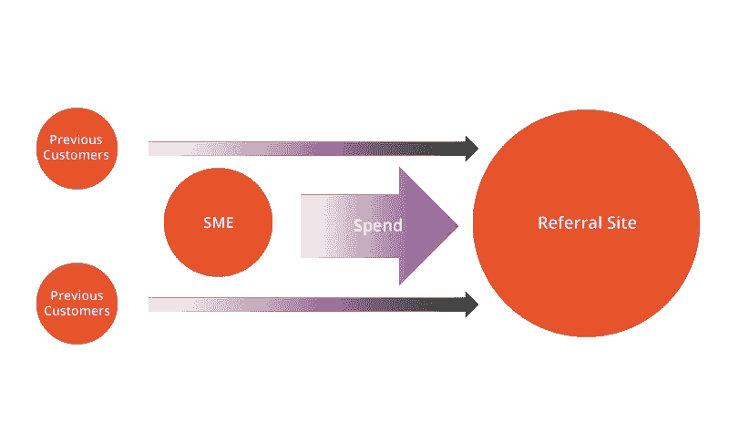
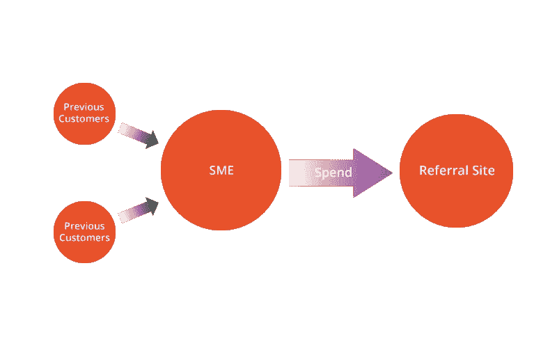

# 从推荐巨头手中夺回市场份额

> 原文：<https://medium.com/swlh/taking-market-share-back-from-referral-giants-9e949284fddd>

Rightmove 最近公布的年度利润数字为 1 . 04 亿美元。事实上，2012 年，它在[以大约 10 亿美元](http://news.sky.com/story/1058393/indeed-tech-start-up-that-broke-the-mould)的价格售出，而《汽车交易商》在 2014 年创造了[2.377 亿美元](http://uk.businessinsider.com/auto-trader-launching-235-billion-ipo-today-2015-3)。

这些公司相当于各自行业的谷歌，是相关领域相关产品的首选网站。但毫无疑问，这些公司也需要谷歌为他们创造大量的流量。

他们还需要从机构和企业那里获得汽车/工作/房子，他们从这些机构和企业那里获得 SERP 房地产，这可能会增强使用他们服务的中小企业的能力。

根据 Google Keyword Planner 的数据，“待售房屋”、“待售房产”和“房地产代理”等术语是房地产行业中表现最好的搜索术语，在英国每月分别有 368，000 次搜索、165，000 次搜索和 90，500 次搜索。

下面我列出了排名前三的域名。有什么突出的吗？

**搜索词——“待售房屋”**

P1。Rightmove.co.uk

P2。Rightmove.co.uk

P3。Zoopla.co.uk

**搜索词—“待售房产”**

P1。Rightmove.co.uk

P2。Rightmove.co.uk

P3。Zoopla.co.uk

**搜索词—“房地产中介”**

P1。Rightmove.co.uk

P2。Jackson-stops.co.uk

P3。Gascoignehalman.co.uk

Rightmove 占据主导地位，如果我们使用这些网站的品牌术语，并在关键字规划器中查找估计的每月搜索量，我们可以看到进一步的证据

杰克逊站—中午 12 点 100 分

加斯科因·哈尔曼—中午 12 点 100 分

动物园——335 万下午

还有…

**右移— 11，100，000pm**

这是一个比行业规模大得多的品牌。它在谷歌中的竞争搜索词和品牌搜索的位置表明它是，这只是他们从搜索巨头那里获得的流量的一部分。这个数字不包括品牌差异和关键字/品牌混合搜索词，这些词给房地产网站带来了有机流量。

让我们看看 Google Trends，看看 Rightmove 在房地产行业的主导地位如何:

如果这还不足以证明你的观点，那么塞姆拉什的预计流量呢？

关键词可见性？

“我用谷歌搜索一下”和“你可以用易贝搜索”是品牌变成动词的两个例子。只有最大的公司进入了公共词汇，但中小企业如何才能停止这种增长并增加自己的直接和有机流量呢？他们如何让自己的品牌令人难忘？

我们知道大品牌主导着谷歌的搜索词， [Rand Fishkin 在这里精彩地解释了这一点](https://www.youtube.com/watch?v=hbKSM6lPgaM)。**所有这些明显的第二十二条军规是，如果没有顾客在上面放置内容，主导品牌就无法存在，而顾客也无法在不牺牲大量营销预算和搜索引擎可见性的情况下，从这些品牌的主导地位中获利。中小企业本质上是在养活比自己大得多的机器，牺牲 SERP 地产和必要的品牌曝光率。**

除了让你知道每个搜索词的搜索结果，以及每个品牌词的估计搜索量，我不会对以下行业进行过多的描述。他们基本上遵循着与房地产行业非常相似的模式，其中一个品牌远远超过其竞争对手。

**搜索词——“待售汽车”(135，000pm)**

P1。auto trader . co . uk-(auto trader-6120000pm)

P2。Parkers.co.uk—(帕克—下午 165，000)

P3。Gumtree.com(冈特里岛——9140000pm)

**搜索词—“汽车估价”(60，500pm)**

P1。Autotrader.co.uk

P2。Parkers.co.uk

P3。Whatcar.com(什么车？— 135，000pm)

AutoTrader 显然在汽车购买行业占据主导地位，但它只能从**用户的**汽车的页面列表和销售中发挥作用。

工作和职业也是如此:

**搜索词——“乔布斯”(301，000pm)**

P1。Jobsite.co.uk(工作现场-165，000pm)

P2。Indeed.co.uk(实际上是 224 万人)

P3。Jobs.ac.uk (jobs.ac.uk —下午 6.05 万)

**搜索词—“求职”(201，000pm)**

P1。Jobsearch.direct.gov.uk(全球工作匹配—183 万人)

P2。Fish4.co.uk(渔业 4 工作岗位——49500pm)

P3。Indeed.co.uk

这个领域有点独特，因为用户会搜索大量的利基、低容量、特定工作术语。以上述为指导，你可以看到，虽然这些网站中的一些远远大于行业中最常见的搜索词之一，但只有真正主宰了这一领域(尽管它们在 P1 的一些非常有竞争力的词中排名不前)。看看他们的关键词可见性，看看他们真正拥有的第一页有多少:

*中小企业问自己的一个好问题是，行业主导品牌是如何统治它们各自的领地的，我们如何才能恢复我们的有机品牌知名度？*

中小企业需要思考他们为什么把营销预算投入到单一品牌中。显然，大型推荐人正在做正确的事情，那就是获得相关列表的相关关注，但随着中小企业付费将其内容列在这些网站上，这给了大型品牌巨大的营销支出，这在它们主导 SERPs 时很普遍。

中小企业没有可供大型跨国公司支配的营销预算。他们负担不起在公交车站张贴海报、通过数字板在伦敦地铁吸引数百万人目光的能力、在《泰晤士报》上刊登整版广告、数百万人付费的广告活动……但他们确实有能力保留从 Indeed、Rightmove 和 Auto Trader 等公司获得的客户。

让我给你举个例子:

简正在网上搜寻一辆汽车。她下意识地接受了所有行业领导者的营销，并决定去看看《汽车交易商》。在谷歌上输入搜索结果，到达 autotrader.co.uk 后，她看到了一辆她喜欢的车。

*点击进入列表并被推荐到汽车经销商网站后，简最终查看了这辆车并当场购买。*

*五年过去了，简已经结婚生子，并决定寻找一辆新车。现在的问题是，她是回到向她购买车辆的汽车经销商那里，还是回到汽车交易商那里，再次经历同样的过程？*

*这取决于两个因素。首先，汽车经销商是否提供了让 Jane 一直关注的优质服务；其次，同样重要的是，汽车经销商是否最大限度地利用了他们在当地的所有营销机会，以保持 Jane 多年来的关注？*

这就是中小企业如何与大型推荐网站竞争，并夺回一些本地化的 SERP 房地产。利用推荐机会增加他们的数据库，通过良好的客户服务留住客户，然后适当地向他们推销，为他们购买新车/房子或获得新工作做好准备。这将从根本上降低成本，因为他们不需要在推荐网站上做广告，因为他们保留了客户，这意味着他们没有回到 Auto Trader，只是让客户登陆其中一个 SMEs 竞争对手的网站并失去他们的客户。

这里有两个模型展示了我的意思:

**糟糕的营销和客户体验**

*在上面的例子中，客户过去使用过职业介绍所(或者这也可能是他们的第一份工作),并通过 Indeed 到达工作列表。中小型企业对有机/营销业务不感兴趣，而是选择支出成本，这意味着他们对长期保留之前获得的客户不感兴趣，这种循环周而复始。*

但是中小企业怎样做才有机会降低推荐巨头的统治地位呢？

**良好的营销和客户体验**

*这个例子说明了当中小企业留住从大型推荐网站获得的客户时会发生什么。支出减少，这阻碍了推荐网站的底线。这是一个非常缓慢的过程(我们谈论的是几年时间，可能是一场在线革命)，因为中小企业必须不断获得推荐，以建立一个合适的数据库，同时逐渐减少支出。但通过保留客户，中小企业正间接地从大企业手中夺走 SERP 地产。如果中小企业不在推荐网站上列出房产/汽车/工作，那么他们就没有内容来填充登陆页面，这意味着他们最终不太可能在这么多搜索项上超过中小企业。*

中小企业是否充分利用了来自这些巨头的推荐流量？鉴于其中一些品牌的增长，目前可能不会。但是，中小企业可以做些什么来确保他们最大限度地利用他们付费的推荐流量呢？

重新营销应该是一个优先事项。AJ Kohn 举了一个很好的例子，他用 StumbleUpon 的内容做了类似的事情。最大化这些大型推荐网站的潜在品牌曝光率是你在当地活动的关键，对那些访问你网站的人进行再营销可能是他们在首次访问后改变主意并联系你或不联系你的区别(注意——right move 最近似乎从马克·扎克伯格的书中吸取了经验，阻止了人们离开网站)。

一个设计良好的网站/销售漏斗将永远帮助你转换。[你是否创建了经过深思熟虑的登录页面，](https://blog.kissmetrics.com/100-conversion-optimization-case-studies/)你的列表页面是否涵盖了你试图销售的实体的所有领域，你是否创建了一个清晰简单的用户旅程？这些都是应该被考虑的事情，让你有时间去长时间点击，证明你在为你的用户提供合适的服务。

电子邮件营销必须是一个优先事项，你可以在客户最初与你联系时从推荐人那里获得他们的电子邮件地址。你的客户从推荐网站来到你身边，因为他们对你卖的东西感兴趣。这可能意味着他们将来也会对你卖的东西感兴趣，所以在你的电子邮件营销工作中始终让他们知道意味着，首先，你的品牌将永远留在他们潜意识中的某个地方，其次，你永远不知道他们什么时候会从你的电子邮件中看到他们想了解更多的房子/工作/汽车。

谷歌我的业务/三包总是会有所帮助，尤其是当客户通过推荐人进入你的网站时。如果他们在过去的推荐中与你有过愉快/成功的交易，当他们将来在谷歌中进行搜索时，如“待售汽车”，他们可能会看到你在 3 包中的品牌排名，并可能基于他们以前的积极体验回到你身边，而不是点击推荐网站，该网站不可避免地直接位于 3 包之下。

请记住推荐网站有多依赖谷歌向他们发送关键词流量。对于中小企业来说，三包是一个轻松的胜利,因为如果你有自己的房子，以便进行本地化搜索，并确保你鼓励用户通过谷歌/Yelp 等对你的业务进行评级。它进一步为您现有的客户群提供了更多积极的支持。

你在社交媒体上的表现和你在现实世界中的客户服务一样好吗？我之前提到过，向推荐给你的客户询问电子邮件地址，同时，在你建立关系的同时，为什么不同时询问社会关系呢？记得与你的客户群互动，在需要的地方给他们建议，并**与他们建立关系**。如果你已经与某个推荐人找到你的客户建立了关系，无论是通过电子邮件(可以是私人的)、社交还是现实世界的互动，那么你就增加了他们不需要再去找推荐巨头的机会。

如果中小企业从本地化营销开始，优质服务往往会带来口碑推荐，并确保他们从数字推荐中留住客户，那么他们将开始追回他们从谷歌失去的东西，谷歌是这个问题开始和可能结束的地方。

谷歌不会帮助小企业，因为像“确实”这样的广告费用可能会很高，这意味着从他们那里获取付费流量份额的成本甚至是不可行的，除非中小企业能够确定它将转换很大比例的流量，这些流量实际上是在寻找 Indeed.co.uk 而不是他们的网站。你可能会说，如果中小企业把钱投给谷歌，而不是某个推荐巨头，那又有什么区别呢？嗯，你是对的，这就是为什么我希望看到中小企业在客户的整个生命周期中，从他们获得的每一次推荐中获得每一分每一毫，而不是在没有长期战略的情况下将钱投入到付费搜索中。

要做到这一点，企业在网上花钱的方式需要一场革命。像 Rightmove 这样的大品牌将用户品牌搜索发展到如此程度，以至于它蚕食了关键字搜索和中小企业 SERPs 中的可用空间。

大品牌正在向谷歌发出正确的品牌信号，这让许多中小企业别无选择，只能付费在这些网站上展示。诚然，推荐巨头将中小企业直接放在目标受众面前，但在谷歌和大型推荐网站重塑用户搜索行为之前，这种情况不也是通过有机关键词搜索发生的吗？

*原载于 2016 年 1 月 19 日*[*【www.venndigital.co.uk】*](https://www.venndigital.co.uk/blog/2016/01/taking-market-share-back-from-referral-giants/)*【安德鲁·阿克森* *。*