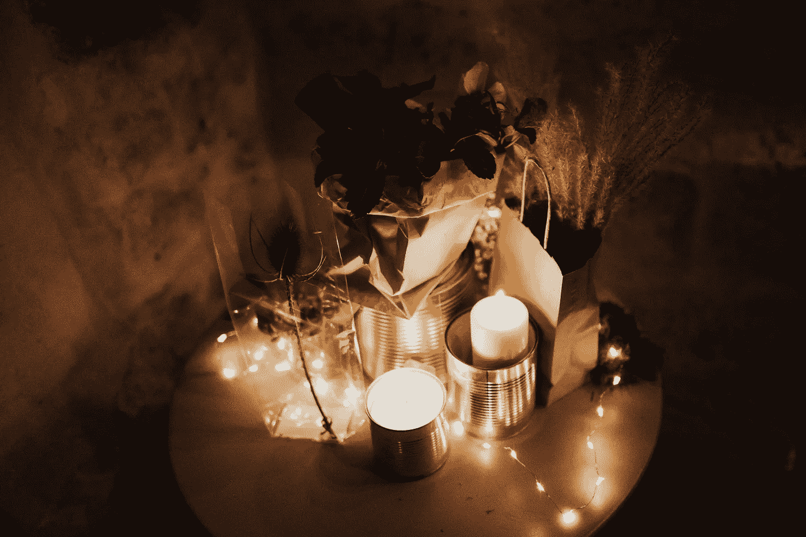
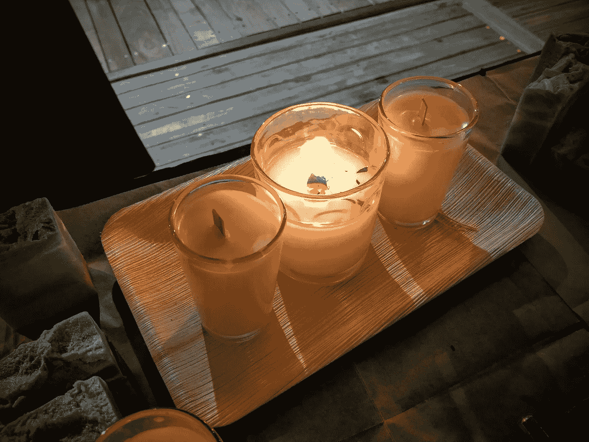

# 在产品设计中利用嗅觉记忆

> 原文：<https://medium.com/swlh/taking-smellfies-olfactory-memory-in-product-design-1e499d1dfadb>

2018 年 1 月，我在 [PechaKucha 耶路撒冷 3.0 做了一个探索嗅觉记忆的简明演示。](https://www.pechakucha.org/faq)如果你错过了，以下是要点:

“Smell is a potent wizard that transports you across thousands of miles and all the years you have lived.” — Helen Keller. Let that sink in.

嗅觉>自拍

*   自拍(或任何以记录记忆为目的的照片)有效地捕捉了特定的事件。然而，在它们的特殊性中，它们也可能产生除了被拍摄的事件之外的所有事情都被削弱的不良影响，就好像周围的记忆，或者那些在之前和之后出现但没有被拍摄的类似记忆，并没有发生。

这些是用你的大脑，通过你的鼻子拍摄的。在你的一生中，你的大脑总是根据气味而不是事件对气味进行分类。因此，每次你闻到肉桂的味道，你就有机会生动地回忆起你和肉桂在一起的每一次生活经历——记忆越早，储存的就越强烈。就像 Google 相册可以通过面部对你的照片进行分组一样，你的嗅觉记忆可以通过气味对你的记忆进行分组。

> 一张平面的照片甚至不能激活一个精心设计的香味的多维体验的一小部分。

然后，观众闻 8 种标有数字的卡片上的不明香味，每种香味持续 40 秒钟，与标有数字的幻灯片相协调(熟悉的香味，如橄榄、雪松和甜豆)，同时让记忆在香味体验中浮现。最后，我建议通过记住呼吸来利用他们的嗅觉回忆，通过呼吸来记住。

一个非常诚实的朋友后来告诉我，有一个大问题没有得到回答:

***我如何将嗅觉记忆的这种意识实际应用到产品设计中？***

我要警告你，这个过程有点过火了。

Image by Photo by [Sweet Ice Cream Photography](https://unsplash.com/photos/i2fORTFkc4w?utm_source=unsplash&utm_medium=referral&utm_content=creditCopyText).

还在吗？太好了！请继续阅读:

# 第一步:找一个值得讲的故事。

在为我的肥皂和蜡烛业务创造产品时，我总是从一个既普遍又独特的故事/经历开始(在我的目标市场内)。在甜橙+丁香蜡烛的例子中，我选择创造一种香味蜡烛，用于 Havdalah 仪式，通过这种仪式，每个星期六晚上，严守秘密的犹太人同时告别他们每周的休息日，迎接下一周的到来。

Havdalah 仪式包括一系列感官上的祝福:一杯酒，一种香味，以及象征性交叉的灯芯组成的燃烧的火焰。我希望香味蜡烛在功能上有资格在仪式上使用(通过交叉灯芯)，并通过特定故事的香味支持整体体验。

# 第二步:找出故事中出现的气味。

我自己对哈弗达拉的记忆包括葡萄酒/葡萄汁的味道，但也包括烟熏熄灭的蜡烛和新鲜迷迭香的味道。在犹太传统的一些溪流中，新鲜的香草被认为是制作仪式“气味”祝福的理想选择，我去过以色列的许多家庭，在 Havdalah 仪式上祝福之前几分钟，主人从他们的花园里采摘刺鼻的迷迭香。我还记得我见过的用于“气味”祝福的干桔皮和干香橼。然后是肉桂棒的记忆，有些很淡，有些很浓，还有带刺的丁香和圆形多香果的小袋。

我按气味形式整理了一份记忆清单:**酒、烟、迷迭香、甜橙、香橼、肉桂、丁香和多香果**。

# 第三步:搜索内存洪流。

这部分是最难讲清楚的，因为它涉及 s [共感](https://en.wikipedia.org/wiki/Synesthesia)，定义为*一种知觉现象，其中一种感官或认知途径的刺激导致第二种感官或认知途径中的自动、无意识体验。*

我组装了以下工具-

*   校准良好的数字秤
*   烧杯
*   8 种香味(葡萄酒、烟、迷迭香、甜橙、香橼、肉桂、丁香和多香果)
*   吸量管
*   一本食谱笔记本和一支铅笔，并排记录重量比和记忆恢复程度
*   一罐磨碎的咖啡来清除混合咖啡之间的气味，就像生姜在寿司体验中的作用一样
*   一种放松和开放的精神状态，在这种状态下，好的和坏的，预期的和意外的记忆会大量涌现

然后，我混合，记录比率，测试气味，并记录记忆泛滥的程度，等级为 1-10。再混合，再重复。

比率就是一切，它永远不会是你所期望的。

原因如下:尽管 Havdalah 主题具有我列出的元素，但它们并没有以相等的比例出现。蛋糕不是用等量的面粉、糖、盐、鸡蛋、油、小苏打和水烘焙而成的。类似地，我在 Havdalah 仪式上的感官体验也不是用等量的迷迭香、烟熏、橙子等烘烤的。

我有一个香水混合的标准来测试其准确性(有些人会称之为其适销性)。那就是-

**这样会不会造成没有操控的记忆泛滥？**

带着清晰和开放的心态，当我闻到这种混合物时，我是否回忆起了我经历的更多细节？

**这些记忆是我的认知头脑强加的，** **还是通过我敞开的心灵唤起的，以回应这种融合？**

## 何时停止混合:

我寻找身体迹象——如果我被香味感动得流泪，这是一个好迹象，表明香味是体验的真实转化。这是因为我一般只在回应真善美的时候才会哭。我还注意到，当精确混合成为焦点时，我的手变得非常冷。所以我停下来(并不像听起来那么容易)，写下最终混合的比例，并在敬畏和感激这种香味诞生的状态下收起我的工具，这种香味在这一刻之前并不存在于这个世界上。

# 第四步:在露天市场测试

这种自传体的产品创造方式回避了这个问题

难道我们都不一样吗？我们不是过着不同的生活吗？谁能说对你说的话会对别人说呢？

这是产品过程中最令人兴奋的部分——发现我的共鸣与他人共鸣的程度。

为了找到答案，我创造了一个体验气味的容器——木芯蜡烛。然后它需要一个名字——一种气味的名字框定了它的体验。

The earliest incarnation of “Sweet Orange & Clove”.

## 命名香味

我了解到这种气味的名字，就像餐馆沙拉的名字一样，应该尽可能简单明了(想一想“黄瓜甜瓜”而不是“高含水量的幸福”)，但要省去那些会混淆概念的不必要的细节。顾客必须愿意拿起测试器，他们更有可能在名为“甜橙+丁香”的测试器上冒险，而不是名为“橙、烟、丁香+香橼”的测试器，即使所有四种味道都在不同程度上存在。

# 甜橙+丁香——结论

香味销售。作为一名配方设计师，我知道顾客会通过主动比较我创造的气味来决定是否购买我的产品，这是对一个故事的创造性解释，也是通过他们的嗅觉回忆来与他们自己的故事进行比较。我了解到，在我的设计过程中，我解决的无偏见的记忆泛滥越多，他们从产品中体验到的相同的东西就越多。他们会把已经是他们生活中最美好经历的一部分的气味带回家，而留下那些不太熟悉的或者他们不想再体验的气味。

我把我们的“甜橙+丁香”案例研究带到露天市场的那天，我看到购物者举起测试蜡烛闻了闻，喘了口气，然后立即与他们的购物伙伴分享从他们的记忆缓存中涌出的新恢复的记忆。

当这种情况持续发生时，直到测试批次销售一空，一位客户问我她是否可以购买测试器，我知道我已经成功地将一个故事转化为气味。

___________

[**肖莎娜**](http://medium.com/@shoshanarubli/latest) 无法在中本聪和葛塔诺·多尼采蒂之间决定。

## 这篇文章发表在《T8 创业》(The Startup)杂志上，这是 Medium 最大的创业刊物，拥有 318，120 多名读者。

## 在这里订阅接收[我们的头条新闻](http://growthsupply.com/the-startup-newsletter/)。

