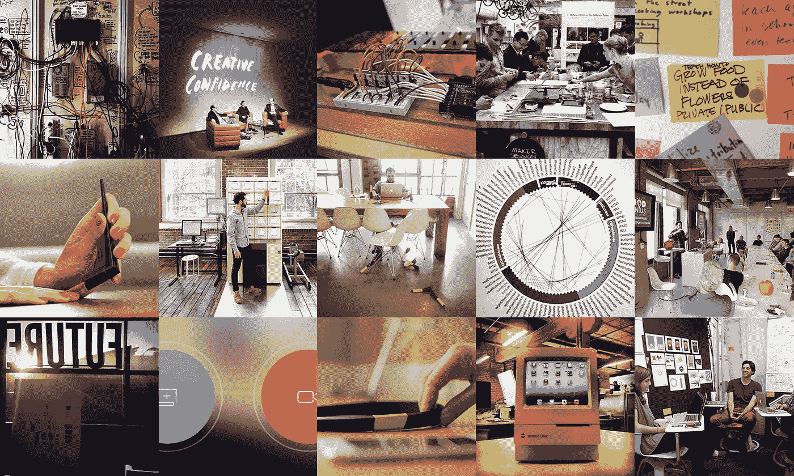
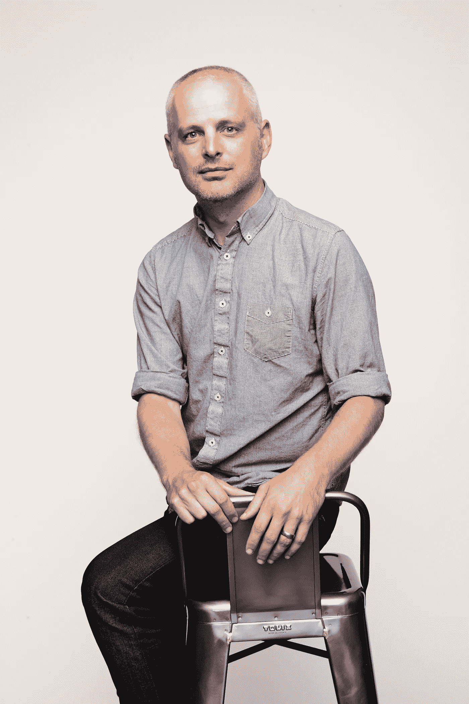
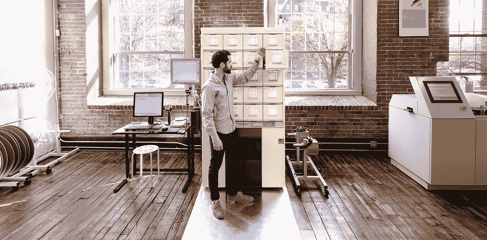

# “少说话。多做。”

> 原文：<https://medium.com/swlh/talk-less-do-more-58193d9b7d73>

## 以及 IDEO Futures 的伊恩·罗伯茨的其他设计课程

Images courtesy of IDEO

如果说历史教会了我们什么的话，那就是单靠武器是无法赢得战争的。只有在你如何使用它们的时候，天平才会倾斜。

在商界，这些武器就是创新和新技术的应用。

***作为我们新播客系列的一部分，*** [***工作室***](http://studio.crew.co) ***，我们与 IDEO Futures 的 Iain Roberts 谈论了区块链，设计思维的未来，并将设计和学术界聚集在一起。这里听完整集:***

想想 Blockbuster 是如何成为网飞采用流媒体技术的受害者并几乎消失的，它曾经是街区街角的主要商品。或者在苹果和三星发布世界上第一批智能手机后，诺基亚在手机行业的主导地位下降得有多快。

一次又一次，不仅仅是了解一种塑造未来的新技术，而是知道如何用这种技术最好地增强用户和客户的能力。

> “在过去一年半的时间里，如果我们知道这个行业变化如此之快，我们本可以采取不同的做法。”—史蒂芬·埃洛普，诺基亚首席执行官

像 IDEO 这样的公司——世界上最大的设计和创新咨询公司之一——有责任预见未来。了解弯道附近有什么，并在进入视野前换挡。

他们知道这一点，因为他们经历过。

早在 2001 年，当最初的互联网 1.0 泡沫破裂，世界各地的公司都在寻找通过利用新技术来留下自己印记的新方法时，他们面临着一个敢为天下先的时刻。

Iain Roberts — credit: IDEO

“我早在 2001 年就加入了 IDEO，当时 IDEO 正处于彻底改造的过程中。在过去的五六年里，我们在新技术的交叉领域建立了自己的品牌:硬件技术，互联网技术。因此，当 2001 年发生时，我们不得不迅速彻底改造我们作为一个组织正在做的事情，”参与 IDEO Futures 的 IDEO 合伙人 Iain Roberts 解释说，他在英国与詹姆斯·戴森合作制造诸如吸尘器和洗衣机等有形产品，开始了他的设计生涯。

“想象一下，当时一家仍被称为 IDEO 产品开发’的公司，以制造实物并开始将它们与互联网 1.0 时代联系起来而闻名。”

然而，面对变化，一个教训——一个观察世界的镜头——帮助 IDEO 保持了他们的路线:永远从人开始。

这意味着使用人类学和人种学的视角，并从人们实际想要的或认为有用和想要的东西中得到启发。

只有到那时，新技术才会从简单的工具变成我们生活中不可或缺的一部分。

虽然这种以人为中心的设计流程自公司 1991 年成立以来就已经成型，但他们应用这些理念的广度已经发生了巨大变化。

# 罗伯茨关于设计未来的教训

在 IDEO，你会发现一群专注于未来的设计师和思想家。他们称之为 IDEO Futures，这是一个由 IDEO 合作伙伴 Diego Rodriguez 领导的精干团队，专注于向前看，连接各个点，并了解设计和技术的未来。然后建造它。

深入研究未来的罗伯茨解释说，他们的设计方法是“在核心层面塑造人类生活和互动方式的一种方式”。

这是一个崇高的宣言，但却正在全世界付诸实践。

Pillpack (startup in residence) — Image courtesy of IDEO

在新加坡，IDEO 经营着一个工作室，帮助政府设计政策，而在美国，他们正在研究数据作为设计媒介的作用。

但是所有这些项目都有两个共同的信念:

1.  **“设计思维”不是一个自上而下的过程:**通过分散或摆脱典型的公司层级，好的想法——或者他们称之为“突发想法”——总是会涌现出来。
2.  **少说话；做得更多:**新出现的想法总是面临挑战，需要聚集合适的资源将想法转化为更多的东西，无论是想法、平台还是技术。因此，正如 Roberts 解释的那样:“每当我们有关于我们实际应该做什么的问题时，我们的答案是构建一个原型，并与用户或客户一起测试它，以了解它是否成功。正是这种想法，每个人在一起都比一群个体聪明。”

将两者结合起来——一种涌现的想法文化和快速的行动——你就会得到罗伯茨所说的“一个有时感觉相当混乱，但能够在如此多的不同战线上前进的有机体”

“因此，IDEO Futures 实际上是一个组织，它帮助 IDEO 看到那些新兴的趋势和模式，确定最重要的趋势和模式，在全球范围内连接这些点，然后将这些东西孵化成公司的新产品。”

# IDEO 如何“设计思维”

那么，罗伯茨认为在不久的将来会改变世界的新兴趋势、模式和技术是什么呢？

# 区块链、比特币和信任的未来

IDEO Futures 如何专注于培养新技术和新兴技术的一个例子是他们与区块链的合作——这是对比特币感兴趣的人最熟悉的技术，但在加密货币之外有着深远的应用。

“当我们想到像区块链这样的技术时，我们在 IDEO 面临的挑战不是过多地考虑这项技术，而是考虑这项技术能够实现什么。因为那些人类的信仰，那些人类的需求，实际上不会随着时间的推移而改变太多。

“因此，如果你想想比特币和区块链是如何在世界上出现的，人们主要关注的是货币兑换和交易。”

> “通过关注人类的需求，它实际上允许我们关注最重要的长期事情。”

“我们实际上提出了一个论点，即这更多的是关于信任、价值和参与。它实际上是分散的网络，人们聚在一起创造信任。进行价值交易。去思考他们建立的关系。

“我们正在探索信任，区块链是我们对未来实现信任的技术的初步假设。但是我们实际上不知道这项技术。这只是一个起点。我们真正在乎的是信任。我们真正关心的是建立牢固的关系。我们真正关心的是价值交易。

“随着区块链今天的发展以及它明天向未来的发展，我们可以对这项技术更加不可知。但通过关注人类的需求，它实际上让我们能够专注于长期最重要的事情。”

# 设计不仅仅是设计师的事:寻找新的合作方式

创造一个共同探索的环境也意味着定义与人才合作的新方式。

为了探索新技术，IDEO 建立了一个新的合作模式，名为 coLABs，由 Joe Gerber 和 Matt Weiss 首创。这个想法是，coLAB 将把对同一领域感兴趣的合作伙伴聚集在一起。

IDEO Futures 和 coLab 与相关的前沿学术机构互动，而不是将 IDEO 设计师聚集在一起，说“这是谁在做这个项目”，这些人来自 MediaLab、HBS、布朗或 RISD 等地，他们有着前沿的见解，但需要一个论坛来探索这些见解。

coLAB — Image courtesy of IDEO

“我们目前有两个 coLABs 正在运行:一个在旧金山，与区块链合作，致力于信任、价值交换和参与，名为 Bits+Blocks；另一个实际上位于剑桥，与麻省理工学院、Target 和其他合作伙伴合作，专注于食品的未来，探索从个人基因组学到数据化食品供应链对我们未来如何与食品互动的意义。

> “这是一种将设计远远带到几乎应用的研发中，并利用设计来塑造服务于人类的技术应用。”

“这些对我来说非常令人兴奋，因为我只能想象这个平台如何进一步扩展。我思考移动的未来。数据在设计中的作用。你几乎可以想象这些实验室是如何出现的，让我们和我们的合作伙伴一起探索未来世界的重要主题。”

“我认为这代表着我们在考虑设计在开发过程中的作用时向前迈出了重要的一步。这是一种将设计远远带到几乎应用的研发中，并利用设计来塑造技术在人类服务中的应用。这种方式对我们的合作伙伴来说非常具有创新性，并且以一种全新的方式挖掘人才。”

世界的未来，不仅仅是设计，在于我们如何与越来越快为我们所用的工具互动。

正如 Iain 和 IDEO Futures 的团队向我们展示的那样，我们需要开阔和开放地思考，将点点滴滴联系起来，保持精益，并建立更多，以确保我们创造的东西对真实的人有意义。

因为最终，好的设计不仅仅是让世界变得美丽。它让世界变得更适合居住。

*这篇文章转录自* [*工作室*](http://studio.crew.co) *的一集——这是一个来自 Crew 的新播客，我们在这里探索当今顶级机构和创意专业人士背后的生活、故事和灵感。* [*在此收听所有剧集*](https://itunes.apple.com/us/podcast/studio-stories-inspiration/id1124584009) *。*