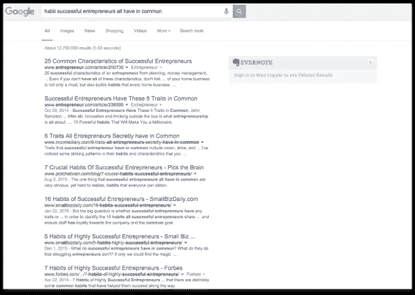

# 失去光泽的子弹:生产力博客如何浪费你的时间

> 原文：<https://medium.com/swlh/tarnished-bullets-how-productivity-blogs-waste-your-time-92f0858bd8af>

看看这个标题，告诉我问题出在哪里:

**“这 50 位成功企业家的 1 个共同习惯”**

Or ANY of these. Seriously Internet. Why the hard-on for Entrepreneur habits?

这篇文章的前提是，大多数成功的企业家都是狂热的读者，他们把阅读列为最重要的习惯之一。

停在那里。从这一点来看，你已经在想什么了？

**“如果我想成为一名成功的企业家，那么我应该多读书。”**

这似乎是显而易见的，对不对？这些成功的企业家都读书，你想成为成功的企业家，所以你也应该读书。

但是，对于任何上过统计学入门课的人来说，问题是显而易见的:**这两件事相关并不意味着一个会导致另一个**。或者，流行的说法是，“相关性并不意味着因果关系。”

你可以用许多不同的方式来解释这个习惯:

*   企业家是好奇的人，好奇的人也喜欢读书
*   他们的导师告诉这些企业家要多读书，所以他们就多读书，即使他们什么也没得到
*   这篇文章的作者想要一个确定的结论，所以他只采访了符合他对结果的想法的人

但是这里有一个更大的问题:当我们阅读这类文章时，我们忘记了这些习惯是对已经成功的生活的改善，而不是它的来源。

例如，以这个标题为例:

**“苹果 CEO 蒂姆·库克每天早上 5 点醒来。下面是为什么"**

你很聪明，也一直在关注，所以你知道相关性并不一定意味着因果关系。但是如果蒂姆·库克在文章中说(不是真正的引用):

> “我知道早起会让我更有效率。我试过在一天的不同时间醒来，当我醒得早的时候，我能完成最多的工作。我的许多高调的朋友也报告了同样的事情。”

看来早起是有好处的。如果你想像蒂姆·库克一样成功，你也应该开始早起。

有道理，对吧？

不，该死的，但是每一个生产力博客都试图用这个来欺骗你。如果你想像蒂姆·库克一样成功，秘诀不是早起，而是努力工作，直到你成为苹果公司的首席执行官。

早起是成功的很小很小的一部分。他能在 7 点而不是 5 点醒来也一样成功吗？很有可能。

这是测试其他人的成功是否值得效仿的简单方法。如果你把它从等式中去掉，他们还会一样成功吗？如果答案通常是“是”，那么这个方面就无关紧要了。

去掉早起:蒂姆·库克依然成功。去掉苹果公司的首席执行官(以及他早期的角色):没那么多。

*“但是 Nat，这些东西帮助他们实现了目标，提高了他们的工作效率！”*

我对此没有异议。我同意阅读、锻炼、睡得好、吃得好都是等式中重要的部分… **但与你用新发现的生产力和创造力所做的事情相比，它们就相形见绌了**。

你可以在最低工资的呼叫中心工作，仍然在早上 5 点醒来，每天锻炼，大量阅读，冥想，做其他一切“生产力”和“成功”博客上谈论的事情。

所有的习惯、生活方式选择、生产力策略，都是在**做重要事情**之上的最后 5%。他们帮助你做最后的改进[从 94 分到 99 分](http://www.nateliason.com/local-maxima/)，**但是如果你一开始就不应该把事情做好，那么做好是没有用的**。

为什么这些博客、文章和书籍会存在呢？因为我们懒。我们真的很懒。

我们不想听到“嗯，你必须选择一项技能，非常擅长，非常努力地工作 20 年，然后你就会成功。”不会在社交媒体上分享。

相反，我们想听到“早上 5 点醒来，你会神奇地变得成功和富有。这里还有一张疲惫的小猫的 gif 图。”

这些是“失去光泽的子弹”他们通过操纵你的心理倾向，从相关性中假设因果关系，或者过分强调不太重要的变量的价值，来欺骗你，让你认为对你的问题或目标有一个快速、简单的解决方案(“银弹”)([聚焦效应](https://en.wikipedia.org/wiki/Focusing_effect)、[琐碎定律](https://en.wikipedia.org/wiki/Parkinson%27s_Law_of_Triviality)、[可疑原因](https://en.wikipedia.org/wiki/Questionable_cause))。

这不是恶意的，他们(希望)甚至没有意识到他们正在这样做。但你现在比他们聪明，你会明白的。

所以帮你自己一个忙。**停止阅读“成功人士的习惯”、“提高生产力的小窍门”和其他垃圾文章。这只会诱使你认为做这些事情会让你“成功”，这会让你无法专注于更重要的事情。**

如果你没有做任何让你兴奋的有价值的事情，那些小的改变都不会有影响。如果你是，那么你的激情会自己推动生产力。

*原载于 2016 年 2 月 2 日*[*www.nateliason.com*](http://www.nateliason.com/tarnished-bullets/)*。*