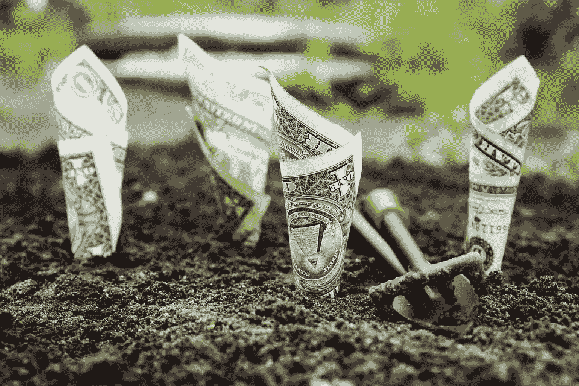
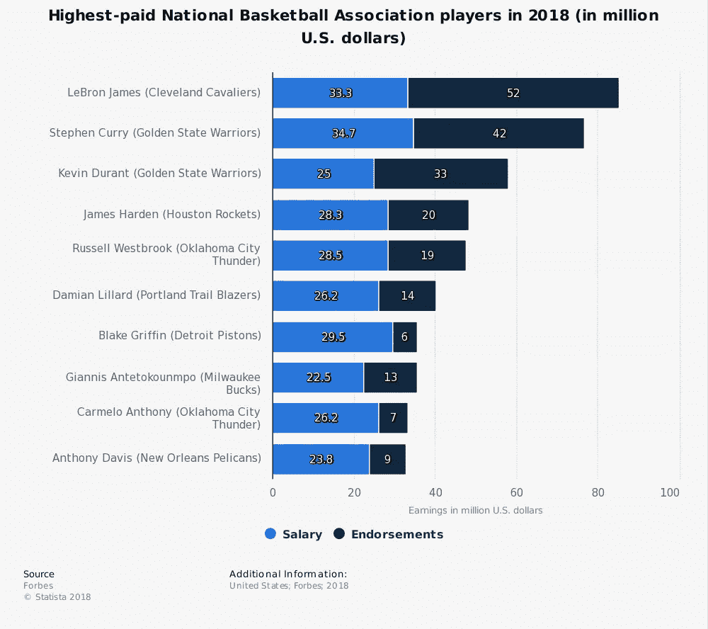
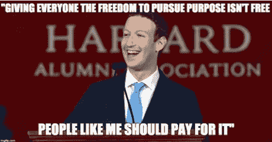

# 普遍基本收入税

> 原文：<https://medium.com/swlh/taxing-for-universal-basic-income-7864f78e7716>

## 使用顶级运动员和演员的案例研究

最近，我了解到“摇滚”德怀恩·约翰逊[向电影公司收取 100 万美元的社交媒体费](http://www.vulture.com/2018/05/the-rock-is-charging-million-dollars-to-promote-his-next-movie-online.html)，在他自己的社交媒体账户上为自己的电影做广告。他为什么不能呢？他在明智地遵守游戏规则。2017 年收入最高的 10 位演员[总共赚了 4.885 亿美元](https://www.forbes.com/sites/natalierobehmed/2017/08/22/full-list-the-worlds-highest-paid-actors-and-actresses-2017/#15c86b537515)。

同样，2018 年收入最高的 10 名 NBA 球员(包括工资和代言)将获得 4.93 亿美元。平均每位球员 4930 万美元。

美国娱乐业与(相对)自由市场的融合产生了大规模的竞价战。无论是球队追求球员，还是电影公司追求演员——这只是两个例子——在这样的市场上交换的巨额资金对大多数美国工薪阶层来说都是不真实的。下面这个标题虽然读起来像洋葱新闻，但却是去年哥伦比亚广播公司播出的:

***报道:勇士队的凯文·杜兰特做出巨大牺牲，同意两年 5300 万美元的合同***

这并不意味着谴责工薪族。富有的运动员和演员是最引人注目的，通常也是最有影响力的慈善家。尽管基金会是绝佳的避税场所——值得称赞的地方，用来存放人们可能不知道该如何处理的钱——但它们也象征着许多高净值个人的良好意愿。

但是，有没有更好的方法从这些巨大的市场中获取社会价值呢？同意 5300 万美元的微薄交易，比他可能要求的最高交易价格低 950 万美元，凯文·杜兰特的生活真的失去了什么？

## 实现普遍基本收入的建议

设定一些合理的大数目，比如 1000 万美元。在任何运动员或演员的第一笔 1000 万美元工资后，我们可以将他们作为最高收入人群支付的税率从 39.6%提高到更高的比例，比如 65%。甚至 80%。

这些市场中的高收入者收入仍将保持不变，最高可达 1000 万美元，在此之后，额外的收入对一个人有多大好处呢？诺贝尔奖获得者丹尼尔·卡内曼发现，在 75，000 美元之后，情绪幸福感不再对更高的收入做出反应。

团队和工作室提供越来越多资金的激励也不会消失。市场结构将基本保持不变，只是在这个例子中，超过 1000 万美元的合同激励会减少。财务以外的激励会增加权重(比如团队文化，或者电影的信息)。

天文数字收入者的天文数字税率并非史无前例(相比之下，65%也不是天文数字)。[60 年代对最高税率征收了臭名昭著的 92%的边际税率。当时，](http://www.slate.com/blogs/moneybox/2017/08/07/the_history_of_tax_rates_for_the_rich.html)[可能有 10，000 个家庭](https://taxfoundation.org/how-many-taxpayers-fall-each-income-tax-bracket/)收入足够高，有资格享受这种“没收性最高税率”。按今天的美元计算，这一合格收入超过了 1000 美元 2M。今天，最高税收等级包括大约 100 万美国人，该群体的起征点为 41.5 万美元。我们——我觉得这很奇怪——50 万美元的纳税人和 5 亿美元的纳税人是一样的。

## 为什么只有运动员和演员？

各州试图通过运动员税来提高运动员的税收。这是一种州税，向外州的球员收取他们在巡回赛中的收入。这种税是沉重的、复杂的、武断的、琐碎的。它首先是由加利福尼亚执行的，1991 年洛杉矶湖人队在总决赛中输给了公牛队。作为报复，他们首次对伊利诺伊州的公牛队征收运动员税。伊利诺伊州进行了反击，只对来自其他州的运动员征收运动员税，而这些州又对伊利诺伊州的运动员征税。税收政策可能不应该从一场痛苦的 NBA 总决赛系列赛中诞生。我们可以制定更好的政策。

为什么运动员和演员会被单独挑选出来，与其他收入相当的美国人相比，受到不同的税收政策？

根据现行法律，如果运动员 X 的收入为 5000 万美元，她将支付 39.6%的统一税率，即 1980 万美元的税收，税后收入为 3020 万美元。如果对 1000 万美元以上的收入征收 70%的边际税率，她现在将支付 3196 万美元的税收，收入约为 1800 万美元。收入 1800 万美元的人比收入 3020 万美元的人差多少？这是个悬而未决的问题。我想听听这些人的想法。这是否是一个好主意还取决于如何处理额外的税收。

人们普遍不信任政府的效率。与其他国家相比，美国人更觉得他们向政府缴纳的每一元税款价值微薄。此外，[丹麦发现](https://www.usnews.com/news/best-countries/articles/2016-01-20/why-danes-happily-pay-high-rates-of-taxes)，**税收越直接改善生活质量，公民愿意支付的税收就越高。这就是为什么丹麦公民乐于支付平均 45%的税率，而高收入者支付更多。**

将这些税率强加给高收入的美国人可能会激起失落感，甚至偷窃。但是税收的概念不仅仅是给政府钱，而是给公众价值；对社会的一种投资，直接购买生活品质。当税收被认为是损失，而不是购买时，这是对税收和政府状况的可悲反映。

## 普遍基本收入

作为一种补救措施，如果从这种对超级富豪征收的假想税中获得的每一美元税收都用于资助普遍基本收入会怎么样？重税的人会觉得他们的钱是在做好事，给社会——尤其是那些境况更差的人——带来切实的价值，而美国政府在很大程度上没有做到这一点吗？

高收入个人可以继续赚钱(如果他们愿意的话)，知道这样做可以提供巨大的社会价值，而不是成立基金会来利用他们的钱(想象一下如果勒布朗·詹姆斯不把他的收入用于慈善事业，他会被指责为贪婪)。创办基金会的个人将出于自主的愿望，将资金集中用于特定的事业，而不是出于财务需要(避税、社会压力)，这将对基金会使命的效率和热情产生奇迹。

目前，仅前 10 名演员和运动员每年就将向 UBI 基金捐赠 5.47 亿美元。这是 20 个人。2010 年，据估计有 2000 人收入超过 1000 万美元。据推断，仅这项税收政策就为 UBI 基金带来了 547 亿**亿**美元的粗略估计，这个估计非常低。仅比尔·盖茨一人每年就将向该基金捐赠 79 亿美元。马克·扎克伯格也在其中，正如他在哈佛毕业典礼上的演讲中所说:

使用的这些数字——1000 万美元和 70%——是任意的。更好的数字可以由受托完成这项任务的小组计算出来。

还有一些细节需要考虑。也许一些上限是必要的，或者是例外，或者是未考虑到的细节。找出细微差别，将公共原则和理念转化为可行的政策，是政府组织的工作。

这只是 UBI 的另一个可能的资金来源，也许可以考虑与 [Scott Santens](https://medium.com/u/751d1915b9fb?source=post_page-----7864f78e7716--------------------------------) 一起列出[包括福利改革、金融交易税、增值税、碳费](/economicsecproj/how-to-reform-welfare-and-taxes-to-provide-every-american-citizen-with-a-basic-income-bc67d3f4c2b8)等。关于普遍基本收入的讨论正在升温，但具体的资助提案却滞后了。将这两者结合在一起可以让辩论变得更有活力，更具可操作性。

## 请阅读这些优秀的书籍，了解更多关于 UBI 的信息:

*   罗格·布雷格曼的 [*现实主义者的乌托邦*](https://amzn.to/2Kbudrl)
*   Guy Standing 的 [*基本收入:豁达指南*](https://amzn.to/2rzGlKZ)

## 如果你同意其中的任何一点，我在[www.MusingMind.org](http://www.MusingMind.org)写了一篇类似的文章，从哲学/意识的角度探索 UBI:

 [## 加缪笔下的西西弗斯会想要基本收入吗？沉思的头脑

### 阿尔贝·加缪发现人类的处境是不可思议的荒谬(当牛津词典授予“后真实”他们…

www.musingmind.org](https://www.musingmind.org/camus-basic-income/) 

## 这个故事发表在 [The Startup](https://medium.com/swlh) 上，这是 Medium 最大的创业刊物，拥有 325，521+人关注。

## 在这里订阅接收[我们的头条新闻](http://growthsupply.com/the-startup-newsletter/)。

