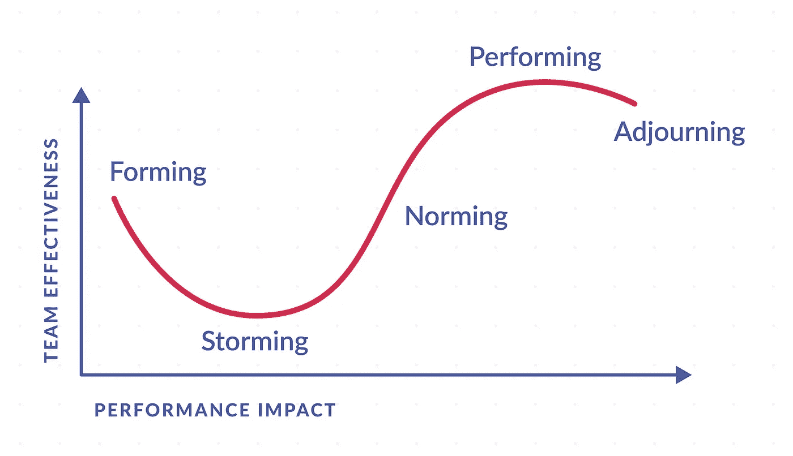
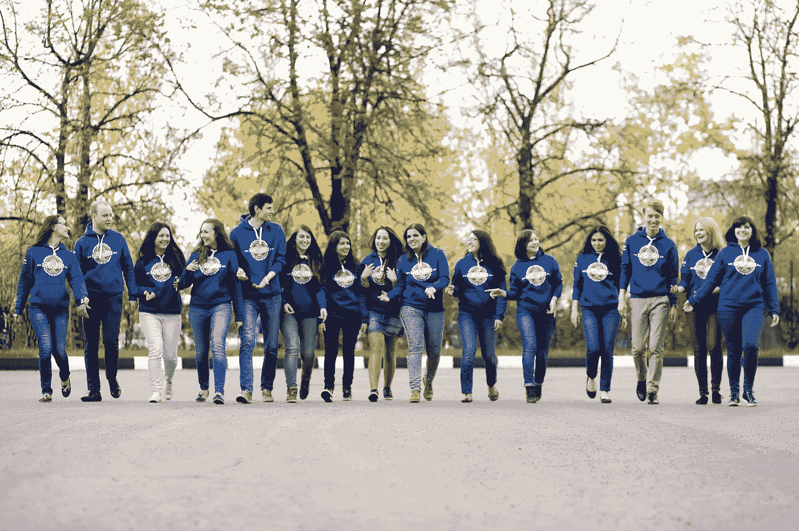

# 每位领导者都应该知道的团队发展的 5 个阶段

> 原文：<https://medium.com/swlh/team-development-stages-51df5606c0a2>

Illustration by Tatiana Shulgina

塔克曼的团队发展阶段模型是团队管理的基础，我相信你们大多数人都知道。但我不想谈团队管理，我想讨论团队领导力。因为我相信，当一个管理者只是简单地分配任务时，一个领导者通过实现项目目标来努力实现他/她的团队成员的潜力。如今，没有人希望被视为一种资源，因此我认为领导力是实现卓越成果的更可行、更健康的方式。而传统模式也应该从这个角度去感知。

> 管理就是把事情做对；领导力就是做正确的事情。
> 
> —彼得·德鲁克

所以，让我们来看看布鲁斯塔克曼的团队发展阶段，以及一个真正的领导者在每个阶段所扮演的角色。

# 关于模型

心理学家布鲁斯·塔克曼(Bruce Tuckman)在他 1965 年的文章《[小群体的发展顺序](http://psycnet.apa.org/journals/bul/63/6/384/)》中首次提出了“形成、冲击、规范和执行”这个短语这是他描述大多数团队在通往高绩效的道路上所遵循的方式。后来，他增加了第五个阶段，“休会”(有时被称为“哀悼”)。

Stages of team development by Bruce Tuckman

让我们详细了解每个阶段，看看领导者需要参与哪些工作。

# 形成

在这个阶段，大多数团队成员通常是积极和礼貌的。有些人焦虑是因为他们处在不确定的环境中，周围都是陌生人。有时对项目的内容没有清晰的理解。

这个阶段会持续一段时间，因为人们开始一起工作，开始了解彼此和他们的责任。

**领导者的角色:**作为领导者，你在这个阶段起主导作用，因为团队成员的角色和职责不明确。我建议与所有团队成员进行个人谈话，了解他们在项目中的个人目标和兴趣，这是未来领导者的重要信息。

# 非常精彩的

一段时间后，团队进入了攻坚阶段。团队成员开始挑战在形成阶段建立的界限。在这个很多团队失败的阶段。

风暴是任何团队经历中不可分割的一部分。如果团队成员的自然工作方式有冲突，通常就会开始。每个人都有自己的工作方法，团队的成功取决于适当的沟通和妥协的意愿。然而，如果不同的工作方式导致了不可预见的问题，他们可能会变得沮丧。领导者必须感受到团队中的这种消极趋势，并有效地管理冲突。

暴风雨也可能发生在其他情况下。在这个阶段，他们更加了解彼此，以及他们的责任。他们可能会感到欺骗性的过度自信，因此挑战你的权威或争夺职位。或者，如果你没有清楚地定义团队将如何工作，人们可能会被他们的工作量压垮，或者他们可能会对你使用的方法感到不舒服。

有些人可能会质疑团队的目标，并因此拒绝接受任务。

如果没有其他既定流程的支持，一直努力工作的团队成员可能会承受更大的压力。

领导的角色:减少团队内部的紧张，管理冲突，坚持团队目标，以身作则。如果事情变得更糟，而且经常发生冲突，组织一次反馈会议或有外部主持人参加的热椅子练习。

这个阶段需要领导者最大限度的关注和参与。

# 规范化

渐渐地，团队进入正常化阶段。你的团队成员理解你在项目中的角色，并开始尊重你作为领导者的权威。他们学会如何处理分歧，欣赏同事的长处。

现在你的团队成员彼此更加了解了，他们可能开始一起社交，甚至寻求帮助或提供建设性的反馈。团队成员对团队目标有了更坚定的承诺，第一个结果出现了。

应该警告领导者，强攻和规范之间的长时间重叠是很平常的事情，因为新的困难任务可能会使团队从强攻阶段退回到行为阶段。

**领导者的角色:**用最初的成果激励团队成员，向他们展示你走在正确的道路上，鼓励他们走向表演的舞台。这是巨大的营养动机显示第一个结果。人们明白痛苦的风暴阶段并没有白费，开始更加珍惜彼此和这个项目。

# 受过训练会玩把戏的

在正常阶段，团队工作得很好，当努力工作是王道时，你到达了表演阶段，你很快就朝着团队的目标前进。您设置的流程很好地支持了这一点。

这是最大效率和生产力的阶段，每个人都喜欢一起工作，并看到朝着目标的进展。

**领导者的角色:**作为领导者，你可以将大部分工作委派出去，并可以集中精力培养团队成员。这是您提高人才发展、指导和教练技能的时机，因为您的团队管理所有工作流程，而无需您的直接参与。

这多酷啊——知道团队中每个人的能力并完全依赖团队。对于团队领导来说，看到团队像时钟一样运行是如此令人惊讶。

# 中止

很多团队最终都会达到这个阶段。例如，一些团队只为一个项目而存在，甚至可能通过组织重组重新分配永久团队。

害怕改变的团队成员，或者已经和同事成为亲密朋友的团队成员，可能会发现这个阶段很困难，因为他们的未来现在看起来不确定。

**领导者的角色:**促进价值观重塑和经验反思。此外，团队领导的工作是建议如何在项目结束后与其他团队成员保持联系。你们一起工作的紧张经历是一个很好的结合工具，所以如果你们后来成为好朋友也就不足为奇了。我仍然和我以前的队友保持联系，我们互相关心，经常聊天，尽管我们已经完成这个项目 3 年多了。

Me (a girl with red hair) and the greatest team ever

# 而不是结论

结束这篇文章，我想说一个领导者的主要任务是尽可能地缩短风暴阶段和延长执行阶段。这是高团队绩效的关键。

有没有人作为团队领导经历过这些阶段？或者作为团队成员。在评论中分享你最大化团队绩效的生活窍门。

*作为国际会议的发言人，Marina Paych 分享了她在领导力、组织发展和营销方面的经验。你可以在* [*阅读她的其他文章她的中简介*](/@marina.paych) *或者* [*加入她的免费邮件列表*](https://upscri.be/a2bfdb/) *。*

## 这个故事发表在 [The Startup](https://medium.com/swlh) 上，这是 Medium 最大的企业家出版物，拥有 313，216+人。

## 在这里订阅接收[我们的头条新闻](http://growthsupply.com/the-startup-newsletter/)。

