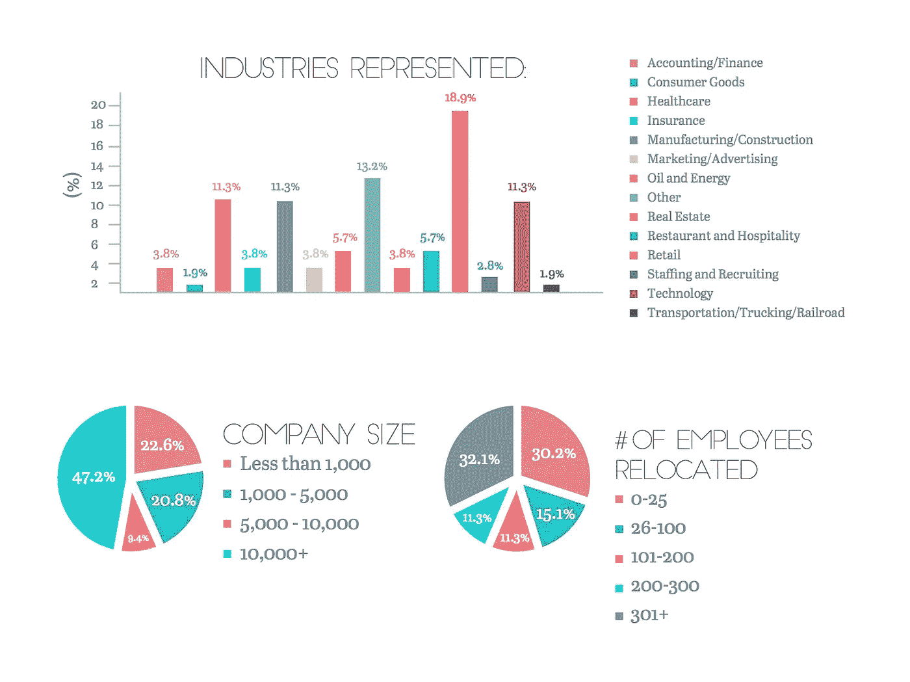

# 团队重新定位最佳实践

> 原文：<https://medium.com/swlh/team-relocation-best-practices-31659803be7f>

# 规划和实施成功的团队迁移

根据[年度调动调查](https://www.atlasvanlines.com/corporate-relocation/survey)，全球化和人才争夺战仍然是过去 10 年人力资源领域的主要趋势，导致全球流动项目的增加。

根据[员工安置状况报告](http://simplemovinglabor-1765654.hs-sites.com/state-of-reloca?__hstc=250923481.9f4cb9526ec2f4d1363aa1e67cd5bd4c.1534249172173.1539162218444.1539170659342.49&__hssc=250923481.2.1539170659342&__hsfp=3660033195)，在所有行业中，利用全球流动计划的公司数量都在上升。

有几个常见的原因导致公司重新思考他们的人才管理方法:

**1。缺乏在当地市场具有相关专业经验的候选人。**公司努力确保拥有必要技能的合适的人在合适的地方。如果一名员工在当地办公室被证明是一名优秀的经理，公司可以让他参与解决其他办公室的问题。

在某些情况下，需要吸引具有独特经验的专家，而这些专家在当地市场[很难招聘到](https://youteam.io/blog/where-can-i-find-offshore-development-team-overview-of-countries/?__hstc=250923481.9f4cb9526ec2f4d1363aa1e67cd5bd4c.1534249172173.1539162218444.1539170659342.49&__hssc=250923481.2.1539170659342&__hsfp=3660033195)。例如，熟悉特定生产技术的专家。在这种情况下，需要从外部人力资源市场调动员工。

**2。需要提供令人兴奋的职业发展机会并留住最优秀的人才**，这些人才已经在公司达到一定的职业水平，并在该地区或国家拥有公认的成就记录。在这种情况下，重新安置是一个额外的激励工具。

**3。培养具有国际经验的领导者的需要。**公司可以为未来的员工提供在另一个国家生活和工作的机会，这样他们可以扩展自己的知识和视野，并建立全球联系网络。

**5。公司扩张努力和成长。**随着公司在地区、国家或国际范围内的扩张，对人才的需求也在不断增加，新分支机构通常会向员工提供特殊条件的职位，以激励他们调动工作。

人才流动已经从一般的技能转移演变为旨在满足各种业务和人力资源需求的各种复杂方法。一些最常见的人才流动策略是:

*   短期项目，通常从几个月到一年，允许员工在不同的地点和分支机构分享知识和经验。
*   **基于项目的任务**，员工临时调动或经常出差去完成一个特定的项目。
*   **针对高潜力员工的职业发展的轮岗计划**。
*   **虚拟移动性**允许来自不同地点的员工进行虚拟协作。

# 搬迁的利弊

全球流动计划的主要**优势**之一是最有效地*利用知识**【1】*和需求领域高素质人才的潜力*另一个优势是将年轻员工重新安置为培训未来领导者**【2】*和扩大组织人才库的机会。

在从外部人力资源市场调动员工的情况下，优势是员工更早获得的*国际经验(3)* ，以及他能够为公司带来的*新的途径、实践、方法**【4】*。

谈到**的缺点**，公司领导在管理搬迁时应该记住几个关键问题。首先，搬迁项目总是非常耗费成本。从差旅费到法律支持，再到各种员工激励和搬迁福利，雇主要负责支付大量的费用。在某些情况下，员工可能还希望获得加薪、额外的带薪休假、持续的搬迁援助。在将员工从低成本地区转移到高成本地区时，公司面临着尤其严峻的挑战。

第二个挑战与许多法律问题有关，比如合同、签证、税收政策。通常，公司会为新员工提供专家顾问来帮助他们应对各种不同的挑战。

# 调动员工时从哪里开始？循序渐进的指南

搬迁是一个复杂的过程，需要有效的搬迁实践和政策以及有竞争力的搬迁方案。员工调动政策对招聘和公司的人才管理计划至关重要，其设计应符合长期业务增长和招聘目标。

根据公司的预算、资源和业务目标，全面的搬迁计划可能会有所不同，但它应该包括以下特征。

**1。写搬迁协议。**确保雇佣合同包含流动条款，并规定雇主搬迁政策的所有细节。

**2。创建搬迁优惠。**一致的搬迁报价必须包括重要条款，如*合同期限*，公司将支付哪些*搬迁费用*，将提供的*资源*和*支持*，员工必须前往新地点的*距离*，搬迁所需的*时间*。重要的是，该提议要考虑到雇员的个人情况和需要，例如他们的家庭状况。

**3。提供搬迁套餐。公司激励员工搬迁的一个潜在方法是考虑提供搬迁套餐和补偿。补偿可以采取一次性付款的形式，以支付额外的旅行费用或支付所有搬家费用。**

在搬迁套餐方面没有神奇的公式，但应该涵盖与搬迁相关的最低要素和费用，例如找房子、临时生活费用和家用物品运输费用的报销。

**4。布置外壳**。住房是搬迁过程中的一个重要方面，确保员工在新地点找到方便的临时和长期住房时得到支持是很重要的。住房细节通常会与每个员工单独讨论，并包含在搬迁方案中。

**5。提供文化资源**。雇主应该简化文化适应的过程，并帮助员工处理新国家的细微差别。提供语言课程，在新的办公地点提供一名导师，帮助为员工的孩子确定最好的学校系统是值得一提的一些行动。

# 搬迁包中应该包括什么？

搬迁方案旨在为员工在新城市的新职位提供最强有力的开端。在某些情况下，公司选择支付搬家的全部费用，而在其他情况下，公司提供固定金额来支付费用。每家公司通常根据其既定政策和与员工的个人协议制定自己的搬迁方案。

通常，重新定位包应包括以下部分或全部内容:

*   **找房子。寻找、购买或租赁新房的相关费用通常包含在搬迁费用中。**
*   **交通报销**。公司通常会报销所有与搬迁到新地点相关的差旅费，包括机票或火车票、出租车费等。
*   **临时住房**。通常会提供一段时间的旅馆或临时住房的费用。
*   **为员工的配偶或伴侣提供求职帮助**。
*   **其他搬家费用。**运输卡车、包装和拆包服务以及其他相关费用可能包含在包裹中。

对于接受新机会的员工来说，搬迁可能是一次令人兴奋的经历。如果公司没有完全准备好，这也是一个潜在的压力和昂贵的过程。

# 内部与外包搬迁

有两种常见的重定位管理方法。第一种方法意味着所有的流程都由公司内部的人力资源部门管理，这允许从头到尾控制所有的流程。但重要的是要注意，全球搬迁涉及许多物流、税收和法律方面的考虑，有时需要外部专业知识。

第二种选择是将搬迁管理外包给搬迁公司。今天，有一些全方位服务的搬迁管理公司(RMC)将帮助管理整个搬迁过程。

外包全球搬迁的一些好处包括:

*   与 RMC 合作的一个关键因素是获得他们的**专业技能和关于搬迁税和法律要求的知识**。由于移民法和税收政策极其复杂，而且因国而异，因此尽可能正确地处理这些问题非常重要。
*   RMC 合作伙伴**能够接触到当前的行业最佳实践**，并能够根据预算、人才需求和公司文化为贵公司的搬迁政策提供建议和审核。
*   RMC 通常有一个合格的服务合作伙伴网络，如房地产代理和全球目的地服务提供商，并帮助处理所有的供应商管理流程。RMC 通常还负责处理各种服务问题、索赔和纠纷，确保员工的整体良好体验。

如果您的公司准备外包移动管理的所有或部分方面，有各种类型的服务和提供商可以与之合作-从管理所有迁移流程的迁移机构到促进签证和工作许可的律师，再到持续监控所有后勤和成本的顾问。

# 听起来太复杂了？成立一个离岸团队

还有另一种选择，被许多全球性公司使用，如谷歌、易贝、微软、Buzzfeed、英特尔等等。与一个专门的离岸开发团队一起工作保证了你所有的任务和过程都在控制之下，同时所有的成本都得到优化。最简单的方法之一是与像 [YouTeam](https://youteam.io/?__hstc=250923481.9f4cb9526ec2f4d1363aa1e67cd5bd4c.1534249172173.1539162218444.1539170659342.49&__hssc=250923481.2.1539170659342&__hsfp=3660033195) 这样的双边平台合作，这是一个建立和管理离岸开发中心的一站式服务。最重要的是，所有的工资、办公空间、假期、法律、培训和所有其他管理都由公司处理，让你专注于公司的主要目标。

# 包扎

如今，移动性不仅仅是将员工重新安置到新的市场。它正在根据公司的业务和人才管理目标制定长期的流动计划和战略。

从建立搬迁战略到管理众多后勤方面，确保你的公司准备好将其团队搬迁到海外并尽可能使这一过程没有压力是很重要的。

## 这篇文章发表在[《创业](https://medium.com/swlh)》上，这是 Medium 最大的创业刊物，有+ 377，008 人关注。

## 订阅接收[我们的头条新闻](http://growthsupply.com/the-startup-newsletter/)。

