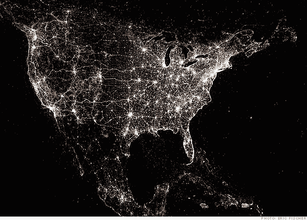
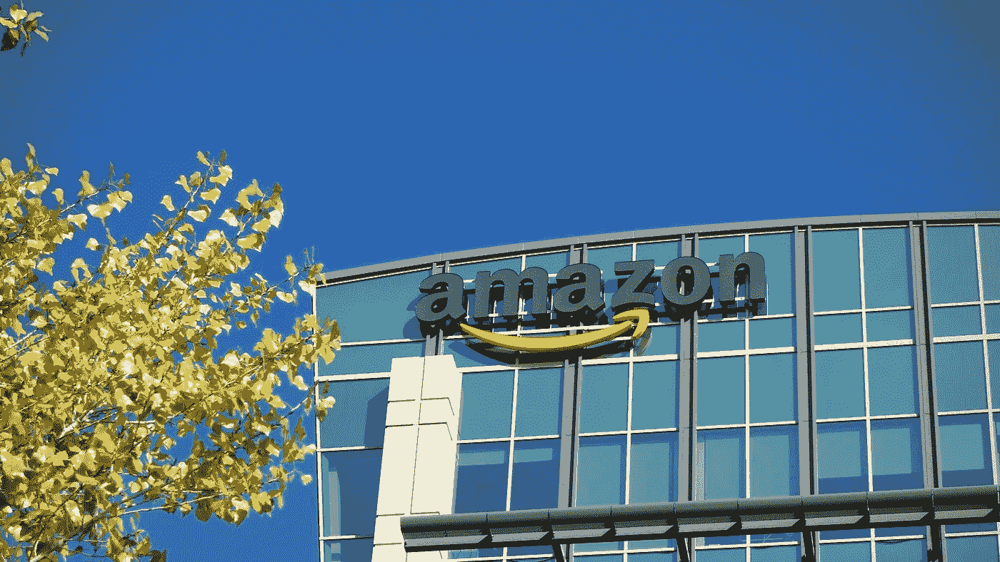

# 技术和经济可持续性:朋友还是敌人？

> 原文：<https://medium.com/swlh/technology-and-economic-sustainability-friends-or-enemies-c12a79a702ec>

技术是一种奇妙的增强。它给我们带来了如此多的东西，并以前几代人从未想过的方式让我们的生活变得更加便利。

技术帮助创办了企业，培养了许多企业家，并让我们真正缩短了购物(如亚马逊)、搜索和研究(如谷歌)等领域的时间，以及金融交易(想想移动银行应用程序)等方面的时间，并通过使用便携式电脑(如苹果和他们的 iPhones)变得更加互联(如脸书)。

技术的爆炸，尤其是苹果公司(Apple Inc .)的 iPhone 在过去十年里的发布，令人瞩目。每个行业都有一个应用程序来解决日常问题，从这些应用程序中，新的和创新的公司正在萌芽，让一切触手可及。

作为一名拥有经济学学位的金融专业人士(本质上也是个经济学呆子)，科技让我焦虑。

原因如下。

# 人口统计数据

不幸的是，一年多过去了，我们仍在消化 2016 年美国总统大选的惊人结果。两个头条新闻立即在这里发挥作用。

***头号标题:人口统计数据*** 以及科技领域的主要基地。不管政治家们是否承认这一点，美国的经济运行在海岸上。

在西部地区，从个人投资者到风险投资公司的金融资本、战略资源、人口密度和大公司都以圣地亚哥为基地，沿着海岸一直延伸到西雅图。

在东部——迈阿密和所有沿海城市到纽约市、华盛顿特区和波士顿。

但是美国的其他地方呢？

当然，中西部和中部时区的一些主要城市是经济的重要参与者，比如芝加哥、达拉斯和休斯顿。但在很大程度上，金融资源(别忘了港口，当然是为了国际贸易)在沿海。

科技公司一直将他们的印记集中在沿海地区，并把总部建在那里，原因很明显，也很容易理解:

> 主要大都市地区→更大的客户群→更多的产品测试样本→更大的规模潜力→更大的覆盖范围→更大的底线。

Source: CNN Money. Tweeter clusters across the United States.

上面这张来自 CNN Money 的地图，提供了一个朝向技术中心和人口中心的视觉图像，每个海岸都被照亮，说明了密度和公司集中资源的地方。

美国中部的黑暗是经济形势令人担忧的地方，也是许多错误信息和敌意的来源，这些信息和敌意在 2016 年美国总统大选中得到了充分展示。

# 经济学

***第二个标题:经济学。许多经济报道和媒体都在讨论这个科技飞速发展的时代的一个现实问题。***

根据劳工统计局最近的数据，失业率为 4.1%——经济学家称之为“充分就业”。这是 20 世纪 90 年代克林顿政府的成就圣杯，也是每一届政府努力追求的目标。

在许多情况下，4%的失业率是为成功欢呼的理由，但是*这个* 4%不同于*20 世纪 90 年代 4%的充分就业率*。

2017 年有多少职位空缺，企业都难以填补这些空缺职位，这表明了美国劳动力中的主要技能鸿沟。

另一方面，最近的调查表明，工人们在寻找其他职业机会方面存在问题，这提出了一个实际上正在发生的问题:技术鸿沟是技能鸿沟的必然结果。

# 发烧和思考

要真正解决和弥合这个国家的技能和技术鸿沟，真正对美国人民诚实，还需要付出更多的努力。

这需要从硅谷说起。

大量工作岗位消失的真正原因是什么？不是移民。我们需要阻止政客们的谎言，但是快速的技术进步可能会让人们的感觉变得更糟。

机器学习和人工智能(A.I .)不是一种趋势，但确实关系到许多员工。各种组织正在大力投资于人工智能，这种人工智能可以在更大的规模上更快地执行操作，不幸的是，它将成为人类劳动力的廉价替代品。

亚马逊、脸书、谷歌和苹果等科技巨头需要明白，科技不可能是一场沿海运动，而是一场美国运动。目前，美国中部在字面上和象征上都被蒙在鼓里。

这导致了很多敌意、恐惧、傲慢和沮丧，为什么这个国家会以现在的方式发展，为什么会有被误导的圣歌引用:

把这个国家夺回来！

# 观点

Source: Los Angeles Times, 2017.

这就是为什么亚马逊寻找第二个总部(被称为#HQ2)引起了如此令人难以置信的兴趣，该中心有可能雇用 5 万名员工，该公司计划投资 50 亿美元建造他们的第二个家。

就我个人而言，作为一名经济学学生，我希望并坚信美国中部/中西部城市(除了芝加哥)是最终的受益者。

亚马逊的决定可能会立即推动另一个不太知名的城市成为另一个技术中心。

我们可以真正开始弥合技术和技能鸿沟，并进一步解决员工流失的根源，让员工为 21 世纪的职业生涯做好准备。

为什么我重申:

**技术不能成为沿海运动，而必须成为全民运动**

*PS。如果亚马逊决定将加拿大的一个城市作为他们的第二故乡，正如一些城市已经提到的那样，那么这篇文章并没有被否定——但仍然希望成为该行业在北美大陆中部投资更多的通知。*

## 这篇文章发表在[《创业](https://medium.com/swlh)》上，这是 Medium 最大的创业刊物，拥有 277，994+读者。

## 在这里订阅接收[我们的头条新闻](http://growthsupply.com/the-startup-newsletter/)。

