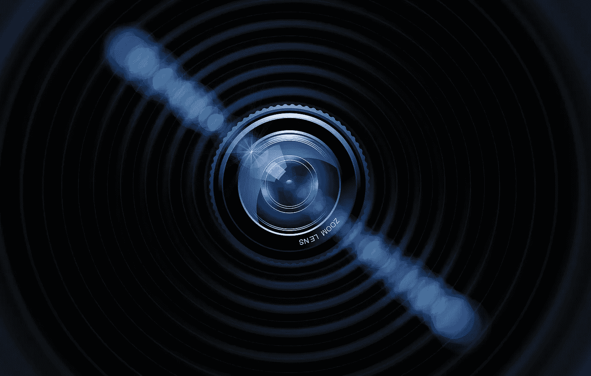

# 技术控制着我们的生活，但这有未来的好处吗？

> 原文：<https://medium.com/swlh/technology-controls-our-lives-but-is-there-a-future-upside-to-this-dea356d79d66>

> 我想先说，虽然从“技术发展太快”的角度来看，这有点有争议，但我并不完全支持这些可能性，只是探索事情按照我们希望的方式发展的想法。

“我们太沉迷于我们的手机了”是一个经常被抛出的话题，在很大程度上，大多数人都会同意。然而，随着技术的发展和越来越多地融入我们的生活，参与可能不是成瘾的补充。

我对这种不同观点的许多探索来自于对埃隆·马斯克的[乔·罗根播客的采访，如果你还没看过，我强烈推荐。](https://www.youtube.com/watch?v=ycPr5-27vSI)

# 不断发展的技术

乔·罗根与埃隆·马斯克讨论的话题之一是不断发展的技术，以及每个人如何为互联网数据库做出贡献，这实质上是建立了一些人害怕的科技巨头。

这个科技巨头，无论是人工智能还是其他东西，它都会吸收我们投入的一切，并且一直在投入。

您可能已经注意到，这在我们的一些设备中非常明显。一个例子是，当我走进一家油炸食品杂货店时，我收到一条来自我手机的通知，上面写着，“我们需要人类的帮助，请告诉我们油炸食品店里的 X。”

我们每天都在重复地走出去，收集现实世界中的数据，并将其放在互联网上，以供持有或最终用作数据。

这可能是一个可怕的概念，我们正在为此做出如此多的贡献，但埃隆的话让我反思为什么我会如此频繁地使用手机。

# 我们是电子人

埃隆·马斯克说，在未来，我们的大脑中会有神经链路与这个数据超级巨人相连。

他说，随着技术成为我们的一部分，我们将能够称自己为电子人。

我们正在为这个不断增长的数据库做出贡献，最终，我们将比以往任何时候都更紧密地与它联系在一起。

但这给了一个具体的想法，关键词是“比以往任何时候都更接近”。

我们已经是电子人了，只是这个数据库的链接还没有在我们的脑袋里，而是在我们的手里。

我们连接到互联网和它所提供的一切，但我们的上传和下载受到手指和 wifi 连接的限制。

手里拿着手机，用它来做我们需要做的任何事情，我们想要查找的任何信息，我们都受到必须进行手动和物理输入的限制。

如果我们可以看着我们的手机，用我们的思维在搜索栏中输入我们想要寻找的东西，而不是把它打出来，这基本上是与它连接的唯一区别。

或者，如果我们能够方便地摆脱必须通过用户界面来找到我们想要启动的应用程序，而是想着启动它并立即获得访问权限。

我们是机器人与数据库连接的缓冲器。我们已经有了所有可能要求的权限。我们可以通过手机和设备与世界各地的任何人交流，并通过整个公共互联网查找我们需要的任何微小的特定信息。

# 这怎么可能没那么糟糕

现在你可能会说，更可怕的是，这已经发生了。

在某种程度上，这可能是可怕的，但为了充分利用可能的坏情况，我们已经创造了什么，虽然它可以被包含，希望是永远的，我们可以看到这种转变变得令人惊讶。

有些人可能害怕改变，但是如果这种改变已经发生了，为什么不让它对我们更方便呢？

我们完全可以接触到任何东西，因为我们的设备本身就是疯狂的。我们已经做出了一些惊人的东西，使用技术摆脱缓冲似乎不是太激烈的变化。

至于回答“这一切有负面影响吗？”我们可能无法确定这一点，即使如此，变化也不会像我们想象的那么大。

我们已经建立了更紧密的联系，我们将继续看到改进，其中一些我们可以访问，但还没有完善，所以我们还没有使用它们。

这方面的一个例子是谷歌眼镜。在旧电影和电视节目中，谷歌眼镜几乎被预测为一种未来技术，我们现在拥有它，只是还不完善。

埃隆·马斯克确实谈到了一个可能的负面影响，如果这是真的，那将是一个巨大的负面影响。我承认，这就是为什么整个事情，虽然仍然很酷，但可能有点太多的原因。就像我之前说的，我只是在幻想未来，如果结果如我们所愿，那并不意味着我不认为任何不好的事情会发生*。*

*埃隆说，随着我们所有人都可以接触到所有这些，即使我们现在也可以，随着大脑中有它的便利和更好的访问，人们会失去独特性吗？*

*是否每个人都知道互联网上的一切，或者至少有机会让每个人都成为他们想成为的专家？*

*以后，该领域的专家的职业生涯是否会仅限于他们的创造性元素，而这些创造性元素仍有可能通过这种数据库访问来学习？*

*这是一件可怕的事情，但尽管我们对此感到害怕，但这是我们前进的方向，看看我们现在利用互联网的程度，如果这是一些人所谓的*太晚了*，那么思考一下它的可能性。*

*如果我们已经是半机械人了，这不会让你感到害怕，这可以被认为是一种更快连接的本质升级，对我们的设备的限制更少，我们都知道，虽然我们可能想放弃它们，但在今天的社会中，它们已经从必要变为必要。*

**

## *这篇文章发表在 [The Startup](https://medium.com/swlh) 上，这是 Medium 最大的创业刊物，有+391，714 人关注。*

## *订阅接收[我们的头条新闻](http://growthsupply.com/the-startup-newsletter/)。*

**