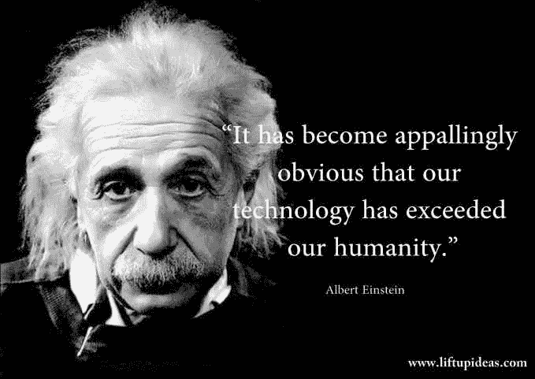
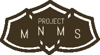

# 技术正在毁灭人类。

> 原文：<https://medium.com/swlh/technology-is-ruining-humanity-821696fa5a84>

Quote From Albert Einstein

点击这里进入[MNMS 项目](http://www.projectmnms.org)！

点击此处访问[社交媒体健康与安全请愿](https://www.change.org/p/facebook-create-health-safety-conventions-in-the-development-of-interactive-social-applications)！

我的名字是[里沙布·辛格](http://therishabhsingh.com)。我是一名 16 岁的高中生。我的兴趣是计算机科学和人工智能。我也是 MNMS **项目 [**的创建者。**然而，作为一名 11 年的学生和 16 年的技术狂热使用者，我想从新千年成长起来的第一代成员的角度与你分享对技术的看法。](http://www.projectmnms.org)**

没错。你猜对了。没有一种媒介会上钩。没有那些欺骗性诱惑的言辞。朴素简单。**科技正在毁灭人性**。

注意。我没有说技术正在毁灭我们的世界。事实上，技术已经让我们的世界工业化并发展到无法想象的极限。我也没有说技术正在毁灭我们的生活，事实是在过去的 200 年里，技术已经使我们的寿命增加了一倍甚至两倍。我反而说，*“技术正在毁掉* ***人性*** *。*”

今天，我们要仔细看看人类。我们还将探索技术这个广阔的宏观世界，并分析我们如何使用技术。只有到那时，我们才能完全理解“为什么？”。**为什么科技在毁灭人类？**

# 人类

“person's hands” by [rawpixel](https://unsplash.com/@rawpixel?utm_source=medium&utm_medium=referral) on [Unsplash](https://unsplash.com?utm_source=medium&utm_medium=referral)

根据牛津英语词典对人性的定义是*“人性——名词——作为人类的状态”*根据 Dictionary.com 的**，**是 ***“为人的品质或状态；*** 人性，也许最有启发性的是**剑桥的**对****人的一般定义*** 。据我所知，试图取悦每个人的要求对字典没什么好处。所以这里是我自己对人性的定义，当然有待讨论，*一个* ***动物阶层的*** *谁能既* ***逻辑上*** *和* ***情感上*** *评估* ***的人生价值。***T42*

*让我解释一下我为什么选择这个定义。人**为什么要学**？更好地了解他们的世界。为什么要更好地了解世界？因为他们**住**在里面。人**为什么要造**？扩大世界。为什么要扩大世界？因为他们**住**在里面。为什么人**会说谎**？试图在世界上获得优势。为什么要试图在世界上获得优势呢？因为他们**住**在里面！*

*有一个反复出现的主题:生活。人们做事的唯一原因是生活给了他们机会。从某种程度上说，不管他们是否知道，这意味着人们珍惜自己的生命。如果这不是真的，那么为什么人们会试图推进这个世界一次一个创新，一本书，一个发现，一个作品？有一个简单的答案:**他们不会**。*

*“人类——名词——*一个* ***动物界的阶层*** *谁既能在* ***逻辑上*** *和* ***情感上*** *评估* ***的人生价值。”****

# *技术*

**

*“gray and black laptop computer on surface” by [Ales Nesetril](https://unsplash.com/@alesnesetril?utm_source=medium&utm_medium=referral) on [Unsplash](https://unsplash.com?utm_source=medium&utm_medium=referral)*

*科技就在我们身边**从我们的手机到我们的平板电脑，从我们的家到我们的工作场所，从我们的办公桌到我们的学校，从我们的……是的，是的，我相信你明白了。关键是技术在我们的日常生活中无处不在，以至于我们不可能摆脱它。***

***科技延长了我们的寿命，提高了我们的生活质量，改善了我们的环境质量，让我们的生活更加轻松，让我们能够获取更多的信息。我相信你已经听过这个演讲了。***

*****技术是重要的工具**而且一直是重要的工具。为了改善我们自己和我们的社会，不断使用技术是人类的天性。***

***我想说的是，**的技术很好**。那我为什么说这是在毁灭人类？嗯，这取决于人类自身。***

# ***使用***

***人类使用技术的方式是毁灭性的。***

******

***“video player on laptop computer” by [Charles Deluvio 🇵🇭🇨🇦](https://unsplash.com/@charlesdeluvio?utm_source=medium&utm_medium=referral) on [Unsplash](https://unsplash.com?utm_source=medium&utm_medium=referral)***

***人类，尤其是新一代，无法足够快地离开他们的手机或笔记本电脑。技术已经融入了他们生活的方方面面。如果你是一个游戏玩家，你每天会花 5 个小时坐在游戏机前。如果你是一个成绩优异的学生，你每天会花另外 3 个小时坐在电脑前。更不用说用手机关注生活了！***

***作为一个青少年，光是想想就让我窒息。我很少有时间享受真实的世界。当我做的时候。就好像我的大脑还在看电视或阅读屏幕。它在做它知道如何做得最好的事情。我们大多数人不知道如何在现实世界中或与我们的环境互动。***

***随着社交媒体的出现，这变得更加糟糕。我们在网上社交比与他人社交感受相同，然而，我们仍然将自己与身体接触隔离开来。这些手机正在把我们变成没有同情心的电视迷。***

***这种对技术的被动使用是技术毁灭我们人性的原因。我们对人类的定义是，“人类——名词— *能够从逻辑和情感上评估生命价值的动物阶层。”这场“流行病”并没有让我们这一代人真正拥抱人性。这就是为什么我创建了 MNMS 项目 [**。一系列解决方案将确保新一代了解技术如何融入他们的生活。**作为工具，不现实。****](http://www.projectmnms.org)****

# ***MNMS 项目***

******

***This article is sponsored by [Project MNMS](http://www.projectmnms.org)***

***现代噩梦现代解决方案。将技术**框定为工具，而不是现实。** [**项目 MNMS**](http://www.projectmnms.org) 是很多东西。主要是**它是一个博客**，关注问题、解决方案、家长解决方案。问题集中在对技术的过度依赖如何对社会有害。比如社交媒体成瘾是如何发生的。解决方案侧重于教导新一代如何建设性地使用技术。比如编程教程，视频剪辑指南。父母解决方案是父母如何为孩子设计技术的指南。**作为工具，而不是现实。*****

***来扩展将技术作为工具的想法。MNMS 项目在他们的网站上发布了一个课程中心。这个课程中心充满了各种各样的内部和外部教程。**这些教程让我们能够真正鼓励年轻人更多地了解某些技术是如何工作的，以及如何将其作为一种工具来使用，而不是成为所有人的全部。*****

***为了充分抓住这场运动的势头。 [**项目 MNMS**](http://www.projectmnms.org) 也有一个**【创造者】**项目。这个节目是针对高中生的。这些候选人将有机会作为领导者在他们的社区推广[**MNMS**](http://www.projectmnms.org)项目，并有机会在网站的博客和视频频道工作，获得使用这些技术的第一手经验。***

***请看一看 MNMS[**项目**](http://www.projectmnms.org) ，帮助我们改变人类的思维定势！人类建造了计算机，但不久计算机将接管人类。我们需要将技术视为一种工具，而不是一种生活方式，一种媒介，而不是现实。***

******

***“photo of outer space” by [NASA](https://unsplash.com/@nasa?utm_source=medium&utm_medium=referral) on [Unsplash](https://unsplash.com?utm_source=medium&utm_medium=referral)***

******

## ***这篇文章发表在 [The Startup](https://medium.com/swlh) 上，这是 Medium 最大的创业刊物，拥有+383，380 名读者。***

## ***在这里订阅接收[我们的头条新闻](http://growthsupply.com/the-startup-newsletter/)。***

******