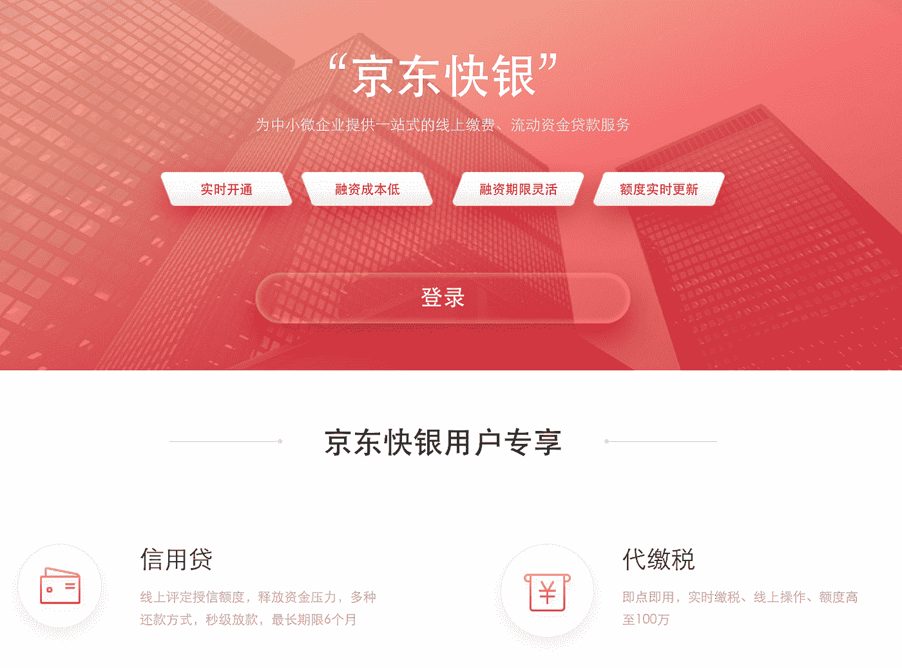

# 中国 300 亿美元零售盛宴背后的技术教训

> 原文：<https://medium.com/swlh/technology-lessons-behind-chinas-30-billion-retail-fiesta-2fe9a0df457a>

## *探索最近中国双 11 节背后的新零售、支付和区块链技术*

是的，在中国，人们庆祝光棍节的方式很流行。

Source: [CNBC](https://www.cnbc.com/2018/11/11/alibaba-singles-day-2018-record-sales-on-largest-shopping-event-day.html)

在我们最近去中国杭州参加 Money 20/20 会议时，每个人都在谈论*双 11 节*——一个用购物折扣来“庆祝”光棍节的购物节日，最早是在 2009 年由阿里巴巴的 Taobao.com 发起的。

Total Gross Merchandise Volume (GMV) of the Double 11 Festival across Alibaba’s sales channels. Source: [China Internet Watch](https://www.chinainternetwatch.com/statistics/alibaba-double11-gmv/)

进入双 11 节十周年，销售数字大幅上升，仅在[24 小时](https://www.cnbc.com/2018/11/11/alibaba-singles-day-2018-record-sales-on-largest-shopping-event-day.html)就超过**308 亿美元**。销售数字令人印象深刻，但**全渠道销售+促销和供应链支持的无缝整合**(马云称之为“新零售”)吸引了所有人的注意力:

*   *Ele.me* (中国领先的送货平台之一)履行星巴克的在线购买订单，并支持双 11 节期间在中国主要城市送货。
*   全线促销**线上** *天猫**淘宝*[*灵寿通*](https://www.slideshare.net/accenture/ling-shou-tong-alibabas-next-innovative-disruptor) (为 20 万家夫妻店提供动力的科技平台)**实体店如*银泰商城**河马*(智能连锁超市)*居然之家*(家具运营商)共同努力促销**

# ****新零售的力量——通过单一价值链整合线上、线下、物流和数据****

**2018 双 11 节期间，正是日本品牌*优衣库*成为天猫上最畅销的时尚零售商[，也是最快在 **2 分 53 秒**内突破**1500 万美元**(1 亿元人民币)**销售大关**的品牌。*优衣库*爆发与它的](http://www.ebrun.com/20181114/307788.shtml)[沉浸式购物体验](http://www.xinnet.com/xinzhi/63/140036.html)—**

*   ****免费改签服务** -所有从*优衣库*线上销售的双 11 商品都可以在优衣库在中国的 500 多家零售店中的任何一家进行改签。这解决了时尚电子商务的一个主要问题，即如果衣服不合身就退货。**
*   ****Pick up anywhere (‘*门店自提*’)** — any purchase orders from T-Mall during Double-11 can be picked up at any *Uniqlo’s* physical stores. This denotes that Uniqlo has achieved full integration of online/offline inventory database which made the shopping experience fully integrated and supported by the necessary inventory management.**

****

**Users just need to scan QR code to get discount coupons, gets loaded on its Uniqlo app and redirects traffic to online checkout on Uniqlo’s stall on Tmall.com. Source: [Sohu](http://www.sohu.com/a/203388007_114949)**

*   ****数字体验-** 可在线购买的优惠券也可在其线下商店使用。这确保了线上/线下购买行为之间没有摩擦。**

***优衣库的*双 11 节的成功揭示了进军线下零售的更广泛趋势:**

****

**Source: [PwC](https://www.pwccn.com/en/retail-and-consumer/publications/global-consumer-insights-survey-2018-china-report.pdf)**

**虽然电子商务在过去几年风靡一时，但中国的实际零售额数据显示，线下零售仍在 2018 年占据大部分销量。因此，中国的零售商一直在用他们的在线业务和技术来增强他们的线下零售店，以[“挖掘 80%”](https://www.alizila.com/future-of-retail-happening-in-china/)(GMV)。**

**为此，阿里巴巴的天猫和淘宝应用用户通过移动设备上的淘宝或天猫应用接收基于位置的商店推荐和折扣通知，从而为线下商店带来流量。更好的是，如果客户在实体店挑选了产品，但不想携带，他们可以在应用程序中进行购买-首次购买时只需输入送货上门的详细信息，中国主要城市的送货速度已经非常快，**从 15 分钟到仅 3 小时**。**

**同样在中国流行的还有**社交商务**的元素，最好的代表是*拼多多最近在纽约证交所上市，此前其团购(在微信等社交应用的朋友网络中)模式在非一线城市开始流行——那么当你将社交商务融入实体购物体验时会发生什么？***

****

**Source: [Technode](https://technode.com/2018/02/14/alibaba-new-retail/)**

**在参加双 11 节的阿里巴巴 pop-up 商店之一，商店里设立了照相馆，工作人员可以快速为顾客化妆，并在店内照相馆用其产品拍照，这些照片可以在社交媒体网络上分享，有效地将每一位顾客转化为对其朋友群的微影响者。**

**如果你想知道- *阿里巴巴的*竞争对手*JD.com*和*腾讯*(统称为 BAT)也在采取类似的策略- *京东*与腾讯合作推出*无界零售*概念-*京东*发布的优惠券可以在该品牌的京东商城、微信商城以及线下商城使用，同时消费者的会员资格和相应折扣也可以自由转换**

# ****零售和支付——“支付宝还是微信”？****

****“知乎宝还是微信”？**是中国任何一家商店，每个店主在结账时问我们的必然问题。**

**事实上，在一线城市，大多数东西，如果不是全部，都可以通过移动支付支付，这为日常用户创造了一个非常**无缝的 UX**。例如，我们的团队在最近的会议期间预订了从机场到我们在杭州的住所的接送服务，但不得不在很短的时间内取消预订。取消后，付款几乎立即返回到我们的微信支付钱包，这一过程在传统的结算基础设施中需要花费很长时间。**

****

**For illustrative purposes only. Our experience with reimbursements is that they are almost instantaneous although the system usually quotes up to 5 days. Source: [Baidu](https://image.baidu.com/search/detail?ct=503316480&z=0&ipn=d&word=%E5%BE%AE%E4%BF%A1%E6%94%AF%E4%BB%98%E9%80%80%E6%AC%BE%E9%80%9A%E7%9F%A5&step_word=&hs=0&pn=2&spn=0&di=177991510951&pi=0&rn=1&tn=baiduimagedetail&is=0%2C0&istype=2&ie=utf-8&oe=utf-8&in=&cl=2&lm=-1&st=-1&cs=3498993507%2C3023500548&os=1642213248%2C2916678880&simid=0%2C0&adpicid=0&lpn=0&ln=1879&fr=&fmq=1542610949554_R_D&fm=detail&ic=0&s=undefined&se=&sme=&tab=0&width=&height=&face=undefined&ist=&jit=&cg=&bdtype=0&oriquery=&objurl=http%3A%2F%2Fbbs-img.yzcdn.cn%2Fforum%2F201511%2F18%2F134046eq3apdqjpdv3l3zq.jpg!ori&fromurl=ippr_z2C%24qAzdH3FAzdH3Fkkf_z%26e3By57zwg_z%26e3Bv54AzdH3Fu5674_z%26e3Brir%3F451%3Detjopi6jw1%26wvpt5g%3Dr6tgpwksj%26pt1%3Ddma9m0&gsm=0&rpstart=0&rpnum=0&islist=&querylist=)**

**Another seamless experience with payment is an automated check-in/out process we experienced with the full-service travel app *CTrip*- VIP members that booked hotels through *CTrip* can head straight to the hotel room, bypassing the check-in/out and deposit paying processes. With the advancement of a new mobile payments system integrated with the hotel technology infrastructure, the hotel simply does not need to record your personal details manually nor take another deposit from your credit card at check-in, because these all can be obtained from your payment profile and e-wallet! And for the checkout, as you can imagine, you just close your hotel door and leave! In China, they call it “閃住”!**

**众所周知，支付席卷了中国。中国完全跳过了信用卡时代-其信用卡渗透率为<15% in 2014\. With a mobile-first habit, and a tech-savvy consumer base (**86%**[中国客户在](https://www.pwccn.com/en/retail-and-consumer/publications/global-consumer-insights-survey-2018-china-report.pdf)之前就已经使用移动支付，而全球平均水平为 24%)，支付宝和微信支付已经成为首选的零售支付方式，尤其是对于大批量低交易价值的支付。在双 11 节日期间，*蚂蚁金服*报告称，高达 **60.3%** 的交易是通过生物识别支付功能(面部识别或指纹支付结账)完成的——这进一步证明了中国移动支付的成熟水平。**

**零售和支付的结合也为中国的零售商和更广泛的金融机构创造了巨大的机会。**

****

**JD’s microcredit platform. Source: [JD Finance](https://loan.jd.com/ky/qaccess/indexUnion.htm)**

**以*京东金融*为例，经过 10+年的加工商品销售。支付和供应链通过其电子商务平台 JD.com，他们积累了大量关于中小企业的财务数据-事实证明，京东对中小企业的财务状况(现金周期、支付及时性等)有更好的把握-因此，他们在 2017 年推出了**中小企业小额信贷计划**，该计划使其平台上的每个中小企业能够获得高达**15 万美元**(~ 100 万元人民币) **i** n 的贷款，申请可以在几秒钟内发放。迄今为止，已向 100，000 多家中小企业发放了价值**36B**(250 亿元)美元的贷款，解决了中小企业的一个主要痛点，这些中小企业以前不得不以高于央行基准利率 **30%的利率贷款**，因为传统金融机构对这些公司计入了比它们应该承担的更多的风险。**

**处理零售支付的多年经验也转化为向银行和信用社等传统金融机构输出金融科技知识的机会。再次利用其庞大的支付相关数据集，京东推出了**北斗星**服务，以帮助银行利用京东 4 亿用户交易数据点产生的 60 万多个风险控制变量更新其风险模型。**

****

**Source: [Click Ventures](https://www.slideshare.net/FrederickNg/deep-dive-into-vc-funding-in-china-click-ventures?qid=1cfb89d3-037a-49ea-a4cf-3f793cdfb2f1&v=&b=&from_search=1)**

**中国支付技术的触角延伸到了中国以外——随着中国出境游客数量的增长，海外商家和支付基础设施采用中国支付技术是一种自然的过渡。在最近的一次会议上，**微信支付**宣布了进军*新加坡*和*马来西亚*市场的意向，这两个市场的手机普及率都高于中国(新加坡-73%；马来西亚- 53%，中国-41%)；**蚂蚁金服** 正在与亚洲的*印度*(Pay TM)*韩国*(Kakao Pay)*马来西亚* (Touch & Go)的当地合作伙伴构建支付生态系统，并与 **Elang Mahkota Teknologi** 成立合资公司，在*印尼*……中国支付科技对外扩张的例子是**

# ****区块链、零售和支付****

**如果你认为中国对 ICO 的全面禁止扼杀了区块链在这个国家的创新，请三思。阿里巴巴申请了多达 90 项区块链相关专利，甚至超过了 IBM。**

****

**Source: Ant Financial. Snapshot taken during the Money 2020 conference**

**双 11 节期间，*蚂蚁区块链*首次亮相，**追踪 24 小时窗口**内售出的多达 1.5 亿件商品的来源，并记录到区块链中。他们的区块链功能不仅仅是索引- *蚂蚁金服*推出了一个 BaaS(区块链后端即服务)平台，该平台利用智能合同来支持电子签名、合同管理等。**

**使用中国支付应用程序的跨境汇款在区块链也变得更快- **当数字分类账保持检查和平衡时，汇款结算变成了几秒钟的事情**，这与相关方之间多次来回沟通以确认支付已被发送的传统方式形成对比；支付也变得**在单个区块链**上完全可追溯，这加快了支付审计，传统上需要各方合作提交支付数据-类似的项目，如 [IBM World Wire Blockchain](https://www.ibm.com/blockchain/solutions/world-wire) 已经启动，但中国区块链在支付领域的发展无疑与世界其他地区保持同步。**

****查看我们的** [**深入了解中国风险投资**](https://www.slideshare.net/FrederickNg/deep-dive-into-vc-funding-in-china-click-ventures?qid=1cfb89d3-037a-49ea-a4cf-3f793cdfb2f1&v=&b=&from_search=1) **在 Money2020 杭州峰会上的主题演讲，了解社交商务、电动汽车、媒体等领域的最新投资趋势！****

**Source: [Click Ventures](https://www.slideshare.net/FrederickNg/deep-dive-into-vc-funding-in-china-click-ventures?qid=1cfb89d3-037a-49ea-a4cf-3f793cdfb2f1&v=&b=&from_search=1)**

****跟随我们的旅程在** [**脸书**](https://www.facebook.com/clickventures/) **，** [**推特**](https://twitter.com/click_ventures?lang=en) **，** [**领英**](https://www.linkedin.com/company/clickventures/)**

****

## **这篇文章发表在 [The Startup](https://medium.com/swlh) 上，这是 Medium 最大的创业刊物，拥有+391，714 名读者。**

## **在这里订阅接收[我们的头条新闻](http://growthsupply.com/the-startup-newsletter/)。**

****