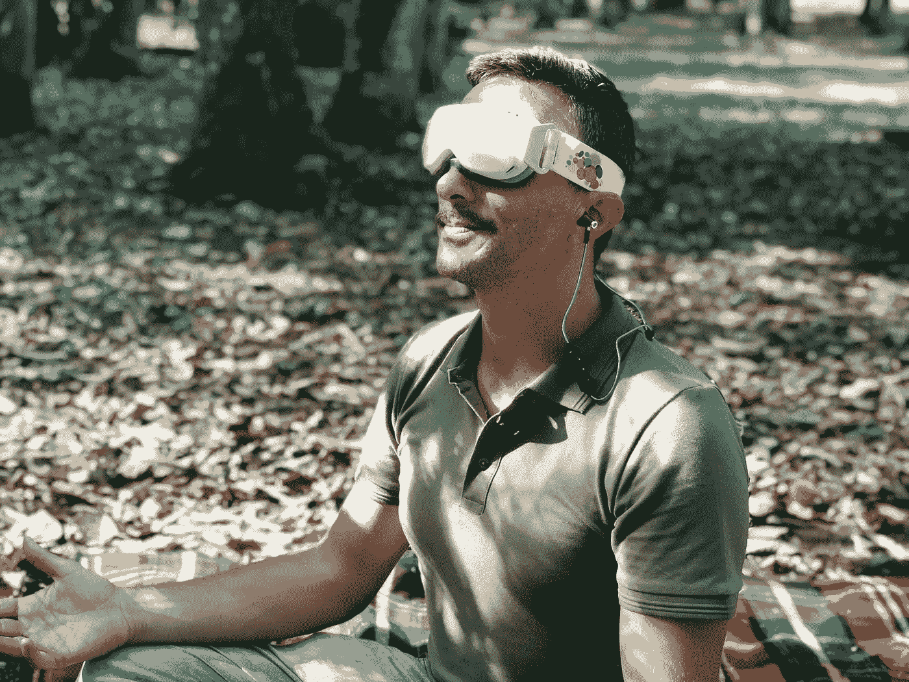
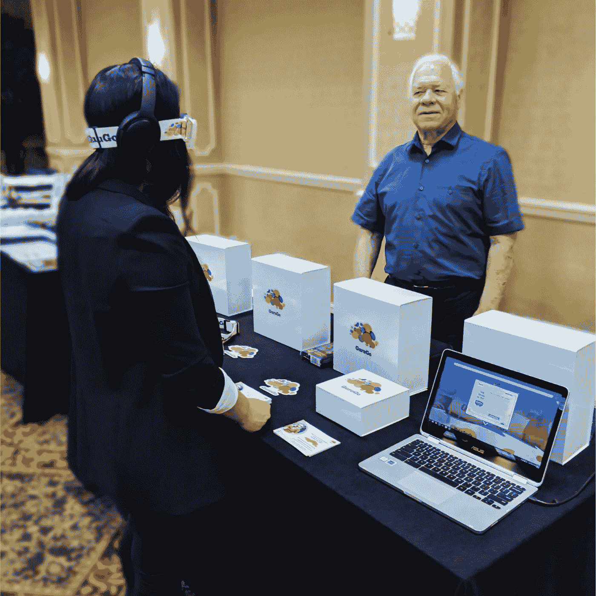

# 技术与精神相遇:创造成功心态的新方式

> 原文：<https://medium.com/swlh/technology-meets-spirituality-fa7837f55482>

不久前，失败的创始人和受欢迎的 medium.com 撰稿人 [Brian Krommenhoek](/@bramkrommenhoek) 写了一篇文章，[“为什么 90%的创业公司失败，以及该怎么办。”](/swlh/why-90-of-startups-fail-and-what-to-do-about-it-b0af17b65059)，它包括了一大串避免创业失败的切实可行的事情。但是，当问题不是外在的——当它看不见的时候，你会怎么做呢？

**创业是一次情感之旅。**

任何开始创业努力的人都感受到了激情、乐观和活力与悲伤、怀疑和恐惧的矛盾结合。情感的过山车通常会激励我们，引领我们追求更高的高度。

然而，恐惧——尤其是对失败的恐惧——经常会阻碍企业家和初创公司实现他们的梦想。通常，无论梦想有多大，想法有多好，恐惧都会导致拖延、犹豫不决，甚至自毁。

即使那些有意识意识到这些恐惧的人也不能幸免，因为 95%的时候我们的行为(或缺乏行为)都是由我们从很小的时候起就有的潜意识信念、恐惧和心理编程所驱动的。

可穿戴设备解决了潜意识问题。

正是考虑到这一点，以及他自己的许多失败，终身企业家、发明家和董事会认证的催眠师霍华德·斯威尼(Howard Sweeney)创造了 GuruGo，这是第一款从潜意识开始解决这些问题的可穿戴设备。

*Inventor, Howard Sweeney, demoing GuruGo at HypnoThoughts Live, August 2018*

基于多年的研究和开发，GuruGo 耳机使用同步光、自定义等时音调以及引导冥想和催眠技术的强大组合来优化脑电波，以消除通常会加剧大多数企业家面临的恐惧的自我限制信念。

GuruGo 耳机中集成的 led 和等时音调的脉冲节拍协同工作，温和而自动地引导大脑在目标脑电波频率下进入更高的意识状态。然后，定制指导冥想和催眠轨道，基于世界上最深刻的个人发展见解，是分层的。

古鲁戈没有花费数年时间练习冥想或重复肯定的话——这些似乎效果甚微——而是在每一个疗程中提供一致的体验；当大脑处于这些最佳状态时，大脑可以绕过经常阻碍企业家发展的精神障碍。

这种独特的技术组合允许大脑自动进入已被证明能够释放创造力的状态，连接来自大脑所有部分的信息，并促进身体和精神的最佳表现。

**跳出思维定势。**

消除企业家对失败的恐惧的可穿戴设备？几年前，像这样的发明可能会遭到怀疑。但是，随着个人发展市场预计在 2022 年达到 132 亿美元，虚拟现实市场预计在同一时间范围内达到 2092 亿美元，人们正在寻找解决方案，他们对创新和技术持开放态度。GuruGo 的制造商计划在 2019 年春天向他们的 [Kickstarter 活动](http://mediume.fnd.to/gurugo)的支持者提供这款设备，在这些爆炸式增长的市场中，为各地的企业家和自我完善的寻求者提供传统思维计划的开创性替代方案。

## 这篇文章发表在[《创业](https://medium.com/swlh)》上，这是 Medium 最大的创业刊物，有+368，052 人关注。

## 订阅接收[我们的头条新闻](http://growthsupply.com/the-startup-newsletter/)。

