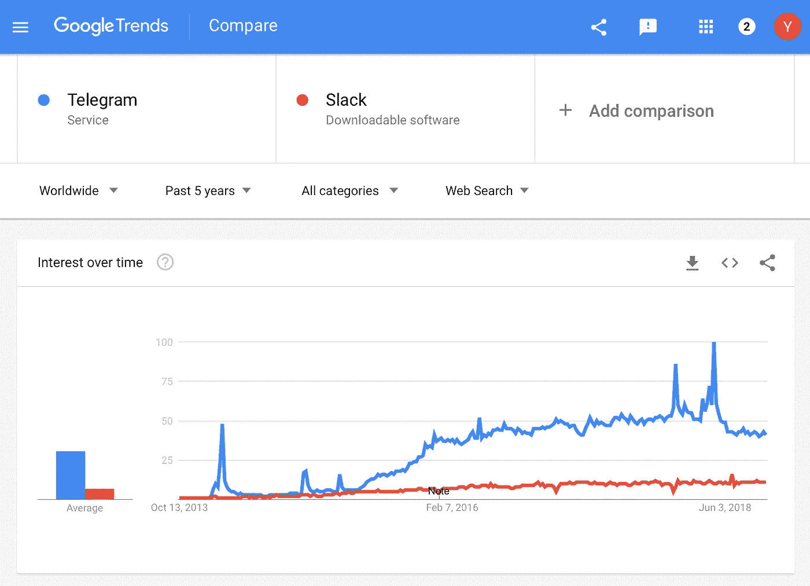
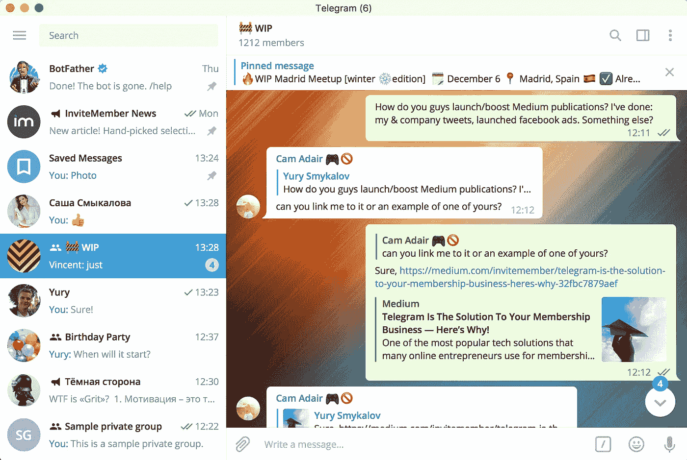
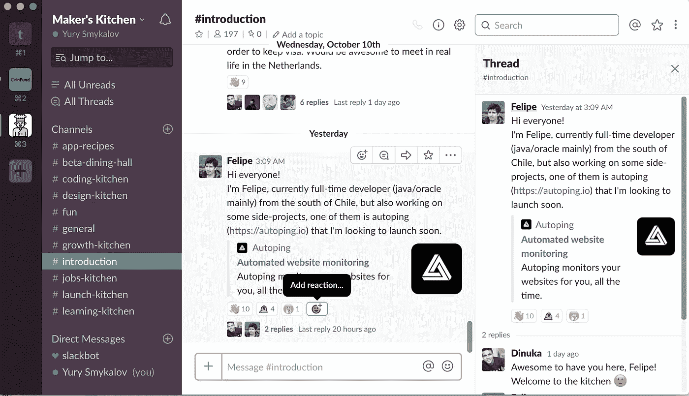

# Telegram vs Slack，什么对你的网络社区最好？

> 原文：<https://medium.com/swlh/telegram-vs-slack-whats-best-for-your-online-community-67c09f3d7496>

Photo by [rawpixel](https://unsplash.com/photos/mqpMdf1MeRE?utm_source=unsplash&utm_medium=referral&utm_content=creditCopyText) on [Unsplash](https://unsplash.com/?utm_source=unsplash&utm_medium=referral&utm_content=creditCopyText)

Telegram 和 Slack 实际上不是直接竞争对手。实际上，Telegram 是像微信或 WhatsApp 一样的通用消息应用，而 Slack 是像 Flock 或 Wire 一样的团队协作工具。

然而，这两者都是用来建立在线社区的。以下是一些值得注意的例子:

**电报** : [在建工程](https://social.invitemember.com/cRmxMUxC)，[留心制造者](https://social.invitemember.com/DgKKva45)等。

**懈怠** : [游牧民名单](https://social.invitemember.com/p1gy67mR)， [#FemaleFounders](https://social.invitemember.com/3pxpCy12) 等。

如果你打算创建自己的在线社区，你可能会想——“我应该使用哪个消息应用程序，为什么？”

在本文中，我们将从以下几个方面比较 Telegram 和 Slack:

*   有多少用户(毛，DAU)？
*   超级群组、回复、线程和工作区。
*   用户体验。
*   跨平台支持。
*   价格。
*   付费墙/会员插件。

# 有多少用户(毛，DAU)？

在开始建立社区之前，了解每个平台上有多少用户在交流是有好处的。要求安装应用程序才能加入社区可能会增加摩擦，降低你的转化率。

以下是过去 5 年中，Telegram 和 Slack 搜索词在谷歌全球范围内的搜索热度增长情况:

Screenshot of [Google Trends](https://social.invitemember.com/Ndf44axj)

2018 年 3 月， [Telegram 报 2 亿 MAU](https://social.invitemember.com/P9h4RMww) (月活跃用户)。2018 年 5 月， [Slack 报 800 万 DAU](https://social.invitemember.com/HX9aCj7F) (日活跃用户)。这些是目前(2018 年 10 月)可用的最新数字。我们不能直接比较这些指标(毛与 DAU)，但知道它们还是有好处的。

我们可以比较的另一个指标是 Android 应用程序的安装数量。根据 Google Play 的数据， [Slack](https://social.invitemember.com/lR1odmqS) 应用的安装量超过 1000 万，而 [Telegram](https://social.invitemember.com/fpN-8MQr) 应用的安装量超过 1 亿。这清楚地表明，至少在移动世界中，Telegram 是绝对的赢家，拥有明显更多的受众。

# 超级群组、回复、线索和工作区

Telegram 和 Slack 的组织方式有很大的不同。

在 Telegram 中，社区基本上是组(确切地说是[超级组](https://social.invitemember.com/RVdlTxbq))。群组就像 Telegram 中的普通聊天一样出现。您的社区将在其他聊天和频道中可见。

如果社区是活跃的，将会有大量的消息，每条消息将会提升聊天。因此，社区将始终处于顶端，很难忘记您的对话。

Screenshot of [Work In Progress](https://social.invitemember.com/cRmxMUxC) community in Telegram

您发送到超级组的所有消息都在一个大线程中可见。

但是，您可以回复单封邮件。然后，您的答案将会显示出来，并带有一个指向原始答案的链接。你可以浏览所有这些连锁回复，然后回到一条线索中的第一条消息，但是所有这些“线索”都混在一起了。

在 Slack 中，社区是[工作区](https://social.invitemember.com/P3umXis6)。您可以在时差中有多个工作空间。比如说；一个用于工作，一个用于您加入的每个社区。您可以在它们之间快速切换，但您无法在一个位置看到每个工作区的每个对话。

在工作区内，对话被组织在渠道和直接消息中。渠道类似于 Telegram 中的群聊，直接消息类似于 Telegram 中的私聊。

Screenshot of [Maker’s Kitchen](https://social.invitemember.com/6i8myz9E) community in Slack

松弛通道/直接消息中的每个消息都可以成为一个线程的开始。该主题的消息只有在您打开它时才可见。

如你所见，Slack 为组织对话提供了更多功能。

如果您的社区很大，并且需要多个子通道来组织聊天，那么选择 Slack。不然电报绰绰有余。

# 用户体验

与 Slack 相比，Telegram 更随意一些，而 Slack 则更专注一些。这源于 Telegram 是一款通用的消息应用，而 Slack 是一款团队协作工具。

电报社区更容易接触到，即使你不想要他们，他们也会引起你的注意(新的消息会把这个群在聊天列表中提升)。当你在的时候，你很容易被群聊、机器人、频道和私聊分散注意力。只需点击一下就可以在它们之间切换。

Slack 社区有点难接触到(你需要启动 Slack 应用程序，甚至切换其中的活动工作区才能进入)，但当你在里面时，没有什么会让你分心。您只能看到属于当前工作区的频道和私人对话。

如果您的社区将被随意使用，如短时间内每天多次使用，请选择 Telegram。对于不太随意和更集中的用法，选择 Slack。

# 跨平台支持

Telegram 和 Slack 可以在所有最流行的平台上使用:Windows、Linux、Mac、Android、iOS 和 Windows Phone。

Telegram 也有一个 Firefox OS 应用程序。但是对于绝大多数用户来说，这两个 app 没有区别。

# 价格

电报是完全免费的。

Slack 有一个免费层[，最多可搜索 10K 的消息，还有其他限制](https://social.invitemember.com/r8uN4t0N)。如果你需要 Slack 的全套功能，它会变得很贵。

然而，如果你可以处理这些限制，你可以坚持使用免费层——你的社区仍然可以根据你的需要而变大。

# 付费墙/会员插件

一些在线社区是付费的，这有两个主要目的:

1.  为社区管理者提供发展和维护社区的资源；
2.  过滤掉巨魔和随机的人。

如果你决定让你的社区成为付费社区，你可以同时使用 Telegram 和 Slack。他们没有任何内置的付费墙，但您可以轻松创建一个会员社区，并使用第三方服务将其直接集成到平台中:

**电报** : [邀请函](https://invitemember.com)

**松弛** : [启动通过](https://social.invitemember.com/3YpOIfWt)

您也可以雇佣一个开发人员来为您构建一个定制的集成(但是这可能很贵)。

# 专家怎么看？

我们请了一些知名的社区创始人分享他们的想法。

[**马克·科尔布鲁日**](https://social.invitemember.com/cYNjroFS)**[**创始人工作进展**](https://social.invitemember.com/cRmxMUxC) **:****

> **对我来说，电报就像一辆小型摩托车。轻量级。好用。快点。Slack 更像一辆公交车。更健壮，对团队来说很好，但是不够敏捷。对我来说，懈怠是需要你全神贯注的事情。这不是你兼职做的事情。这对于某些用例来说很好，但是对于 WIP，我不想建立一个人们全天候聊天的社区。重点是工作，所以像 Telegram 这样更轻量级的解决方案，不管它有什么缺点，都更适合。**

**[**约书亚·沃迪克**](https://social.invitemember.com/hwEZPyUO) **创始人** [**忌惮制造者**](https://social.invitemember.com/DgKKva45) **:****

> **Slack 是一个很棒的工具，但是 Telegram 更有趣。它给人的感觉是更紧密的联系，更少的商业色彩，允许更容易地构建机器人，并且有贴纸包。**

**[**玛丽吴彤**](https://social.invitemember.com/9jGM_SY_)**[**女使**](https://social.invitemember.com/MfiTgTNx) **:******

> ****我开始让女人拍电报有几个原因。首先，我是通过 wip 聊天发现的平台的忠实粉丝。然后我用 Slack 工作，不想把两者混在一起。懈怠让我感到不知所措，当我看到一条消息时，我觉得我需要立即处理它。与电报相比，它似乎很慢。****
> 
> ****我想要一些易于使用的东西，如果你想的话，你可以随时随地和人们聊天。****

****[**迪努卡**](https://social.invitemember.com/zT7Mp5M8)**[**创客厨房**](https://social.invitemember.com/6i8myz9E) **:********

> ****Slack 和 Telegram 都为开发者提供了难以置信的控制能力。这使我们能够在他们的平台上构建应用程序和机器人，以促进我们自己的产品。与 Slack 相比，Telegram 提供了一种更简单的创建机器人的方式。Telegram 的机器人父亲系统允许开发人员从零开始构建机器人所需的时间。然而，slack 对 webhook 消息更广泛的控制，如消息格式、自定义按钮等，使得在工作空间内构建微程序变得很有趣。虽然 Telegram 已经是一个移动消息系统，但 Slack 主要是为工作场所通信而设计的。这使得 Telegram 相对于现有的以移动为中心的用户群而言具有优势。当我们启动 Maker's Kitchen 时，我们收到了几条消息，要求我们将社区扩展到 Telegram，仅仅因为他们已经在使用这个应用程序。我的观点是，如果你的目标是建立一个社区，这两种选择都非常适用，但归根结底是可访问性。如果你想在你的工作空间内利用 Slack 的工作空间应用生态系统，那是你最好的选择。如果你想利用 Telegram 现有的用户群，并为你的社区快速建立机器人，这将是你最好的选择。****

****[**塞尔吉奥·马泰**](https://social.invitemember.com/1ea117-v) **创始人**[**maker log**](https://social.invitemember.com/J2iKsFnM)**:******

> ****我更喜欢 Slack，因为它让人感觉更专注、更有条理。你有保持对话整洁的渠道和线索。第二，Slack 可用的集成数量巨大——有大量的应用可供选择。最后，规模。Slack 可以很好地处理大型群组，并且提供通知设置。****

# ****摘要****

****Telegram 和 Slack 对于在线社区来说各有利弊。****

****要选择其中之一，你应该问自己这些问题:****

1.  ****我的社区需要一个复杂的对话组织，还是 1-2 个群聊就足够了？****
2.  ****我的社区多久开放一次？是比较随意还是比较专注？****
3.  ****我需要大量存储空间还是需要访问完整的消息历史记录？如果是，我可以支付 Slack 的高级订阅计划吗？****

****无论你选择什么，享受创建和发展你的社区的乐趣吧！****

****感谢你阅读这篇文章！可以在 Twitter 关注我: [@ysmykalov](https://social.invitemember.com/dr5Ouhx0) 。****

********

## ****这篇文章发表在[《创业](https://medium.com/swlh)》上，这是 Medium 最大的创业刊物，有+385，976 人关注。****

## ****订阅接收[我们的头条新闻](http://growthsupply.com/the-startup-newsletter/)。****

********