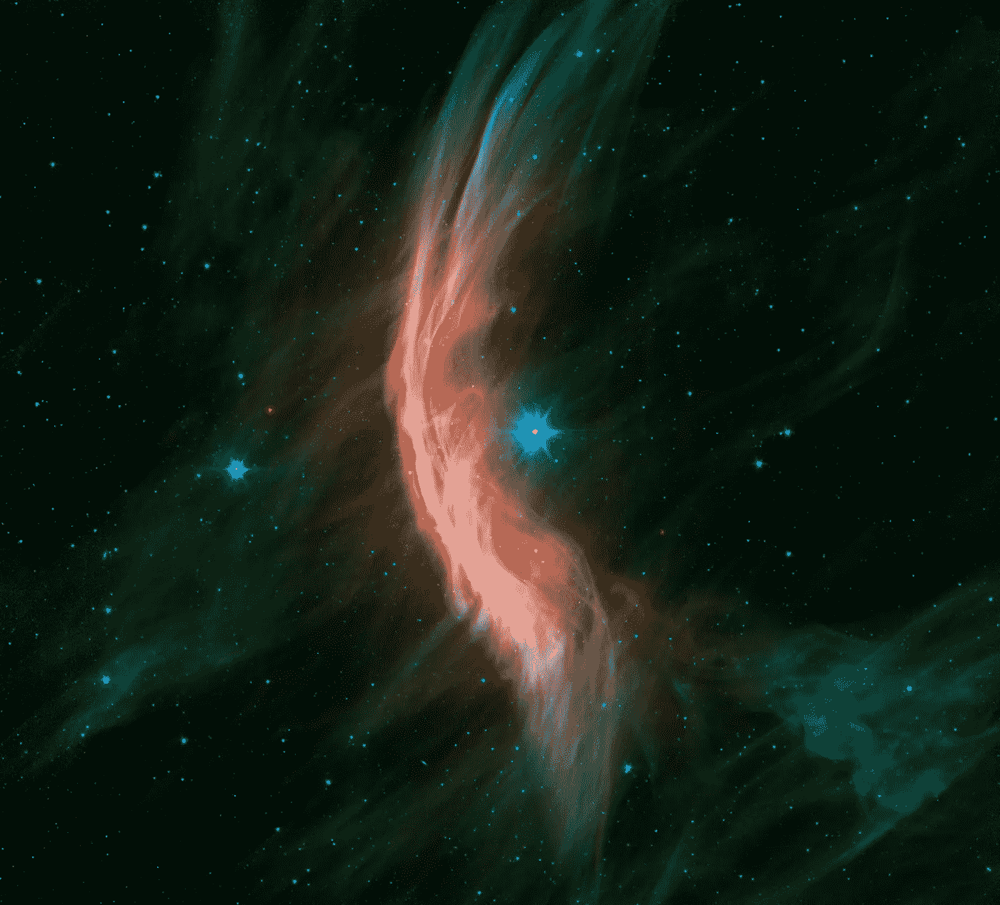
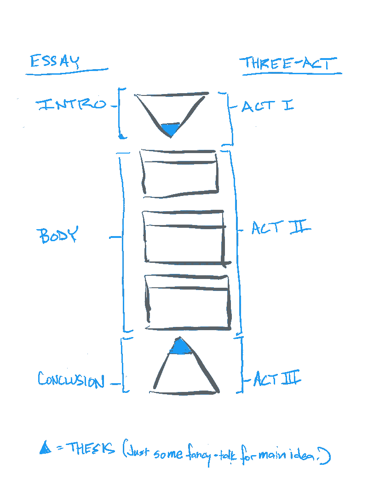

# 讲述伟大的故事

> 原文：<https://medium.com/swlh/tell-great-stories-bd8e1bab8231>

> 宇宙是由故事组成的，而不是原子。
> 
> ~穆里尔·鲁凯泽

[NASA/JPL-Caltech](http://www.spitzer.caltech.edu/images/5517-sig12-014-Massive-Star-Makes-Waves)

你走进电影院去见证这个叫做电影的东西。你已经读到了爱迪生令人难以置信的发明——首先是电影摄影术，然后是电影放映机——以及人们是如何观察电影内部并实际观看电影的。现在卢米埃尔兄弟有了更好的东西——电影摄影！这是一台把电影投影到一个平面上的机器。想象一下，在墙上移动图片。

1896 年 1 月 25 日。你正在申请观看琉米爱尔的最新电影《火车抵达拉乔塔特》。你的心因期待而跳动，你的手掌因兴奋而湿漉漉的。

灯光变暗，电影摄影机随着机械的呼呼声响起。当一个图像出现在你面前的屏幕上时，卷轴爬行的声音充满了整个房间。

人们。他们在拉乔塔特的站台上转来转去，显然预料到火车随时会到来。即使场景缺乏色彩，你也会感觉被传送了。远处，一个黑点。

这个小点越来越大，似乎从地平线上升起，变得越来越大，直到——它正朝你飞来吗？你的心怦怦直跳，恐惧退缩。其他人跑向剧院的后面，爬过椅子，尖叫着——试图逃离火车的铁喉。突然，它就像一个灵魂穿过你一样飞驰而过。

尽管对那天发生的事情已经没有任何第一手的描述，但人们相信这个故事是一个都市传奇，马丁·洛佩丁格称之为“电影的创始神话”不管你选择相信与否，这是一个很好的例子，说明了叙事的力量，以及一个好的叙事是如何通过时间坚持下来，并告诉我们这么多关于这个世界的事情。

根据这个故事，人们对新技术如此着迷，以至于尽管所有的证据都与此相反——他们坐在电影院，除了放映机的声音，没有其他声音，电影是完全黑白的——观众还是相信它是真实的。事实上，如此真实，以至于人们害怕得往后退缩，跑向出口，以免被火车撞上。事实上，这是如此的真实，以至于直到今天，人们仍然站在争论的两边。

这个传说之所以持续存在，是因为它引人注目，甚至在最简单的复述中，当我们的大脑重现这一经历并引发生物反应时，我们的心都会怦怦直跳。对我来说，这就是一个好故事的力量，这是神经科学开始理解的东西。我们从过去 30-40 年的研究中了解到，叙事是体验世界的基本构造，是人类与动物王国其他部分的区别。这就是为什么如果你想告知、娱乐、说服或以其他方式教育人们，你应该设法讲述伟大的故事。

对故事的需求已经融入了我们的 DNA。自从火出现的第一天，人类围着火焰向部落传授如何抵御翼龙攻击的知识，我们就依靠故事来传递信息。虽然很难确定第一个故事是何时被讲述的，但我们知道口头传统远早于任何书写系统。人类使用语言的能力很可能在至少 10 万年前就已经形成，我们对叙事的偏好也很可能是在这个时候形成的。

在有纸之前，人们把知识以故事的形式记在脑子里。事实上，许多古代文化在部落中都有一个首席说书人，他是知识的源泉，通过叙事的方式传播部落的道德和文化价值观。口头传递信息是一种有用且简单的分享方法，但它受制于讲故事者的反复无常。直到很久以后，人类才认识到需要一种持续的知识获取和信息传递方式，发明了文字作为一种交流方式。

苏美尔人因最先书写故事而获得荣誉，大部分故事是用楔形文字潦草地写在石碑上，最早起源于公元前 3400 年左右。平板电脑主要包含经济和行政文件。后来，艺术以散文、诗歌、赞美诗和神话的形式出现。已知最古老的虚构故事是起源于公元前 3000 年的吉尔伽美什史诗故事。一旦我们开始写作，我们就不会回头。

正是我们对语言的使用让我们能够表达出自己的想法。我们头脑中的故事让我们得以生存并创造意义。作为制造意义的机器，我们不断地寻找事物之间的关系。当我们遇到一个场景时，我们会在脑海中重建它，所有的景象、声音、气味——所有的感官信息都会被记录下来，并与储存在我们大脑中的现有信息库相匹配。

人类大脑使用所有这些信息和记忆之间的关系作为产生意义的工具。例如，停在街上的一辆车可能看起来只是一辆车，直到我们走近它，看得更近一点。然后我们对汽车的故事有所了解。我们可以感觉到它的温暖，所以我们知道它最近停在那里。我们看到汽车的颜色，感受周围的天气。车湿了吗？但是没有下雨。为什么会这样？

我们的大脑将零散的信息连接起来，形成一个关于停在路边的汽车的连贯叙述。我们甚至可以利用现有的叙述，如 societal(这是一辆豪华车吗？)或个人叙述(还记得我的第一辆车)来增加深度和复杂性。从这种意义出发，身体对我们的世界产生了反应。

我们的身体不是由许多为自己服务的不同系统组成的。相反，我们是由彼此具有共生关系的系统组成的，这由大脑中的任务控制来协调。意义总是导致产生身体反应的情感。这也是大脑工作的一部分:将想法和感觉转化为身体反应。这正是叙事如此强大的原因。

故事通过引发情感直接影响我们的观众。当你听到、读到或看到一个好故事时，它不仅激活了你大脑的语言中枢，还激活了大脑中与触觉、嗅觉、运动等相关的部分。听到香蕉这个词不仅会在你的脑海中产生香蕉的画面，而且还会激活你大脑中管理气味、形状和颜色的部分。它会返回与香蕉相关的情感。你可能会对香蕉感到厌恶，因为它会让你的舌头发痒，或者有一次你在门廊上滑稽地踩在香蕉皮上滑倒了。不可思议的是，大脑根本不在乎我们是否真的看到了一根香蕉，吃了一根香蕉，或者听到了一个关于香蕉的故事。反应都差不多。

现在，考虑一下琉米爱尔神话的持久性。在这个故事中，人们被正在发生的事情吓坏了，他们真的跑向出口，以避开一辆迎面而来的火车，这辆火车是黑白的，投影在墙上，闻不到，摸不到，听不到，也感觉不到。这起初对我们来说似乎很荒谬，但只需几秒钟，我们的大脑就可以根据自己的经验构建一个故事，讲述在黑暗的地方，看到从未适合公众消费的新技术，成为兴奋和期待的一部分，展示我们世界的美好可能性。我们能感觉到紧张。

当我们阅读或听到这个神话时，大脑会为我们建立所有的联系，而不需要我们有意识的努力。它把景象、声音、气味结合在一起，并把它们打包以产生意义。这个意思引发了我们身体的生理反应。我们可能会发现自己的心率加快，手心出汗，脖子后面的汗毛竖起来。我们紧张、焦虑、兴奋、困惑。

为什么？

因为叙事对于人类的生存状况是如此重要，无论我们是否参与，它都会产生这些影响。唯一不同的是正在发生的事情的实际强度，这可以通过使用良好的讲故事技巧来提高。我们每个人携带的是宇宙中最强大的个人虚拟现实机器。

# 那么，我们如何简单地讲述伟大的故事呢？

因为叙事是人类的基本组成部分，这意味着它有巨大的使用机会。一个讲得好的故事可以让人们产生想法，激发变化，甚至改变一个人的世界观。虽然叙事是人类生存的基础，但它并不是我们在日常生活中想要使用的工具。

使用它的主要障碍是，当我们想到记叙文时，我们认为它在大多数情况下都太复杂了。我们看不到它是如何形成一篇论文、一个 Powerpoint 演示或一个现场活动的结构的。这就像在当地的杂货店看到你的一位小学老师——我们在艺术、书籍、电影、诗歌等单一的背景下看待它。

相反，有一个简单的框架可以适应各种环境。如果 I️把媒介换成网页，一个故事会是什么样子？它看起来不同，但本质上是一样的。并且能够以多种不同的形式部署它，这说明了它的多功能性。那么我们可以采用的最简单的结构是什么呢？

# **进入舞台左侧:三幕故事结构**

有许多不同的故事情节设计，但对我来说，最简单的方法之一就是像编剧一样思考——三幕故事结构。大多数故事，尤其是令人信服的故事，都是基于这个简单的框架。虽然三幕结构最初是为了从剧本的角度描述情节，但我发现它是一个有助于描述实际上是一个简单的基本结构的结构。

它是这样工作的。

## **第一幕**

第一幕是所有关于正在发生的事情的说明或背景设置，并以改变主角生活的事件结束。这个事件提出了一个问题，接下来的叙述试图回答这个问题。

这里不要把事情过于复杂化。主角可以是你，讲故事的人，也可以是朋友、同事或商业伙伴。它甚至可以成为一门生意。关键是有些事情正在发生变化，随之而来的将是试图解决由这种变化产生的冲突。请记住，尽管我们认为自己是灵活的生物，但变化是具有挑战性的，有时是困难的。

## **第二幕**

第二幕描述了解决问题的尝试。无论如何，在第二幕中，我们的目标是增加紧张感，直到我们到达戏剧性的顶点，高潮。我们的主角尝试了不同的方法来解决这个问题，每种方法都产生了不同的结果。紧张感随着它沸腾到高潮而增加，这是叙事紧张感的顶峰。

## 第三幕

第三幕是对第一幕中的变化所引起的冲突的解决。这是我们总结事情的地方，并展示出发生了什么变化，以及事情与我们开始时有什么不同。至此，叙述之旅已经完成，我们可以讨论下一步的工作了。

# **展开三幕结构**

在一篇文章中，我们可以把结构要素想成:引言、论题、正文和结论。每个目标都对应于三幕结构:

*   第一幕:引言——引言为文章的其余部分提供了背景，并以论题结束。它通常回答以下问题:我们试图解决什么问题？对我(作为读者)有什么好处？我为什么要在乎？
*   论文陈述是花言巧语，描述你对你刚刚介绍的主题的简洁陈述。它为观众接下来的表演做好了准备。如果你在三幕结构的背景下思考它，它是主角的变化，或者是其余叙事试图回答的问题。
*   第二幕:身体——身体是你为你最终想要证明的任何事情进行论证的地方。在你的论文中，你将花每一个模块描述支持你论文的论点，以及驳斥反对你论文的常见论点。这一部分的工作应该发展到高潮，或者对读者来说结论是显而易见的。
*   第三幕:结论——结论是你回到你的论文，表明你的论点已经为你的提议建立了一个案例。你展示了你是如何应对论文提出的挑战的，事情是如何不同的，以及对读者有什么好处。读者应该毫不怀疑你在某一问题上的立场。

Essay structure = three-act structure.

正如你所看到的，三幕结构可以很容易地扩展到一篇文章。唯一改变的是运载工具，但整体结构保持不变。正如我们在论文中所做的那样，我们可以类似地构建一个 PowerPoint 演示文稿。在 PowerPoint 演示中也可以很容易地得出同样的结论。

一个简单的可视化方法是创建一个大纲。在大纲中，你可以列出你的背景，你的论文，每个支持细节，以及第三幕的所有细节。然后你可以思考什么样的视觉效果可以伴随着正确的词语来抓住你的论点的本质。记住，演示应该支持你的论点，但真正的表达是演讲。使用简单的单词和短语来支持和加强你的关键论点。不要用文字填充幻灯片。你想通过故事吸引人们，你的视觉效果只是帮助你理解你的主要观点。最终，人们来听你讲话。

一旦你开始用叙事的形式来组织你的作品，你就会引起观众的共鸣。共鸣是人们在某种东西与他们深深联系在一起时产生的那种感觉。他们越能理解你所说的，你和他们的联系就越紧密，他们就越容易接受。

所以，下次你必须做一个 PowerPoint 演示，或者做一个推销，或者试图左右观众的时候，花些时间在叙述的背景下考虑你的方法。你会发现这是一种非常简单的与人交流的方式，而且他们会接受你所说的话，因为归根结底，这是人类交流的基本形式。

## 这个故事发表在 [The Startup](https://medium.com/swlh) 上，这里有 262，800 多人聚集在一起阅读 Medium 关于创业的主要故事。

## 订阅接收[我们的头条新闻](http://growthsupply.com/the-startup-newsletter/)。

