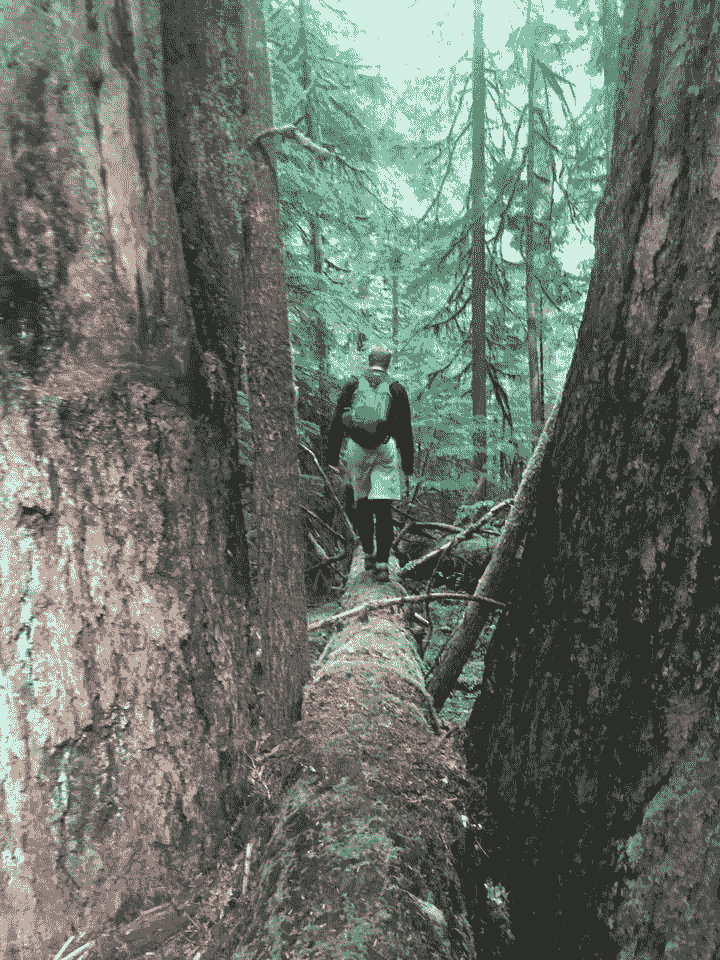
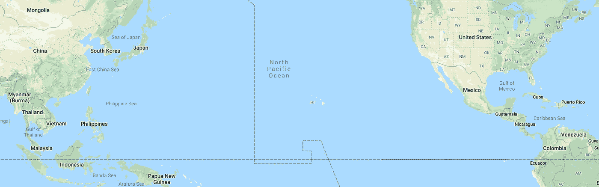
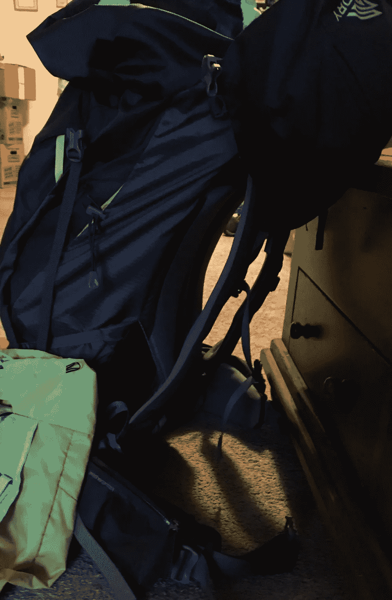
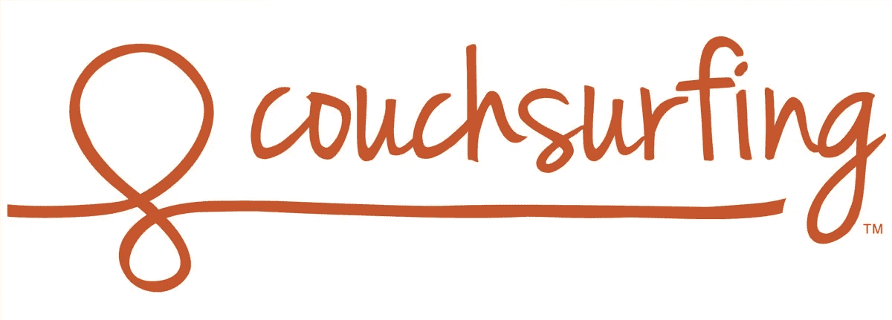
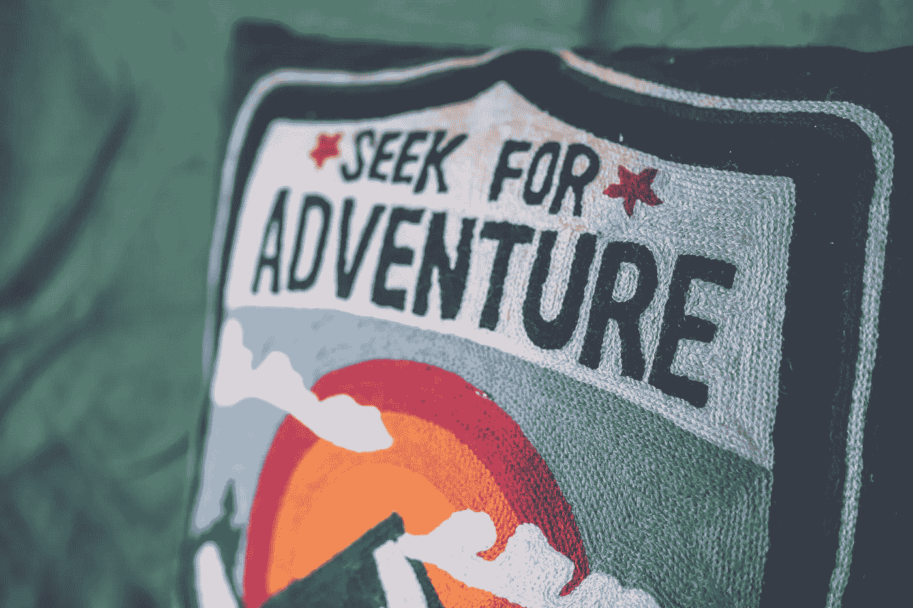
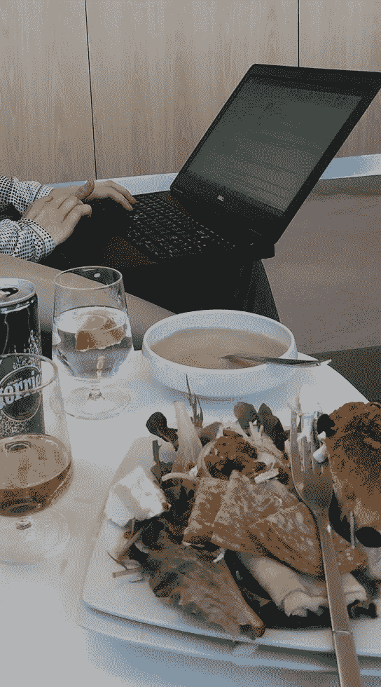
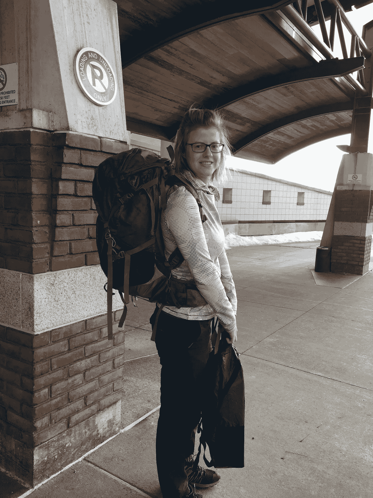
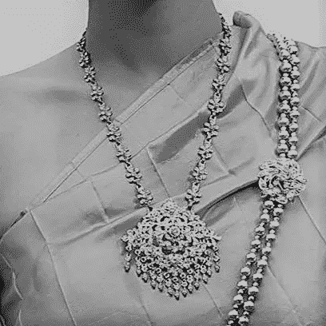
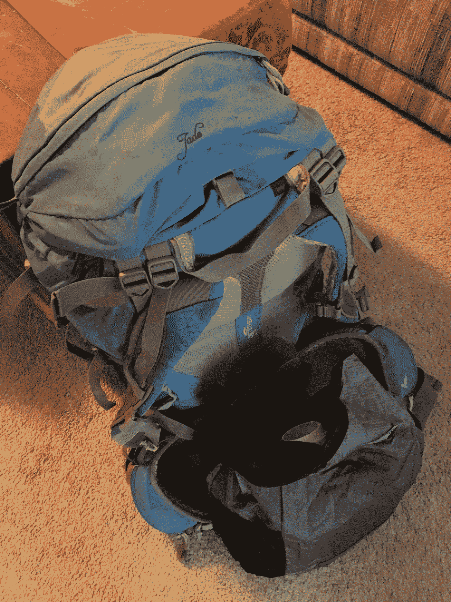

# 两个背包旅行的千禧一代教会我的十件事

> 原文：<https://medium.com/swlh/ten-things-two-backpacking-millennials-taught-me-b5515cb0ff55>

我的儿子和他的女朋友上周离开，开始了他们为期数月的亚洲探险之旅。

第一年他这么做的时候，我很焦虑。虽然我们生活在非英语国家，但我们有彼此和我们周围的社区。他要独自去那些不说英语的国家和我从未去过的国家。我不知道如果他生病或受伤了，谁来照顾他。当他变得困惑时，我不知道谁会帮助他集中注意力。

父母们，当我说这个孩子在卧室门后找不到他的鞋子时，你们会明白我的意思。这是一个等到离开时间前十分钟的孩子，突然发现他没有他需要的一切，并在房子里和我的心里制造了一场龙卷风。

他已经长大了，他喜欢冒险。他不想要我们的帮助，这意味着我们对他的计划一无所知。他自己做了所有的安排，货比三家寻找最好的旅行信用卡，考虑他可能需要旅行的东西，出发前去看医生，并设法在开始大旅行前把朋友和停留地点联系在一起。

Half a world away.

第一课:

***如果是你想做的事，你会找到办法的。***

盘子可能没洗好。吸尘可能不会完成，但朋友和旅行？我从没见过这么多协调！

想象一种生活，在这种生活中，你所做的一切都是你热爱并为之兴奋的事情！这个世界上不会有任何电视迷或抑郁症。

Three months worth

当他把看起来比他自己还大的背包扛在肩上时，我想他会向后摔倒。

第二课。

我们在日常生活中使用的东西有多少真正重要？

如果你能坚持三个月不戴它，你能永远不戴它吗？

你可以清理、出售或赠送什么东西来帮助你减轻压力？

第三课:

***社区。节省你的便士。成为圈内人。***

据我所知，他没有地方住，他打算在飞机上做。当他去参加极限飞盘比赛时，我在美国见过他很多次。这次他注册了一个沙发冲浪组织。我很惊讶地发现，全世界有超过一百万人愿意做东道主。[***https://www.couchsurfing.com/places/asia/thailand/bangkok***](https://www.couchsurfing.com/places/asia/thailand/bangkok)

Seriously? There really is such a thing.

有一个审查过程，有一个匹配过程，有一个善待对方的过程。在这个世界里，我们教育我们的孩子要小心，不要和陌生人说话，他却真的出去睡在陌生人的家里。

哇哦。那个让我大吃一惊。

我会找各种各样的借口不那样做。

好的一面是，在沙发上冲浪时，他结交了新朋友，尽量减少酒店住宿，有时甚至睡在外面。当他第三次回到亚洲时，他仍然有那些朋友可以联系。

我担心过他的安全吗？当然了。CouchSurfing 社区和系统有助于减少问题。

m 唯一的抢劫来自他在旅行中遇到的所谓的朋友，这些人是美国人，而不是亚洲人。

The third time is a charm

今年，M & C 决定返回泰国和马来西亚。这是他们第二次一起做这件事，计划很早就开始了。他们看机票，并在购买前阅读东西的重量。(背包之地有一处很有价值的不动产——毕竟是航空公司随身携带的。)他们决定留下一些东西，在乡下买。

第四课:

***出行可不贵！***

与威瑞森、美国电话电报公司和斯普林特不同，有些电话号码可以通过互联网使用。我可以打他的电话，留个言，它会把我说的打印出来。他们每个月 20 美元，只要有互联网接入，他们就能很好地工作.Skype 免费使用。电子邮件是免费的。理发、按摩、眼镜和牙科检查在泰国要便宜得多！让别人帮你洗衣服并把衣服送到你手上是很便宜的！

重要的东西是阅读用的火柴，不含漂白剂的防晒霜，一场扣球比赛，可以兼作枕头的舒适的一体式人物睡衣，还有一层也可以邀请谈话和终极飞盘锦标赛的夹板。

和别人一起旅行时，分享杂物，这样可以节省空间。

Remoting from the airport lounge.

第五课:

***问吧！***

通过与她的雇主合作，允许远程工作三个月，c 展现了一个专家的影响力和谈判技巧。在全球经济中，有人倒班可以让客户感到更受支持。

第六课:

***买经历，不买东西。会有一辈子的故事。***

第一年，M 更频繁地通过短信交流。这很有道理。他独自一人。他谁都不认识。“到了马尼拉，到处都是枪，”这可不是我想听到的。

“我不知道该坐哪辆巴士，所以从机场乘了一辆酒店班车，剩下的路只好步行。一位年长的女士问我是否想去她的酒店房间。走过赤裸的婴儿和敞开的下水道。”

即使我们的父母没有六位数的收入，观察别人的生活也有助于我们理解特权。

“我的钱包、护照和现金被偷了，但他们找到了我的背包和衣服，我在警察局过了一夜，”他发短信说。那不是我想读的。“我应该和我的朋友一起旅行回来，但他们离开了，”*(我一个人，在外国，没有钱，也没有护照)*让我很生气——考虑到这些所谓的朋友一直在看他的东西。他们眼睁睁地看着钱进了自己的口袋，然后抛弃了他，这样他就不会知道他们拿了他的钱。

**第七课:**

*“需要是一种无价的激励，它帮助人们在难以置信的困难面前创造奇迹。”奥里森·斯韦特·马登*

***放开妈妈。他会没事的。***

他没有人和他一起比喻性地“找到他的鞋子”，所以他找到了一种方法，天意就这样发生了，我坐在后面咬着指甲，但仍然试图鼓励他。我实际上更像是一个共鸣板，而不是一个直升机妈妈。我可以改变。

*好吧，是的，他的确在夏威夷没穿鞋出现在机场，他们错过了航班，有人追上了他，送来了他的鞋，他们赶上了另一趟航班……*

尽管我通过脸书、短信和几次 Skype 会话在远处监控着他的健康和幸福，看到了各种各样的事情，但我不一定想看到这样的事情，“现在我正在看一场台风，它可能会延误我明天飞往普林塞萨港的航班。谁想用泰拳和棋盘游戏迎接新年，避免吸入烟花碎片？”我看到了一大堆让我骄傲、嫉妒和质疑自己的东西，为什么我不敢独自去同样的国家旅行。

第八课:

***“有时候你不得不做让你害怕的事情。”深入挖掘。***

有一天，他感到孤独，躲在一家酒店里，雨水从屋顶漏了进来，他不得不移动他的床，我们来回发短信。那是他可能有一段时间没说英语的一天。我向他暗示，他总是可以比原计划提前回家。我知道把自己放在那里很难。“妈妈，有时候你必须做让你害怕的事情。”

难受，深挖原因。

他当然是对的，他只是希望有一个旅伴，因为如果有人和他一起分享，旅行会变得更加愉快。

这些千禧一代让我惊讶。

Roll with it.

第九课:

***随遇而安。***

你为你的航班付款，准备登机，并在你起飞前找到需要申请的签证；不是在你到达之后。你是做什么的？

尝试从你的信用卡公司、脸书和你的朋友那里获得退款，并想出新的选择。

所以你的 Airbnb 主机抛弃了你，你会怎么做？

朋友脸书:“周末有没有人有空的床/沙发/地板空间，或者有没有其他靠近田野或派对的地方？”

所以你在国外得了胃病。你是做什么的？

爬进一家旅馆，脸书你的朋友:“在曼谷躲了几天，C 病好了，然后南下槟榔屿。对泰国南部比较了解的朋友们，一路上/回来的路上有哪些岛屿是我们一定要去的，哪些是不值得的？”

第十课。

***沉浸其中。融合。混合。玩吧。了解周围的当地人和环境。走出你的舒适区。跳过高端旅游陷阱。***

Go Native

c 学习了传统舞蹈，并穿着当地的服装和她的主人一起表演。

m 和他的主人去购物。他去了他们在菲律宾的理发师、验光师和牙医那里。

在当地市场购物。握紧你的钱包。

发现新的食物。尝试新鲜的水果饮料或椰子饮料。

乘坐当地的公共汽车。

参观猫和你一起睡在你房间里的岛。

睡在吊床上。

花时间和你的主人在一起，而不是出去旅游。通过你遇到的人来了解文化。

旅行不一定要很贵才会有意义或愉快。

Go on an adventure!

## 这篇文章发表在 [The Startup](https://medium.com/swlh) 上，这是 Medium 最大的创业刊物，有 293，189+人关注。

## 订阅接收[我们的头条新闻](http://growthsupply.com/the-startup-newsletter/)。

我们可以从背包客身上学到很多东西。他们知道背包可以装下你需要的一切。

*如果你喜欢这个故事，请分享并尽可能多地点击拍手，以便其他人可以看到。*