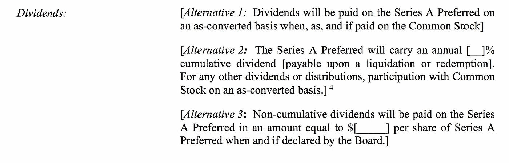
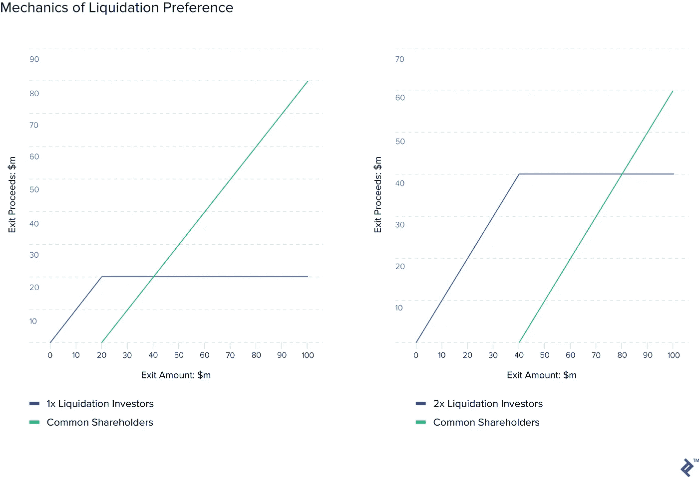
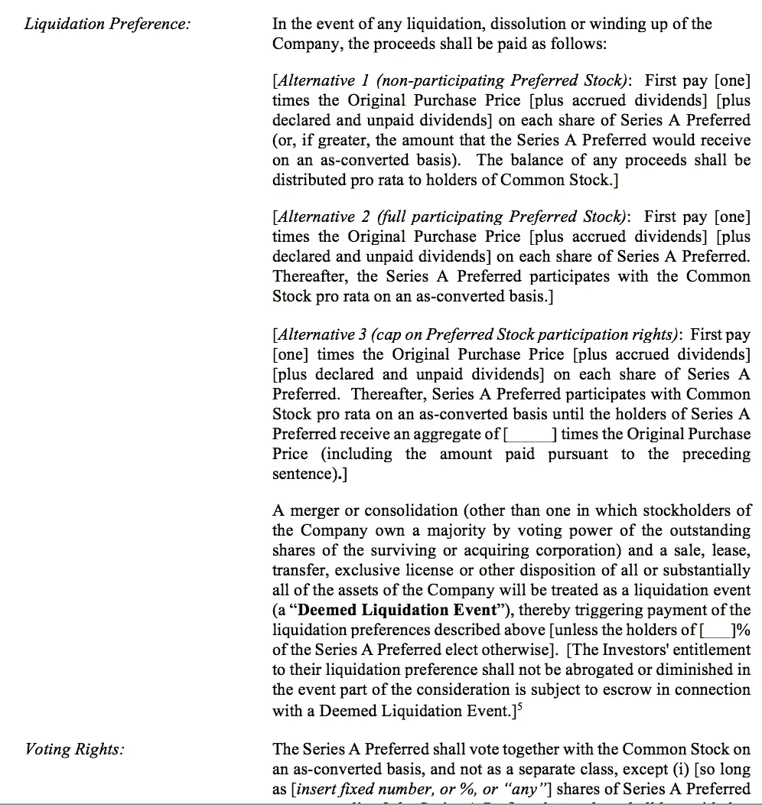
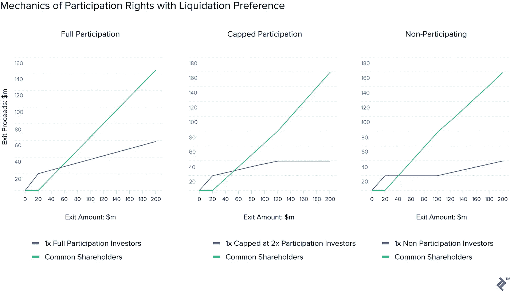
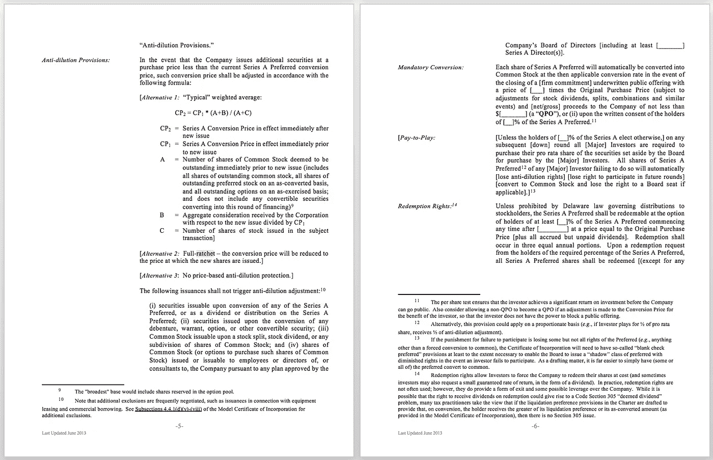
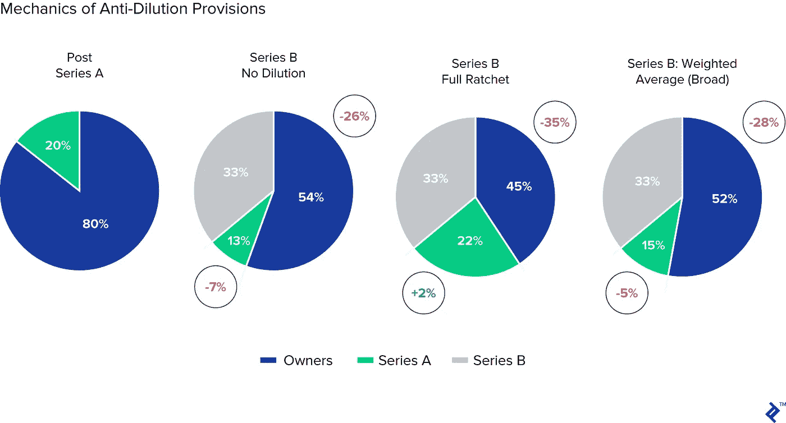
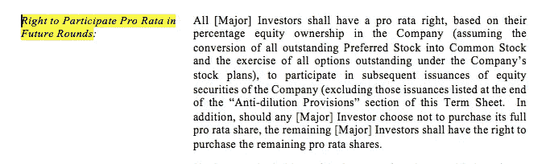
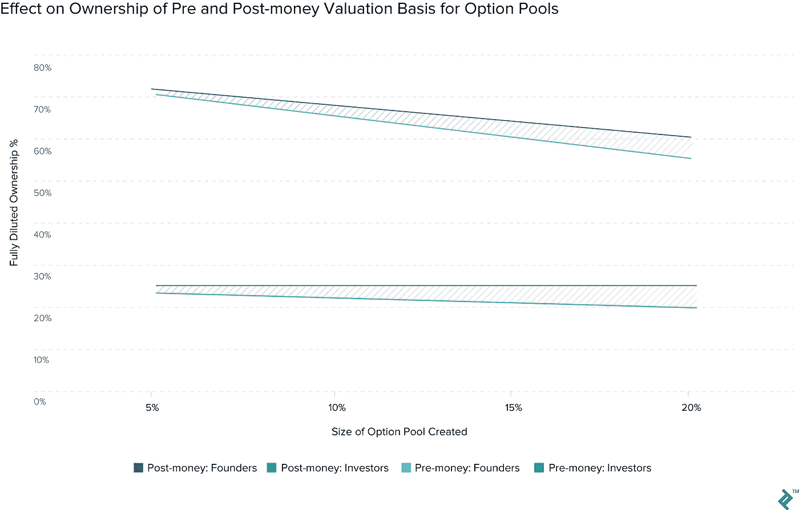
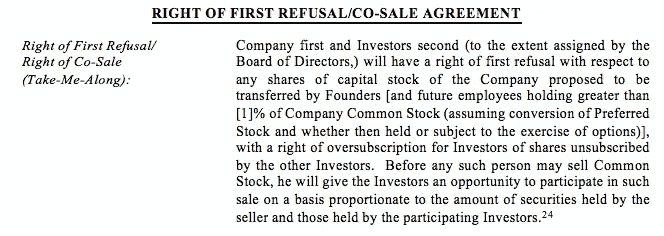
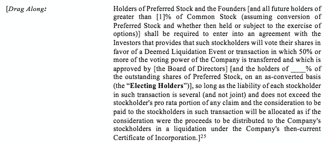

# 条款清单模板——谈判过程中需要注意的条款

> 原文：<https://medium.com/swlh/term-sheet-templates-clauses-to-look-out-for-during-negotiation-fd81271d26de>

Source: [Toptal](https://www.toptal.com/finance/fundraising/common-term-sheet-mistakes-founders-make?utm_source=Medium&utm_content=term)

近年来，通过创业文化走向主流，以及通过各种博客和 T2 播客提供更多透明度，为企业家筹集资金的过程已经不再神秘。

然而，尽管如此，筹资过程的某些方面对创始人来说仍然具有挑战性。在[我的工作](https://www.toptal.com/finance/venture-capital-consultants)，我经常收到帮助创始人处理投资回合条款清单的焦虑请求，他们要么对术语感到困惑，要么担心质疑点可能会失去交易。

# 准备好谈判，而不是赎金

有许多努力旨在概述“中性”条款清单应该是什么样子(例如 Y Combinator 的 [SAFE Financing Documents](https://www.ycombinator.com/documents/) 和 [NVCA 的](http://nvca.org/)条款清单模板资源)。对于创始人来说，熟悉这些条款非常重要，因为一般来说，投资者会首先提交第一份条款草案。

需要说明的是，很少会看到条款清单中充满了对创业者不利的攻击性条款。大多数投资者都知道，创始人和股东之间的合作对于实现可观的资本回报至关重要。

然而，不幸的是，在某些情况下，某些条款清单条款可能会导致创始人无意中失去对其业务的控制或经济效益。**本文强调了这一术语可能引发的潜在陷阱，并解释了对创始人的潜在后果。**

*注意:虽然这篇文章主要是为创业者写的，但它也可以作为初创公司员工的有用资源，他们有基于股票的薪酬。*

# 预筹款:最初的功课

在进入条款清单条款的细节之前，首先强调一些需要完成的初步基础工作是有意义的。以下是我发现自己最常为创业者提供融资建议的领域。

## 1.找出归属

在内部，在与外部投资者进行谈判之前，确保制定适当的[授权时间表](http://www.investopedia.com/terms/v/vesting.asp)。一个拥有既得股票的创始人突然离开，会在资本表上留下死股，这可能会对剩下的创始人的努力产生重要影响。[这里有一个很好的指导](https://www.quora.com/Whats-an-appropriate-founder-vesting-schedule)让你开始这个话题。

## 2.让你的投资者保持一致

同时获得两份独立的条款清单是处理您的价值的绝佳方式。你可以孤立地比较这两者，更全面地了解投资者是如何评价你的。此外，如果一个投资者看到你已经把所有的鸡蛋放进了他们的篮子里，这可能会对某些谈判要素产生影响。

## 3.适应不匹配的投资者

如果一家初创公司从知名天使或早期风险投资基金获得了种子资金，那么它将经历一个运转良好的机器，不太可能出现意外。相反，如果一个机会主义的晚期私人股本投资者或新加入游戏的公司正在投资，那么如果它试图移植通常用于其他类型交易的条款清单，可能会有更多的法律问题需要解决。

## 4.做你自己的尽职调查

对于你的投资者，把这个过程看作是一个双向的尽职调查。他们的资质应该超越他们的财力来评估。选择你的投资者意味着选择长期的商业伙伴，他们在你的商业发展中扮演着重要的角色。所以一定要做好功课。[这里有一篇有用的文章](https://techcrunch.com/2012/04/08/things-to-consider-before-saying-i-do-to-investors/)可以开始。

## 5.聪明对待你的估价

任何融资者都需要学习[融资前和融资后估值](https://www.entrepreneur.com/article/312333)的概念。从所有权比例和经济角度来看，两者之间的口误可能是重大的。

要知道你的估值是如何与其他公司进行比较的。高估值当然可以显示一些外部验证和更强的账面财富。然而，如果你想进入下一轮，这也提高了你的业绩水平，这种情况也被称为“[估值陷阱](http://avc.com/2014/05/the-valuation-trap)”。

## 6.获得中立的建议

最后，与其他外部方联系，找一个在这方面有良好记录的律师，并确保自己决定雇佣谁。不一定选择你的投资人的推荐。这篇文章为解决法律方面的问题提供了一些有用的见解。

# 需要了解的条款清单详细信息

有了基础知识，我们现在可以进入给创始人带来问题的最常见的条款清单条款的细节。

## 1.优先股机制

早期投资者通常选择所谓的[优先股](http://avc.com/2011/07/financing-options-preferred-stock/)进行投资。优先股是一种不同于普通股的权益类别；可以说是牛类的高级经济。通过拥有不同的股票类别，投资者能够添加不适用于其他类别股东的独特条款和条件。[这种情况在 IPO 时](http://www.reuters.com/article/us-snap-ipo-votingrights-idUSKBN15I2W7)经常可以看到，在这种情况下，投票权往往在股票类别之间分配不均。

在债务人层级[中，优先股位于普通股之上](http://www.axial.net/forum/why-capital-structure-matters/)，因此持有人享有在其他股东之前收回资金的好处。在成功退出的情况下，这是一种被遗忘的形式，但在折价出售的情况下，它会产生实质性的影响。

因此，本文其余部分详述的投资意向书条款通常只适用于你的投资者将资金投入到你的公司后产生的优先股类别。

## 2.未来红利再现

优先股的一个特点是，它包含一个固定的股息百分比(收益率)，是欠其持有人的。股息是定期支付的利润份额，通常与蓝筹股相关。初创公司通常倾向于将现金流重新投入到业务中，尽管也有极少数例外。

在启动条款清单上，协商优先股股息有三种选择:

1.  "**自由支配**":当企业选择这样做时，就支付股息。
2.  "**固定**":定期以现金或股票形式支付保证股息。
3.  "**累积** ": [附带强制累积股息权利](https://www.techstartuplawyer.com/toolkits/venture-capital-financing/liquidation-preference-accrued-and-unpaid-dividends/)，每年累积股息，并在清算事件时支付

这些排列的措辞示例如下所示，摘自 [NVCA 投资意向书模板](https://nvca.org/resources/model-legal-documents/):

第一种选择是对创始人最友好的，但所有融资都是基于个案的。因此，请注意，对于其他选项，相对于投资者的初始现金投资，这些义务将增加投资者应得的经济考虑。

## 3.清算偏好的隐藏冰山

你会遇到的最常见的创业投资意向书条款之一是[清算优先权](http://www.investopedia.com/terms/l/liquidation-preference.asp)。顾名思义，清算优先权决定了清算事件(如出售公司)的支付等级。清算偏好允许投资者定义他们被保证作为支出的初始数量。让我们看一个例子。

1 倍的清算优先权意味着投资者可以保证获得 1 倍的初始投资回报。因此，如果你的投资者向你的公司投资 1000 万美元，而公司以 1100 万美元的价格出售，他们将在任何人之前收回全部 1000 万美元。2 倍的优先权会将这一障碍提高到 2000 万美元，以此类推。

请记住，这一切都发生在普通股股东(即创始人和员工)开始获得收益之前。

## **清算优先权的图示**

*在每个示例中(第一个示例是 1x 清算优先权，第二个示例是 2x 清算优先权)，投资者已经投资了 2000 万美元，以获得 20%的事后报酬。*

正如你在 x 轴上看到的退出价值，对于低价值的退出，清算偏好给予投资者大部分的证券和相对价值，从普通股股东那里收回回报。

## 4.通过参与权二次探底

如果参与优先股被发行，投资者在他们的清算权利被履行后获得进一步上涨的机会。这使得投资者不仅可以通过清算权收回原始投资，还可以按比例分享剩余收益。

有三种类型的*参与权*，根据其对投资者的经济利益而定。在谈判过程中，企业家必须特别注意陈述的类型。

*   **全员参与**:最有利于投资者的选择。投资者首先获得他们的清算优先权，然后按比例获得剩余收益。
*   **封顶参与**:按全额，但清算总回报和参与权以规定倍数封顶。
*   **不参与**:对企业家最友好的选择。投资者必须在他们的直接清算偏好或所有收益的比例份额之间做出选择。

这些条款的后果是，投资者从退出中获得的经济收益往往高于他们对公司的实际所有权比例。**只有在 1 倍非参与的成功退出中，投资者才能根据其实际持股比例获得收益(通过选择其比例)。**

投资者插入这些条款是为了减轻风险，并奖励他们在早期或以后的困难时期对企业表现出的信心。最好是充分了解商定的条款，并做一些测试场景，以避免将来出现任何不愉快的意外。

清算优先权和参与权通常会一起包含在条款清单中。下面是中的子句的 NVCA 例子，这样你可以开始习惯它的样子。

## **参与权的图示**

下面您可以看到在流动性偏好部分介绍的场景的扩展。在这个例子中，显示了投资者可以附加到其股票的不同参与权以及 1x 清算优先权的支出。

显然，全面参与的方案会给投资者带来最高的回报。封顶投资者遵循类似的轨迹，然后达到 4000 万美元的上限(2 倍)。对于非参与投资者，他们首先获得 1x，但在 1 亿美元的回报后，他们的支出(和创始人的回报)将开始与他们的实际所有权百分比相对应。

在这份来自 WSGR 的[报告中，81%的受访者使用了对创始人友好的非参与术语。在上行轮中，这一数字略有下降，在上行轮中，投资者将通过上限和完全参与权来增加保护，从而对更高的估值条款做出回应。**一般来说，没有参与的 1x 清算优先权是早期融资轮的公平报价**。](https://www.wsgr.com/publications/PDFSearch/entreport/Q32016/private-company-financing-trends.htm)

## 5.极端反稀释条款

一个理性的投资者总是达成交易，因为他们相信这将成为一个成功的全垒打。尽管有这种心态，他们还是会经常寻找应急措施，以确保在未来结果令人失望的情况下拥有股权。

这在[下一轮](http://www.investopedia.com/terms/d/downround.asp?ad=dirN&qo=investopediaSiteSearch&qsrc=0&o=40186)场景中尤为相关。在这个十字路口，投资者股票未来估值的降低不仅会损害经济利益，还会稀释股权，从而降低对公司的战略影响力。

为了缓解未来较低的估值，投资者可以插入反稀释条款，调整他们的所有权股份，以避免受到太大的冲击。其主要应用是通过[加权平均](http://www.feld.com/archives/2005/03/term-sheet-anti-dilution.html)和[完全棘轮](https://www.foley.com/intelligence/detail.aspx?int=9064)方法。你可以把这些想象成投资者的保险单，保护他们免受下跌的影响，就像看跌期权应用于投资组合管理一样。

这两种方法都涉及将持有人的现有股票转换成新的分配，以说明和补偿下行周期的影响。两者之间的区别在于，加权平均稀释考虑了新发行股票相对于现有资本基础的**价格**和**数量**。完全棘轮只是考虑了新**价格**的影响。

通过思考新一轮的规模，加权平均法对创始人更友好。如果你想了解更多这些方法背后的计算，这篇[文章](https://www.strictlybusinesslawblog.com/2014/03/08/venture-capital-term-sheet-negotiation-part-7-anti-dilution-provisions/)提供了清晰的解释。

如今，在早期投资条款清单中，完全棘轮可能是一种罕见的景象。它们被视为应用投资者保护的一种极端方式，因为一旦被触发，它们的应用实际上可以导致投资者增加他们的所有权比例。这是因为完全棘轮将触发所有条款持有人股票的重新定价，即使只有一只新股的定价低于其价值。

根据 NVCA 条款清单模板，以下是反稀释条款的条款清单措辞示例:

## 反稀释条款的图示

为了证明反稀释方法的效果比较，在将它们纳入理论上的 A 轮系列后，可以在下面看到由此产生的所有权百分比变化的直观总结。请注意在完整的棘轮例子中，首轮投资者如何在下一轮中获得更高比例的公司股份。

*注:A 轮投资人投入 8000 万 pre-money 轮估值。正在进行的 B 轮投资者投资 6000 万 pre-money。*

前面提到的 [WSGR 报告](https://www.wsgr.com/publications/PDFSearch/entreport/Q32016/private-company-financing-trends.htm)显示，绝大多数投资者现在选择更平等、基础更广泛的加权平均法。追溯重估也可以应用于之前的投资轮次，正如 2016 年的 [Zenefits](https://techcrunch.com/2016/06/30/zenefits-revalues-itself-at-2-billion-giving-later-shareholders-more-ownership/) 所看到的那样

**如果正在协商稀释保护，除非您的公司处于非常困难的财务状况，否则您应该强烈主张广泛的加权平均稀释保险。**

## 6.超级按比例分配权利的障碍

按比例分配的权利是早期融资的支柱，通常是条款清单中包含的积极因素。它们为初始投资者在未来几轮投资中提供了一种选择(权利，但不是义务)，以维持他们的所有权比例，否则他们的所有权比例会被稀释。

这让他们排在队伍的最前面，对他们的赢家加倍下注，保持一定比例的所有权，并因为他们最初的信念而得到回报。

按比例配股还可以作为新一轮启动的催化剂，并吸引新的投资者进入。尽管未来几轮对股票的需求可能会变得拥挤，一些新投资者可能会抱怨将现有股票让给小投资者，但这些都被普遍接受。

下面是一个措辞示例(再次通过 NVCA 使用[，说明如何将按比例分配的权利应用到条款清单中:](http://nvca.org/resources/model-legal-documents/)

比例权利变得更加复杂的地方是，当它以超级比例权利的形式出现时，它允许持有者在未来几轮中增加(而不是保持)他们的所有权股份。

如果这一轮融资受到渴望进入的新投资者的激烈竞争，而早期投资者决定行使超比例权利并增加他们的所有权，结果可能是没有足够的股权供较大的投资者购买。

由于较大的基金通常需要投资较大的规模，如果他们开始发现很难达到他们的最低投资额，他们可能会决定完全退出这一轮。在这种情况下，创始人可能会被迫牺牲更多的所有权，以满足新老投资者的配置要求。

这种情况还可能导致超级比例权利投资者挟持公司。例如，如果有人反对向他们提供更多的分配，他们可以通过保护性条款(见下一节)试图否决交易，从而中断融资回合。

即使在最初的投资阶段，如果投资者要求获得超比例的权利，这是一个不祥的征兆。通过要求这种对未来进行更多投资的自由选择，他们基本上是在说:“我们相信你，但现在还不够。”

## 7.期权池魔术

创业公司通常会使用员工股票期权池来激励和奖励员工。这是金融理论民间传说的一部分，旨在协调利益，避免代理成本。这是很自然的，然后讨论将发生在你的条款清单谈判股票期权。

AngelList 的一项[分析](http://tomtunguz.com/option-pool-planning/)显示，一家企业的前 34 名员工需要获得 0.25%至 3%的股票奖励(平均为 1.375%)，因此，在首轮融资中，企业将有 15%至 25%的稀释所有权分配给员工。每一轮都需要充值，到了后期，创业员工将拥有 [10%(欧洲)到 20%(美国)](https://www.indexventures.com/sites/default/files/pdf/index_ventures_hand_book_2_digital_1600x1200-2018-01-05.pdf)的股份。

创建期权池时要注意这些平均值:相对于你的规模，不要创建不必要的大期权池。这将降低未分配股权的可能性，并确保未来的投资者通过以后的充值为负担提供资金。

然而，条款清单中有一个关于员工股票期权的重要细节需要注意:

## 它们包括在投资前或投资后的估值中吗？

如果条款清单规定，一家企业的投资前估值包括一个期权池，该期权池以其投资后完全稀释的资本化进行估值，那么在投资发生之前，该期权池的创建将完全由股东出资。

这篇[文章](https://www.toptal.com/finance/fundraising/aribbeanavenue.com)提供了这种情况背后的全面解释和数学计算，其中“真实”的前期估值通过包含期权池而被有效降低。创始人和早期投资者必须自己出资购买期权，尽管它们是基于新融资后的企业价值。从而让新投资者以较低的股价进行投资。

在更平等的情况下，期权池是在融资后创建的，这导致新老股东分担稀释。

为了直观显示这一点，下面的图表显示了在融资前和融资后的情况下，期权池的创建对所有权变化的影响。在这个简单的例子中，500 万美元正以 1500 万美元的(实际)投资前估值进行投资。创始人是公司仅有的早期投资者。

对于创始人来说，根据期权池的规模，承担期权池创建的全部成本与承担部分成本的差异从 1.25%延伸到 5%。这是重大稀释，并保证在审查相关条款清单部分时采取预防措施。

## 8.通过信息和转让权实现清晰

这些术语不像其他术语那样可以量化，但仍然非常重要。它们与您的投资者在您公司的所有权股份相关的行为有关。这里宽松的术语可能会因为利益冲突而破坏进度。

例如，拥有[优先购买权](http://www.investopedia.com/terms/r/rightoffirstrefusal.asp)条款允许通知所有现有股东，并允许他们从想要出售股票的投资者那里购买股票。这与批准出售条款(指示董事会批准所有所有权转让)一起，防止了秘密转让股票的发生。如果没有这些条款，理论上，一个心怀不满或受到激励的投资者可能会在没有人知道的情况下把他们的股票卖给你的竞争对手。

这是 NVCA 对优先购买权的表述。

如果优先购买权条款[与贵公司的收购](https://www.feld.com/archives/2006/04/right-of-first-refusal.html)有关，请小心。在这种情况下，投资者(通常是公司)将拥有在出售时直接购买公司的优先权。虽然这可能引发竞购战，但对于未来的投资者，或者实际上与条款投资者竞争的客户/供应商来说，这同样是一个负面信号。

当投资者希望通过共享信息或投资于竞争业务部门来利用其投资组合时，保密协议和非竞争条款可以防止利益冲突。它们不仅能防止竞争公司获得不公平的优势，还能让投资者关注你正在取得的成功。

与本文中讨论包含某些术语如何对您有害的其他部分不同，包含以上几点实际上可以帮助您。**我鼓励你推动纳入信息和转让权，并清楚地阐述其应用**。

## 9.限制性保护条款和拖曳权

保护性条款赋予投资者否决权，否则他们将无法在董事会层面行使否决权，因为他们的股份百分比不构成多数。一般来说，对于关键问题，如公司出售或股票发行，这是非常标准的做法，因为它迫使讨论包括所有相关方。

尽管本意是好的，但这些保护性条款有时会走得太远。如果对开支和雇用签署有惩罚性的否决限制，它们可能会引起摩擦，降低决策能力。

[投资者的拖拉权](http://www.investopedia.com/terms/d/dragalongrights.asp)允许他们强迫其他类别的股票同意他们对清算事件(即出售、合并或解散)的投票要求。

传统上，它们被用来允许大股东通过行使他们对小股东的多数(> 50%)来跟随他们的行动选择，从而干净利落地完成出售。我说传统上，是因为如果所有的股东都是相同的级别和条件，多数投资者的需求很可能在经济上与少数股东一致。

正如我们前面所讨论的，当引入不同种类的股票及其单独的条款时，就增加了拖动权条款的重要性。

在这种情况下，触发拖累所需的多数票可以仅来自优先股类别中的多数票。如果这个决定不需要董事会的批准，普通股股东可能不得不遵循一个不受他们控制的决定。

来自 NVCA 的术语模板展示了该条款的术语如何以多种方式进行改编。

有些情况下，投资者可能热衷于出售，但创始人却不愿意。对于拥有诱人的清算权和/或参与权的投资者来说，在紧张的运营时期意外的收购要约可能是一个有吸引力的选择。通过行使拖曳权，这些投资者可以迫使创始人出售。

为了避免上述情况，企业家可以采用的谈判策略是**增加所需的多数票(尝试高于 50%的开场策略)以触发拖拉条款**。

此外，**抵制排除理事会批准**，为决策流程增加另一个安全层。此外，**在拖带条款**中增加一个最低销售价格的约定，可以确保如果它被触发，在这个价格和清算优先权之间有足够的空间，让企业家把经济学留在桌面上。

这一条款最友好的应用是当它只适用于大多数普通股股东时。在这种情况下，优先股股东面临转换为普通股参与投票的权衡，如果他们这样做，就会牺牲他们的清算优先权。

# 浅谈可转换票据

对于种子期公司来说，可转换票据是最受欢迎的融资形式。可转换票据和普通股权结构之间的根本区别在于，它是一种债务工具，带有日后转换为股权的条款。

“[企业家友好型](https://www.quora.com/Series-Seed-or-Convertible-Note-Which-one-is-more-founder-friendly-Which-one-do-investors-prefer)”可转换债券对于初创公司来说有着非常重要的作用。除了比直接股权更便宜(在法律费用方面)和更快谈判之外，他们避免在创业公司生命的某个阶段进行估值讨论，此时估值实际上只是猜测。

关于可转换票据条款以及它们对转换的影响已经说了很多。为此，我将只关注高层次的数字术语，以及您如何在它们周围定位自己。

*   **上限**:上限越高越好，因为如果触发，投资者在转换时将因定价更接近股权回合条款而拥有更少的股权。上限的模态范围是目标定价轮估值为 [**1.8x**](https://equidam.com/convertible-note-calculator/#/index) **更高**。
*   **折扣**:较低的利率更好，因为投资者将更接近于你未来一轮定价中包含的基本面。上述相同的数据表明 **20%的折扣是意料之中的**。
*   **利率**:经常被忽视，因为一般来说，实际上没有利息券被兑换。作为一种形式，较低的利率将有利于你，当利息累计到已发行的股票。**利率将与您所在市场的基础浮动基准利率挂钩**。

## 他们什么时候皈依？

对投资者来说，显而易见的意图是让这种债券在你的下一轮融资中转换:一轮定价的股权融资。

但是请注意其他可能触发转换的事件，以消除任何歧义。在 M&A 或租购销售的情况下，预先约定最低回报倍数将确保在这些意外事件发生时的透明度。如果没有明确的条款，除了标准的价格轮转换事件之外，投资者可能只在法律上有义务收回其原始投资。这可能会导致你和他们的关系丑陋和/或持久的结束。

此外，要知道票据的到期日以及此时会发生什么。是否规定了票据将被偿还，或者是否规定了转换为股权的价格？请记住利率，因为票据持续的时间越长，利率越高，越多的钱将被计入股本。

# 条款清单很复杂，但清楚地设定了参与的规则

讨论的要点展示了在谈判投资回合时可能存在的复杂权衡。一旦支票兑现，投资者的参与并没有结束，对这些条款的解释显示了它们如何以其他方式显著影响他们的投资结果。

然而，如果掌握了正确的知识，创始人不仅可以避免这些陷阱，还可以实际使用这些术语作为有效的保护措施。

我希望本指南为您提供了一个有用的高层次总结，让您了解在进行任何条款清单谈判时需要注意的事项。回到前面的问题，如果你有其他问题，有一位经验丰富的律师在你身边会非常有帮助。尽管如此，请在这里随意发表任何问题或评论，我会尽可能地解决它们。

【www.toptal.com】最初发表于**。**

**

## *这篇文章发表在 [The Startup](https://medium.com/swlh) 上，这是 Medium 最大的创业刊物，拥有+383，719 名读者。*

## *在此订阅接收[我们的头条新闻](http://growthsupply.com/the-startup-newsletter/)。*

**