# 测试这 5 件事会让你的在线转化率翻倍

> 原文：<https://medium.com/swlh/testing-these-5-things-will-double-your-online-conversions-e6ac5112377c>

总是在测试。

如果你不是，让我告诉你怎么做。

这里有 5 样东西你可以今天下午在*上测试，以增加今晚*的转化率。**

**不客气**

## **#1**

# ****头条****

**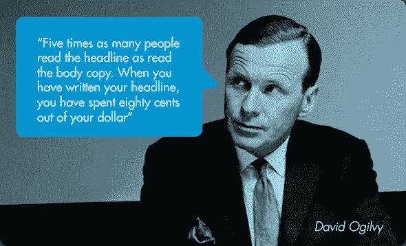**

**就页面元素而言，标题是增加转化率的王。**

***为什么？***

**因为 80%的网站访问者只会阅读标题。**

**只有五分之一的人会继续阅读剩下的部分。**

**正如 Upworthy 的 Peter Koechley [在 *Wired* :](http://www.wired.com/2013/02/tabloid-chic-the-rise-of-racy-headlines/) 中所说**

> **“当我们测试标题时，我们看到 20%的差异、50%的差异、500%的差异。一个真正优秀的标题可以让一些东西像病毒一样传播开来。”**

**大量研究支持这一观点:**

*   **芬兰 SEO 机构 [Tulos 通过改变标题将客户的转化率提高了 127%](https://vwo.com/blog/ab-test-headlines-improvement-conversion-rate/) 。**
*   **Source Patrol LLC [通过标题变更，为一家客户增加了 89.97%的销售额](https://vwo.com/blog/headline-ab-test-increased-sales/)。**
*   **测试标题使诺亚·卡根的 300 美元课程销量增加了 6.49%。**

**那么如何测试标题呢？**

## **25 条标题规则**

**亚当·莫迪凯曾经是《洋葱报》的编辑，现在是 Upworthy 的自由编辑，他有一条黄金法则:写 25 个标题。**

> **“之所以总是 25 岁，不多不少，是因为这迫使你在写作时跳出框框思考。你对 21 号标题感到绝望，做了一些非常出格的事情，以至于这不是典型的标题。**

**如果这对你来说太模糊，看看指挥的图表:**

**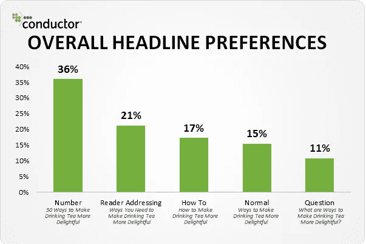**

**[Source](https://moz.com/blog/5-data-insights-into-the-headlines-readers-click)**

**数据很清楚:[直截了当地面对读者](https://moz.com/blog/5-data-insights-into-the-headlines-readers-click)(*你】*)，列出清单，提供有价值的信息让你获得更多的股份。**

**这里有一个例子:**

**如果你有一篇关于*如何写得更好*的文章，你可以用图表中的框架写出 25 个标题:**

*   **列出了今天成为更好作家的 7 个简单方法**
*   ****How-to:** [**CTA 按钮**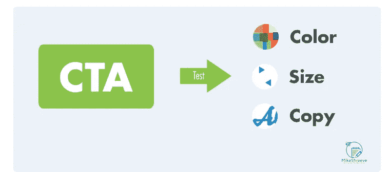

    这是一个简单的测试。你只想知道:](https://blog.growth.supply/how-to-write-10-000-words-per-day-9bfb3c99042f#2</h2><h1 id=) 

    [*“我是不是在增加*](https://blog.growth.supply/how-to-write-10-000-words-per-day-9bfb3c99042f#2</h2><h1 id=)[*CTR*](https://en.wikipedia.org/wiki/Click-through_rate)*？”*

    做对了这一点，你就在谈论增加你的文案中最重要的部分:

    你的读者实际上做了一些事情。

    现在有三样东西需要测试。

    # **#1**

    ## **CTA 复印**

    这可能会让你吃惊，但是在你的 CTA 中调整几个词会对转化率产生巨大的影响。

    不相信我？在转向以利益为中心的文案后，这项业务的转换率增加了 [68%:](http://unbounce.com/conversion-rate-optimization/how-to-write-a-call-to-action-that-converts-with-case-sudies/)

    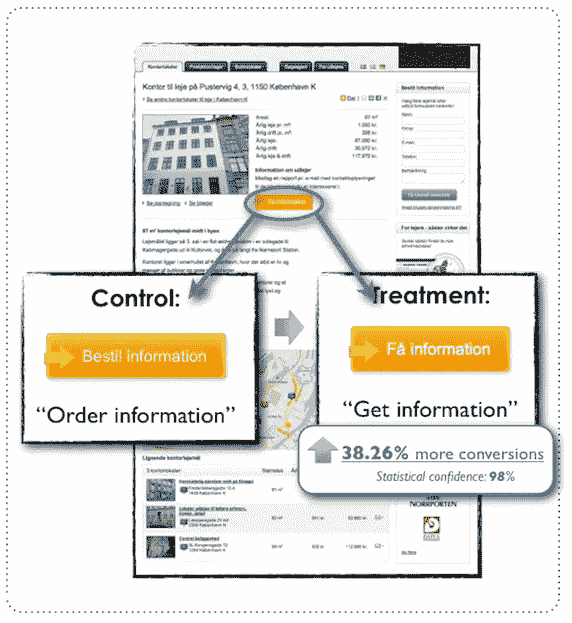

    [Source](http://unbounce.com/conversion-rate-optimization/how-to-write-a-call-to-action-that-converts-with-case-sudies/)

    在另一项测试中，在使副本更加个性化后，转化率增加了[90%——从*开始你的免费试用*到*开始我的免费试用。*](http://contentverve.com/10-call-to-action-case-studies-examples-from-button-tests/)

    不幸的是，我不能给你一个“一刀切”的解决方案来解决 CTA 复制的困境。但是，我可以为您提供一些关于在您的副本中测试哪些更改的指导:

    *   个性化:用“我的”而不是“你的”来让文案看起来更个性化。
    *   **关注结果:**使用以效益为中心的文案，承诺结果，而不仅仅是一个产品(*“了解如何节省更多的钱*”，而不是*“了解更多*”)。
    *   **使用动作词:**如‘免费’、‘保存’等词。邀请行动。在你的文章中多使用它们。你可以在这里找到一个行为词汇列表。

    像往常一样，混合搭配以上内容并进行测试。

    # **#2**

    ## **CTA 按钮颜色**

    花十分钟在线阅读关于转换优化的文章，你可能会看到有人宣称“黄色/橙色/绿色按钮表现最好”。

    千万不要相信。

    什么颜色转换最好很大程度上取决于你的交通，产品和设计。一些网站用红色按钮会看到很好的结果，而其他网站用绿色按钮可能会更好。

    重要的是要确保颜色在页面上醒目。

    例如，在一次测试中，将按钮颜色从蓝色改为绿色[，转化率提高了 35.81%](http://contentverve.com/10-call-to-action-case-studies-examples-from-button-tests/) 。

    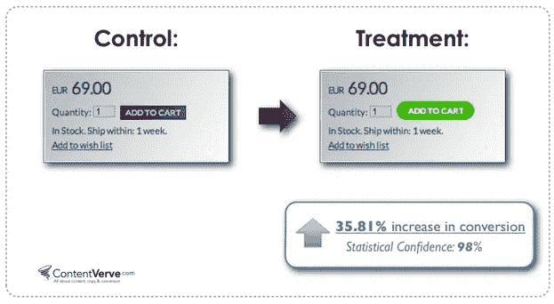

    [Source](http://contentverve.com/10-call-to-action-case-studies-examples-from-button-tests/)

    这与[色彩心理学](https://blog.kissmetrics.com/psychology-of-color-and-conversions/)关系不大，更多的是因为绿色在蓝色页面上突出。

    **要点:**不要盲目地采用一种颜色，而是挑选一些在页面上突出的东西，并进行测试。

    # **#3**

    ## **按钮尺寸**

    测试按钮尺寸时，遵循与按钮颜色测试相同的原则——选择一个在页面上突出的尺寸。

    然而，这比简单地将所有的 CTA 按钮变大要复杂得多。似乎有一个点，超过这个点，大按钮实际上会降低 CTR，影响用户体验。

    例如，[一项测试](http://unbounce.com/conversion-rate-optimization/design-call-to-action-buttons/)发现，按钮尺寸增加 10%会降低 CTR，降幅之大令人震惊。

    一种解决方案是以 5%的增量制作按钮并进行测试。最终，你会找到高点击率和高可用性的最佳点。

    一旦你找到了最佳地点，你就可以给我开支票了。** 

## **#3**

# ****社交媒体****

**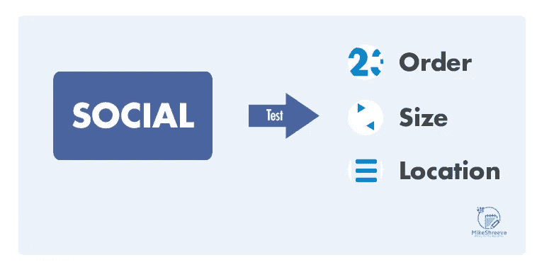**

**如果你从社交网站获得(*或想要获得*)流量，你应该进行测试。**

**这里有一些你应该测试的东西:**

# ****#1****

## ****分享按钮位置****

**大多数网站遵循一个简单的模式——标题下有一排分享按钮，文章底部有另一排。有些人甚至会在页面的左边放一个浮动栏。**

**由于按钮在任何地方都处于相同的位置，这可能会导致“按钮盲”。解决这个问题的一个方法是测试共享按钮的不同位置。尝试不同的组合，如仅在帖子下方，仅在帖子上方，浮动共享栏+帖子底部等。**

**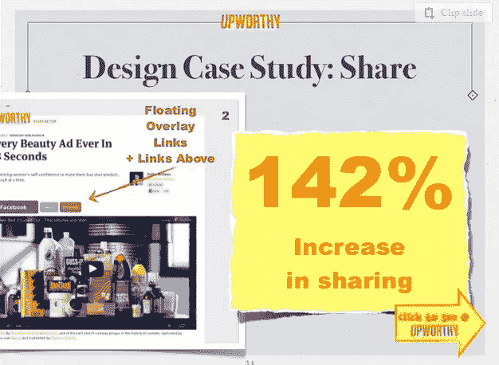**

**[Source](http://www.slideshare.net/Upworthy/upworthy-10-ways-to-win-the-internets)**

**例如， [Upworthy 通过在帖子前添加一个浮动的覆盖链接和分享按钮，将份额提高了 142%](http://www.slideshare.net/Upworthy/upworthy-10-ways-to-win-the-internets) 。**

# ****#2****

## ****分享按钮大小****

**有什么特殊的社交网络占了你大部分的股份吗？**

**那么，为什么不为特定网络的按钮测试一个更大的尺寸，看看影响。**

**Upworthy 做了类似的事情——它在 hover 上增加了脸书股票按钮的大小，看到了股票 398%的惊人增长。**

# ****#3****

## ****分享按钮样式****

**大多数网站使用与主题/共享插件捆绑在一起的默认共享按钮样式。这要么是社交网络本身提供的按钮，要么是常见的设计变体。**

**这两种风格都不突出，不引人注意。**

**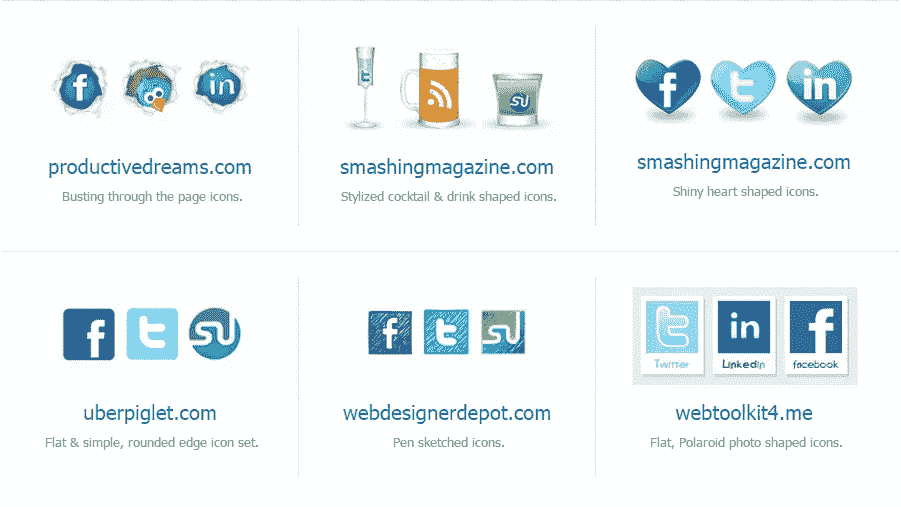**

**In a world of default settings, the one-eyed man is king. Try something different. [Source.](http://www.sharethis.com/publishers/button-gallery)**

**尝试测试不同的按钮样式，并测量对总份额的影响。一个不寻常但容易识别的设计可以让按钮脱颖而出，让你得到更多的点击。**

# ****#4****

## **你真的需要它们吗？**

**分享按钮对内容来说很好。**

**它们在网络上的其他地方并不总是有意义的。**

**酸味[Taloon.com](https://vwo.com/blog/removing-social-sharing-buttons-from-ecommerce-product-page-increase-conversions/)摆脱了他们的社交按钮，看到总的“添加到购物车”行动增加了 11.9%。**

**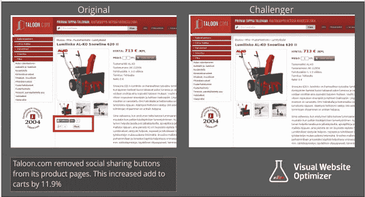**

**[Source](https://vwo.com/blog/removing-social-sharing-buttons-from-ecommerce-product-page-increase-conversions/)**

**重要的补充说明:有时你必须打破常规，在 A/B 测试中取得突破。**

**事实上，你几乎总是不得不。**

**不要害怕尝试新事物。**

## **#4**

# ****表格****

**注册表单、电子邮件表单、调查表单……这些是你网站中最重要的部分，但也是最少被测试的部分。**

**如果你在你的网站上使用默认表单，请先测试一下。**

# ****#1****

## ****双击表单****

**这听起来可能违反直觉，但在电子邮件选择加入表单中增加额外的点击可能实际上增加你的转化率。**

**LeadPages 采用了这种策略，订阅量增长了 60 %( T21)。**

**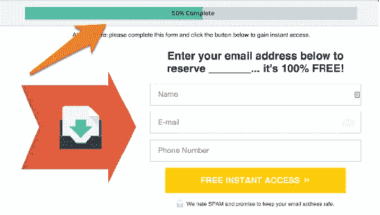**

**这背后的想法很简单:通过在注册过程中增加一个额外的步骤，你实际上过滤掉了最没有积极性的人。转换率上升，你得到更好的质量订户。**

**在你的电子邮件表格中测试一下，看看结果。**

# ****#2****

## ****表格长度****

**这是一个显而易见的问题:没有人喜欢填写长表格。**

**然而，你的问题是，在你看到对你的转换率的负面影响之前，这个表格能持续多长时间。**

**尝试在您的注册和潜在客户捕获表单中添加和删除字段。改变你要求的信息的数量和种类。你会发现，虽然人们会相对容易地放弃他们的电子邮件，但他们会更加保护自己的电话号码。**

**创建一组不同的表单，每个表单都有单独的字段，例如:**

*   **只有电子邮件和密码字段的表单。**
*   **只有电子邮件字段的表单。**
*   **要求提供个人信息(*姓名、电话号码、出生日期等)的表格。*)除了用户名和密码。**
*   **包括脸书/谷歌/LinkedIn 注册选项的表单。**

**诸如此类——你大概明白了。**

**你的目标是在不影响用户体验的情况下，测试出不同的组合，并衡量你能从你的冲浪者那里获得多少信息。**

## ****#5****

# ****登陆页面内容****

**你的登陆页面到底应该有多长？**

**说实话，没人知道。**

**有一些营销人员说，少于几千字，你会刮 CRO 桶的底部。他们会提到 Moz.com 花费 100 万美元重新设计的主页和 HighRise 的有据可查的登陆页面实验。**

**但如果你现在登陆 Moz 或 Basecamp ( *37Signals 的新名字*)主页，你会看到有数百而非数千字的页面。**

**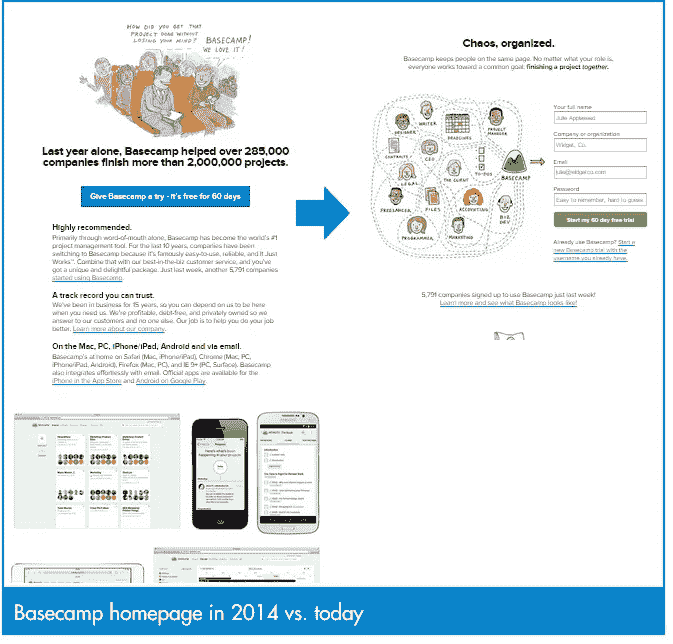**

**(*目前的 Basecamp 主页实际上只有 177 个字*)。**

**Buffer 似乎也在做类似的事情——它的登陆页面只有一个注册表单。**

**一些测试表明，较短的页面实际上可能比较长的页面转换得更好:**

*   **DesignBoost [通过更短的登录页面将电子邮件注册率提高了 13%](http://conversionxl.com/4-cases-where-short-home-pages-outperformed-long-home-pages/) 。**
*   **通过减少内容长度和删除额外的 CTA，PipeDrive 的注册人数增加了 300%。**

**当然，和其他在线产品一样，这完全取决于你的定位、产品和流量。**

**首先，测试这些登录页面创意:**

*   **在页面上添加/删除评价。**
*   **添加/删除导航栏。**
*   **添加/删除侧栏。**
*   **添加/删除页脚。**
*   **在文件夹上方添加注册表单。**
*   **使用人的图像而不是物体。**
*   **每页只使用 1 个 CTA。**
*   **添加/删除客户徽标和“特色”部分。**

**除了单个组件之外，您还应该测试正文副本的不同变体。对比测试不同的标题、标语、特色和以利益为中心的文案等。这应该是一个长期的项目，你应该和一个有经验的文案一起工作。**

**由于制作新的登陆页面比改变按钮的颜色需要更多的投资，我建议把这些测试留到最后。在你处理拷贝修改和多页面变体之前，先抓住所有容易的 CRO 胜利。**

**如果你不能决定是长格式还是短格式，就问乔安娜该怎么做:**

# ****“我应该考多少？”****

**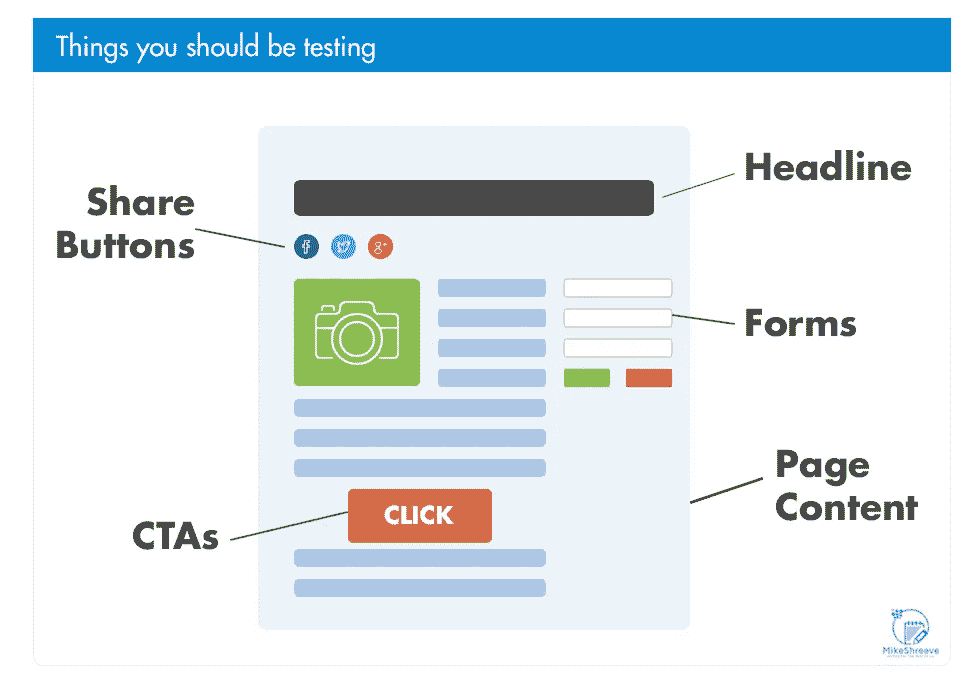**

**测试实际上从未停止过。**

**你可能会找到一个更好的 CTA 或标题转换版本，但这并不意味着你不能在未来做得更好。**

**拥抱持续的测试，你将永远不会再与转化率作斗争。**

# **每天将这样的文章发送到您的收件箱**

***想要更多这样的文章吗？注册* [*我的私人每日简讯*](https://mikeshreeve.clickfunnels.com/mediumnewslettersignup) *我在这里写关于创业、成功心理、写作以及这之间的一切。***

****

***发表于* **创业、旅游癖和生活黑客****

************

**-**