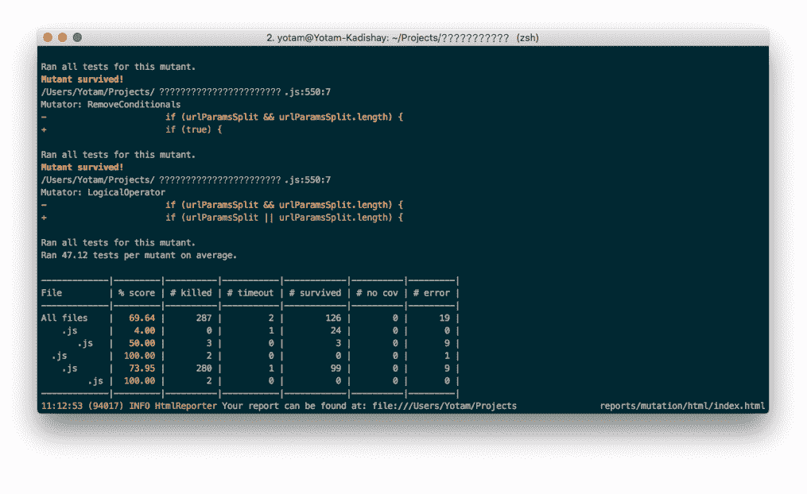

# 测试覆盖面是死的——变异测试万岁

> 原文：<https://medium.com/swlh/tests-coverage-is-dead-long-live-mutation-testing-587b4359d6ab>


在今天的行业中，拥有一个伟大的产品可能还不够。竞争潜伏在拐角处，市场领导者的一个关键优势是他们能够在不被 T2 破坏的情况下快速行动。

公司变得越来越注重质量。众所周知，作为终端用户，我们被宠坏了。有多少人想到甚至大声说出了下面这句话:“我讨厌这个免费的工具！有一次在我需要的时候加载失败了。”因此，许多公司把产品质量放在基座上，并将其视为自己的圣杯。

简单地在网上搜索如何保证质量作为持续集成/持续部署(CI/CD)周期的一部分，人们可以很容易地理解自动化测试是必须的，而单元测试是其基石之一。

而是“多少次测试？”有人可能会问自己最喜欢的搜索引擎中的输入框。不幸的是，这里的答案是模糊的。

调查万维网，你会发现代码覆盖率是关键的指标，并且依赖于你的代码类型(功能、逻辑等等。)，您可以定义一个想要实施的随机代码覆盖率。试图做到这一点，你可以看到，在大多数情况下，100%几乎是不可能的。虽然 80%对你的代码来说更好，但是 100%真的比 80%好吗？如果您添加了更多的测试，这是否意味着您的测试套件更强大了？或者，它只是在增加功能上造成了夸大的开销？

追求随机覆盖指数有一些陷阱。从我个人的经验来看，作为一个努力工作的开发人员，我有时觉得在所有开发和维护阶段，我在创建和修改测试上投入了太多的时间。另一方面，我曾经从一个狡猾而懒惰的开发人员朋友那里听说，他听说一些开发人员正在添加测试来提高覆盖率，但是这些测试并没有完全覆盖功能——OMG！！！

提高覆盖率很容易——只需调用函数，或者加载对象，使用不同的输入——就完成了！而且也不总是故意的。有时我们根本没有考虑被测试单元的所有边缘情况，也许是因为我们太专注于消除未覆盖代码的红线。

# 停止杀死红线——杀死变种人

一个很好的解决方案是停止对测试代码覆盖率的困扰，并且有所保留。**我敦促你将突变测试**作为测试套件强度的关键指标。

突变测试包括更改代码——一次更改一小部分——创建突变体，并重复运行单元测试套件。如果测试仍然通过——这意味着他们无法识别突变体(这可能代表一种错误的行为)——我们可以得出结论，他们没有那么强，反之亦然。

例如，假设我需要编写一个函数来验证我的核反应堆是否应该冷却，或者它是否会发生核熔毁(不好)——如果温度高于 1000°c，这将是正确的。函数和测试的简单实现如下所示:

```
function isDangerous(temp) {
  if (temp > 1000) {
    return true; //run away now!
  } else {
    return false; //it’s a very nice…
  }
}test(“test isDangerous”) {
  expect(isDangerous(500)).toBeFalsy();
  expect(isDangerous(2000)).toBeTruthy();
}
```

测试通过了，测试覆盖率将达到 100% —耶！然而，正如我们所知，**代码覆盖率并不是测试强度和彻底性的最佳指标**。

如果我们要执行某个突变测试工具，它会运行这些测试，将'>'更改为' > = '的简单突变(这是一种常见的突变)，并预计我的测试会失败(因为功能可能发生了变化)。这暴露了我的测试中的一个弱点——我忘记检查并确保我正确地处理了数字 1000。这意味着我的测试可能是好的，但仍然不够彻底。解决这个问题很容易，只需要添加:

```
expect(isDangerous(1000)).toBeFalsy();
```

这种测试方法可以为我们提供一个更好的答案，来回答“我们的测试有多好/多强？”

一个很好的工具是 [stryker-mutator](https://stryker-mutator.io/) ，它在 CLI 中执行简单，支持主要的测试框架(karma、jest、jasmine 等)。)，它的输出是提高测试强度和软件弹性的可靠工具。



在 AppsFlyer，我们的 SDK 在全球 90%的移动设备上运行，我们的服务器目前每天处理约 500 亿个事件。我们认为自己是客户至上的，因此，我们不能在快速移动和向快速 CI/CD 环境添加功能的同时让我们的客户失望。因此，我们需要对我们系统弹性的真实质量和测试质量有透明度——我觉得在许多项目中，突变测试为我们提供了这样的透明度。

以上是在创建我的[特拉维夫顶级餐厅](https://www.resty.co.il/?locale=en)网站时调查和实施的。

[](https://medium.com/swlh)

## 这篇文章发表在 [The Startup](https://medium.com/swlh) 上，这是 Medium 最大的创业刊物，有+ 373，685 人关注。

## 订阅接收[我们的头条新闻](http://growthsupply.com/the-startup-newsletter/)。

[](https://medium.com/swlh)