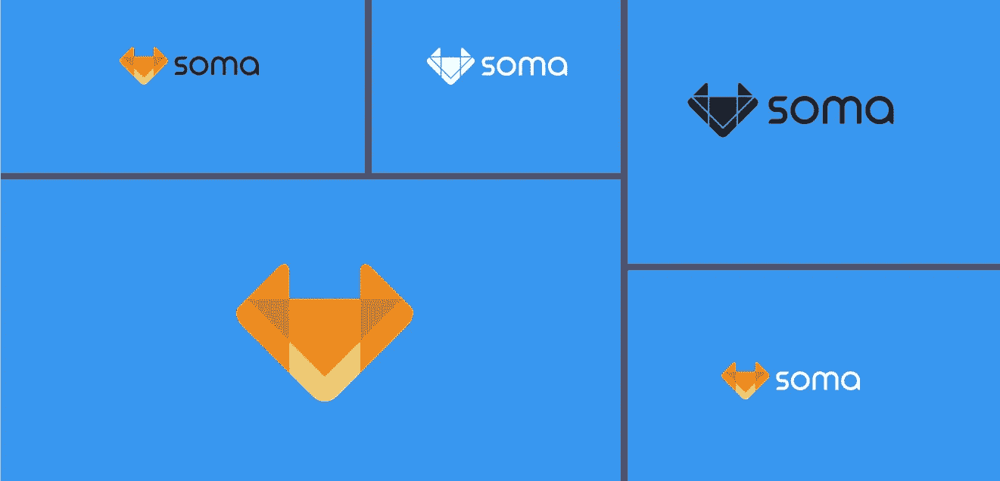

# 泰佐斯(XTZ)现在是火币全球，索玛应该是下一个！

> 原文：<https://medium.com/swlh/tezos-xtz-is-now-on-huobi-global-soma-should-be-next-7d25bb8be646>

Tezos 已经在 Huobi Global 上市了，你不觉得去中心化社交市场 SOMA(SCT)应该是下一个吗！

12 月 12 日，全球第三大交易所火币网将 Tezos (XTZ)上市，该公司在 CoinMarketCap 的排名中位列第 25 位。霍比的上市决定对市场表现产生了实质性影响，引发了近 13%的飙升。

关于上市，火币发布声明

> *“Tezos(XTZ)将于 2018 年 12 月 12 日(GMT+8)在火币全球首发。存款将于 2018 年 12 月 12 日 14:30(GMT+8)开始。XTZ/BTC 和 XTZ/ETH 交易将于 2018 年 12 月 13 日 18:00(GMT+8)开始。2018 年 12 月 16 日 14:30(GMT+8)起可提取。”*

Tezos 于 2017 年 7 月 14 日作为 ico 推出。ico 筹集了大约 2.32 亿美元，几乎是团队设定目标的十倍。亚瑟和凯瑟琳·布莱特曼共同创立了这个项目。

尽管 Tezos 是一年前推出的，但它已经经历了联合创始人亚瑟和凯瑟琳·布莱特曼与前总裁兼董事会成员约翰·格弗斯之间的权力斗争。由于令牌发放的延迟，它还面临着心怀不满的 ICO 参与者的集体诉讼。

现在，既然大多数问题已经解决，让我们看看 Tezos 项目

# 什么是泰佐斯(XTZ)？

根据 [Tezos](https://www.tezos.com/) 网站，

> Tezos 是一个可以通过自我升级而进化的区块链。利益攸关方就《议定书》的修正案，包括表决程序本身的修正案进行表决，以就提案达成社会共识。Tezos 支持智能合约，并提供了一个构建分散应用的平台

Tezos 类似于以太坊，但比以太坊平台具有更好的特性

Tezos 的目标是建立一个区块链，消除比特币和以太坊现有区块链的负面因素。Tezos 成功推出了区块链，它的计算强度低得多，需要更少的电力来开采(烘烤),正如 Tezos 定义的那样，但仍保持着可靠的 PoS 共识机制。

从投资者的角度来看，Tezos 被认为是 BTC 和 ETH 的一个强有力的竞争对手，肯定有更大的增长空间。目前，该股在 0.37 美元的区间内交易，较 ATH 的 10.74 美元下跌了近 97%。

如果你想拥有一些这种代币，你可以从 Huobi 以优惠的价格购买。

欲了解更多有关该项目的信息，请访问

网址:[https://tezos.com/](https://tezos.com/)

基础:[https://tezos.foundation/](https://tezos.foundation/)

街区探险家:【https://tzscan.io/ 

为了配合 Tezos 的上市，我相信火币也应该将 [SOMA (SCT)](https://soma.co/) 项目作为平台下一个上市的好项目。

# 什么是索玛？

> *Soma 是一个革命性的去中心化平台，由区块链技术和本地加密货币(Soma Community Token，或 SCT)提供支持，可促进贸易和社交互动，以实现 Soma 社区内的流动性。通过价值链的脱媒，买卖双方可以实现更大的利润。与此同时，创新的奖励系统激励有益的合作，并确保增值服务得到补偿——雅各布·安德拉，CMO @索玛*

简而言之， [SOMA](https://soma.co/) 是一个分散的市场，卖家和买家可以在其中安全可靠地进行交易。与传统的网上购物不同，SOMA 利用了良好的社会互动因素(喜欢、分享等)。)帮助买家做出决策，并通过 Q1 2019 将推出的在线平台向买家提供真实的反馈。

在我最近审查的项目中，SOMA 是基本面很强的项目之一。一个更积极的事实是[芬兰商业](https://www.prnewswire.com/news-releases/soma-secures-first-round-of-funding-from-business-finland-to-grow-decentralized-social-marketplace-300703752.html)提供的价值 5 万€的第一轮资金(它可以在第二轮获得高达€100 万的资金，在第三轮获得高达€2000 万的资金)。顶级制表商( [Bausele](https://soma.co/bausele-luxury-watches-on-blockchain/) 、 [SAVOT](https://soma.co/2018/10/11/savot-watches-joins-soma-pilot/) 、 [DWISS](https://soma.co/2018/09/30/dwiss-soma-swiss-watches-blockchain/) 、[si piln Kello](/somabusiness/sipilänkello-to-participate-in-soma-pilot-f40301a8c290)、 [Diefendorff](https://soma.co/2018/10/01/diefendorff-luxury-watches-on-blockchain/) 等)也对此很感兴趣。)报名参加 SOMA 试点项目，这让我觉得该项目有很大的机会获得更广泛的适应。

我确实拥有我在 12 月第一周带来的 SOMA 令牌，并将在 2019 年持有它，因为他们将在 2019 年启动试点计划。此外，SCT 代币仅在两家小型交易所交易，在大型交易所上市肯定会提高项目的价值。

要了解更多关于这个项目的信息，请访问

网址:[https://soma.co/](https://soma.co/)
推特:[https://twitter.com/SomaToken](https://twitter.com/SomaToken)

感谢您的阅读！！！！

## 尼布·P·拉朱

[**简介**](https://www.linkedin.com/in/nibu-rajoo-08414a17/)

**免责声明:*此处提供的材料是一般性的，并未考虑您的目标、财务状况或需求。尽管我们在准备本材料时已尽了最大努力，但我们并不就其完整性或准确性提供任何陈述或担保(明示或暗示)。* *这不是买卖加密货币的邀请或要约，也不是买卖特定类型加密货币的建议。保证金交易加密货币具有很高的风险，可能不适合某些人。仔细考虑你的投资目标、经验水平、财务资源、风险偏好和其他相关情况。你可能会失去部分或全部投资，包括你的初始存款。如有疑问，请寻求独立专家的建议***

## 这篇文章发表在 [The Startup](https://medium.com/swlh) 上，这是 Medium 最大的创业刊物，拥有+401，714 名读者。

## 在这里订阅接收[我们的头条新闻](http://growthsupply.com/the-startup-newsletter/)。

