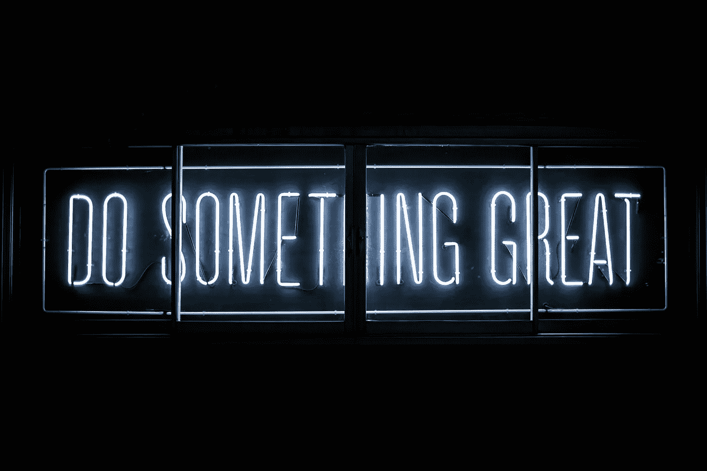
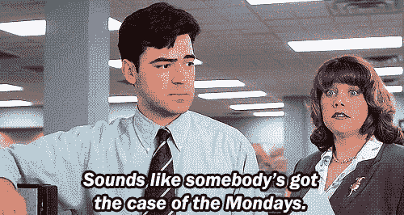

# TGIM:在乎你的朝九晚五

> 原文：<https://medium.com/swlh/tgim-give-a-damn-about-your-9-5-547e889c7866>

感谢上帝，今天是星期一。

我们以前听过这样的话:我们一生中有三分之一的时间在工作，为什么要花在做自己不在乎的事情上呢？为什么不做更多你喜欢的事情呢？为什么要花时间去做你并不真正关心的事情呢？

我明白了。我们都明白。不是每个人都能实现自己的梦想，或者拥有一份让他们早上高兴得跳起来的工作。但这并不意味着你应该开始每一周，等待它结束。

接受一份你不喜欢的工作并告诉自己“工作就是工作”很容易，但是工作中的不快乐会影响你的[心理健康](https://www.huffingtonpost.com/dr-terri-orbuch/job-satisfaction_b_859855.html)、你的[性欲](http://metro.co.uk/2012/04/10/womens-sex-lives-ruined-by-job-stress-claims-new-study-382318/)，甚至当你不工作的时候[你的快乐](http://oem.bmj.com/content/62/2/105.full)。

事情是这样的:在工作中有糟糕的态度不会让事情变得更好。做最少的事情不会提升你的成就感。如果你拼命工作，即使你并不完全热爱你所做的事情，也会发生以下两种情况之一:1；你每天都会为你的职业道德感到骄傲，或者 2；你的努力会被注意到，你的情况会改善。

那么，我们该如何做出改变呢？视角。

理解工作给我们的生活带来的价值，提供目标感和自豪感，社交机会，当然，还有生活和追求爱好或兴趣的钱。不管你喜不喜欢，工作对你有好处。

通过改变我们的视角来看待工作的价值，我们也会对工作中的小事更加感激，这反过来会让我们更有耐心，促进身心健康，并改善我们的睡眠。

当然，也许我应该为自己每天醒来都精力充沛而感到幸运。以前有人说我盲目乐观，但和所有人一样，我也有不开心的时候。我做过我讨厌的工作。我讨厌在咖啡店轮班工作，擦洗锅碗瓢盆，为我不信任的公司写广告。但是每周花 40 个小时做一些让我热血沸腾的事情迫使我想出如何才能永远不再有那种感觉。

这让我思考我更愿意做什么，并激励我不断学习以达到目标。有几天，几周，甚至几个月，我对工作不满意。在那段时间里，我的做法是:尝试新事物。

当我在早上 6 点提供甜甜圈和双份套餐，为赚取租金而感到压力时，我开始学习个人理财。最终，这让我在一家投资公司工作，现在我通过教别人理财来支付账单。我从没想过自己会这么做，但是我们在一起了。

在其他工作不太刺激的时候，我学过法语，学过摄影，学过设计，还尝试过打鼓(抱歉，邻居。)

不过，事情不必那么激烈，也不必那么大声。如果你尝试了 100 种新事物，你一定会在这个过程中爱上某样东西。粉刷你的家，从事缝纫，或者尝试用直剃刀而不是电动剃刀刮胡子。这些可能会让你成为一名承包商、裁缝或理发师。最糟糕的情况是，你会[通过学习新技能来激发创造力和增强自信](https://www.huffingtonpost.com/entry/a-look-at-the-incredible-benefits-of-trying-new-things_us_59196b49e4b02d6199b2f129)，同时消除潜在的职业道路。

与其拖着你的脚后跟去工作，不如寻找新的一天提供的机会。去你的周一的*案例和你的 *TGIF。去做一些新的事情。去看看你是什么做的。去做一些伟大的事情。**

感谢上帝，今天是星期一。

## 这个故事发表在《创业公司》杂志上，有 266，600 多人聚集在一起阅读 Medium 关于创业的主要故事。

## 在这里订阅接收[我们的头条新闻](http://growthsupply.com/the-startup-newsletter/)。

