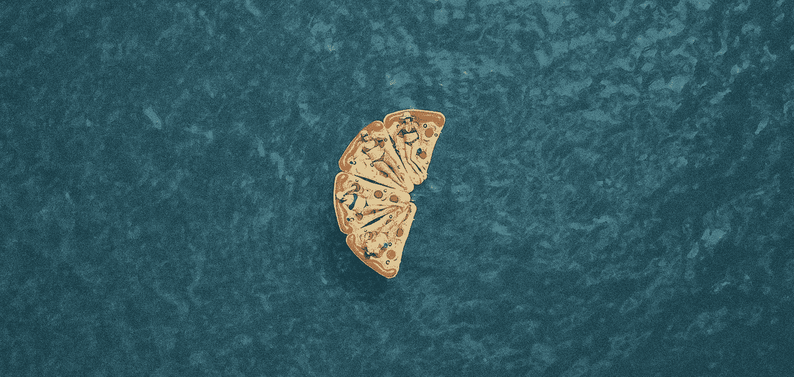

# 那篇关于留下良好第一印象的文章可能会毁了你的第一印象

> 原文：<https://medium.com/swlh/that-article-on-making-a-great-first-impression-may-ruin-yours-5f66c3cd6e0a>

Photo by [Mitch Meyers](https://unsplash.com/photos/NuzaZJ0X46Y?utm_source=unsplash&utm_medium=referral&utm_content=creditCopyText) on [Unsplash](https://unsplash.com/search/photos/funny?utm_source=unsplash&utm_medium=referral&utm_content=creditCopyText)

我刚刚从一个拥有九位数观众的网站上读到一篇关于第一印象的文章，并理解了为什么我的第一印象如此之差。

假装直到你成功。

*问出惊人的问题。*

*扔出一个很酷的 stat。*

始终保持积极的态度。