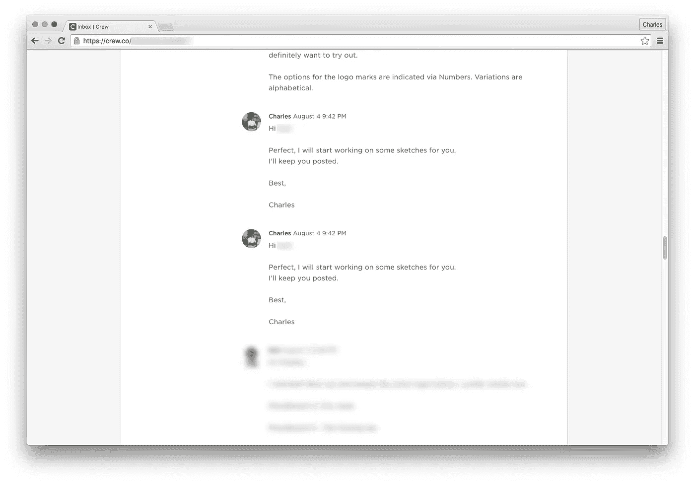

# 那个设计太过时了

> 原文：<https://medium.com/swlh/that-design-is-so-last-year-d933b0872887>

## 我们如何设计梦之队

由[**Charles Deluvio**](https://twitter.com/charlesdeluvio)|*原载于* [*剧组博客*](http://backstage.crew.co/creating-dream-crew/) *。*

**完全披露:**我曾经是一名全职自由设计师。像你们中的许多人一样，我在船员中工作来赚取额外的收入。虽然我觉得这个平台运行得很好，但我确实对这个应用程序本身感到失望。

比如:

*   添加协作者时出错
*   在手机上无法注销我的帐户
*   我的信息被复制
*   在预览之前必须下载文件

如果我没有向基里尔(我的好朋友，当时是 Crew 的产品设计师)提出这些问题，我们可能会讨论不同的设计方案。

脸书的那次对话是一年前的事了，当时剧组正在着手进行迄今为止最具挑战性的产品更新。

虽然那次巨大的大修(被称为“大贝莎”)的结果令人印象深刻，但它们并不是全体船员的终极目标。

> 现在，我们正在以社区为中心重新设计整个船员体验。我们称之为梦之队。

我们正在重新设计整个网站的每一个流程，为您带来一个更快、更具响应性的应用程序，提供实时*一切*。

我们的目标是拥有一个反映你的反馈的平台，并继续适应自由职业者今天面临的挑战。

# 你对梦之队有什么期待？

首先，一个全新的布局。

CTO using Photoshop. Not bad.

这就是我们的首席技术官安格斯对下一版 Crew 的设想:类似 Slack 的三栏布局。

为什么是这种布局风格？我们发现许多工作人员更喜欢在 Slack 上管理他们的项目，而不是使用工作人员平台。见鬼，我们甚至在空闲时间处理日常任务。

当我们进一步挖掘并查看其他项目管理工具(如 Basecamp 和 Asana)时，我们发现了更多相同的内容:一个三栏布局，一栏是*您的项目*，另一栏是*您的任务*，最后一栏是与任务相关的*信息。如果有用，为什么要改？*

# 有目的地制造产品

进行这样的重新设计需要在考虑建造之前进行认真的思考和研究。

对于像这样的大型项目，我喜欢参考马特·库克的设计方法论 T2 图表 T3。它有助于产生有目的的概念，而不是创造没有功能的“外观和感觉”设计。

更重要的是，图表让我们保持检查，确保我们总是在每个阶段验证我们的初始设计概要(并在我们认为合适的时候调整它)。

我们知道**我们的目标受众更喜欢在 Slack** 上管理他们的项目，因为有以下特点:

*   即时直接消息(即时反馈)
*   简化的项目管理(在“一个屏幕”中处理多个项目)
*   无故障团队管理(轻松添加/删除渠道合作者)

此外，Slack 的成功来自于它允许我们同时导航和管理各种对话的方式，以及这一切感觉有多“快”。它也很容易在网上获得，并作为我们的手机和台式电脑上的应用程序。

为了让*梦之队*成为现实，我们需要抓住这些‘惊喜时刻’,因此我们的主要设计目标是:

*   **简化流程**:设计一个更智能、反应更灵敏的应用程序，实时显示重要信息
*   当使用大多数消息传递/项目管理工具的共享美学导航团队时，创造一种熟悉感
*   让**消息传递**成为我们应用程序最突出的特点

接下来,“分歧”阶段是我们大部分背景研究发生的地方。

一旦我们对我们要去的地方有了一点想法，我们后退一步，抛开我们的假设，并从整体上评估这个项目。

为了确保我们不只是根据自己的感受来做决定，我们联系了最了解我们团队的人——那些每天都与我们的成员互动的人。

在支持下，我们概述了当前网站的每个问题领域。我们还为每一个问题提出了潜在的解决方案。

这个练习帮助我们完善了我们的设计问题:

> *Crew 将帮助项目负责人打造他们梦想中的产品，为他们找到业内最好的自由职业者。*
> 
> 对于这些专业人士来说，这是找到合同工作最安全的地方，因为船员承担了与自由职业相关的所有风险(内部协议、资金保障和任何纠纷都由船员幸福团队处理)。

## 发现需要解决的问题

我们发现，一旦匹配阶段完成，特别是在协议和融资阶段，Crew 的问题就会出现。

在与我们的成员交谈后，我们明确了主要的难点:

*   **不完整的规格:**建立一份可靠的工作协议是任何项目成功的关键。不幸的是，目前的协议太长，无法完成，描述也太宽泛，导致效果不佳，规格不一致。
*   **停工时间:**太多的行动需要对方批准，导致项目失去动力。
*   **知道发生了什么:**Crew 应用程序未能传达完成一个项目所需的许多阶段。很多时候，由于信息分散在应用程序中，用户不知道需要做什么。
*   **无响应:**机组 App 未能通知对方某个人有空(休假、在线/离线)。
*   **预算与最终预算脱节+人员费用:**与项目各部分相关的成本沟通不够清晰。关于船员费用是如何传达给各方的，还不清楚。

为了解决这些问题并获得更好的用户体验，我们提出了以下应该在 *Dream Crew* 中实现的功能:

*   **即时消息+通知:**保持对话。对船员进行实时讨论。
*   **更好的陪同人员:**我们自己的“船员机器人”会指引你去做下一件事。
*   **进度跟踪器:**轻松知道你正处于项目的哪个阶段。
*   **修改原始协议:**部件不再是连续的，可以在任何时间以任何顺序创建。新协议应该反映这一变化。
*   **简化协议/标准化建议书:** *成员 1 雇佣成员 2 建造项目 X，预计价格为美元，将于该日期交付:_ _ _ _ _ _ _ _。*
*   **惩罚/奖励系统:**惩罚无反应的船员。奖励那些按时交货的人。

最后，我们根据我们的设计目标创建了一系列视觉实验和解决方案。

从我们的研究和为*梦之队*设计的时候，我们发现有必要对我们当前的布局做些改变——让它能够显示所有新的信息和功能。

我们需要一个脱离 970 像素网格限制的布局，并且是全宽的。

*   在屏幕左侧的，用户可以导航到他们的项目。
*   **在屏幕的中间**，用户可以管理他们的项目。
*   **在最右边的**，用户可以找到关于该项目的重要信息。

有了好的设计思路，我们的重点现在将转移到设计 3 列布局中的不同交互。理想情况下，我们希望保持交互尽可能直观和一致(例如，我在哪里可以看到我所有的项目？在哪里可以添加合作者？新的协议页面看起来像什么？我如何回到上一个屏幕，等等…)

# 设计总是重新设计

距离我们上次重大更新已经一年了。然而，我们又在这里，奔向另一个重大的船员变化。

当然，以这种速度，你可能会认为每年都会有更新更好的团队。然而，我们希望*梦之队*将是最后一次应用程序的彻底改革，未来的更新将是相对较小的，孤立的功能，将有助于稍微更好的体验。

为*梦之队*设计是一项艰巨的任务。
*令人望而生畏*因为你正在重新设计一些目前有效的东西。令人望而生畏的因为，嗯，工作量很大。

但我感到欣慰的是，我继承了一个经过深思熟虑的产品。这使得设计梦之队变得更加容易实现。

> “设计从来都不是一个从头开始的过程:设计总是要重新设计。总有一些东西首先作为一个给定、一个问题、一个难题而存在。设计是一项任务，根据项目必须应对的各种限制，使之更生动、更商业化、更可用、更用户友好、更可接受、更可持续等等。”—布鲁诺·拉图尔:迈向设计哲学的几步。

如果你对剧组未来的设计有任何问题或意见，欢迎发邮件到[deluvio@crew.co](mailto:deluvio@crew.co)给我

# 有主意了吗？

## 与最好的设计师和开发人员一起工作。超过 1000 万人使用了剧组生产的[产品。超过 300 万人阅读了我们的博客。在这里](http://crew.co/?utm_source=Medium&utm_medium=CTA&utm_campaign=MediumCTAs)加入他们。

