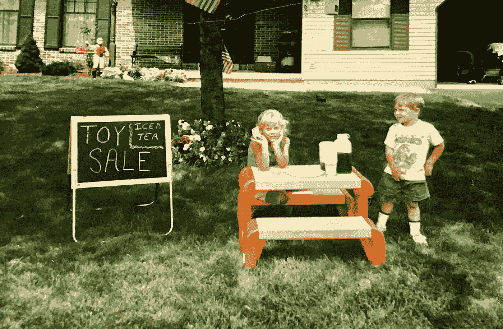

# 那次我在一个柠檬水摊上失去了我一生的积蓄

> 原文：<https://medium.com/swlh/that-time-i-lost-my-life-savings-on-a-lemonade-stand-aa026c9881fc>

Another [Huston](https://www.instagram.com/strategicstephtravels/) Kids business venture ~ circa 1993

诚然，我当时大约 7 岁，但无论如何这都是一个艰难的损失。

我记得跑进房子，对我在银湖的新柠檬水摊生意的结果感到兴奋(*我们在费城郊区的邻居*)。

独特的销售主张是，我们建造了一个移动柠檬水摊位——我们捡了一个柜子，清理干净，我爸爸把它钉在一个有轮子的平台上。我可以在附近闲逛，直接去找拿柠檬水的人！

我坐在餐桌旁，兴奋地向父母报告我第一天就赚了 36 美元。

我又开始数钱，像我的老奶奶(*曾祖母*)教我的那样，把钱面朝同一个方向，想着我能用它做的所有事情，这时我爸爸打断了我的思路。

> “嗯，斯蒂芬妮，你知道这不全是利润，对吧……”
> 
> “那是什么意思，爸爸搞什么鬼！？这都是我赚来的！”

然后，我爸拿出一个记事本，我敢肯定，他从口袋里拿出一支笔，列出我的柠檬水摊的“启动费用”，他已经“投资”了。

我开始第一次感受到在商业冒险中赔钱的痛苦——直到那一刻我才知道这是可能的！

> 搭建展台的人工:21 美元
> 
> 柠檬水混合饮料:22 美元
> 
> 用品(水罐、勺子、餐巾):17 美元
> 
> 杯子:0 美元(因为我们会在每场扬基队比赛后留下来，收集每个人留下的塑料杯…然后卖给我们费城球迷的邻居…#那是看见了其他没有孩子的帖子)

> “斯蒂芬妮，看起来你的启动成本达到了 60 美元*……所以你今天可能赚了 36 美元，但严格来说你只赚了-24 美元，因为你欠我 60 美元来启动这项业务。”

七岁，没有存款，第一次欠债。

> *插入七岁的 Strategic Stephanie 有生以来第一次(但肯定不是最后一次)为生意哭泣:

我不记得我爸爸是否让我还钱给他*(他可能真的想让我还钱，以证明一点，我妈妈不让他还钱)*但这个故事一直让我发笑，并让我记住了这个故事，成为我的第一堂商业课。

没有什么是免费的，无论你是谁或你是什么年龄。有人(*导师、兄弟、同事、朋友、父母等*)总是投入一些东西(*时间、金钱、努力、爱等*)让你到达你要去的地方，所以要意识到并感激这些，并永远向前付出。

My Mentor Since Day 1 :)

**所有数字都是猜测的，因为我在 90 年代没有整理过，找不到任何记录实际损益的记录*；)

你准备好最终将你的旅行梦想变成现实了吗？ [*今天就注册我的简讯*](http://eepurl.com/dylLZf) *，我会把你可以开始环游世界、过上你一直梦想的生活的前三步发给你！*

如果你喜欢这篇文章，请👏并分享给你的朋友。记住，你最多可以鼓掌 50 次——这对我真的很重要。

*我很乐意在*[*insta gram*](https://www.instagram.com/strategicstephtravels/)*，* [*脸书*](https://www.facebook.com/StrategicStephTravels) *，*[*Twitter*](https://twitter.com/StrategicSteph)*，或者*[*LinkedIn*](https://www.linkedin.com/in/stephanielhuston)*！❤*

## 这篇文章发表在 [The Startup](https://medium.com/swlh) 上，这是 Medium 最大的创业刊物，拥有 299，352+人关注。

## 在这里订阅接收[我们的头条新闻](http://growthsupply.com/the-startup-newsletter/)。

