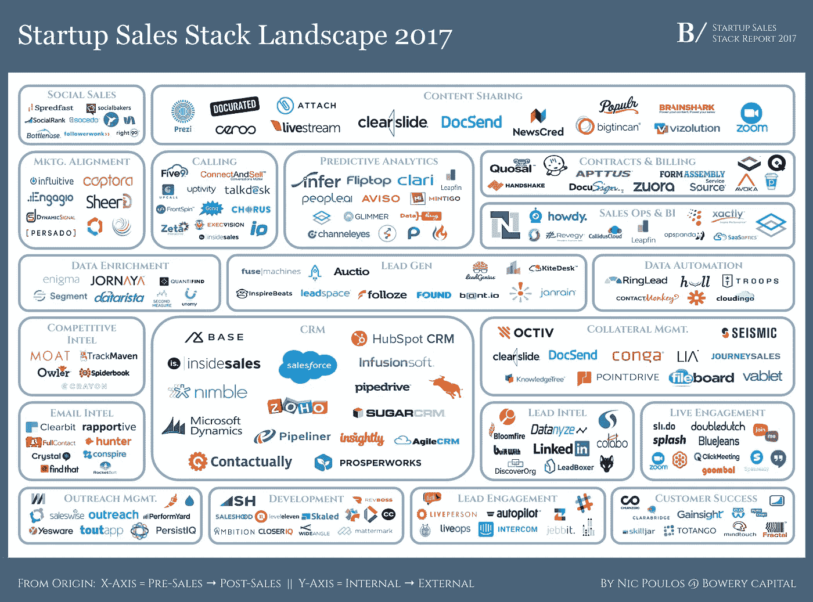
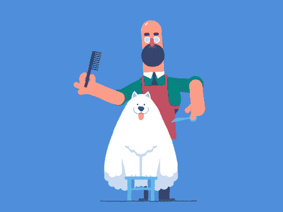

# 如果你是一家 SaaS 初创公司，留住客户的第一招。

> 原文：<https://medium.com/swlh/the-1-hack-to-retain-your-customers-if-you-are-a-saas-startup-1772b3c548bd>

Photo by [Freddy Marschall](https://unsplash.com/photos/bL8MDg0p_nI?utm_source=unsplash&utm_medium=referral&utm_content=creditCopyText) on [Unsplash](https://unsplash.com/?utm_source=unsplash&utm_medium=referral&utm_content=creditCopyText)

从松散的意义上来说，SaaS 的每一家初创公司都曾经只是一个共享的电子表格。

[Expensify](https://www.expensify.com) ， [Zendesk](https://www.zendesk.com) ， [Quip](https://quip.com) ， [Salesloft](http://www.salesloft.com) 。

因此，真正让你的创业公司与一张没有灵魂的电子表格不同的是，你如何赢得并留住你的客户。

现在，你可能认为既然你在解决他们的业务问题，你就应该成为他们事实上的创业选择。*幼稚而错误。*想知道为什么吗？

## 因为这是 2018 年，你的创业公司不是唯一一个解决问题的公司。

This picture merely shows a slice of the options available for your buyer [Source: Bowery Capital]

如今，客户期望的不仅仅是您的技术解决方案。

他们希望受到热情的问候和对待。

萨姆·沃尔顿有句名言:

> “只有一个老板。顾客。他可以解雇公司里从董事长开始的所有人，只要把钱花在别的地方就行了。”

战略中缺失的部分是大多数初创公司成功解决了他们的问题，而市场是……同理心。

# 什么是同理心&为什么你应该关心？

《牛津词典》将“同理心”定义为理解和分享他人感受的能力。同理心让你*理解*另一个人的处境、动机，甚至他们的感受和情绪。

简而言之，同理心让你的初创公司能够提供出色的客户体验。

Genesys 几年前进行了一项调查，重点是在与公司互动时，什么对客户最重要。40%，或者说是第二名答案的两倍多，说“更好的**人工服务**”。

尤其是在免费试用的时代，你很有可能会轻视你的 SaaS 客户，把更多的精力放在其他紧迫的任务上。

但研究表明，与留住现有客户的成本相比，获得一个新客户的成本至少是 6-7 倍。即使减少很小的百分比，也会在一段时间内极大地提高公司的盈利能力。

在这篇哈佛商业评论[关于顾客体验的文章](https://hbr.org/2013/09/the-truth-about-customer-experience)中，作者认为，即使是顾客询问产品的常规服务事件也可以被用作展示同情心和价值的机会。

在 SaaS，你还可以在其他地方表现出同理心，包括:

a)产品/界面设计

b)您的自动电子邮件

c)你的 404 页

d)您网站上的整个客户旅程

e)社交媒体互动

f)反馈调查

在危机时期

h)特别是在危机时期*

即使客户不同意你的观点，或者对你没有他/她想要的特色感到不安，你仍然可以给他们留下积极的印象。

[玛莎·科利尔](http://The Genius Training Student Workbook)对此有一个绝妙的建议:

## 客户服务不能总是提供解决方案，但它总能传递同理心。

与越来越多的人工智能/自动化主导客户与公司的互动的流行趋势相反，你的初创公司可以成为一股新鲜空气。Y-Combinator 初创企业大师保罗·格拉厄姆长期以来一直是这种做法的倡导者。[做不上规模的事情](http://paulgraham.com/ds.html)。我认为这个建议适用于所有公司，尤其是 SaaS 的初创公司，因为竞争非常激烈。

# 所以，我们走吧，希望你在发展你的 SaaS 创业公司的时候，将同理心贴近你的内心。

*PS:我们正在尽最大努力确保我们在构建产品* [*关闭页面*](https://medium.com/u/456d077ec7ac?source=post_page-----1772b3c548bd--------------------------------) *时言行一致，从登录流程一直到 404 页面。如果你有兴趣免费加入我们的早期用户群，请在*[*www.getclosingpage.com 报名。*](http://www.getclosingpage.com.) *非常感谢你们，祝你们温暖！*

## 这个故事发表在 [The Startup](https://medium.com/swlh) 上，这是 Medium 最大的企业家出版物，拥有 281，454+人。

## 在这里订阅接收[我们的头条新闻](http://growthsupply.com/the-startup-newsletter/)。

