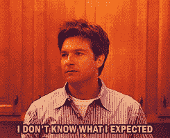

# 零售商最头疼的问题不是亚马逊。糟糕多了

> 原文：<https://medium.com/swlh/the-1-problem-retailers-struggle-with-isnt-amazon-it-s-much-worse-d184da47c723>

## 归咎于杰夫·贝索斯的方便，网上的方便和定价。但这些都是站不住脚的借口。

不是网上购物的方便。

它的根源离我们家更近。

事实上，这正是 iTunes 存在的方式和原因，也是为什么今天一些零售店苦苦挣扎，而另一些零售店却在碾压它。

# 僵尸和零售品牌中的问题

上周末，在密尔沃基举行的今年*大湖创新峰会*上，我做了一个具有里程碑意义的品牌大师班，之后我去了当地的一家咖啡馆，很多当地人都向我推荐过这家咖啡馆。

我开车去那里，走进去，我惊讶得目瞪口呆。

场地太棒了。

不仅仅是服务和美味的咖啡，还有整体的消费者体验和真正的社区意识。

整个会场没有一个空座位。

作为一个实体零售场所的光辉典范，我在密尔沃基的 Colectivo Coffee 停下来记录了这条关于零售品牌*的重要信息，讲述了零售业如何通过以下方式战胜自己:*

*   养育一代“销售僵尸”(这是一种流行病，但也有例外像这个小绿洲)
*   迎来了成为“人体收银机”的一代人，他们离开商店，成为交易中心*,导致零售业棺材里的“最后一根稻草”,以及*
*   *忽视了人际关系的力量和影响。*

*没错。*

*这是 ***不是***Amazon.com。那是一个借口。*

*这正是我要说的:*

# *零售品牌问题的虚假陈述*

*在《快公司》*最近的一篇帖子中，宜家的*前*设计总监说:“设计会扼杀营销。”**

**说“设计会扼杀营销”就像说“歌词会让旋律变得不必要”或“电镀一顿饭会让味道过时”或“复制会让图像灭绝。”**

**那完全是胡扯。**

**那是*二值逻辑*并且完全是为了鸟*(创造一篇有争议的文章是美妙的，但在现实生活中是废话)。***

**另外，我觉得有趣的是，这个评论来自宜家的 ***前*** 设计总监……这两个事实有关联吗？**

**想了解更多关于如何真正品牌化的信息？*抢一本我的亚马逊#1 畅销书，* [***品牌介入。***](https://www.amazon.com/dp/0999529706/ref=cm_sw_r_tw_dp_U_x_rG9WBb3V9WNVJ)**

****

## **从这篇文章中获得了价值？
然后鼓掌，分享，关注我，订阅我的 [YouTube 频道](https://www.youtube.com/user/headmusik)每周都有新视频。需要一个品牌重塑或一个难忘的主题演讲人？在这里找到我。**

****

## **这篇文章发表在 [The Startup](https://medium.com/swlh) 上，这是 Medium 最大的创业刊物，拥有+ 378，529 名读者。**

## **在这里订阅接收[我们的头条新闻](http://growthsupply.com/the-startup-newsletter/)。**

****