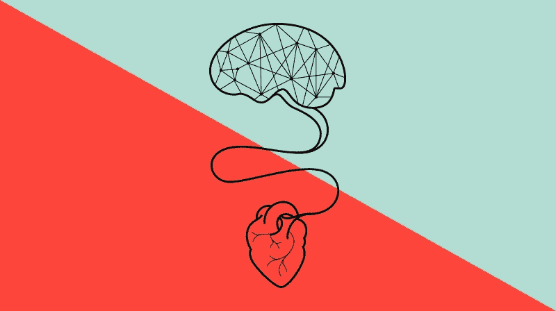
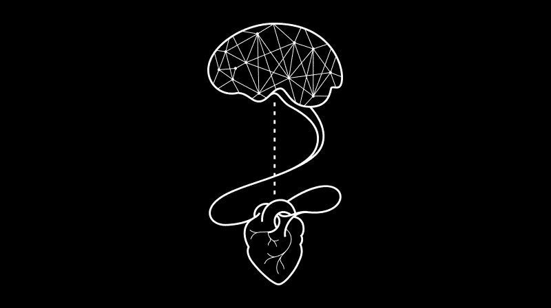
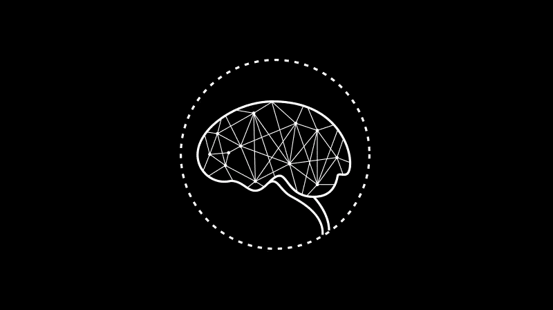
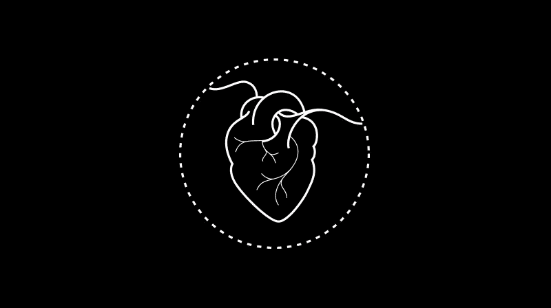
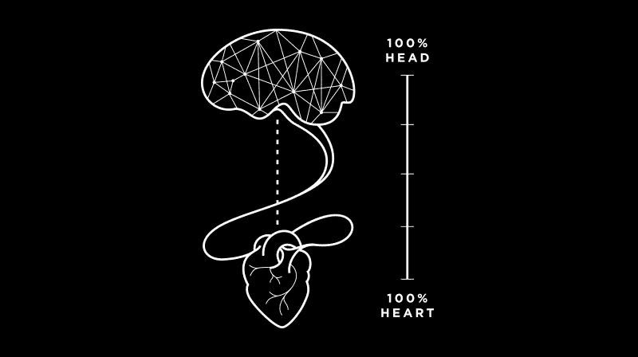

# 品牌最想念顾客的一件事

> 原文：<https://medium.com/swlh/the-1-thing-your-company-is-missing-d2ad97ec931f>

## 他们购物是用头脑还是用心灵？

当品牌创建客户档案时，它们都使用相同的模板。年龄范围。市区还是郊区。已婚或单身。但是这个模板缺少了最重要的细节，这个细节将会决定一个品牌对顾客的吸引力:她如何购物。

我将解释为什么这个细节如此重要，并告诉你如何通过使用一些每个人都喜欢的东西来提高品牌销售额。

# 两种类型的购物者

通过 10 年来对客户的剖析和在一系列行业(从化妆品和消费品到餐馆和科技)创造卓越的品牌体验，我发现**有两种不同类型的购物者有特定的购买方式**:一种是用头脑购物，另一种是用心购物。了解顾客的“购物者类型”是定位你的品牌的关键。

这两种类型的购物者都从同一个地方开始:寻找满足需求。

*   **购买美容产品:**她发现了一个个人问题——也许是皱纹和细纹。
*   买酒:她喜欢白葡萄酒，想花 12 美元左右。
*   为男孩购物:她已经准备好和她社交圈之外的人约会——并且听说了网上约会的好消息。

一旦她知道自己的需求，那么无论是头脑还是内心都会推动她前进。

# 当头儿领先时

当首席购物者第一次看到你的产品时，不管她是在网上还是在货架上看到的，她都会立即想知道两件关键的事情:

*   *它真的会传递她想要的东西吗？*
*   这是她最好的选择吗？

首席购物者还要求了解产品如何运作的细节。她喜欢在购物前确切地知道她要买什么。

*   **逛街美容:**她想看前后照片和临床结果。她已经做了功课，所以她会扫描你的标签，寻找经过验证的成分。
*   **买酒:**这款酒来自一个看起来和听起来都可信的葡萄园吗？她需要相信索诺玛出产的灰皮诺比澳大利亚出产的要好。
*   为男孩购物:她会阅读交友网站的恋爱哲学，寻找长期成功的故事。她会仔细看看交友网站用来匹配她的兴趣。

一个品牌可以通过多种方式证明自己。它可以展示事实来证明可信度，但也需要看起来可信。没有泡泡字母和感叹号，孩子们。

当瞄准主要购物者时，品牌应该切断绒毛，专注于产品的不同之处，并以简洁易懂的方式进行教育。

# 心会继续

像首席购物者一样，核心购物者也会做调查。但是她最终的购买决定取决于你所说的故事。她认为:

*   我对这个品牌的故事感兴趣吗？
*   *这个品牌的故事符合我为自己设想的生活方式吗？*

“心购物者”非常擅长讲故事。她希望从你的品牌中感受到一些东西，并通过文字和视觉感受到一种精神状态。

*   **购买美容产品:**这种面霜叫做“棉花糖云”——她喜欢它像云一样坐在皮肤上的想法。金色的包装会让她觉得自己每天都在放纵。
*   购买酒类:标签上的蓝色字体让她想起了她去圣托里尼岛的一次度假，所以她知道它尝起来会像夏天。清澈的瓶身让她觉得产品纯净轻盈。
*   **为男生购物:**明亮、大胆的图形和简单的界面让约会看起来既刺激又轻松。简洁的文案让人觉得这个品牌理解她——使用这个应用的人也会理解她。

一旦顾客对你的故事感兴趣，她会决定它是否符合她的个人品牌和她关心的事情。你的语气符合她对自己的看法吗？

如果答案是肯定的，并且你让她真正感受到了什么，那么这位心动的顾客会拿起棉花糖面霜。她的皮肤会看起来如此惊人，以至于一个酷似约翰·斯塔莫斯的人会从她身上滑过。他来的时候她会准备好一瓶完美的夏季葡萄酒。

# 将你的品牌与完美的购物者配对

这两种类型的购物者都在寻求满足需求。两种类型的购物者都想看到和听到吸引人的故事。但重要的是，你的品牌是否以吸引头脑或心灵的方式阐释了故事。

所以一定要击中要害。必要时调整你的品牌目标。她会在你身上挥棒。

## 喜欢这篇文章吗？按下拍手按钮👏帮助其他人找到它。

> 关注我，获取每日发布的创业品牌洞察: [Instagram](https://www.instagram.com/kimberlybrizzolara/) || [脸书](https://b-m.facebook.com/brandsthatgetyou/) || [LinkedIn](http://www.linkedin.com/in/kimberly-brizzolara-0b95093)
> 
> 你也可以[注册我的电子邮件](http://kimberlybrizzolara.com)并在媒体上继续关注我[。](/@Kbrizz)

最初发表于[beautymatter.com](http://beautymatter.com)

## 这篇文章发表在《初创企业》杂志上，这是 Medium 最大的创业刊物，有 332，253 人关注。

## 订阅接收[我们的头条新闻](http://growthsupply.com/the-startup-newsletter/)。

